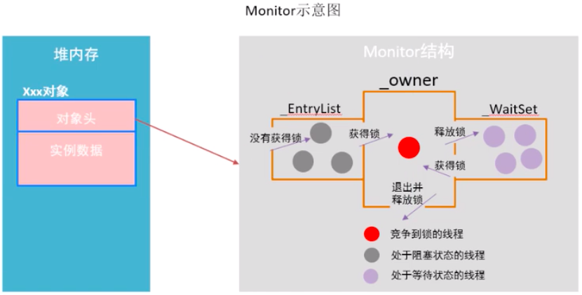
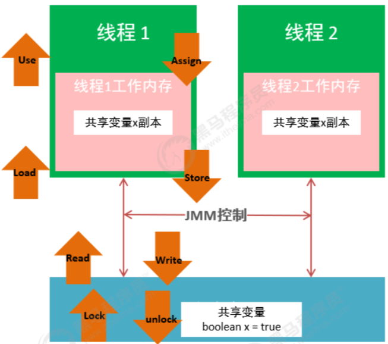
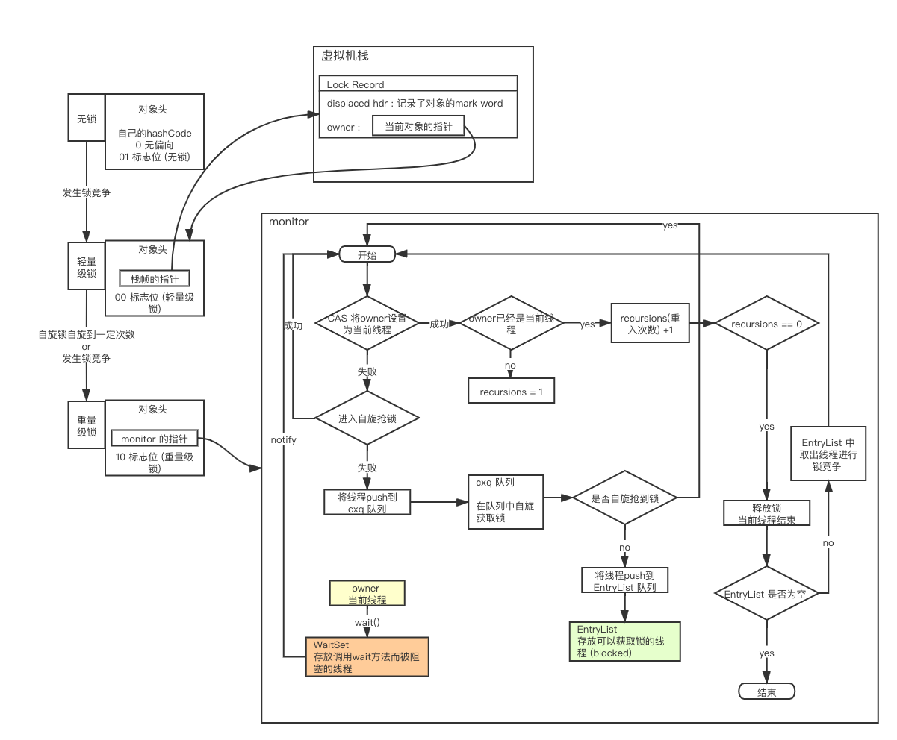

[toc]

# synchronized 与 AQS


## synchronized 原理


一段简单的 `synchronized` 代码

```java
public class Test {
    private static Object obj = new Object();

    public static void main(String[] args) {
        synchronized (obj) {
            System.out.println("1");
        }
    }

    public synchronized void sMethod() {
        System.out.println("a");
    }
}
```


利用 JDK 自动的 `javap` 命令查看字节码文件

```shell
javap -p -v -c Test.class
```


字节码文件内容如下 (省略了常量池和版本信息)

```
{
  private static java.lang.Object obj;
    descriptor: Ljava/lang/Object;
    flags: ACC_PRIVATE, ACC_STATIC

  public test.Test();
    descriptor: ()V
    flags: ACC_PUBLIC
    Code:
      stack=1, locals=1, args_size=1
         0: aload_0
         1: invokespecial #1                  // Method java/lang/Object."<init>":()V
         4: return
      LineNumberTable:
        line 9: 0
      LocalVariableTable:
        Start  Length  Slot  Name   Signature
            0       5     0  this   Ltest/Test;

  public static void main(java.lang.String[]);
    descriptor: ([Ljava/lang/String;)V
    flags: ACC_PUBLIC, ACC_STATIC
    Code:
      stack=2, locals=3, args_size=1
         0: getstatic     #2                  // Field obj:Ljava/lang/Object;
         3: dup
         4: astore_1
         5: monitorenter
         6: getstatic     #3                  // Field java/lang/System.out:Ljava/io/PrintStream;
         9: ldc           #4                  // String 1
        11: invokevirtual #5                  // Method java/io/PrintStream.println:(Ljava/lang/String;)V
        14: aload_1
        15: monitorexit
        16: goto          24
        19: astore_2
        20: aload_1
        21: monitorexit
        22: aload_2
        23: athrow
        24: return
      Exception table:
         from    to  target type
             6    16    19   any
            19    22    19   any
      LineNumberTable:
        line 13: 0
        line 14: 6
        line 15: 14
        line 16: 24
      LocalVariableTable:
        Start  Length  Slot  Name   Signature
            0      25     0  args   [Ljava/lang/String;
      StackMapTable: number_of_entries = 2
        frame_type = 255 /* full_frame */
          offset_delta = 19
          locals = [ class "[Ljava/lang/String;", class java/lang/Object ]
          stack = [ class java/lang/Throwable ]
        frame_type = 250 /* chop */
          offset_delta = 4

  public synchronized void sMethod();
    descriptor: ()V
    flags: ACC_PUBLIC, ACC_SYNCHRONIZED
    Code:
      stack=2, locals=1, args_size=1
         0: getstatic     #3                  // Field java/lang/System.out:Ljava/io/PrintStream;
         3: ldc           #6                  // String a
         5: invokevirtual #5                  // Method java/io/PrintStream.println:(Ljava/lang/String;)V
         8: return
      LineNumberTable:
        line 19: 0
        line 20: 8
      LocalVariableTable:
        Start  Length  Slot  Name   Signature
            0       9     0  this   Ltest/Test;

  static {};
    descriptor: ()V
    flags: ACC_STATIC
    Code:
      stack=2, locals=0, args_size=0
         0: new           #7                  // class java/lang/Object
         3: dup
         4: invokespecial #1                  // Method java/lang/Object."<init>":()V
         7: putstatic     #2                  // Field obj:Ljava/lang/Object;
        10: return
      LineNumberTable:
        line 10: 0
}
SourceFile: "Test.java"
```


基本上可以看出synchronize代码块结构为

```
monitorenter
代码逻辑...
monitorexit
```


- **monitorenter**

  每一个对象都会和一个监视器**monitor**关联。监视器被占用时会被锁住，其他线程无法来获 取该monitor。 当JVM执行某个线程的某个方法内部的`monitorenter`时，它会尝试去获取当前对象对应 的monitor的所有权。其过程如下:

  1. 若monior的进入数为0，线程可以进入monitor，并将monitor的进入数置为1。当前线程成为 monitor的owner(所有者)
  2. 若线程已拥有monitor的所有权，允许它重入monitor，则进入monitor的进入数加1
  3. 若其他线程已经占有monitor的所有权，那么当前尝试获取monitor的所有权的线程会被阻塞，直到monitor的进入数变为0，才能重新尝试获取monitor的所有权。

- **monitorexit**

  1. 能执行`monitorexit`指令的线程一定是拥有当前对象的**monitor**的所有权的线程。
  2. 执行monitorexit时会将monitor的进入数减1。当monitor的进入数减为0时，当前线程退出monitor，不再拥有monitor的所有权，此时其他被这个monitor阻塞的线程可以尝试去获取这个 monitor的所有权

  monitorexit释放锁。 monitorexit插入在**方法结束处和异常处**，JVM保证每个monitorenter必须有对应的monitorexit。

  所以在synchronize代码块中出现异常会释放锁


**同步方法**

可以看到同步方法`sMethod`会增加 `ACC_SYNCHRONIZED` 修饰。会隐式调用monitorenter和 monitorexit。在执行同步方法前会调用monitorenter，在执行完同步方法后会调用monitorexit。


### monitor监视器锁

可以看出无论是synchronized代码块还是synchronized方法，其线程安全的语义实现最终依赖一个叫monitor的东西


在HotSpot虚拟机中，monitor是由ObjectMonitor实现的。其源码是用c++来实现的`ObjectMonitor.hpp`, 主要属性如下: 

1. `_object`:存储monitor的对象
2. `_recursions`:线程重入的次数
3. `_owner`:初始时为NULL。当有线程占有该monitor时，owner标记为该线程的唯一标识。当线程释放monitor时，owner又恢复为NULL。owner是一个临界资源，JVM是通过CAS操作来保证其线程安全的。
4. `_cxq`:竞争队列，所有请求锁的线程首先会被放在这个队列中(单向链接)。`_cxq`是一个临界资源，JVM通过CAS原子指令来修改`_cxq`队列。修改前`_cxq`的旧值填入了node的next字段，`_cxq`指 向新值(新线程)。因此`_cxq`是一个后进先出的stack(栈)。`
5. `_EntryList`:`_cxq`队列中有资格成为候选资源的线程会被移动到该队列中。 
6. `_WaitSet`:因为调用wait方法而被阻塞的线程会被放在该队列中。


每一个Java对象都可以与一个监视器monitor关联，我们可以把它理解成为一把锁，当一个线程想要执行一段被synchronized圈起来的同步方法或者代码块时，该线程得先获取到synchronized修饰的对象对应的monitor。

我们的Java代码里不会显示地去创造这么一个monitor对象，我们也无需创建，事实上可以这么理解: monitor并不是随着对象创建而创建的。我们是通过synchronized修饰符告诉JVM需要为我们的某个对象创建关联的monitor对象。每个线程都存在两个ObjectMonitor对象列表，分别为free和used列表。 同时JVM中也维护着global locklist。当线程需要ObjectMonitor对象时，首先从线程自身的free表中申 请，若存在则使用，若不存在则从global list中申请。

ObjectMonitor的数据结构中包含:`_owner`、`_WaitSet`和`_EntryList`，它们之间的关系转换可以用下图 表示:




**monitor竞争**


1. 执行monitorenter时，会调用`InterpreterRuntime.cpp`

   ```cpp
   IRT_ENTRY_NO_ASYNC(void， InterpreterRuntime::monitorenter(JavaThread* thread， BasicObjectLock* elem))
   #ifdef ASSERT
     thread->last_frame().interpreter_frame_verify_monitor(elem);
   #endif
     if (PrintBiasedLockingStatistics) {
       Atomic::inc(BiasedLocking::slow_path_entry_count_addr());
   	}
     Handle h_obj(thread， elem->obj());
   	assert(Universe::heap()->is_in_reserved_or_null(h_obj())，"must be NULL or an object");
     if (UseBiasedLocking) { // 是否使用了偏向锁
       // Retry fast entry if bias is revoked to avoid unnecessary inflation
       ObjectSynchronizer::fast_enter(h_obj， elem->lock()， true， CHECK);
     } else {
       ObjectSynchronizer::slow_enter(h_obj， elem->lock()， CHECK);
     }
     assert(Universe::heap()->is_in_reserved_or_null(elem->obj())， "must be NULL or an object");
   ```

2. 对于重量级锁，monitorenter函数中会调用 `ObjectSynchronizer::slow_enter`

3. 最终调用 `ObjectMonitor::enter`

   ```cpp
   void ATTR ObjectMonitor::enter(TRAPS) {
     // The following code is ordered to check the most common cases first
     // and to reduce RTS->RTO cache line upgrades on SPARC and IA32 processors.
     Thread * const Self = THREAD ;
     void * cur ;
   	
     // 通过CAS操作尝试把monitor的_owner字段设置为当前线程
     cur = Atomic::cmpxchg_ptr (Self， &_owner， NULL) ;
     if (cur == NULL) {
        // Either ASSERT _recursions == 0 or explicitly set _recursions = 0.
   		assert (_recursions == 0 ， "invariant") ;
       assert (_owner == Self， "invariant") ; 
       // CONSIDER: set or assert OwnerIsThread == 1 
       return ;
   	}
   	// 线程重入，recursions++ 
     if (cur == Self) {
        // TODO-FIXME: check for integer overflow!  BUGID 6557169.
       _recursions ++ ;
   		return ; 
     }
   	// 如果当前线程是第一次进入该monitor，设置_recursions为1，_owner为当前线程
   	if (Self->is_lock_owned ((address)cur)) {
   		assert (_recursions == 0， "internal state error");
   		_recursions = 1 ;
   		// Commute owner from a thread-specific on-stack BasicLockObject address to 
       // a full-fledged "Thread *".
       _owner = Self ;
       OwnerIsThread = 1 ;
       return ;
     }
   	
     // 省略一些代码 
     
     for (;;) {
       jt->set_suspend_equivalent();
       // cleared by handle_special_suspend_equivalent_condition()
       // or java_suspend_self()
   		
       // 如果获取锁失败，则等待锁的释放; EnterI (THREAD) ;
       if (!ExitSuspendEquivalent(jt)) break ;
       //
       // We have acquired the contended monitor， but while we were 
       // waiting another thread suspended us. We don't want to enter 
       // the monitor while suspended because that would surprise the // thread that suspended us.
       //
       _recursions = 0 ;
       _succ = NULL ;
   		exit (false， Self) ; 
       
       jt->java_suspend_self();
   	}
     Self->set_current_pending_monitor(NULL);
   }
   ```

   此处省略锁的自旋优化等操作，统一放在后面synchronzied优化中说。 以上代码的具体流程概括如下:

   1. 通过CAS尝试把monitor的owner字段设置为当前线程。
   2. 如果设置之前的owner指向当前线程，说明当前线程再次进入monitor，即重入锁，执行recursions ++ ，记录重入的次数。
   3. 如果当前线程是第一次进入该monitor，设置recursions为1，_owner为当前线程，该线程成功获得锁并返回。
   4. 如果获取锁失败，则等待锁的释放


**monitor 等待**

竞争失败等待调用的是ObjectMonitor对象的EnterI方法

```cpp
void ATTR ObjectMonitor::EnterI (TRAPS) {
    Thread * Self = THREAD ;
	  // Try the lock - TATAS
    if (TryLock (Self) > 0) {
        assert (_succ != Self
        assert (_owner == Self
        assert (_Responsible != Self
        return ;
    }
    if (TrySpin (Self) > 0) {
        assert (_owner == Self
        assert (_succ != Self
        assert (_Responsible != Self  , "invariant") ;
        return ;
    }
    // 省略部分代码
    // 当前线程被封装成ObjectWaiter对象node，状态设置成ObjectWaiter::TS_CXQ; ObjectWaiter node(Self) ;
    Self->_ParkEvent->reset() ;
    node._prev = (ObjectWaiter *) 0xBAD ;
    node.TState  = ObjectWaiter::TS_CXQ ;
    // 通过CAS把node节点push到_cxq列表中 ObjectWaiter * nxt ;
    for (;;) {
        node._next = nxt = _cxq ;
        if (Atomic::cmpxchg_ptr (&node， &_cxq， nxt) == nxt) break ;
        // Interference - the CAS failed because _cxq changed.  Just retry.
        // As an optional optimization we retry the lock.
        if (TryLock (Self) > 0) {
          	assert (_succ != Self， "invariant") ;
            assert (_owner == Self， "invariant") ;
            assert (_Responsible != Self， "invariant") ;
            return ;
        } 
    }
    // 省略部分代码 
    for (;;) {
        // 线程在被挂起前做一下挣扎，看能不能获取到锁 if (TryLock (Self) > 0) break ;
        assert (_owner != Self， "invariant") ;
        if ((SyncFlags & 2) && _Responsible == NULL) { 
          	Atomic::cmpxchg_ptr (Self， &_Responsible， NULL) ;
        }
        // park self
        if (_Responsible == Self || (SyncFlags & 1)) {
		        TEVENT (Inflated enter - park TIMED) ; 
          	Self->_ParkEvent->park ((jlong) RecheckInterval) ;
		        // Increase the RecheckInterval， but clamp the value. RecheckInterval *= 8 ;
            if (RecheckInterval > 1000) RecheckInterval = 1000 ;
        } else {
        		TEVENT (Inflated enter - park UNTIMED) ;
          	// 通过park将当前线程挂起，等待被唤醒
            Self->_ParkEvent->park() ;
        }
        if (TryLock(Self) > 0) break ;
				// 省略部分代码 
    }
		// 省略部分代码 
}
```

当该线程被唤醒时，会从挂起的点继续执行，通过 ObjectMonitor::TryLock 尝试获取锁，TryLock方 法实现如下:

```cpp
int ObjectMonitor::TryLock (Thread * Self) {
  for (;;) {
    void * own = _owner ;
    if (own != NULL) return 0 ;
    if (Atomic::cmpxchg_ptr (Self， &_owner， NULL) == NULL) {
        // Either guarantee _recursions == 0 or set _recursions = 0.
        assert (_recursions == 0， "invariant") ;
        assert (_owner == Self， "invariant") ;
    		// CONSIDER: set or assert that OwnerIsThread == 1 
      	return 1 ;
    }
    // The lock had been free momentarily， but we lost the race to the lock. 
    // Interference -- the CAS failed.
    // We can either return -1 or retry.
    // Retry doesn't make as much sense because the lock was just acquired. 
    if (true) return -1 ;
  } 
}
```

以上代码的具体流程概括如下:

1. 会再次尝试抢锁, 如果没有抢到就进入自旋抢锁
2. 如果还没有抢到, 当前线程被封装成ObjectWaiter对象node，状态设置成ObjectWaiter::TS_CXQ。
3. 在for循环中，通过CAS把node节点push到`_cxq`列表中，同一时刻可能有多个线程把自己的`node`节点push到`_cxq`列表中。
4. node节点push到`_cxq`列表之后，通过自旋尝试获取锁，如果还是没有获取到锁，则通过park将当前线程挂起，等待被唤醒。
5. 当该线程被唤醒时，会从挂起的点继续执行，通过 ObjectMonitor::TryLock 尝试获取锁。


**monitor 释放**

当某个持有锁的线程执行完同步代码块时，会进行锁的释放，给其它线程机会执行同步代码，在 HotSpot中，通过退出monitor的方式实现锁的释放，并通知被阻塞的线程，具体实现位于 ObjectMonitor的exit方法中。

```cpp
void ATTR ObjectMonitor::exit(bool not_suspended， TRAPS) { 
  Thread * Self = THREAD ;
  // 省略部分代码
  if (_recursions != 0) {
    _recursions--;        // this is simple recursive enter
    TEVENT (Inflated exit - recursive) ;
    return ; 
 	}
  // 省略部分代码 
  ObjectWaiter * w = NULL ; 
  int QMode = Knob_QMode ;
  
  // qmode = 2:直接绕过EntryList队列，从cxq队列中获取线程用于竞争锁 
  if (QMode == 2 && _cxq != NULL) {
    w = _cxq ;
    assert (w != NULL， "invariant") ;
    assert (w->TState == ObjectWaiter::TS_CXQ， "Invariant") ; ExitEpilog (Self， w) ;
    return ;
  }
  
  // qmode =3:cxq队列插入EntryList尾部; 
  if (QMode == 3 && _cxq != NULL) {
    w = _cxq ;
    for (;;) {
       assert (w != NULL， "Invariant") ;
       ObjectWaiter * u = (ObjectWaiter *) Atomic::cmpxchg_ptr (NULL，&_cxq， w) ; 
       if (u == w) break ;
       w=u;
    }
    assert (w != NULL ， "invariant") ;

    ObjectWaiter * q = NULL ;
    ObjectWaiter * p ;
    for (p = w ; p != NULL ; p = p->_next) {
      guarantee (p->TState == ObjectWaiter::TS_CXQ， "Invariant") ; 
      p->TState = ObjectWaiter::TS_ENTER ;
      p->_prev = q ;
      q=p;
    }
    ObjectWaiter * Tail ;
    for (Tail = _EntryList ; Tail != NULL && Tail->_next != NULL ; Tail = Tail->_next) ;
    if (Tail == NULL) {
      _EntryList = w ;
    } else {
      Tail->_next = w ;
      w->_prev = Tail ;
    }
  }
  
	// qmode =4:cxq队列插入到_EntryList头部 
	if (QMode == 4 && _cxq != NULL) {
	  w = _cxq ;
    for (;;) {
      assert (w != NULL， "Invariant") ;
      ObjectWaiter * u = (ObjectWaiter *) Atomic::cmpxchg_ptr (NULL，&_cxq， w) ; 
      if (u == w) break ;
      w=u;
    }
    assert (w != NULL ， "invariant") ;
    ObjectWaiter * q = NULL ;
    ObjectWaiter * p ;
    for (p = w ; p != NULL ; p = p->_next) {
      guarantee (p->TState == ObjectWaiter::TS_CXQ， "Invariant") ; 
      p->TState = ObjectWaiter::TS_ENTER ;
      p->_prev = q ;
      q=p;
    }
      if (_EntryList != NULL) {
        q->_next = _EntryList ;
        _EntryList->_prev = q ;
      }
      _EntryList = w ;
  }
	w = _EntryList  ;
  if (w != NULL) {
    assert (w->TState == ObjectWaiter::TS_ENTER， "invariant") ; 
    ExitEpilog (Self， w) ;
    return ;
  }
  w = _cxq ;
  if (w == NULL) continue ;
  
  for (;;) {
	  assert (w != NULL， "Invariant") ;
  	ObjectWaiter * u = (ObjectWaiter *) Atomic::cmpxchg_ptr (NULL， &_cxq，w) ;
    if (u == w) break ;
  	w=u; 
  }
  TEVENT (Inflated exit - drain cxq into EntryList) ; 
  
  assert (w != NULL ， "invariant") ;
  assert (_EntryList == NULL ， "invariant") ;
  
  if (QMode == 1) {
    // QMode == 1 : drain cxq to EntryList， reversing order 
    // We also reverse the order of the list.
    ObjectWaiter * s = NULL ;
    ObjectWaiter * t = w ;
    ObjectWaiter * u = NULL ;
    while (t != NULL) {
      guarantee (t->TState == ObjectWaiter::TS_CXQ， "invariant") ;
      t->TState = ObjectWaiter::TS_ENTER ;
      u = t->_next ;
      t->_prev = u ;
      t->_next = s ; s = t;
      t=u;
    }
    _EntryList = s ;
    assert (s != NULL， "invariant") ;
  } else {
    // QMode == 0 or QMode == 2
    _EntryList = w ;
    ObjectWaiter * q = NULL ;
    ObjectWaiter * p ;
    for (p = w ; p != NULL ; p = p->_next) {
			guarantee (p->TState == ObjectWaiter::TS_CXQ， "Invariant") ; 
      p->TState = ObjectWaiter::TS_ENTER ;
			p->_prev = q ;
			q=p;
		} 	
  }
  
  if (_succ != NULL) continue;
  
  w = _EntryList  ;
  
  if (w != NULL) {
    guarantee (w->TState == ObjectWaiter::TS_ENTER， "invariant") ; ExitEpilog (Self， w) ;
		return ;
  }
}
}
```

1. 退出同步代码块时会让`_recursions`减1，当`_recursions`的值减为0时，说明线程释放了锁。 
2. 根据不同的策略(由QMode指定)，从cxq或EntryList中获取头节点，通过ObjectMonitor::ExitEpilog 方法唤醒该节点封装的线程，唤醒操作最终由unpark完成，实现 如下:

```cpp
void ObjectMonitor::ExitEpilog (Thread * Self， ObjectWaiter * Wakee) { 
  assert (_owner == Self， "invariant") ;
  _succ = Knob_SuccEnabled ? Wakee->_thread : NULL ;
  ParkEvent * Trigger = Wakee->_event ;

  Wakee = NULL ;
  
	// Drop the lock
	OrderAccess::release_store_ptr (&_owner， NULL) ;
  OrderAccess::fence() ;
	// ST _owner vs LD in unpark()
  if (SafepointSynchronize::do_call_back()) {
    TEVENT (unpark before SAFEPOINT) ;
	}
  
  DTRACE_MONITOR_PROBE(contended__exit， this， object()， Self);
  Trigger->unpark() ; // 唤醒之前被pack()挂起的线程.
   
  // Maintain stats and report events to JVMTI
  if (ObjectMonitor::_sync_Parks != NULL) {
    ObjectMonitor::_sync_Parks->inc() ;
	} 
}
```

被唤醒的线程，会回到 的第600行，继续执行monitor 的竞争。

```cpp
// park self
if (_Responsible == Self || (SyncFlags & 1)) {
TEVENT (Inflated enter - park TIMED) ; Self->_ParkEvent->park ((jlong) RecheckInterval) ;
// Increase the RecheckInterval， but clamp the value. 
  RecheckInterval *= 8 ;
  if (RecheckInterval > 1000) RecheckInterval = 1000 ;
} else {
  TEVENT (Inflated enter - park UNTIMED) ;
  Self->_ParkEvent->park() ;
}
if (TryLock(Self) > 0) break ;
```


**monitor是重量级锁**

可以看到ObjectMonitor的函数调用中会涉及到Atomic::cmpxchg_ptr，Atomic::inc_ptr等内核函数， **执行同步代码块，没有竞争到锁的对象会park()被挂起，竞争到锁的线程会unpark()唤醒。这个时候就 会存在操作系统用户态和内核态的转换，这种切换会消耗大量的系统资源。所以synchronized是Java语 言中是一个重量级(Heavyweight)的操作。**

用户态和和内核态是什么东西呢?要想了解用户态和内核态还需要先了解一下Linux系统的体系架构:


从上图可以看出，Linux操作系统的体系架构分为:用户空间(应用程序的活动空间)和内核。 

- 内核:本质上可以理解为一种软件，控制计算机的硬件资源，并提供上层应用程序运行的环境。
- 用户空间:上层应用程序活动的空间。应用程序的执行必须依托于内核提供的资源，包括CPU资源、存 储资源、I/O资源等。

- 系统调用:为了使上层应用能够访问到这些资源，内核必须为上层应用提供访问的接口:即系统调用。

所有进程初始都运行于用户空间，此时即为用户运行状态(简称:用户态);但是当它调用系统调用执行某些操作时，例如 I/O调用，此时需要陷入内核中运行，我们就称进程处于内核运行态(或简称为内 核态)。 系统调用的过程可以简单理解为:

1. 用户态程序将一些数据值放在寄存器中， 或者使用参数创建一个堆栈， 以此表明需要操作系统提 供的服务。
2. 用户态程序执行系统调用。
3. CPU切换到内核态，并跳到位于内存指定位置的指令。
4. 系统调用处理器(system call handler)会读取程序放入内存的数据参数，并执行程序请求的服务。
5. 系统调用完成后，操作系统会重置CPU为用户态并返回系统调用的结果。

由此可见用户态切换至内核态需要传递许多变量，同时内核还需要保护好用户态在切换时的一些寄存器 值、变量等，以备内核态切换回用户态。这种切换就带来了大量的系统资源消耗，这就是在 synchronized未优化之前，效率低的原因。


## JMM Java内存模型


**Java内存模型的概念**

Java Memory Molde (Java内存模型/JMM)，千万不要和Java内存结构混淆 关于“Java内存模型”的权威解释，请参考 https://download.oracle.com/otn-pub/jcp/memory_model-1.0-pfd-spec-oth-JSpec/memory_model-1_0-pfd-spec.pdf。 Java内存模型，是Java虚拟机规范中所定义的一种内存模型，Java内存模型是标准化的，屏蔽掉了底层不同计算机的区别。

Java内存模型是一套规范，描述了Java程序中各种变量(线程共享变量)的访问规则，以及在JVM中将变量 存储到内存和从内存中读取变量这样的底层细节，具体如下。

- 主内存 

  主内存是所有线程都共享的，都能访问的。所有的共享变量都存储于主内存。 

- 工作内存

  每一个线程有自己的工作内存，工作内存只存储该线程对共享变量的副本。线程对变量的所有的操 作(读，取)都必须在工作内存中完成，而不能直接读写主内存中的变量，不同线程之间也不能直接 访问对方工作内存中的变量。

Java内存模型是一套在多线程读写共享数据时，对共享数据的可见性、有序性、和原子性的规则和保障。




主内存与工作内存之间的数据交互过程

```
lock -> read -> load -> use -> assign -> store -> write -> unlock
```


**对象在内存中布局**

- 普通对象: 对象头 + 类型指针 + 实例数据 + 对齐
- 数组: 对象头 + 类型指针 + 数组长度 + 实例数据 + 对齐

对齐是为了能够使得大小能够被 8 整除


**对象头**

当一个线程尝试访问synchronized修饰的代码块时，它首先要获得锁，那么这个锁到底存在哪里呢?是存在锁对象的对象头中的。

在普通实例对象中定义包含两个成员，分别是 `_mark` 和 `_metadata`

- `_mark` 表示对象标记、属于markOop类型，也就是接下来要讲解的Mark World，它记录了对象和锁有关的信息
- `_metadata` 表示类元信息，类元信息存储的是对象指向它的类元数据(Klass)的首地址，其中Klass表示普通指针、 `_compressed_klass` 表示压缩类指针。

对象头由两部分组成，一部分用于存储自身的运行时数据，称之为 **Mark Word**，另外一部分是类型指针，及对象指向它的类元数据的指针。


**Mark Word**

Mark Word用于存储对象自身的运行时数据，如哈希码(HashCode)、GC分代年龄、锁状态标志、 线程持有的锁、偏向线程ID、偏向时间戳等等，占用内存大小与虚拟机位长一致。


64位的虚拟机下, Mark Word 是 64bit, 其结构为:

<table>
  <tr>
  	<td rowspan="2">锁状态</td><td>25 bit</td><td>31 bit</td><td>1 bit</td><td>4 bit</td><td>1 bit</td><td>2 bit</td>
  </tr>
  <tr>
  	<td></td><td></td><td>cms_free</td><td>分代年龄</td><td>偏向锁</td><td>锁标志位</td>
  </tr>
  <tr>
  	<td>无锁</td><td>unused</td><td>hashCode</td><td></td><td></td><td>0</td><td>01</td>
  </tr>
  <tr>
  	<td>偏向锁</td><td colspan="2">ThreadID(54 bit) Epoch(2 bit)</td><td></td><td></td><td>1</td><td>01</td>
  </tr>
  <tr>
  	<td>轻量级锁</td><td colspan="5">指向栈中锁记录的指针</td><td>00</td>
  </tr>
  <tr>
  	<td>重量级锁</td><td colspan="5">指向互斥量 (重量级锁) 的指针</td><td>10</td>
  </tr>
</table>


**klass pointer**

这一部分用于存储对象的类型指针，该指针指向它的类元数据，JVM通过这个指针确定对象是哪个类的实例。该指针的位长度为JVM的一个字大小，即32位的JVM为32位，64位的JVM为64位。 如果应用的对 象过多，使用64位的指针将浪费大量内存，统计而言，64位的JVM将会比32位的JVM多耗费50%的内 存。为了节约内存可以使用选项 -XX:+UseCompressedOops 开启指针压缩，其中，oop即ordinary object pointer普通对象指针。开启该选项后，下列指针将压缩至32位:

1. 每个Class的属性指针(即静态变量) 
2. 每个对象的属性指针(即对象变量)
3. 普通对象数组的每个元素指针

当然，也不是所有的指针都会压缩，一些特殊类型的指针JVM不会优化，比如指向PermGen的Class对 象指针( JDK8中指向元空间的Class对象指针)、本地变量、堆栈元素、入参、返回值和NULL指针等。

> 对象头 = Mark Word + 类型指针(未开启指针压缩的情况下)
>
> 在32位系统中，Mark Word = 4 bytes，类型指针 = 4bytes，对象头 = 8 bytes = 64 bits;
>
> 在64位系统中，Mark Word = 8 bytes，类型指针 = 8bytes，对象头 = 16 bytes = 128bits;


## synchronized 的优化


### 偏向锁


在大多数情况下，锁不仅不存在多线程竞争，而且总是由同一线程多次获得，为了让线程获得锁的代价更低，引进了偏向锁。

偏向锁的“偏”，就是偏心的“偏”、偏袒的“偏”，它的意思是这个锁会偏向于第一个获得它的线程，会在对象头存储锁偏向的线程ID，以后该线程进入和退出同步块时只需要检查是否为偏向锁、锁标志位以及 ThreadID即可。

不过一旦出现多个线程竞争时必须撤销偏向锁，所以撤销偏向锁消耗的性能必须小于之前节省下来的 CAS 原子操作的性能消耗，不然就得不偿失了。


**偏向锁原理**

当线程第一次访问同步块并获取锁时，偏向锁处理流程如下:

1. 虚拟机将会把对象头中的标志位设为“01”，即偏向模式。
2. 同时使用CAS操作把获取到这个锁的线程的ID记录在对象的Mark Word之中 ，如果CAS操作成功，持有偏向锁的线程以后每次进入这个锁相关的同步块时，虚拟机都可以不再进行任何同步操作，偏向锁的效率高。


**偏向锁的撤销**

1. 偏向锁的撤销动作必须等待全局安全点
2. 暂停拥有偏向锁的线程，判断锁对象是否处于被锁定状态
3. 撤销偏向锁，恢复到无锁(标志位为 01)或轻量级锁(标志位为 00)的状态


**偏向锁好处**

偏向锁是在**只有一个线程执行同步块时进一步提高性能**，适用于一个线程反复获得同一锁的情况。偏向锁可以提高带有同步但无竞争的程序性能。
它同样是一个带有效益权衡性质的优化，也就是说，它并不一定总是对程序运行有利，如果程序中大多数的锁总是被多个不同的线程访问比如线程池，那偏向模式就是多余的。


在JDK5中偏向锁默认是关闭的，而到了JDK6中偏向锁已经默认开启。但在应用程序启动几秒钟之后才 激活，可以使用`-XX:BiasedLockingStartupDelay=0` 参数关闭延迟，如果确定应用程序中所有锁通常 情况下处于竞争状态，可以通过 `XX:-UseBiasedLocking=false` 参数关闭偏向锁。


### 轻量级锁

轻量级锁是JDK 6之中加入的新型锁机制，它名字中的“轻量级”是相对于使用monitor的传统锁而言的，因此传统的锁机制就称为“重量级”锁。首先需要强调一点的是，轻量级锁并不是用来代替重量级锁的。


引入轻量级锁的目的:在多线程交替执行同步块的情况下，尽量避免重量级锁引起的性能消耗，但是如果多个线程在同一时刻进入临界区，会导致轻量级锁膨胀升级重量级锁，所以轻量级锁的出现并非是要替代重量级锁。


> **知识补充 栈帧:** 
>
> **栈帧位置**
>
> JVM 执行 Java 程序时需要装载各种数据到内存中，不同的数据存放在不同的内存区中（逻辑上），这些数据内存区称作运行时数据区（Run-Time Data Areas）]。
>
> 其中 JVM Stack（Stack 或虚拟机栈、线程栈、栈）中存放的就是 Stack Frame（Frame 或栈帧、方法栈）。
>
> **对应关系**
>
> 一个线程对应一个 JVM Stack。JVM Stack 中包含一组 Stack Frame。线程每调用一个方法就对应着 JVM Stack 中 Stack Frame 的入栈，方法执行完毕或者异常终止对应着出栈（销毁）。
>
> 当 JVM 调用一个 Java 方法时，它从对应类的类型信息中得到此方法的局部变量区和操作数栈的大小，并据此分配栈帧内存，然后压入 JVM 栈中。
>
> 在活动线程中，只有位于栈顶的栈帧才是有效的，称为当前栈帧，与这个栈帧相关联的方法称为当前方法。


**轻量级锁原理**

当关闭偏向锁功能或者多个线程竞争偏向锁导致偏向锁升级为轻量级锁，则会尝试获取轻量级锁，其步骤如下: 

1. 判断当前对象是否处于无锁状态(hashcode、0、01)，如果是，则JVM首先将在当前线程的栈帧中建立一个名为锁记录(Lock Record)的空间(对象)，用于存储锁对象目前的Mark Word的拷贝(官方 把这份拷贝加了一个Displaced前缀，即Displaced Mark Word)，将对象的Mark Word (hashCode, 分代年龄, 01) 复制到栈帧中的Lock Record中 (保存到 `displaced hdr`)，将Lock Reocrd中的`owner`指向当前对象。
2. JVM利用CAS操作尝试将对象的Mark Word更新为指向Lock Record的指针，如果成功表示竞争到锁，则将锁标志位变成00，执行同步操作。
3. 如果失败则判断当前对象的Mark Word是否指向当前线程的栈帧，如果是则表示当前线程已经持有当前对象的锁，则直接执行同步代码块; 否则只能说明该锁对象已经被其他线程抢占了，这时轻 量级锁需要膨胀为重量级锁，锁标志位变成10，后面等待的线程将会进入阻塞状态。


**轻量级锁的释放**

轻量级锁的释放也是通过CAS操作来进行的，主要步骤如下:

1. 取出在获取轻量级锁保存在Displaced Mark Word中的数据。
2. 用CAS操作将取出的数据替换当前对象的Mark Word中，如果成功，则说明释放锁成功。

3. 如果CAS操作替换失败，说明有其他线程尝试获取该锁，则需要将轻量级锁需要膨胀升级为重量级锁。


对于轻量级锁，其性能提升的依据是“对于绝大部分的锁，在整个生命周期内都是不会存在竞争的”，如果打破这个依据则除了互斥的开销外，还有额外的CAS操作，因此在有多线程竞争的情况下，轻量级锁比重量级锁更慢。


**轻量级锁好处** 

在**多线程交替执行同步块**的情况下，可以避免重量级锁引起的性能消耗。


### 自旋锁


**自旋锁原理**

前面我们讨论monitor实现锁的时候，知道monitor会阻塞和唤醒线程，线程的阻塞和唤醒需要CPU从 用户态转为核心态，频繁的阻塞和唤醒对CPU来说是一件负担很重的工作，这些操作给系统的并发性能 带来了很大的压力。同时，虚拟机的开发团队也注意到在许多应用上，共享数据的锁定状态只会持续很 短的一段时间，为了这段时间阻塞和唤醒线程并不值得。如果物理机器有一个以上的处理器，能让两个 或以上的线程同时并行执行，我们就可以让后面请求锁的那个线程“稍等一下”，但不放弃处理器的执行 时间，看看持有锁的线程是否很快就会释放锁。为了让线程等待，我们只需让线程执行一个忙循环(自 旋) , 这项技术就是所谓的自旋锁。

自旋锁在JDK 1.4.2中就已经引入 ，只不过默认是关闭的，可以使用-XX:+UseSpinning参数来开启，在 JDK 6中 就已经改为默认开启了。自旋等待不能代替阻塞，且先不说对处理器数量的要求，自旋等待本 身虽然避免了线程切换的开销，但它是要占用处理器时间的，因此，如果锁被占用的时间很短，自旋等 待的效果就会非常好，反之，如果锁被占用的时间很长。那么自旋的线程只会白白消耗处理器资源，而 不会做任何有用的工作，反而会带来性 能上的浪费。因此，自旋等待的时间必须要有一定的限度，如果自旋超过了限定的次数仍然没有成功获得锁，就应当使用传统的方式去挂起线程了。**自旋次数的默认值是10次，用户可以使用参数-XX : PreBlockSpin来更改。**


**适应性自旋锁**

在JDK 6中引入了自适应的自旋锁。自适应意味着自旋的时间不再固定了，而是由前一次在同一个锁上 的自旋时间及锁的拥有者的状态来决定。如果在同一个锁对象上，自旋等待刚刚成功获得过锁，并且持 有锁的线程正在运行中，那么虚拟机就会认为这次自旋也很有可能再次成功，进而它将允许自旋等待持 续相对更长的时间，比如100次循环。另外，如果对于某个锁，自旋很少成功获得过，那在以后要获取 这个锁时将可能省略掉自旋过程，以避免浪费处理器资源。有了自适应自旋，随着程序运行和性能监控 信息的不断完善，虚拟机对程序锁的状况预测就会越来越准确，虛拟机就会变得越来越“聪明”了。


**锁膨胀的过程**




### 锁消除

锁消除是指虚拟机即时编译器(JIT)在运行时，对一些代码上要求同步，但是被检测到不可能存在共享数据竞争的锁进行消除。

锁消除的主要判定依据来源于**逃逸分析**的数据支持，如果判断在一段代码中， 堆上的所有数据都不会逃逸出去从而被其他线程访问到，那就可以把它们当做栈上数据对待，认为它们 是线程私有的，同步加锁自然就无须进行。变量是否逃逸，对于虚拟机来说需要使用数据流分析来确 定，但是程序员自己应该是很清楚的，怎么会在明知道不存在数据争用的情况下要求同步呢?实际上有 许多同步措施并不是程序员自己加入的，同步的代码在Java程序中的普遍程度也许超过了大部分读者的 想象。下面这段非常简单的代码仅仅是输出3个字符串相加的结果，无论是源码字面上还是程序语义上 都没有同步。

```java
public class Demo01 {
    public static void main(String[] args) {
        contactString("aa", "bb", "cc");
    }
    public static String contactString(String s1, String s2, String s3) {
        return new StringBuffer().append(s1).append(s2).append(s3).toString();
		} 
}
```

StringBuffer的append ( ) 是一个同步方法，锁就是this也就是(new StringBuilder())。虚拟机发现它的 动态作用域被限制在concatString( )方法内部。也就是说, new StringBuilder()对象的引用永远不会“逃 逸”到concatString ( )方法之外，其他线程无法访问到它，因此，虽然这里有锁，但是可以被安全地消除 掉，在即时编译之后，这段代码就会忽略掉所有的同步而直接执行了。


### 锁粗化

原则上，我们在编写代码的时候，总是推荐将同步块的作用范围限制得尽量小，只在共享数据的实际作用域中才进行同步，这样是为了使得需要同步的操作数量尽可能变小，如果存在锁竞争，那等待锁的线程也能尽快拿到锁。大部分情况下，上面的原则都是正确的，但是如果一系列的连续操作都对同一个对象反复加锁和解锁，甚至加锁操作是出现在循环体中的，那即使没有线程竞争，频繁地进行互斥同步操作也会导致不必要的性能损耗。

```java
public class Demo01 {
    public static void main(String[] args) {
        StringBuffer sb = new StringBuffer();
        for (int i = 0; i < 100; i++) {
            sb.append("aa");
				}
        System.out.println(sb.toString());
    }
}
```


### 写代码如何对synchronized优化


- 减少synchronized的范围

  同步代码块中尽量短，减少同步代码块中代码的执行时间，减少锁的竞争。

- 降低synchronized锁的粒度

  将一个锁拆分为多个锁提高并发度

  - hashTable 锁定整个hash表, 效率低下
  - ConcurrentHashMap 1.7 Segment 数组局部锁定 1.8 CAS
  - LinkedBlockingQueue 入队和出队使用不同的锁，相对于读写只有一个锁效率要高

- 读写分离

  读取时不加锁，写入和删除时加锁 ConcurrentHashMap，CopyOnWriteArrayList和ConyOnWriteSet