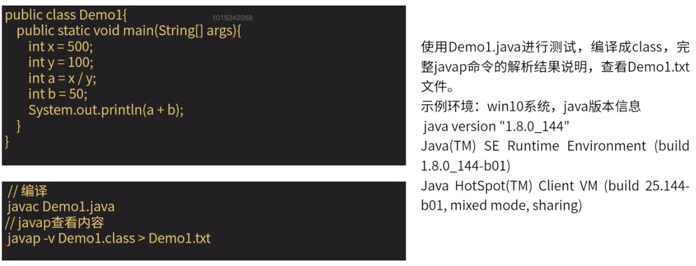

## 线程基础

### java 运行原理分析

-   jvm 运行时内存
    

-   方法区：
    

-   堆内存：
    

-   虚拟机栈：
    

-   本地方法栈：
    

*   程序计数器：
    

### class 文件内容（javap）

-   查看 class 文件内容
    
-   版本号访问控制
    

-   常量池
    

-   构造函数
    

-   程序入口 main 方法
    

### 程序完整运行分析


### 线程状态

6 种状态：java.lang.Thread.State

-   NEW：尚未启动的线程状态
-   RUNNABLE：可运行线程状态，等待 CPU 调度
-   BLOCKED：线程阻塞等待监视器锁定的线程状态。  
     eg. 在 synchronized 代码块中的被阻塞
-   WAITING：线程处于等待状态。  
     不带超时的方式： Object.wait Thread.join LockSupport.park
-   TIMED_WAITING：具有等待时间的等待线程状态  
     带超时的方式 Thread.sleep Object.wait Thread.join LockSupport.parkNanos LockSupport.parkUntil
-   TERMINATED：终止状态。线程正常执行完或者出现异常。


### 线程终止

-   不正确的终止：stop
    stop 会终止线程，并且清除监视器锁信息但是可能导致线程安全问题，JDK 不建议使用。

-   正确的终止：interrupt  
    如果目标线程在调用 Object 的 wait、join、sleep 等方法被阻塞时，interrupt 会生效，该线程的中断状态会被清除，抛出 InterruptedException 异常。  
    如果目标线程是被 I/O 或者 NIO 的 Channel 锁阻塞，IO 操作会被中断或者返回特殊异常值，达到终止线程的目的。  
    如果以上条件都不满足，则会设置此线程的中断状态。

-   正确的终止：标志位
    

### 内存屏障和 CPU 缓存

#### CPU 性能优化手段

-   CPU 缓存
    
    
    缓存同步协议：
    
-   运行时指令重排序
    

-   CPU 优化导致的问题
    

#### 内存屏障


### 线程的通信方式

线程的通信方式分为 4 类：

-   文件共享
-   网络共享（网络开发时具体解释）
-   变量共享
-   JDK 提供的线程协调 API：  
     ~~suspend/resume~~、 wait/notify、 park/unpark

#### 文件共享


#### 变量共享


#### JDK API

**示例：生产消费者**


-   ~~suspend/resume~~
    
    死锁示例：
    

-   wait/notify  
     这些方法只能由同一对象锁的持有者线程调用，也就是写在同步代码块里，否则会抛出 IllegalMonitorStateException 异常。  
     **wait** 方法导致当前线程等待，加入该对象的等待集合中，并且放弃当前持有的对象锁。  
     **notify/notifyAll** 唤醒一个或所有等待这个对象锁的线程。  
    <font color="red">注意：</font>虽然 wait 自动解锁，但是<font color="red">对顺序有要求</font>，如果在 notify 被调用后，才开始 wait 方法调用，线程会永远处于 WAITING 状态。

    ```java
    import java.util.concurrent.TimeUnit;

    /**
    * 功能描述:
    * 示例代码
    *
    * @auther: pikaqiu
    * @date: 2019/3/23 10:12 PM
    */
    public class WaitNotifyTest {
        // 包子店
        public static Object baozidian = null;

        public void Test() throws InterruptedException {
            //启动线程
            new Thread(() -> {
                // 如果没有包子则进入等待
                if (baozidian == null) {
                    // 如果这里休眠5秒，程序就会永远陷入等待状态，说明了对顺序有要求
    //                try {
    //                    TimeUnit.SECONDS.sleep(5);
    //                } catch (InterruptedException e) {
    //                    e.printStackTrace();
    //                }
                    synchronized (this) {
                        System.out.println("1. 进入等待");
                        try {
                            this.wait();
                        } catch (InterruptedException e) {
                            e.printStackTrace();
                        }
                    }
                }
                System.out.println("2. 买到包子了，回家");
            }).start();

            // 3秒之后生产一个包子
            TimeUnit.SECONDS.sleep(3);

            baozidian = new Object();
            synchronized (this) {
                System.out.println("通知消费者");
                this.notifyAll();
            }
        }
    }

    ```

-   park/unpark  
    线程调用 park 则等待“许可”，unpark 则是为为直到线程提供“许可（permit）”。  
    <font color="green">不要求 park 和 unpark 方法的调用顺序</font>  
    在多次调用 unpark 后，再调用 park，线程会直接运行。但<font color="red">不会叠加</font>，也就是说联系多次调用 park，第一次会拿到“许可”直接运行，后续调用会进入等待。
    

#### 伪唤醒

<font color="red">警告 ⚠️ 之前代码中使用 if 来判断是否进入等待状态，是错误的！</font>  
官方建议<font color="red">应该在循环中检查等待条件</font>，原因是处于等待状态的线程可能会收到<font color="red">错误的等待和伪唤醒</font>，如果不在循环中检查等待条件，程序就会在没有满足结束条件情况下退出。

伪唤醒是指线程并非是因为 notity,notityAll,unpark 等 API 调用而唤醒，是更底层原因导致的。

```java
// wait
synchronized (obj) {
    while (<条件判断>) {
        obj.wait();
        // 后续操作
    }
}

// park
while (<条件判断>) {
    LockSupport.park();
    // 后续操作
}
```

### 线程封闭

数据都被封闭在各自的线程之中，就不需要同步，这种通过数据封闭在线程中而避免使用同步的技术被称为线程封闭。

#### ThreadLocal

线程级别的变量，每一个线程都有一个 ThreadLocal 就是每个线程都拥有了自己独立的一个变量，竞争条件都被彻底消除了，在并发模式下是绝对安全的。

```java
import java.util.concurrent.TimeUnit;
/**
 * ThreadLocal示例
 * */
public class Main {

    static ThreadLocal<String> value = new ThreadLocal<>();

    public static void main(String[] args) throws InterruptedException {
        value.set("这是是主线程设置的123");
        String v = value.get();
        System.out.println("线程1执行前，主线程取到的值："+v);

        new Thread(new Runnable() {
            @Override
            public void run() {
                String v = value.get();
                System.out.println("线程1取到的值："+v);

                value.set("这里是线程1设置的456");

                v = value.get();
                System.out.println("重新设置后，线程1取到的值："+v);
                System.out.println("线程1执行结束");
            }
        }).start();

        TimeUnit.SECONDS.sleep(3);
        System.out.println("线程1结束后主线程取到的值："+value.get());
    }

}
```

#### 栈封闭

**局部变量**的固有属性之一就是封闭在线程中。  
他们位于线程执行的栈中，其他线程无法访问这个栈。

### 线程池

线程是不是越多越好？

1. 线程在 Java 中是一个对象，更是操作系统的资源，线程创新销毁需要时间。如果创建时间+销毁时间 > 执行任务时间就很不划算。
2. Java 对象占用堆内存，操作系统线程占用系统内存，根据 JVM 规范，每个线程默认最大栈大小 1M，这个栈空间是需要从系统内存中分配的。线程过多，会消耗很多内存。
3. 操作系统需要频繁切换线程上下文，影响性能。

线程池就是为了更好的控制线程的数量。

#### 线程池原理 - 概念

-   线程池管理器：用于创建并管理线程池，包括创建线程池，销毁线程池，添加新任务。
-   工作线程：线程池中的线程在没有任务时处于等待状态，可以循环的执行任务。
-   任务接口：每个任务必须实现的接口，以供工作线程调度任务的执行，它主要规定了任务的入口，任务执行完成后的收尾工作，任务的执行状态等。
-   任务队列：用于存放没有执行的任务。一种缓存机制


#### 线程池 API - 接口定义和实现类

| 类型   | 名称                        | 描述                                                                        |
| ------ | --------------------------- | --------------------------------------------------------------------------- |
| 接口   | Executor                    | 最上层的借口，定义了执行任务的方法 execute                                  |
| 接口   | ExecutorService             | 继承了 Executor 接口，拓展了 Callable、Future、关闭方法                     |
| 接口   | ScheduledExecutorService    | 继承了 ExecutorService，增加了定时任务相关的方法                            |
| 实现类 | ThreadPoolExecutor          | 基础、标准的线程池实现                                                      |
| 实现类 | ScheduledThreadPoolExecutor | 继承了 ThreadPoolExecutor，实现了 ScheduledExecutorService 中相关的定时方法 |

#### 线程池 API - 方法定义


#### 线程池原理

使用 Executors 工具类创建线程池：


任务 execute 执行过程：


#### 线程数量

怎样确定合适的线程数量？

-   计算型任务：CPU 数量的 1-2 倍
-   IO 型任务：相比于计算型任务，需要多一些线程，需要根据具体的 IO 阻塞时长进行考量。如 Tomcat 的默认最大线程为 200。也可以考虑根据需要在一个最小数量和最大数量间自动增减线程数（CachedThreadPool)。
