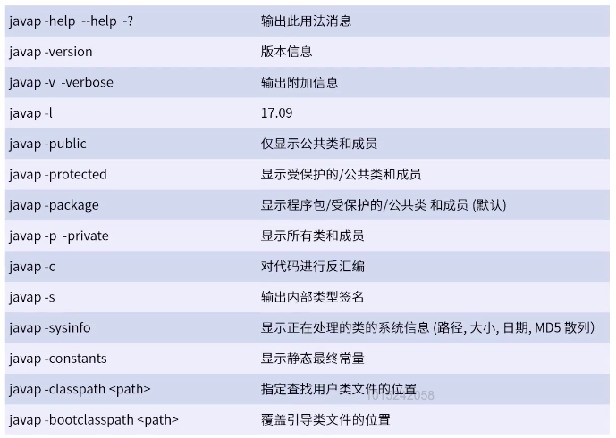
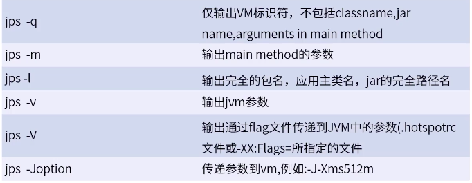
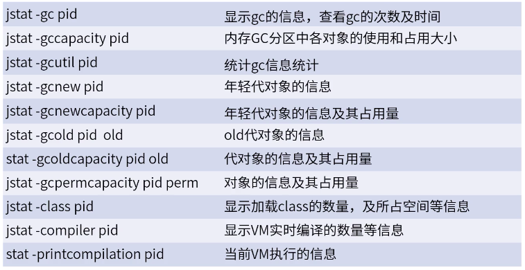
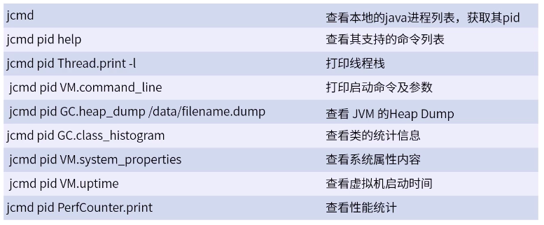
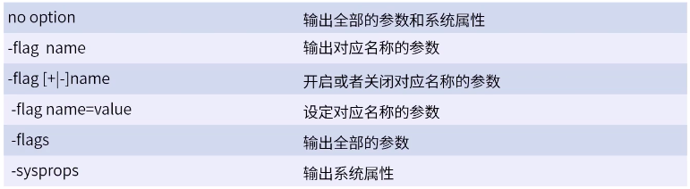
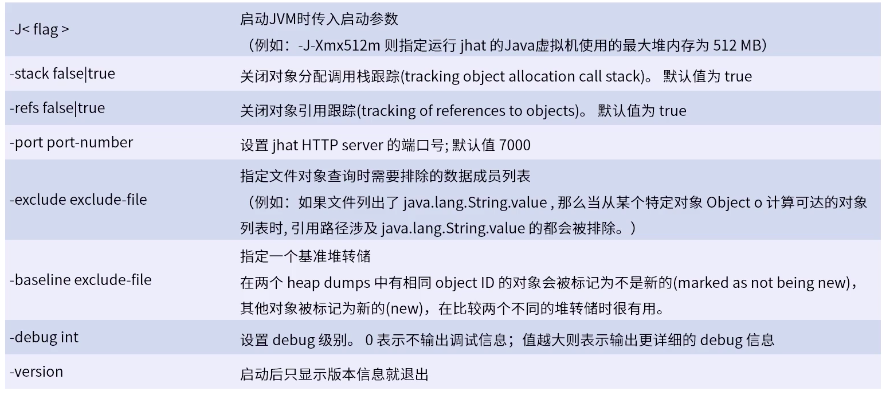
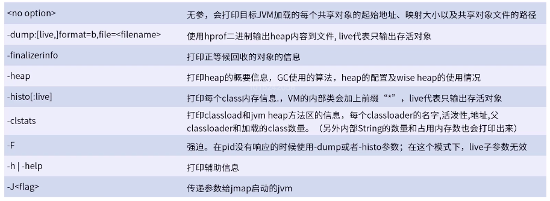
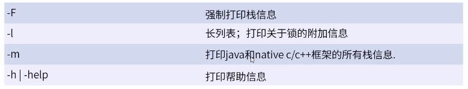

## JVM 内置命令工具

### javap

Java 的反编译工具，主要用于根据 Java 字节码文件反汇编成 Java 源代码文件。

使用：**javap \<options> \<class>**

### jps

jps（Java Virtual Machine Process Status Tool）显示当前所有 Java 进程 pid 的命令。  
使用：**jps \<options> \<hostid>**

### jstat

在 JVM 优化时常用。  
监视 Java 虚拟机（JVM）统计信息。  
用法：**jstat [generalOption | outputOptions vmid [interval[s|ms][count]]]**  
-t 参数可以在输出信息前面加上一个 timestamp 列，显示程序运行的时间。  
-h 参数可以在周期性的数据输出时，输出多少行数据后，跟着输出一个表头信息。  
interval 制定输出统计周期，count 制定输出多少次数据。

具体参数：[jstat 命令手册](/资料/jstat命令手册.pdf)

### jcmd

可以替代 jps 工具查看本地 JVM 信息，**jcmd -l**

**jcmd \<pid | main class> \<command ... | PerfCounter.print | -f file>**

### jinfo

查看运行中 JVM 的全部参数，还可以设置部分参数。  
jinfo [option] pid  
jinfo [option] executable core
jinfo [option][server-id@] remote-hostname-or-IP

参数说明：

-   pid：对于 JVM 的进程 id
-   executable core：产生 core dump 文件
-   [server-id@] remote-hostname-or-IP：远程的 IP 或者 hostname，server-id 标记服务的唯一性 id

### jhat

jhat（Java Head Analyse Tool）分析 Java 堆命令，可以将堆中的对象以 HTML 的形式显示出来，支持对象查询语句 OQL

使用：**jhat [-stack \<bool>][-ref \<bool>] [-port \<port>][-baseline \<file>] [-debug \<int>][-version] [-h|-help][file]**

### jmap

常用于内存泄漏或者内存溢出问题分析。  
打印 Java 进程内存中 Object 的情况，或者将 JVM 中的堆以二进制输出成文本。  
jmap [option] pid (to connect to remote debug server)  
jmap [option] executable core (to connect to remote debug server)  
jmap [option][server-id@]remote-hostname-or-IP (to connect to remote debug server)

### jstack

常用于死锁或者 CPU 100%时查找原因。  
堆栈跟踪工具。jstack 用于打印出给定的 Java 进程 ID 或者 core file 或者远程调用服务的 Java 堆栈信息，如果实在 64 位机器上，需要制定选项”-J-d64“  
jstack [option] pid
jstack [option] executable core  
jstack [option][server-id@]remote-hostname-or-IP

### 可视化工具

Jconsole：测试或者性能调试时使用。  
JvisualVM：很强大，很全面的图形化界面命令，可以查看很多的参数。

---

[内存模型](./README.md)  
[Java](../README.md)  
[主页](../../../../../)
