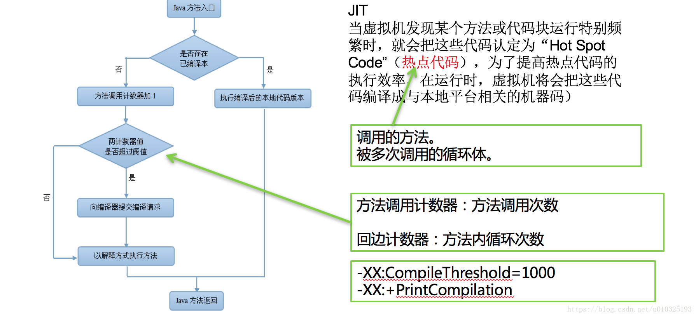
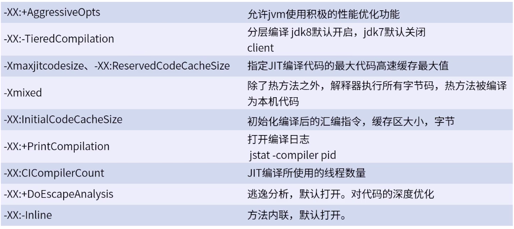

## JVM 的参数及调优

<font color='red'>$系统瓶颈核心还是在应用代码，一般情况下无需过多调优，JVM 本身在不断优化$</font>

### 调优的基本概念

在调整性能时 JVM 有三个组件：

1. 堆大小的调整
2. 垃圾收集器的调整
3. JIT 编译器

大多数调优选项都与调整堆大小和为具体情况选择最合适的垃圾回收器有关。  
JIT 编译器堆性能也有很大影响，但是很少需要使用较新版本的 JVM 进行调优。

通常调优 Java 程序时，重点是以下两个目标：

-   **响应性：** 应用程序或系统对请求的数据进行响应的速度，对于专注响应性的应用程序，长的暂停时间是不可接受的，重点是在短时间内做出反应。
-   **吞吐量：** 侧重于在特定时间段内最大化应用程序的工作量，对于专注于吞吐量的应用程序，高暂停时间是可接受的。由于高吞吐量应用程序在较长时间内专注于基础测试，因此不需要考虑快速响应时间。

### 常用的 JVM 参数

<font color='red'>版本不断更新，JVM 参数和具体说明建议需要时具体参考 oracle 官方手册</font>

| 参数                            | 说明                               |
| ------------------------------- | ---------------------------------- |
| -XX:+AlwaysPreTouch             | JVM 启动时分配内存，非使用时再分配 |
| -XX:ErrorFile=filename          | 崩溃日志                           |
| -XX:+TraceClassLoading          | 跟踪类加载信息                     |
| -XX:PrintClassHistogram         | 按下 Ctrl+Break 后，打印类的信息   |
| -Xmx -Xms                       | 最大堆和最小堆                     |
| -XX:PermSize、-XX:MetaSpaceSize | 永久代、元数据空间                 |
| -XX:+HeapDumpOnOutOfMemoryError | OOM 时导出堆到文件                 |
| -XX:+HeapDumpPath               | OOM 时堆导出的路径                 |
| -XX:OnOutOfMemoryError          | 在 OOM 时执行一个脚本              |
| -XX:+PrintFlagsFinal -version   | 打印所有-XX 参数和默认值           |

### GC 调优思路

1. 场景分析
   例如：启动速度慢；偶尔出现反应慢于平均水平或者出现卡顿
2. 确定目标
   内存占用、低延迟、吞吐量
3. 收集日志
   通过参数配置收集 GC 日志；通过 JDK 查看工具查看 GC 状态
4. 分析日志
   使用工具辅助分析日志，查看 GC 次数、GC 时间
5. 调整参数
   切换垃圾回收器或者调整垃圾回收器参数

### 同用 GC 参数

JDK1.8 的通用参数

| 参数                   | 说明                                                                                                                    |
| ---------------------- | ----------------------------------------------------------------------------------------------------------------------- |
| -XX:ParallelGCThreads  | 设置 GC 并行线程数                                                                                                      |
| -XX:ConcGCThreads      | 设置并发 GC 线程数                                                                                                      |
| -XX:MaxGCPauseMillis   | 最大停顿时间，单位毫秒；<br>GC 尽力保证回收时间不超过设定值                                                             |
| -XX:GCTimeRatio        | 0-100 范围内取值；<br>垃圾收集时间占总时间的比；<br>默认 99，即最大 1%的 GC 时间                                        |
| -XX:SurvivorRatio      | 设置 Eden 区大小和 Survivor 区大小比例；<br>8 表示：两个 Survivor：一个 Eden = 2:8，即一个 Survivor 占整个年轻代的 1/10 |
| -XX:NewRatio           | 新生代和老年代的比<br>4 表示新生代：老年代 = 1:4，即年轻代占 1/5                                                        |
| -verbose、-XX:+printGC | 打印 GC 的简要信息                                                                                                      |
| -XX:PrintGCDetails     | 打印 GC 详细信息                                                                                                        |
| -XX:PrintGCTimeStamp   | 打印 GC 发生的时间戳                                                                                                    |
| -Xloggc:log/gc.log     | 指定 GC log 的位置，以文件输出                                                                                          |
| -XX:PrintHeapAtGC      | 每一次 GC 后都打印出堆信息                                                                                              |

### 调优示例一

#### Parallel 调优

-   JDK 默认垃圾回收器
-   吞吐量优先

具体设置命令请看[这里](JVM.md)

目标代码：

```java
package com.example.boot;

import org.springframework.boot.SpringApplication;
import org.springframework.boot.autoconfigure.SpringBootApplication;

import java.util.Random;
import java.util.concurrent.Executors;
import java.util.concurrent.TimeUnit;


// 启动程序，模拟用户请求
// 每100毫秒钟创建1000线程，每个线程创建一个512kb的对象，最多1秒内同时存在1500线程，并发量1000/s，占用内存750m（75%），查看GC的情况
@SpringBootApplication
public class PerformanceApplication {

    public static void main(String[] args) {
        SpringApplication.run(PerformanceApplication.class, args);
        Executors.newScheduledThreadPool(1).scheduleAtFixedRate(() -> {
            new Thread(() -> {
                for (int i = 0; i < 150; i++) {
                    try {
                        // 创建 512 kb 的对象
                        byte[] bytes = new byte[1024 * 512];
                        Thread.sleep(new Random().nextInt(1000));
                    } catch (InterruptedException e) {
                        e.printStackTrace();
                    }
                }
            }).start();
        }, 100, 100, TimeUnit.MILLISECONDS);
    }

// 打包 mvn clean package
// 服务器上运行 performance-1.0.0.jar
// 对象存活1秒左右，远超了平时接口调用响应时间，该场景为吞吐量优先
}
```

调优过程：

```shell
# 运行本程序

# 查找到 performance-1.0.0.jar 的进程号，这里假设进程号为 5755
jcmd | grep "performance-1.0.0.jar" | awk '{print $1}'

# jmap 打印出 heap 概要信息， GC 使用的算法，heap 的配置及 wiseheap 的使用情况
jmap -heap 5755

# 收集 GC 日志（日志离线分析，主要用于检测故障看是不是由于 GC 导致的程序卡顿）
# 不建议直接输出 java -Xmx1024m -XX:+PrintGCDetails -XX:+PrintGCTimeStamp -jar performance-1.0.0.jar
java -Xmx1024m -Xloggc:gc/gc.log -jar performance-1.0.0.jar

# 分析 GC 日志，
GCViewer 工具，分析 GC 日志文件 https://github.com/chewiebug/GCViewer

# 实时分析
# jstat 动态监听 GC 统计信息，间隔1000ms统计一次，每十行数据后输出列标题
jstat -gc -h10 5755 1000
```

具体 jstat 参数参考：[jstat 命令手册](/资料/jstat命令手册.pdf)

jstat 动态监听结果截取：

```shell
 S0C    S1C    S0U    S1U      EC       EU        OC         OU       MC     MU    CCSC   CCSU   YGC     YGCT    FGC    FGCT     GCT
512.0  512.0  128.0   0.0   348160.0 221780.0  236544.0   44886.9   17792.0 16924.2 2432.0 2164.0    268    3.035  26      0.786    3.821
512.0  512.0  128.0   0.0   348160.0 297982.4  236544.0   44934.9   17792.0 16924.2 2432.0 2164.0    270    3.042  26      0.786    3.827
512.0  512.0   0.0   128.0  348160.0 71437.2   236544.0   45022.9   17792.0 16924.2 2432.0 2164.0    273    3.052  26      0.786    3.838
512.0  512.0   0.0   128.0  348160.0 162835.1  236544.0   45086.9   17792.0 16924.2 2432.0 2164.0    275    3.058  26      0.786    3.844
512.0  512.0   0.0   128.0  348160.0 249031.9  236544.0   45134.9   17792.0 16924.2 2432.0 2164.0    277    3.065  26      0.786    3.850
512.0  512.0   0.0   128.0  348160.0 292040.6  236544.0   45198.9   17792.0 16924.2 2432.0 2164.0    279    3.071  26      0.786    3.857
512.0  512.0  128.0   0.0   348160.0 18254.5   236544.0   45294.9   17792.0 16924.2 2432.0 2164.0    282    3.082  26      0.786    3.868
512.0  512.0  128.0   0.0   348160.0 98999.3   236544.0   45358.9   17792.0 16924.2 2432.0 2164.0    284    3.088  26      0.786    3.874
512.0  512.0  128.0   0.0   348160.0 163397.1  236544.0   45422.9   17792.0 16924.2 2432.0 2164.0    286    3.097  26      0.786    3.883
512.0  512.0  128.0   0.0   348160.0 264584.6  236544.0   45478.9   17792.0 16924.2 2432.0 2164.0    288    3.103  26      0.786    3.889
 S0C    S1C    S0U    S1U      EC       EU        OC         OU       MC     MU    CCSC   CCSU   YGC     YGCT    FGC    FGCT     GCT
512.0  512.0   0.0   128.0  348160.0 22457.5   236544.0   46078.9   17792.0 16924.2 2432.0 2164.0    291    3.114  26      0.786    3.900
512.0  512.0   0.0   128.0  348160.0 67152.0   236544.0   46118.9   17792.0 16924.2 2432.0 2164.0    293    3.122  26      0.786    3.908
512.0  512.0   0.0   128.0  348160.0 150870.1  236544.0   46174.9   17792.0 16924.2 2432.0 2164.0    295    3.129  26      0.786    3.915
512.0  512.0   0.0   128.0  348160.0 240125.0  236544.0   46222.9   17792.0 16924.2 2432.0 2164.0    297    3.137  26      0.786    3.922
512.0  512.0   0.0   128.0  348160.0 326081.8  236544.0   46278.9   17792.0 16924.2 2432.0 2164.0    299    3.143  26      0.786    3.928
512.0  512.0  128.0   0.0   348160.0 61908.7   236544.0   46886.9   17792.0 16924.2 2432.0 2164.0    302    3.153  26      0.786    3.939
512.0  512.0  128.0   0.0   348160.0 120165.0  236544.0   52071.1   17792.0 16924.2 2432.0 2164.0    304    3.161  26      0.786    3.947
512.0  512.0  128.0   0.0   348160.0 204259.1  236544.0   65431.5   17792.0 16924.2 2432.0 2164.0    306    3.171  26      0.786    3.956
512.0  512.0  128.0   0.0   348160.0 279361.3  236544.0   84440.0   17792.0 16924.2 2432.0 2164.0    308    3.181  26      0.786    3.967
512.0  512.0   0.0   128.0  348160.0 54097.4   236544.0   123417.2  17792.0 16924.2 2432.0 2164.0    311    3.201  26      0.786    3.986
 S0C    S1C    S0U    S1U      EC       EU        OC         OU       MC     MU    CCSC   CCSU   YGC     YGCT    FGC    FGCT     GCT
512.0  512.0   0.0   128.0  348160.0 124886.9  236544.0   160346.4  17792.0 16924.2 2432.0 2164.0    313    3.214  26      0.786    4.000
512.0  512.0   0.0   128.0  348160.0 231631.5  236544.0   200347.6  17792.0 16924.2 2432.0 2164.0    315    3.229  26      0.786    4.015
```

观察 jstat 结果：
YGC（young GC）新生代大概每 10 秒回收 22 次，FullGC 很稳定，执行了 26 次

此时 jinfo 打印结果 ：

```shell
Attaching to process ID 9516, please wait...
Debugger attached successfully.
Server compiler detected.
JVM version is 25.151-b12
Non-default VM flags: -XX:CICompilerCount=3 -XX:InitialHeapSize=134217728 -XX:MaxHeapSize=1073741824 -XX:MaxNewSize=357564416 -XX:MinHeapDeltaBytes=524288 -XX:NewSize=44564480 -XX:OldSize=89653248 -XX:+PrintGC -XX:+PrintGCTimeStamps -XX:+UseCompressedClassPointers -XX:+UseCompressedOops -XX:+UseFastUnorderedTimeStamps -XX:+UseParallelGC
Command line:  -Xmx1024m -Xloggc:/Users/pikaqiu/Dev/Workspace/Java/boot/gc.log -Dfile.encoding=UTF-8
```

调优过程：

1. 查看 Parallel 是否开启了自适应

    ```shell
    # 通过命令查看参数 java -XX:+PrintFlagsFinal -version | grep 关键字
    java -XX:+PrintFlagsFinal -version | grep UseAdaptiveSizePolicy
    ```

    结果：

    ```shell
        bool UseAdaptiveSizePolicy                     = true                                {product}
        bool UseAdaptiveSizePolicyFootprintGoal        = true                                {product}
        bool UseAdaptiveSizePolicyWithSystemGC         = false                               {product}
    java version "1.8.0_151"
    Java(TM) SE Runtime Environment (build 1.8.0_151-b12)
    Java HotSpot(TM) 64-Bit Server VM (build 25.151-b12, mixed mode)
    ```

    UseAdaptiveSizePolicy 默认自动开启，所以 Eden 区会自动变化大小

2. 查看当前的线程数量

    ```shell
    java -XX:+PrintFlagsFinal -version | grep ParallelGCThreads
    ```

    结果：

    ```shell
        uintx ParallelGCThreads                         = 4                                   {product}
    java version "1.8.0_151"
    Java(TM) SE Runtime Environment (build 1.8.0_151-b12)
    Java HotSpot(TM) 64-Bit Server VM (build 25.151-b12, mixed mode)
    ```

    当前服务器是 4 核 CPU，此时线程数量为 4。

    尝试修改当前程序启动参数：将线程变成 8 个

    ```shell
    java -Xmx1024m -Xloggc:log地址 -XX:ParallelGCThreads=8 -jar jar包
    ```

    执行结果：

    ```shell
     S0C    S1C    S0U    S1U      EC       EU        OC         OU       MC     MU    CCSC   CCSU   YGC     YGCT    FGC    FGCT     GCT
    512.0  512.0   0.0    96.0  348160.0 95751.8   406528.0   403181.3  17792.0 16951.1 2432.0 2163.9  11485   62.697  42      1.283   63.980
    512.0  512.0   0.0    96.0  348160.0 218268.4  406528.0   403221.3  17792.0 16951.1 2432.0 2163.9  11487   62.707  42      1.283   63.990
    512.0  512.0   0.0    64.0  332800.0 288113.1  406528.0   403269.3  17792.0 16951.1 2432.0 2163.9  11489   62.715  42      1.283   63.998
    512.0  512.0   96.0   0.0   340480.0 62978.5   406528.0   403317.3  17792.0 16951.1 2432.0 2163.9  11492   62.729  42      1.283   64.012
    512.0  512.0   64.0   0.0   348160.0 158134.7  406528.0   403349.3  17792.0 16951.1 2432.0 2163.9  11494   62.739  42      1.283   64.022
    512.0  512.0   64.0   0.0   348160.0 265834.9  406528.0   403373.3  17792.0 16951.1 2432.0 2163.9  11496   62.751  42      1.283   64.034
    512.0  512.0   96.0   0.0   348160.0 342876.2  406528.0   403413.3  17792.0 16951.1 2432.0 2163.9  11498   62.761  42      1.283   64.044
    512.0  512.0   0.0    96.0  348160.0 43195.5   406528.0   403453.3  17792.0 16951.1 2432.0 2163.9  11501   62.783  42      1.283   64.066
    512.0  512.0   0.0    96.0  348160.0 142957.8  406528.0   403485.3  17792.0 16951.1 2432.0 2163.9  11503   62.804  42      1.283   64.087
    512.0  512.0   0.0    96.0  348160.0 228647.0  406528.0   403517.3  17792.0 16951.1 2432.0 2163.9  11505   62.819  42      1.283   64.101
    S0C    S1C    S0U    S1U      EC       EU        OC         OU       MC     MU    CCSC   CCSU   YGC     YGCT    FGC    FGCT     GCT
    512.0  512.0   0.0    64.0  348160.0 329615.3  406528.0   403565.3  17792.0 16951.1 2432.0 2163.9  11507   62.834  42      1.283   64.117
    512.0  512.0   64.0   0.0   348160.0 44806.0   406528.0   403621.3  17792.0 16951.1 2432.0 2163.9  11510   62.848  42      1.283   64.131
    512.0  512.0   64.0   0.0   348160.0 121667.6  406528.0   403661.3  17792.0 16951.1 2432.0 2163.9  11512   62.863  42      1.283   64.146
    512.0  512.0   96.0   0.0   348160.0 207340.7  406528.0   403701.3  17792.0 16951.1 2432.0 2163.9  11514   62.874  42      1.283   64.157
    512.0  512.0   64.0   0.0   348160.0 296455.1  406528.0   403749.3  17792.0 16951.1 2432.0 2163.9  11516   62.886  42      1.283   64.169
    512.0  512.0   0.0    96.0  348160.0 41117.0   406528.0   403821.3  17792.0 16951.1 2432.0 2163.9  11519   62.908  42      1.283   64.190
    512.0  512.0   0.0    96.0  348160.0 118626.3  406528.0   403877.3  17792.0 16951.1 2432.0 2163.9  11521   62.922  42      1.283   64.205
    512.0  512.0   0.0    64.0  348160.0 217125.2  406528.0   403933.3  17792.0 16951.1 2432.0 2163.9  11523   62.935  42      1.283   64.218
    512.0  512.0   0.0    64.0  348160.0 288143.6  406528.0   403965.3  17792.0 16951.1 2432.0 2163.9  11525   62.948  42      1.283   64.231
    512.0  512.0   96.0   0.0   348160.0 27074.1   406528.0   404013.3  17792.0 16951.1 2432.0 2163.9  11528   62.966  42      1.283   64.249
    S0C    S1C    S0U    S1U      EC       EU        OC         OU       MC     MU    CCSC   CCSU   YGC     YGCT    FGC    FGCT     GCT
    512.0  512.0   64.0   0.0   348160.0 146680.0  406528.0   404045.3  17792.0 16951.1 2432.0 2163.9  11530   62.979  42      1.283   64.262
    512.0  512.0   96.0   0.0   348160.0 184157.3  406528.0   404085.3  17792.0 16951.1 2432.0 2163.9  11532   62.993  42      1.283   64.276
    ```

    观察 jstat 结果：
    YGC 大概每 10 秒回收 22 次左右，FullGC 很稳定，执行了 46 次

    尝试修改当前程序启动参数：将线程变成 1 个

    ```shell
    java -Xmx1024m -Xloggc:log地址 -XX:ParallelGCThreads=1 -jar jar包
    ```

    执行结果：

    ```shell
    S0C    S1C    S0U    S1U      EC       EU        OC         OU       MC     MU    CCSC   CCSU   YGC     YGCT    FGC    FGCT     GCT
    30208.0 30208.0 3616.1  0.0   286208.0 203523.6  233472.0   137393.5  17792.0 16945.8 2432.0 2161.9    190    3.806  26      1.036    4.842
    27136.0 27648.0  0.0   1056.0 289792.0 78914.3   233472.0   143049.7  17792.0 16945.8 2432.0 2161.9    193    3.827  26      1.036    4.863
    25088.0 26112.0  0.0   1056.0 294400.0 262862.1  233472.0   145625.7  17792.0 16945.8 2432.0 2161.9    195    3.841  26      1.036    4.877
    20992.0 22016.0 544.0   0.0   302080.0 186826.8  233472.0   147697.8  17792.0 16945.8 2432.0 2161.9    198    3.861  26      1.036    4.897
    18944.0 19968.0  0.0   1056.0 306176.0 86184.3   233472.0   148233.8  17792.0 16945.8 2432.0 2161.9    201    3.881  26      1.036    4.916
    16896.0 17920.0  0.0   544.0  310272.0 204992.9  233472.0   149273.8  17792.0 16945.8 2432.0 2161.9    203    3.893  26      1.036    4.929
    13824.0 14336.0 544.0   0.0   317440.0 62638.2   233472.0   149297.8  17792.0 16945.8 2432.0 2161.9    206    3.912  26      1.036    4.948
    11776.0 12800.0 544.0   0.0   321024.0 220613.9  233472.0   149825.9  17792.0 16945.8 2432.0 2161.9    208    3.924  26      1.036    4.960
    10752.0 11264.0  0.0    32.0  324096.0 40823.5   233472.0   149849.9  17792.0 16945.8 2432.0 2161.9    211    3.942  26      1.036    4.978
    9728.0 10240.0  0.0    32.0  327168.0 182627.1  233472.0   149865.9  17792.0 16945.8 2432.0 2161.9    213    3.954  26      1.036    4.990
    S0C    S1C    S0U    S1U      EC       EU        OC         OU       MC     MU    CCSC   CCSU   YGC     YGCT    FGC    FGCT     GCT
    8192.0 8704.0  0.0    32.0  329216.0 325931.2  233472.0   149881.9  17792.0 16945.8 2432.0 2161.9    215    3.966  26      1.036    5.002
    5632.0 6656.0  32.0   0.0   334336.0 114957.5  233472.0   149905.9  17792.0 16947.6 2432.0 2161.9    218    3.984  26      1.036    5.020
    5632.0 6144.0  32.0   0.0   336384.0 238824.5  233472.0   149921.9  17792.0 16947.6 2432.0 2161.9    220    3.996  26      1.036    5.032
    4608.0 5120.0  0.0    32.0  337408.0 26184.2   233472.0   149945.9  17792.0 16947.6 2432.0 2161.9    223    4.015  26      1.036    5.051
    4096.0 4608.0  0.0    32.0  339456.0 119062.4  233472.0   149961.9  17792.0 16947.6 2432.0 2161.9    225    4.025  26      1.036    5.061
    3584.0 4096.0  0.0    32.0  339968.0 234067.9  233472.0   149977.9  17792.0 16947.6 2432.0 2161.9    227    4.037  26      1.036    5.073
    3072.0 3584.0  0.0    32.0  340992.0 302554.8  233472.0   149985.9  17792.0 16947.6 2432.0 2161.9    229    4.047  26      1.036    5.083
    2560.0 2560.0  32.0   0.0   343040.0 53846.5   233472.0   149985.9  17792.0 16947.6 2432.0 2161.9    232    4.065  26      1.036    5.101
    1536.0 2048.0  32.0   0.0   344064.0 158102.3  233472.0   149985.9  17792.0 16947.6 2432.0 2161.9    234    4.077  26      1.036    5.113
    2048.0 2048.0  32.0   0.0   345088.0 223747.3  233472.0   149985.9  17792.0 16947.6 2432.0 2161.9    236    4.089  26      1.036    5.124
    S0C    S1C    S0U    S1U      EC       EU        OC         OU       MC     MU    CCSC   CCSU   YGC     YGCT    FGC    FGCT     GCT
    1536.0 1536.0  0.0    32.0  345088.0   0.0     233472.0   149993.9  17792.0 16947.6 2432.0 2161.9    239    4.107  26      1.036    5.143
    1536.0 1536.0  0.0   544.0  346112.0 75780.1   233472.0   150001.9  17792.0 16947.6 2432.0 2161.9    241    4.120  26      1.036    5.155
    ```

    观察 jstat 结果：
    YGC 大概每 10 秒回收 25 次左右，FullGC 很稳定，执行了 26 次

Parallel 调试发现。。。。原理默认的参数就很好。。。

#### CMS 调优

-   响应时间优先
-   Parallel GC 无法满足应用程序延迟再考虑 CMS
-   新版本建议使用 G1

| 参数                               | 说明                                                                                                    |
| ---------------------------------- | ------------------------------------------------------------------------------------------------------- |
| -XX:+UseConcMarkSweepGC            | 老年代使用 CMS                                                                                          |
| -XX:+UseParNewGC                   | 新生代使用 ParNew                                                                                       |
| -XX:CMSInitiatingOccupancyFraction | 设置出发 GC 的阈值，默认 68%<br/>如果内存预留空间不够就会引起 concurrent mode failure 就会变成单线程 GC |
| -XX:+UseCMSCompactAtFullCollection | Full GC 后，进行一次整理<br/>整理过程是独占的，会引起停顿时间变长                                       |
| -XX:+SCMFullGCsBeforeCompaction    | 设置进行几次 Full GC 后进行碎片整理                                                                     |
| -XX:+CMSClassUnloadingEnabled      | 允许对类元数据进行回收                                                                                  |
| -XX:+UseCMSInitiatingOccupancyOnly | 表示只在达到阈值时，才进行 SCM 回收                                                                     |
| -XX:+CMSIncrementalMode            | 使用增量模式，比较适合单 CPU                                                                            |

调优过程：

将代码改用 CMS 回收器 java -Xmx1024m -Xloggc:log 地址 -XX:+UseConcMarkSweepGC -jar jar 包

```shell
 S0C    S1C    S0U    S1U      EC       EU        OC         OU       MC     MU    CCSC   CCSU   YGC     YGCT    FGC    FGCT     GCT
34048.0 34048.0 524.1   0.0   272640.0 142594.2  707840.0   596881.7  17792.0 16946.0 2432.0 2157.5    468    4.561  134     0.617    5.178
34048.0 34048.0  0.0   527.8  272640.0 117567.0  707840.0   596886.7  17792.0 16946.0 2432.0 2157.5    471    4.576  134     0.617    5.193
34048.0 34048.0 525.8   0.0   272640.0 84732.2   707840.0   596891.7  17792.0 16946.0 2432.0 2157.5    474    4.589  134     0.617    5.206
34048.0 34048.0  0.0   526.1  272640.0 12474.7   707840.0   596896.2  17792.0 16946.0 2432.0 2157.5    477    4.602  134     0.617    5.218
34048.0 34048.0 525.8   0.0   272640.0   0.0     707840.0   596901.2  17792.0 16946.0 2432.0 2157.5    480    4.614  134     0.617    5.231
34048.0 34048.0 525.8   0.0   272640.0 245255.2  707840.0   596904.4  17792.0 16946.0 2432.0 2157.5    482    4.624  134     0.617    5.241
34048.0 34048.0  0.0   525.8  272640.0 196428.2  707840.0   596909.4  17792.0 16946.0 2432.0 2157.5    485    4.639  134     0.617    5.256
34048.0 34048.0 525.8   0.0   272640.0 182451.3  707840.0   596913.9  17792.0 16946.0 2432.0 2157.5    488    4.653  134     0.617    5.270
34048.0 34048.0  0.0   527.4  272640.0 146421.3  707840.0   596918.9  17792.0 16946.0 2432.0 2157.5    491    4.666  134     0.617    5.283
34048.0 34048.0 527.8   0.0   272640.0 127953.3  707840.0   596923.4  17792.0 16946.0 2432.0 2157.5    494    4.679  134     0.617    5.296
 S0C    S1C    S0U    S1U      EC       EU        OC         OU       MC     MU    CCSC   CCSU   YGC     YGCT    FGC    FGCT     GCT
34048.0 34048.0  0.0   528.2  272640.0 89367.8   707840.0   596927.9  17792.0 16946.0 2432.0 2157.5    497    4.690  134     0.617    5.306
34048.0 34048.0 527.8   0.0   272640.0 49384.8   707840.0   596932.9  17792.0 16946.0 2432.0 2157.5    500    4.701  134     0.617    5.318
34048.0 34048.0  0.0   525.8  272640.0   0.0     707840.0   596937.9  17792.0 16946.0 2432.0 2157.5    503    4.708  134     0.617    5.325
34048.0 34048.0  0.0   525.4  272640.0 237608.3  707840.0   596941.1  17792.0 16946.0 2432.0 2157.5    505    4.713  134     0.617    5.330
```

观察结果：10 秒内发生了 30+次的 GC，并且有逐渐增多的趋势。CMS 这种**高频回收**并不是适合这个场景。

#### G1 调优

-   兼顾吞吐量和响应时间
-   超过 50%的 Java 堆被实时数据占用
-   建议大堆（6G 或更大）
-   要求 GC 延迟小（停顿时间低于 0.5s）

| 参数                                  | 说明                                                                                                                                                                         |
| ------------------------------------- | ---------------------------------------------------------------------------------------------------------------------------------------------------------------------------- |
| -XX:+UseG1GC                          | 使用 G1 垃圾收集器                                                                                                                                                           |
| -XX:MaxGCPauseMillis=200              | 设置期望达到的最大 GC 停顿时间指标（JVM 会尽力实现，但不保证达到）                                                                                                           |
| -XX:InitiatingHeapOccupancyPercent=45 | 启动并发 GC 周期时的堆内存占用百分比. G1 之类的垃圾收集器用它来触发并发 GC 周期,基于整个堆的使用率,而不只是某一代内存的使用比. 值为 0 则表示”一直执行 GC 循环”. 默认值为 45. |
| -XX:NewRatio=n                        | 新生代与老生代(new/old generation)的大小比例(Ratio). 默认值为 2.                                                                                                             |
| -XX:SurvivorRatio=n                   | eden/survivor 空间大小的比例(Ratio). 默认值为 8.                                                                                                                             |
| -XX:MaxTenuringThreshold=n            | 提升年老代的最大临界值(tenuring threshold). 默认值为 15.                                                                                                                     |
| -XX:ParallelGCThreads=n               | 设置垃圾收集器在并行阶段使用的线程数,默认值随 JVM 运行的平台不同而不同.                                                                                                      |
| -XX:ConcGCThreads=n                   | 并发垃圾收集器使用的线程数量. 默认值随 JVM 运行的平台不同而不同.                                                                                                             |
| -XX:G1ReservePercent=n                | 设置堆内存保留为假天花板的总量,以降低提升失败的可能性. 默认值是 10.                                                                                                          |
| -XX:G1HeapRegionSize=n                | 使用 G1 时 Java 堆会被分为大小统一的的区(region)。此参数可以指定每个 heap 区的大小. 默认值将根据 heap size 算出最优解（heap/2000）. 最小值为 1Mb, 最大值为 32Mb.             |
| -XX:G1MixedGCLiveThresholdPercent     | 老年代一块 Mixed GC，出发阈值                                                                                                                                                |
| -XX:G1OldCSetRegionThresholdPercent   | 设置混合垃圾回收期间要回收的最大旧区域数。默认值是 Java 堆的 10%。                                                                                                           |
| -XX:ClassUnloadingWithConcurrentMark  | G1 增加并默认开启，在并发标记阶段结束后，JVM 即将进行类型卸载                                                                                                                |
| -XX:G1NewSizePercent=5                | 设置要用作年轻代大小最小值的堆百分比。默认值是 Java 堆的 5%。                                                                                                                |
| -XX:G1MaxNewSizePercent=60            | 设置要用作年轻代大小最大值的堆大小百分比。默认值是 Java 堆的 60%。                                                                                                           |
| -XX:G1MixedGCCountTarget=8            | Mixed GC 数量控制                                                                                                                                                            |

将代码改用 G1 回收器 java -Xmx1024m -Xloggc:log 地址 -XX:+UseG1GC -jar jar 包

```shell
 S0C    S1C    S0U    S1U      EC       EU        OC         OU       MC     MU    CCSC   CCSU   YGC     YGCT    FGC    FGCT     GCT
 0.0   1024.0  0.0   1024.0 656384.0 53248.0   391168.0   390219.5  17792.0 16967.5 2432.0 2165.0    127    0.651   0      0.000    0.651
 0.0   1024.0  0.0   1024.0 587776.0 60416.0   459776.0   458839.1  17792.0 16967.5 2432.0 2165.0    129    0.662   0      0.000    0.662
 0.0    0.0    0.0    0.0   660480.0  6144.0   388096.0   112218.7  17792.0 16967.9 2432.0 2165.0    132    0.677   0      0.000    0.677
 0.0    0.0    0.0    0.0   660480.0 24576.0   388096.0   200806.9  17792.0 16967.9 2432.0 2165.0    134    0.689   0      0.000    0.689
 0.0   1024.0  0.0   1024.0 659456.0 16384.0   388096.0   160377.5  17792.0 16967.9 2432.0 2165.0    137    0.707   0      0.000    0.707
 0.0   1024.0  0.0   1024.0 659456.0 38912.0   388096.0   296584.7  17792.0 16967.9 2432.0 2165.0    139    0.718   0      0.000    0.718
 0.0   1024.0  0.0   1024.0 641024.0 53248.0   406528.0   406165.5  17792.0 16967.9 2432.0 2165.0    141    0.729   0      0.000    0.729
 0.0    0.0    0.0    0.0   660480.0  7168.0   388096.0   113819.8  17792.0 16967.9 2432.0 2165.0    144    0.746   0      0.000    0.746
 0.0   1024.0  0.0   1024.0 659456.0  4096.0   388096.0   103591.2  17792.0 16967.9 2432.0 2165.0    147    0.765   0      0.000    0.765
 0.0   1024.0  0.0   1024.0 659456.0 32768.0   388096.0   260793.1  17792.0 16967.9 2432.0 2165.0    149    0.778   0      0.000    0.778
 S0C    S1C    S0U    S1U      EC       EU        OC         OU       MC     MU    CCSC   CCSU   YGC     YGCT    FGC    FGCT     GCT
 0.0   1024.0  0.0   1024.0 637952.0 49152.0   409600.0   409282.6  17792.0 16967.9 2432.0 2165.0    151    0.792   0      0.000    0.792
 0.0    0.0    0.0    0.0   660480.0 15360.0   388096.0   154310.0  17792.0 16967.9 2432.0 2165.0    154    0.817   0      0.000    0.817
 0.0   1024.0  0.0   1024.0 659456.0 11264.0   388096.0   134359.2  17792.0 16967.9 2432.0 2165.0    157    0.839   0      0.000    0.839
 0.0   1024.0  0.0   1024.0 659456.0 37888.0   388096.0   324842.4  17792.0 16967.9 2432.0 2165.0    159    0.856   0      0.000    0.856
```

可以看出 G1 避免了 Full GC

### 调优示例二

目标代码：从吞吐量 -> 响应时间（性能）
这个场景很难模拟。。。要求响应时间的情况并不是优化 JVM 能解决的

```java
// 每100毫秒钟创建1000线程，每个线程创建一个512kb的对象，最多100毫秒内同时存在1000线程，并发量1000/s，吞吐量6000/s，查看GC的情况
@SpringBootApplication
public class PerformanceApplication {
    public static void main(String[] args) {
        SpringApplication.run(PerformanceApplication.class, args);
        Executors.newScheduledThreadPool(1).scheduleAtFixedRate(() -&gt; {
            new Thread(() -&gt; {
                for (int i = 0; i &lt; 1000; i++) {
                    try {
                        //  不干活，专门512kb的小对象
                        byte[] temp = new byte[1024 * 512];
                        Thread.sleep(new Random().nextInt(100)); // 随机睡眠200毫秒秒以内
                    } catch (InterruptedException e) {
                        e.printStackTrace();
                    }
                }
            }).start();
        }, 100, 100, TimeUnit.MILLISECONDS);
    }
}

```

**Parallel GC** 服务器默认 java -Xmx1024m -Xloggc:/netease/gc6.log -jar performance-1.1.0.jar
UseAdaptiveSizePolicy 自适应默认开启，所以 Eden 区会自动变化大小

```shell
 S0C    S1C    S0U    S1U      EC       EU        OC         OU       MC     MU    CCSC   CCSU   YGC     YGCT    FGC    FGCT     GCT
37376.0 37888.0 34817.1  0.0   272384.0 92500.6   125952.0   57532.9   35120.0 33541.2 4656.0 4335.4    286    2.698   7      0.360    3.059
36864.0 36864.0 32289.0  0.0   275456.0   0.0     125952.0   87877.8   35120.0 33541.2 4656.0 4335.4    300    2.812   7      0.360    3.173
35328.0 35840.0 31777.0  0.0   276480.0   0.0     128000.0   61118.4   35120.0 33542.5 4656.0 4335.4    314    2.924   8      0.404    3.328
34816.0 34816.0 31297.0  0.0   279552.0 139082.4  128000.0   102215.6  35120.0 33555.8 4656.0 4335.4    328    3.029   8      0.404    3.433
33792.0 33792.0 30752.9  0.0   281600.0 181082.7  130048.0   68303.1   35120.0 33555.8 4656.0 4335.4    342    3.138   9      0.448    3.586
33280.0 33280.0  0.0   29728.9 282624.0 132715.1  130048.0   122168.7  35120.0 33555.8 4656.0 4335.4    357    3.254   9      0.448    3.701
33280.0 33280.0 25152.8  0.0   282624.0 78765.8   132608.0   98078.6   35120.0 33556.9 4656.0 4335.4    372    3.361  10      0.490    3.851
31232.0 27136.0  0.0   26688.8 285696.0 136307.1  136704.0   76004.6   35120.0 33558.1 4656.0 4335.4    387    3.479  11      0.542    4.021
31744.0 31232.0 26656.8  0.0   286208.0   0.0     138752.0   49337.7   35120.0 33558.1 4656.0 4335.4    402    3.595  12      0.585    4.180
29184.0 29184.0 25152.8  0.0   289792.0   0.0     138752.0   112435.6  35120.0 33558.1 4656.0 4335.4    418    3.716  12      0.585    4.301
```

默认情况，实时监控结果：10 秒内 132 次 YGC，5 次 FullGC，单词 YGC 耗时 0.008s，总耗时 1.242 秒

1、 调大-XX:ParallelGCThreads=4 java -Xmx1024m -Xloggc:/netease/gc7.log -XX:ParallelGCThreads=4 -jar performance-1.1.0.jar

```shell
 S0C    S1C    S0U    S1U      EC       EU        OC         OU       MC     MU    CCSC   CCSU   YGC     YGCT    FGC    FGCT     GCT
47616.0 48128.0 43073.3  0.0   252416.0 227997.7  130560.0   122261.9  35120.0 33506.0 4656.0 4334.8    197    2.479   6      0.359    2.838
47104.0 47104.0 43105.3  0.0   254976.0 153173.5  116736.0   67205.9   35120.0 33506.0 4656.0 4334.8    208    2.629   7      0.405    3.034
46080.0 46080.0 44097.3 42529.3 257024.0   0.0     116736.0   86822.5   35120.0 33506.0 4656.0 4334.8   221    2.767   7      0.405    3.172
45568.0 45568.0  0.0   42049.3 258048.0 129250.1  116736.0   104391.0  35120.0 33506.0 4656.0 4334.8    233    2.933   7      0.405    3.338
44544.0 44544.0  0.0   43041.3 260096.0 27359.1   120320.0   68802.0   35120.0 33506.0 4656.0 4334.8    245    3.111   8      0.463    3.574
44544.0 44544.0 39937.2  0.0   260096.0 51577.7   120320.0   97642.8   35120.0 33506.0 4656.0 4334.8    258    3.283   8      0.463    3.746
44544.0 36864.0  0.0   36353.1 261120.0  7862.2   121856.0   68276.2   35120.0 33506.0 4656.0 4334.8    271    3.439   9      0.508    3.947
42496.0 42496.0  0.0   37441.1 263680.0   0.0     121856.0   106301.3  35120.0 33506.0 4656.0 4334.8    285    3.654   9      0.508    4.162
40960.0 41472.0 37889.2  0.0   265216.0   0.0     122880.0   85228.3   35120.0 33506.0 4656.0 4334.8    298    3.834  10      0.551    4.385
41472.0 41472.0 37441.1  0.0   266240.0   0.0     123904.0   57506.1   35120.0 33515.1 4656.0 4334.8    312    4.010  11      0.595    4.605
```

实时监控结果：10 秒内 115 次 GC，5 次 fullGC，总耗时 1.767，单次 YGC 时间 0.014s 多线程，也不管用

2、 降低耗时，设置-XX:MaxGCPauseMills=5 java -Xmx1024m -Xloggc:/netease/gc8.log -XX:MaxGCPauseMillis=5 -jar performance-1.1.0.jar

```shell
 S0C    S1C    S0U    S1U      EC       EU        OC         OU       MC     MU    CCSC   CCSU   YGC     YGCT    FGC    FGCT     GCT
11264.0 12800.0  0.0    0.0   50688.0    0.0     48128.0    28445.5   35200.0 33483.7 4736.0 4334.6     22    0.136   3      0.184    0.320
26624.0 25088.0  0.0   18496.6 44032.0  11192.5   48128.0    32045.6   35200.0 33483.7 4736.0 4334.6     29    0.165   3      0.184    0.349
33792.0 34304.0 21504.7  0.0   39424.0  11034.2   48128.0    36789.8   35200.0 33483.7 4736.0 4334.6     40    0.218   3      0.184    0.401
34304.0 34816.0 27712.8  0.0   37888.0    0.0     64512.0    44331.6   35200.0 33483.9 4736.0 4334.6     54    0.296   5      0.266    0.561
32768.0 26624.0  0.0    0.0   37888.0    0.0     76288.0    49968.7   35200.0 33483.9 4736.0 4334.6     69    0.385   9      0.429    0.815
47616.0 48640.0 39489.2  0.0   28672.0    0.0     84992.0    54068.5   35200.0 33483.9 4736.0 4334.6     92    0.543  11      0.513    1.056
57856.0 57856.0  0.0   19968.6 20480.0   9283.9   100352.0   59194.0   35200.0 33484.9 4736.0 4334.6    123    0.764  15      0.682    1.446
35840.0 36864.0 13312.4  0.0   13824.0    0.0     115200.0   88901.4   35200.0 33487.8 4736.0 4335.7    172    1.076  26      1.113    2.188
24576.0 17408.0  0.0   16896.5  9216.0    0.0     99840.0    82761.6   35200.0 33488.2 4736.0 4335.7    227    1.363  40      1.757    3.121
14848.0 14848.0 9216.3  0.0    6144.0    0.0     95744.0    84799.3   35200.0 33488.5 4736.0 4335.7    310    1.657  55      2.399    4.056
```

实时监控结果：结果不太好，不合适。

**CMS**
3、 改用 CMS 回收器 java -Xmx1024m -Xloggc:/netease/gc9.log -XX:+UseConcMarkSweepGC -jar performance-1.1.0.jar

```shell
 S0C    S1C    S0U    S1U      EC       EU        OC         OU       MC     MU    CCSC   CCSU   YGC     YGCT    FGC    FGCT     GCT
2048.0 2048.0 1536.0  0.0   16384.0    0.0     848412.0   836821.7  35220.0 33468.3 4756.0 4331.8    116    0.804   7      0.037    0.841
17024.0 17024.0 16901.3  0.0   136320.0 91188.6   878208.0   75373.9   35220.0 33468.5 4756.0 4331.8    122    0.859   8      0.114    0.973
17024.0 17024.0  0.0   16901.3 136320.0 90524.2   878208.0   154741.3  35220.0 33468.5 4756.0 4331.8    127    0.900   8      0.114    1.015
17024.0 17024.0  0.0   16901.3 136320.0 67869.0   878208.0   279165.8  35220.0 33468.5 4756.0 4331.8    133    0.953   8      0.114    1.068
17024.0 17024.0 16898.9  0.0   136320.0 29055.4   878208.0   462985.0  35220.0 33469.5 4756.0 4331.8    140    1.020   8      0.114    1.134
17024.0 17024.0  0.0   16898.9 136320.0 32667.9   878208.0   681621.7  35220.0 33472.4 4756.0 4332.9    147    1.089   8      0.114    1.204
17024.0 17024.0  0.0   16902.3 136320.0 27188.4   878208.0   294018.9  35220.0 33472.8 4756.0 4332.9    155    1.174  10      0.128    1.302
17024.0 17024.0 16900.9  0.0   136320.0   0.0     878208.0   607890.7  35220.0 33473.4 4756.0 4332.9    164    1.266  10      0.128    1.394
17024.0 17024.0  0.0   16898.9 136320.0 80996.3   878208.0   225418.4  35220.0 33475.7 4756.0 4332.9    173    1.358  12      0.140    1.499
17024.0 17024.0 16898.9  0.0   136320.0   0.0     878208.0   607899.4  35220.0 33475.7 4756.0 4332.9    184    1.470  12      0.140    1.611
```

实时监控结果：高频回收，会抢占用户线程，根据实际需要进行调优

**G1 建议大堆使用**
4、 改用 G1 java -Xmx1024m -Xloggc:/netease/gc10.log -XX:+UseG1GC -jar performance-1.1.0.jar

```shell
S0C    S1C    S0U    S1U      EC       EU        OC         OU       MC     MU    CCSC   CCSU   YGC     YGCT    FGC    FGCT     GCT
 0.0    0.0    0.0    0.0   55296.0   8192.0   993280.0   592928.3  35200.0 33534.8 4736.0 4331.4    272    3.725   0      0.000    3.725
 0.0    0.0    0.0    0.0   55296.0   8192.0   993280.0   597028.5  35200.0 33534.8 4736.0 4331.4    284    3.988   0      0.000    3.988
 0.0    0.0    0.0    0.0   55296.0   7168.0   993280.0   490485.7  35200.0 33535.9 4736.0 4331.4    295    4.299   0      0.000    4.299
 0.0    0.0    0.0    0.0   55296.0   8192.0   993280.0   603137.7  35200.0 33537.1 4736.0 4331.4    308    4.568   0      0.000    4.568
 0.0    0.0    0.0    0.0   641024.0 22528.0   407552.0   392447.4  35200.0 33537.1 4736.0 4331.4    319    4.869   0      0.000    4.869
 0.0    0.0    0.0    0.0   55296.0   2048.0   993280.0   316671.2  35200.0 33537.1 4736.0 4331.4    330    5.151   0      0.000    5.151
 0.0    0.0    0.0    0.0   55296.0   7168.0   993280.0   614372.8  35200.0 33537.1 4736.0 4331.4    342    5.408   0      0.000    5.408
 0.0    0.0    0.0    0.0   449536.0 44032.0   599040.0   598790.9  35200.0 33537.1 4736.0 4331.4    355    5.715   0      0.000    5.715
 0.0    0.0    0.0    0.0   55296.0   1024.0   993280.0   299773.5  35200.0 33537.1 4736.0 4331.4    367    6.045   0      0.000    6.045
 0.0    0.0    0.0    0.0   55296.0   7168.0   993280.0   625419.5  35200.0 33537.1 4736.0 4331.4    380    6.335   0      0.000    6.335
```

实时监控结果：难看的数据
5、增加分区大小 java -Xmx1024m -Xloggc:/netease/gc11.log -XX:+UseG1GC -XX:G1HeapRegionSize=64m -jar performance-1.1.0.jar

```shell
 S0C    S1C    S0U    S1U      EC       EU        OC         OU       MC     MU    CCSC   CCSU   YGC     YGCT    FGC    FGCT     GCT
 0.0   65536.0  0.0   65536.0 327680.0 262144.0  229376.0   43625.6   35196.0 33417.9 4732.0 4335.1     84    0.899   0      0.000    0.899
 0.0   65536.0  0.0   65536.0 327680.0 229376.0  229376.0   44153.1   35196.0 33417.9 4732.0 4335.1     89    0.944   0      0.000    0.944
 0.0   65536.0  0.0   65536.0 327680.0   0.0     229376.0   43658.6   35196.0 33417.9 4732.0 4335.1     95    1.001   0      0.000    1.001
 0.0   65536.0  0.0   65536.0 327680.0 196608.0  229376.0   43673.1   35196.0 33417.9 4732.0 4335.1    100    1.047   0      0.000    1.047
 0.0   65536.0  0.0   65536.0 327680.0 131072.0  229376.0   43690.6   35196.0 33417.9 4732.0 4335.1    106    1.113   0      0.000    1.113
 0.0   65536.0  0.0   65536.0 327680.0 196608.0  229376.0   43705.6   35196.0 33417.9 4732.0 4335.1    112    1.181   0      0.000    1.181
 0.0   65536.0  0.0   65536.0 327680.0 98304.0   229376.0   44236.6   35196.0 33418.6 4732.0 4335.1    119    1.271   0      0.000    1.271
 0.0   65536.0  0.0   65536.0 327680.0 131072.0  229376.0   43743.6   35196.0 33419.1 4732.0 4335.1    126    1.360   0      0.000    1.360
 0.0   65536.0  0.0   65536.0 327680.0 196608.0  229376.0   44274.6   35196.0 33419.8 4732.0 4335.1    133    1.461   0      0.000    1.461
 0.0   65536.0  0.0   65536.0 393216.0 196608.0  262144.0   43781.6   35196.0 33419.8 4732.0 4335.1    140    1.546   0      0.000    1.546
```

### JIT 优化（基本不可能做优化）




```java
public static StringBuffer craeteStringBuffer(String s1, String s2) {
    StringBuffer sb = new StringBuffer();
    sb.append(s1);
    sb.append(s2);
    return sb;
}

public static String createStringBuffer(String s1, String s2) {
    StringBuffer sb = new StringBuffer();
    sb.append(s1);
    sb.append(s2);
    return sb.toString();
}
```

逃逸分析：**对象并不一定都是在堆上分配内存的**

逃逸分析的基本行为就是分析对象动态作用域：当一个对象在方法中被定义后，它可能被外部方法所引用，例如作为调用参数传递到其他地方中，称为方法逃逸。

第一段代码中的 sb 就逃逸了，而第二段代码中的 sb 就没有逃逸。

使用逃逸分析，编译器可以对代码做如下优化：

1. 同步省略。如果一个对象被发现只能从一个线程被访问到，那么对于这个对象的操作可以不考虑同步。

2. 将堆分配转化为栈分配。如果一个对象在子程序中被分配，要使指向该对象的指针永远不会逃逸，对象可能是栈分配的候选，而不是堆分配。

3. 分离对象或标量替换。有的对象可能不需要作为一个连续的内存结构存在也可以被访问到，那么对象的部分（或全部）可以不存储在内存，而是存储在 CPU 寄存器中。

---

[内存模型](./README.md)  
[Java](../README.md)  
[主页](../../../../../)
