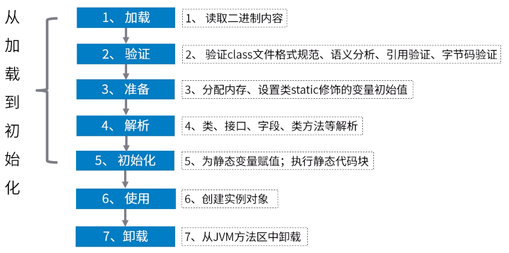
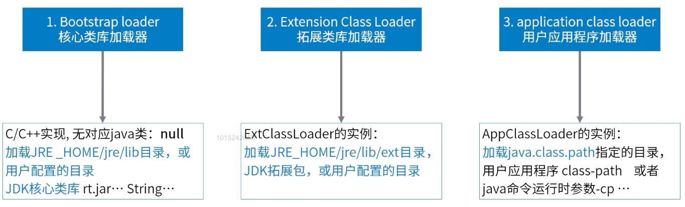
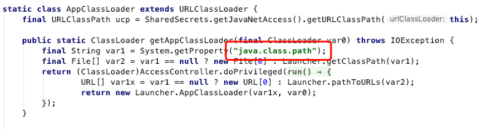
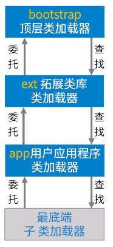
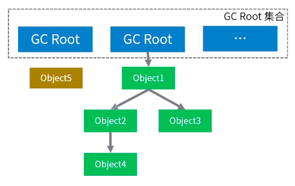

## JVM

### 类加载机制

jvm 运行时数据区：


问题：class 文件是怎么被加载到 JVM 中的？

#### 类的生命周期



#### 类加载器

类加载器负责装入类，搜索网络、jar、zip、文件夹、二进制数据内存等指定位置的类资源。  
一个 Java 程序运行，最少有三个类加载器实例，负责不同类的加载。



#### 查看类加载器

通过 API 查看：java.lang.Class.getClassLoader 会返回类加载器，如果这个类是是由 bootstrapClassLoader 加载的，那么会返回 null。

```java
package classloader;

/**
 * 功能描述: 查看类加载器实例
 *
 * @auther: pikaqiu
 * @date: 2019/4/4 9:26 PM
 */
public class ClassLoaderView {
    public static void main(String[] args) throws ClassNotFoundException {
        // 加载核心类库的 BootstrapClassLoader
        System.out.println("核心类库加载器：" + ClassLoaderView.class.getClassLoader()
                .loadClass("java.lang.String").getClassLoader());

        // 加载扩展类库的 ExtensionClassLoader
        System.out.println("扩展类库加载器：" + ClassLoaderView.class.getClassLoader()
                .loadClass("com.sun.nio.zipfs.ZipCoder").getClassLoader());

        // 加载应用程序的
        System.out.println("应用程序加载器：" + ClassLoaderView.class.getClassLoader());

        // 双亲委派模型
        System.out.println("应用程序加载器的父类：" + ClassLoaderView.class.getClassLoader().getParent());
        System.out.println("应用程序加载器的父类的父类：" +
                ClassLoaderView.class.getClassLoader().getParent().getParent());
    }
}
```

运行结果：

> 核心类库加载器：null  
> 扩展类库加载器：sun.misc.Launcher\$ExtClassLoader@6e0be858  
> 应用程序加载器：sun.misc.Launcher\$AppClassLoader@135fbaa4  
> 应用程序加载器的父类：sun.misc.Launcher\$ExtClassLoader@6e0be858  
> 应用程序加载器的父类的父类：null

#### JVM 如果知道我们的类在何方

class 文件存放在不同的位置：桌面 jar、项目 bin 目录、target 目录等等。。

查看 JDK 的 AppClassLoader 类源码：


说明 JVM 是通过**读取 java.class.path**配置来确定 class 文件的位置。  
也可以通过**jps、jcmd**命令来严重这个结论：

-   jps 查看本机运行的 Java 进程
-   查看运行时配置 [ jcmd 进程号 VM.properties ]

#### 类不会重复加载

类的唯一性：同一个类加载器，类名一样，代表是同一个类。  
识别方式：ClassLoader Instance id + PackageName + ClassName
验证方式：使用类加载器，对容一个 class 类的不同版本，进行多次加载，检查是否会加载到最新代码

验证代码：

```java
package classloader;

import java.net.URL;
import java.net.URLClassLoader;
import java.util.concurrent.TimeUnit;
/**
 * 功能描述: 类加载验证
 *
 * @auther: pikaqiu
 * @date: 2019/4/4 10:53 PM
 */
public class LoaderTest {
    public static void main(String[] args) throws Exception {
        URL url = new URL("file:D:\\");
        URLClassLoader loader = new URLClassLoader(new URL[]{url});
        while (true) {
            // 静态块触发
            Class clazz = loader.loadClass("HelloService");
            System.out.println("HelloService使用的类加载器：" + clazz.getClassLoader());
            Object newInstance = clazz.newInstance();
            Object value = clazz.getMethod("test").invoke(newInstance);
            System.out.println("调用test方法的返回值为：" + value);

            TimeUnit.SECONDS.sleep(1);
            System.out.println();
        }

    }
}
```

#### 类的的卸载

类的卸载需要满足两个条件：

1. 该 Class 所有的示例都被 GC
2. 加载该类的 ClassLoader 已经被 GC

验证方式：JVM 启动中增加 -verbose:class 参数，输出类的加载和卸载信息。

#### 双亲委派模型



**为了避免重复加载，由下到上逐级委托，由上到下逐级查找。**

首先，**不会自己去尝试加载类**，而是把这个请求**委派给父加载器**去完成。每一个加载器都是如此，所以所有类的加载都会传给上层的启动类加载器（BootstrapClassLoader）  
只有当**父加载器**反馈给自己**无法完成该加载**请求（父加载器在加载范围内没有搜索到该类）时，子加载器才会尝试**自己去加载该类**。

### 垃圾回收机制

#### 确定内存是否需要被回收

垃圾回收的第一步：**标记**。垃圾回收器识别哪些在使用，哪些不在使用的地方。
对象回收判断方式：引用计数，可达性分析。Java 中采用可达性分析。

##### 可达性分析算法

简单来说，对象及其引用可以看做一个图，选定活动对象作为 GC Roots，然后跟踪引用链条，如果一个对象和 GC Roots 之间不可达，也就是不存在引用，那就认为对象可以被回收。  


可以作为 GC Root 的对象：

1. 虚拟机栈中正在引用的对象
2. 本地方法栈中正在被引用的对象
3. 静态属性引用的对象
4. 方法区常量引用的对象

##### 引用类型和可达性级别

引用类型：

1. **强引用（StrongReference）**：最常见的普通对象引用，只要还有一个强引用指向一个对象，就不会回收
2. **软引用（SoftReference）**：JVM 认为内存不足时，才会试图去回收软引用指向的对象。（缓存场景）
3. **弱引用（WeekReference）**：虽然是引用，但是随时可能被回收
4. **虚引用（PhanTomReference）**：不能通过它访问对象，对象被 finalize 以后，执行制定逻辑的机制（Cleaner）

可达性级别：

1. **强可达（Strongly Reachable）**：一个对象可以有一个或多个线程可以不通过各种引用访问对的情况。
2. **软可达（Softly Reachable）**：就是当我们只能通过软应用访问到的状态。
3. **弱可达（Weekly Reachable）**：只能通过弱引用访问的状态。当弱引用被清除，就符合销毁条件。
4. **幻象可达（Phantom Reachable）**：不存在其他引用，并且 finalize 过了，只有幻象引用能引用到这个对象。
5. **不可达（UNreachable）**：对象可以被清除了。

#### 垃圾回收算法

**标记-清除(Mark-Sweep)**：首先标记出所有需要回收的对象，然后清除。  
标记、清除过程效率有限，有内存碎片化的问题。不适合特别大的堆

**复制（Copying）算法**：划分两块同等大小的区域，收集时将活着的对象复制到另一块区域。  
拷贝过程将对象顺序放置，就可以避免内存碎片化。复制+预留内存，有一定的浪费

**标记-整理（Mark-Compack）**：类似于标记清除，但是为了避免内存碎片化，会在清除过程中移动对象，以确保移动后的对象占用连续的内存空间

JVM 的垃圾回收：
