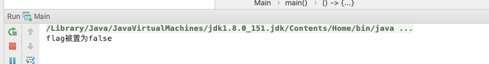

## 线程安全

### 可见性

```java
import java.util.concurrent.TimeUnit;

public class Main {

    static boolean flag = true;

    public static void main(String[] args) throws InterruptedException {
        new Thread(() -> {
            int i = 0;
            while (flag) {
                i++;
            }
            System.out.println(i);
        }).start();

        TimeUnit.SECONDS.sleep(2);

        flag = false;
        System.out.println("flag被置为false");
    }
}
```

运行结果 :  


原因:

-   CPU 缓存只能导致在很短一段时间内有可能 flag 不会被更新, 如下图:  
    
-   Java 语言允许编译器和微处理器进行优化, 这些优化可以和不正确的代码交互,从而产生看似矛盾的行为[重排序: 会发生在 Java 编译期间, 但更多的是发生在 JVM 运行期间 jit(即时编译)]
    

解决:

```java
import java.util.concurrent.TimeUnit;

public class Main {
    // 在此处加 volatile 关键字
    static volatile boolean flag = true;

    public static void main(String[] args) throws InterruptedException {
        new Thread(() -> {
            int i = 0;
            while (flag) {
                i++;
            }
            System.out.println(i);
        }).start();

        TimeUnit.SECONDS.sleep(2);

        flag = false;
        System.out.println("flag被置为false");
    }
}
```

结果:  

可以看到, flag 生效, 控制台打印了 i

原因:

-   禁止缓存
    
    上图上可以看出在 flag 这个属性有 ACC_STATIC , ACC_VOLATILE; 而在 Java 虚拟机标准汇中, ACC_VOLATILE 会屏蔽 CPU 缓存
-   对 volatile 关键字修饰的变量相关指令不做重排序

### 原子操作

```java
public class Demo {
    public int i;
    public void incr () {
        i ++;
    }
}
```

多个线程访问相同的资源, 对这些资源进行写操作时, 对这些执行顺序有要求 :

**临届区 :** incr 方法内部就是临届区域, 关键部分代码的多线程并发执行, 会对执行结果产生影响  
**竞态条件 :** 可能发生在临届区域内的特殊条件, 多线程执行 incr 中的关键代码 i ++时, 产生了竞态条件

**共享资源 :**

-   如果一段代码都是线程安全的, 那它不包含竞态条件. 只有当多个线程更新公共资源时, 才会产生竞态条件.
-   栈封闭时, 不会在线程之间共享的变量都是线程安全的
-   局部对象引用本身不共享, 但是引用的对象存储在共享堆中. 如果方法内创建的对象只在方法中传递, 并且不对其他线程可用, name 也是线程安全的

> 判断规则: 如果创建, 使用和处理资源, 永远不会逃脱单个线程的控制, 该资源的是使用时线程安全的

**不可变对象 :** 创建不可变的共享对象来保证对象在线程中共享时不会被修改, 从而实现线程安全. 如: 一个实体类中, private 的某个属性没有提供 get 方法, 这个变量就是不可变的

**原子操作 :**  
原子操作可以是一个步骤, 也可以是多个步骤, 但其顺序是不可以被打乱, 也不可以被切割只执行其中的一个部分(不可中断行)  
将整个操作视为一个整体, 资源在该次操作中保持一致性, 这是原子性的核心特征.

```java
import java.util.concurrent.TimeUnit;

// 两个线程 分别执行 10000 次 add 方法
public class Main {

    volatile int i = 0;

    public void add() {
        i++;
    }

    public static void main(String[] args) throws InterruptedException {
        Main m = new Main();
        for (int i = 0; i < 2; i++) {
            new Thread(() -> {
                for (int j = 0; j < 10000; j++) {
                    m.add();
                }
            }).start();
        }
        TimeUnit.SECONDS.sleep(2);
        System.out.println(m.i);
    }

}

```

结果:  


原因: i++ 不是一个原子操作:  


优化:[这里不使用同步代码块, unsafe]

```java
import sun.misc.Unsafe;

import java.lang.reflect.Field;

public class Main {

    volatile int i = 0;

    static Unsafe unsafe = null;

    // i的内存地址
    private static long iOffSet;

    static {
        try {
            // Unsafe是不能直接使用的 通过反射拿到对象
            Field theUnsafe = Unsafe.class.getDeclaredField("theUnsafe");
            theUnsafe.setAccessible(true);
            unsafe = (Unsafe) theUnsafe.get(null);
            // 利用unsafe对象定位属性i的内存地址
            unsafe.objectFieldOffset(Main.class.getDeclaredField("i"));
        } catch (NoSuchFieldException e) {
            e.printStackTrace();
        } catch (IllegalAccessException e) {
            e.printStackTrace();
        }
    }

    public void add() {
        int current;
        int newI;
        do {
            current = unsafe.getIntVolatile(this, iOffSet);
            newI = current + 1;
//            System.out.println("i :" + current + "  newi: " + newI);
            //cas操作 (如果 i 发生了变化, 操作会失败)
        } while (!unsafe.compareAndSwapInt(this, iOffSet, current, newI));
    }

    public static void main(String[] args) throws InterruptedException {
        Main m = new Main();
        for (int i = 0; i < 2; i++) {
            new Thread(() -> {
                for (int j = 0; j < 10000; j++) {
                    m.add();
                }
            }).start();
        }
        Thread.sleep(2000);
        System.out.println(m.i);
    }

}

```

以上代码其实就是 Atomic CAS 的实现原理


J.U.C 原子类


这里不给出原子类的代码了

JDK1.8 的计数器原理:

每个线程在对计数器进行操作时, 操作的是不同的属性. 在获取时, 通过 sum 方法, 把所有的属性加起来得到最后的结果

CAS 的三个问题:  


### 锁的概念和 synchronized 关键字

#### 锁的概念

**自旋锁 :** 为了不放弃 CPU 执行事件, 循环对数据尝试 CAS 更新, 直到成功

**悲观锁 :** 假定会发生并发冲突, 同步所有对数据相关的操作, 从读数据就开始上锁  
**乐观锁 :** 假定没有冲突, 在修改数据时如果发现与之前数据不一致, 则读取最新数据, 修改后重试修改

**独享锁(写) :** 给资源加上写锁, 线程可以修改资源, 其他线程不能再加锁; (单写)  
**共享锁(读) :** 给资源加上读锁后只能读不能改, 其他线程也只能加读锁不能加写锁; (多读)

**可重入锁, 不可重入锁 :** 线程拿到一把锁之后, 可以自由进入同一把锁所同步的其他代码  
**公平锁, 非公平锁 :** 争抢锁的顺序, 如果按照先来后到, 就是公平

Java 中的实现方式 : **synchronized, ReentranLock, ReentranReadWriteLock**

#### synchronized

属于最基本的线程通信机制，给予对象监控器实现的。  
Java 中的每一个对象都与一个监视器相关联，一个线程可以锁定或解锁。  
一次只有一个线程可以锁定监视器。  
试图锁定该监视器的任何其他线程都会被阻塞，直到他们能够获得该监视器的锁为止。

**特性：** 可重入、独享、悲观锁  
**锁的范围：** 类锁、对象锁、锁消除、锁粗化

加锁原理：


偏向锁升级到轻量级锁：

偏向所标记第一次有用，出现争抢后就没用了。-XX: UseBiasedLocking 禁用偏向锁  
偏向锁本质就是无锁，因为 JVM 认为没有出现竞争就是单线程，无需同步。

监视器：

