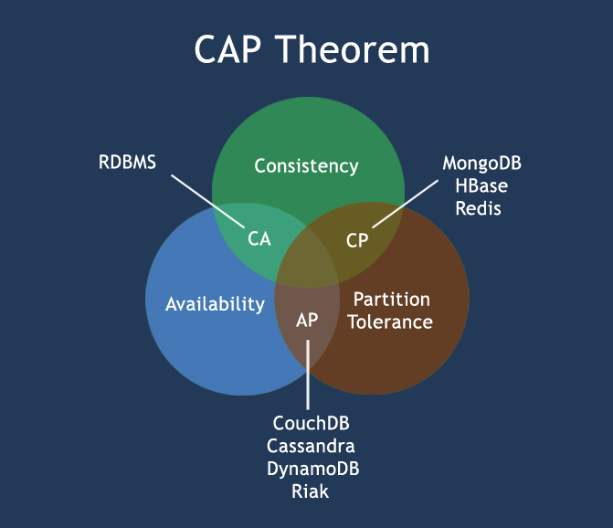
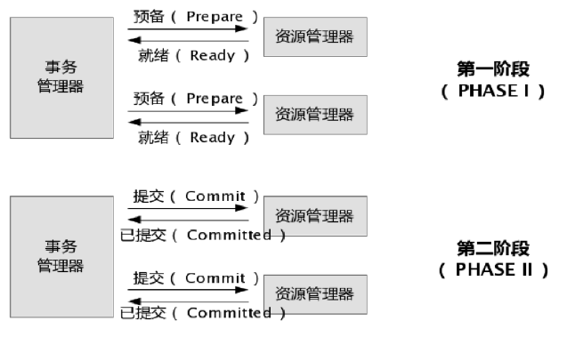
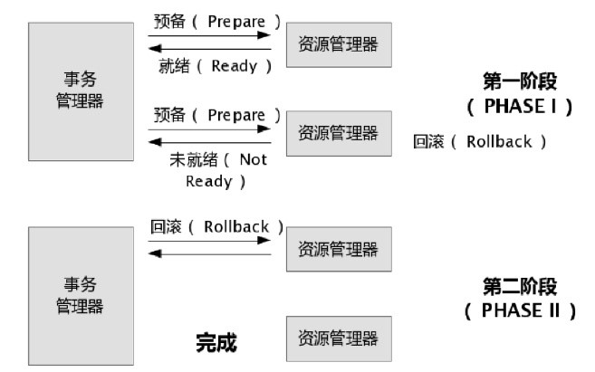

## 分布式系统事务一致性解决方案

传统的企业开发，系统往往是以单体应用形式存在的，也没有横跨多个数据库。我们通常只需借助开发平台中特有数据访问技术和框架（例如 Spring、JDBC、ADO.NET），结合关系型数据库自带的事务管理机制来实现事务性的需求。关系型数据库通常具有 ACID 特性：原子性（Atomicity）、一致性（Consistency）、隔离性（Isolation）、持久性（Durability）。  
而大型互联网平台往往是由一系列分布式系统构成的，开发语言平台和技术栈也相对比较杂，尤其是在 SOA 和微服务架构盛行的今天，一个看起来简单的功能，内部可能需要调用多个“服务”并操作多个数据库或分片来实现，情况往往会复杂很多。单一的技术手段和解决方案，已经无法应对和满足这些复杂的场景了。

## 分布式系统的特性

在分布式系统中，同时满足“CAP 定律”中的“一致性”、“可用性”和“分区容错性”三者是不可能的，这比现实中找对象需同时满足“高、富、帅”或“白、富、美”更加困难。在互联网领域的绝大多数的场景，都需要牺牲强一致性来换取系统的高可用性，系统往往只需要保证“最终一致性”，只要这个最终时间是在用户可以接受的范围内即可。



### 分布式事务

XA 协议指的是 TM（事务管理器）和 RM（资源管理器）之间的接口。目前主流的关系型数据库产品都是实现了 XA 接口的。JTA(Java Transaction API) 是符合 X/Open DTP 模型的，事务管理器和资源管理器之间也使用了 XA 协议。 本质上也是借助两阶段提交协议来实现分布式事务的，下面分别来看看 XA 事务成功和失败的模型图：




在 JavaEE 平台下，WebLogic、Webshare 等主流商用的应用服务器提供了 JTA 的实现和支持。而在 Tomcat 下是没有实现的（其实笔者并不认为 Tomcat 能算是 JavaEE 应用服务器），这就需要借助第三方的框架 Jotm、Automikos 等来实现，两者均支持 spring 事务整合。

**总结：这种方式实现难度不算太高，比较适合传统的单体应用，在同一个方法中存在跨库操作的情况。但分布式事务对性能的影响会比较大，不适合高并发和高性能要求的场景。**

### 提供回滚接口

在服务化架构中，功能 X，需要去协调后端的 A、B 甚至更多的原子服务。那么问题来了，假如 A 和 B 其中一个调用失败了，那可怎么办呢？

工作中经常遇到这类问题，往往提供了一个 BFF 层来协调调用 A、B 服务。如果有些是需要同步返回结果的，我会尽量按照“串行”的方式去调用。如果调用 A 失败，则不会盲目去调用 B。如果调用 A 成功，而调用 B 失败，会尝试去回滚刚刚对 A 的调用操作。

我们的某个论坛网站，每天登录成功后会奖励用户 5 个积分，但是积分和用户又是两套独立的子系统服务，对应不同的 DB，这控制起来就比较麻烦了。解决思路：

1. 把登录和加积分的服务调用放在 BFF 层一个本地方法中。
2. 当用户请求登录接口时，先执行加积分操作，加分成功后再执行登录操作
3. 如果登录成功，那当然最好了，积分也加成功了。如果登录失败，则调用加积分对应的回滚接口（执行减积分的操作）。

**总结：这种方式缺点比较多，通常在复杂场景下是不推荐使用的，除非是非常简单的场景，非常容易提供回滚，而且依赖的服务也非常少的情况。**

**这种实现方式会造成代码量庞大，耦合性高。而且非常有局限性，因为有很多的业务是无法很简单的实现回滚的，如果串行的服务很多，回滚的成本实在太高**

### 本地消息表

在业内广泛使用。其基本的设计思想是将远程分布式事务拆分成一系列的本地事务。如果不考虑性能及设计优雅，借助关系型数据库中的表即可实现。

举个经典的跨行转账的例子来描述。

1. 扣款 1W，通过本地事务保证了凭证消息插入到消息表中。
2. 通知对方银行账户上加 1W 了。那问题来了，如何通知到对方呢？通常采用两种方式：

    - 采用时效性高的 MQ，由对方订阅消息并监听，有消息时自动触发事件
    - 采用定时轮询扫描的方式，去检查消息表的数据。

    两种方式其实各有利弊，仅仅依靠 MQ，可能会出现通知失败的问题。而过于频繁的定时轮询，效率也不是最佳的（90% 是无用功）。所以，我们一般会把两种方式结合起来使用。

其实我们可以消息消费方，也通过一个“消费状态表”来记录消费状态。在执行“加款”操作之前，检测下该消息（提供标识）是否已经消费过，消费完成后，通过本地事务控制来更新这个“消费状态表”。这样子就避免重复消费的问题。

**总结：** 上诉的方式是一种非常经典的实现，基本避免了分布式事务，实现了“最终一致性”。但是，关系型数据库的吞吐量和性能方面存在瓶颈，频繁的读写消息会给数据库造成压力。所以，在真正的高并发场景下，该方案也会有瓶颈和限制的。

### MQ（非事务消息）

通常情况下，在使用非事务消息支持的 MQ 产品时，我们很难将业务操作与对 MQ 的操作放在一个本地事务域中管理。通俗点描述，还是以上述提到的“跨行转账”为例，我们很难保证在扣款完成之后对 MQ 投递消息的操作就一定能成功。这样一致性似乎很难保证。

先从消息生产者这端来分析:

```java
public void trans(data) {
    try {
        // 操作数据库
        bool result = dao.update(data); // 操作失败, 回滚

        if (result) {
            // 如果mq执行失败(投递消息成功), 方法内部会抛出异常
            mq.append(data);
        }

    } catch (Exception e) {
        rollBack();
    }
}
```

根据上述代码，我们来分析下可能的情况：

-   操作数据库成功，向 MQ 中投递消息也成功，皆大欢喜
-   操作数据库失败，不会向 MQ 中投递消息了
-   操作数据库成功，但是向 MQ 中投递消息时失败，向外抛出了异常，刚刚执行的更新数据库的操作将被回滚

从上面分析的几种情况来看，貌似问题都不大的。那么我们来分析下消费者端面临的问题：

1. 消息出列后，消费者对应的业务操作要执行成功。如果业务执行失败，消息不能失效或者丢失。需要保证消息与业务操作一致
2. 尽量避免消息重复消费。如果重复消费，也不能因此影响业务结果

如何保证消息与业务操作一致，不丢失？

主流的 MQ 产品都具有持久化消息的功能。如果消费者宕机或者消费失败，都可以执行重试机制的（有些 MQ 可以自定义重试次数）。

如何避免消息被重复消费造成的问题？

1. 保证消费者调用业务的服务接口的幂等性
2. 通过消费日志或者类似状态表来记录消费状态，便于判断（建议在业务上自行实现，而不依赖 MQ 产品提供该特性）

### MQ（事务消息）

举个例子，Bob 向 Smith 转账，那我们到底是先发送消息，还是先执行扣款操作？

好像都可能会出问题。如果先发消息，扣款操作失败，那么 Smith 的账户里面会多出一笔钱。反过来，如果先执行扣款操作，后发送消息，那有可能扣款成功了但是消息没发出去，Smith 收不到钱。除了上面介绍的通过异常捕获和回滚的方式外，还有没有其他的思路呢？

下面以阿里巴巴的 RocketMQ 中间件为例，分析下其设计和实现思路。

RocketMQ 第一阶段发送 Prepared 消息时，会拿到消息的地址，第二阶段执行本地事物，第三阶段通过第一阶段拿到的地址去访问消息，并修改状态。细心的读者可能又发现问题了，如果确认消息发送失败了怎么办？RocketMQ 会定期扫描消息集群中的事物消息，这时候发现了 Prepared 消息，它会向消息发送者确认，Bob 的钱到底是减了还是没减呢？如果减了是回滚还是继续发送确认消息呢？RocketMQ 会根据发送端设置的策略来决定是回滚还是继续发送确认消息。这样就保证了消息发送与本地事务同时成功或同时失败。如下图：


总结：各大知名的电商平台和互联网公司，几乎都是采用类似的设计思路来实现“最终一致性”的。这种方式适合的业务场景广泛，而且比较可靠。不过这种方式技术实现的难度比较大。目前主流的开源 MQ（ActiveMQ、RabbitMQ、Kafka）均未实现对事务消息的支持，所以需二次开发或者新造轮子。比较遗憾的是，RocketMQ 事务消息部分的代码也并未开源，需要自己去实现。

### 其他补偿方式

做过支付宝交易接口的同学都知道，我们一般会在支付宝的回调页面和接口里，解密参数，然后调用系统中更新交易状态相关的服务，将订单更新为付款成功。同时，只有当我们回调页面中输出了 success 字样或者标识业务处理成功相应状态码时，支付宝才会停止回调请求。否则，支付宝会每间隔一段时间后，再向客户方发起回调请求，直到输出成功标识为止。

其实这就是一个很典型的补偿例子，跟一些 MQ 重试补偿机制很类似。

一般成熟的系统中，对于级别较高的服务和接口，整体的可用性通常都会很高。如果有些业务由于瞬时的网络故障或调用超时等问题，那么这种重试机制其实是非常有效的。

当然，考虑个比较极端的场景，假如系统自身有 bug 或者程序逻辑有问题，那么重试 1W 次那也是无济于事的。那岂不是就发生了“明明已经付款，却显示未付款不发货”类似的悲剧？

其实为了交易系统更可靠，我们一般会在类似交易这种高级别的服务代码中，加入详细日志记录的，一旦系统内部引发类似致命异常，会有邮件通知。同时，后台会有定时任务扫描和分析此类日志，检查出这种特殊的情况，会尝试通过程序来补偿并邮件通知相关人员。

在某些特殊的情况下，还会有“人工补偿”的，这也是最后一道屏障。
