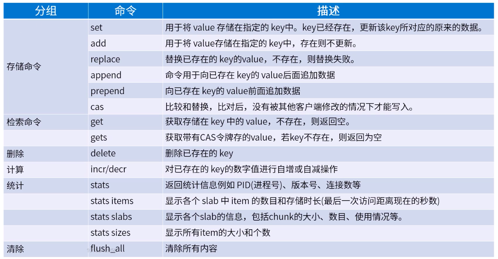

[TOC]

# Memcached

## Memcached 入门

文档地址: https://github.com/memcached/memcached/wiki

Memcached 是一个缓存系统, 通过减轻数据库负载加速动态 web 应用

-   本质就是一个内存 K-V 缓存
-   协议简单, 是基于文本行的协议
-   不支持数据库持久化, 服务器关闭之后数据全部丢失
-   简洁而强大, 上手容易
-   没有安全机制

**Memcached 的设计理念**:

-   简单的 K-V 存储, 服务器不关心数据时什么, 只管存储数据
-   服务端功能简单, 很多逻辑需要客户端实现.
    -   服务端专注如何存储, 合适清除和重用内存
    -   客户端专注如何选择读取和写入服务器, 以及无法联系到服务器时的操作
-   Memcached 实例之间没有通信机制
-   每个命令的复杂度为 O(1). 慢速机上查询应该在 1ms 以下, 高端服务器可达每秒数百万
-   缓存自动清除机制
-   缓存失效机制

具体搭建过程请参考: [memcached 单机到集群完整搭建过程](https://github.com/Mao-PC/Notes/blob/master/Middle/cache/memcached/memcached%E5%8D%95%E6%9C%BA%E5%88%B0%E9%9B%86%E7%BE%A4%E5%AE%8C%E6%95%B4%E6%90%AD%E5%BB%BA%E8%BF%87%E7%A8%8B.md.pdf)

**常用命令**

这里推荐使用客户端: Java 客户端 (xmemcached)

**Memcached 性能**

Memcached 性能的关键是硬件, 内部实现是 hash 表, 读写操作都是 O(1), 硬件好, 几百万 QPS 都是没问题的

**最大连接数限制**: 内部基于事件机制 (类似 Java 的 NIO), 只要内存, 操作系统参数进行调整, 轻松几十万

**集群数量限制**: 理论是没有限制的但是节点越多客户端建立的连接就会越多. 如果存储的数据很多, 优先考虑增加内存, 成本太高的情况下再增加节点

Memcached 没有分布式功能, 所以不论是集群还是主从备份, 都需要第三方产品支持

**Memcached 对服务器硬件要求**

-   CPU 要求: CPU 占用率低, 默认为 4 个工作线程
-   内存要求: 对内存要求高, 建议 Memcached 独占服务器而不是混用, 建议每个 Memcached 实例的内存大小都是一致的, 如果不一致则需要权重调整
-   网络要求: 根据传输内容来定, 网络越大越好, 通常 10M 就够用了, 建议: 项目在 Memcached 传输的内容尽可能小

**Memcached 应用场景**

1. 数据查询缓存
2. 计数器场景: 通过 incr/decr 命令实现评论数量, 点击数量统计
3. 乐观锁实现: 计划任务多实例部署, 通过 cas 实现不重复执行
4. 防止重复处理: cas 命令

## Memcached 持久化

**ExtStore 机制**

1. extStore 是把key 放在内存, 把value放入到flash等介质中的一种持久化方式, 注意是为了解决内存存储容量的瓶颈
2. 使用场景是: value 很大, 存储时间很长. 成本太高的情况下, 不适用普通硬盘
3. Version 1.5.4 + 支持

持久化(写入 ExtStore)的过程:

1.  LRU-Tail 

   当整体内存不足的时候, 进行 LRU 淘汰时, 会选取出需要淘汰的 item; 如果 item 大于等于最新持久化大小 (默认是 512 bytes), 并且有可用的 `write-buf`. 那么则写入到 `write-buf`

2. Write-Buf

   当 `write-buf` 满了的时候 (默认 4M) 就会封装成相关的持久化 IO 事件, 通过持久化IO Threads 进行写入到相关的持久化介质中

3. extStore

读取ExtStore过程

1. worker-thread 读请求 

   处理读请求的时候, 如果发现有 `ITEM_HEAD` 标识, 说明这个数据是持久化存储的. 则封装成 `OBJ_IO_READ` 事件发给 `IO_Thread` 处理持久化读写事件

2. `IO_Thread` store 读取

   从持久化介质读取智慧, 直接调用相关的回调函数, 设置链接状态为回复的状态即可. 后续则是正常请求的 `libevent` 事件处理逻辑

3. `worker-thread` 回复

## Memcached 内存管理

... 略

## Memcached VS Redis

- 性能上

  Redis在6.0之后, 会使用多线程来处理IO

  - 单线程 VS 多线程 多线程在多核场景下, QPS会有提升; 在单核的虚拟机上Redis的表现会很好, 但如果是多核(如 有10 +, 50 +核的宿主机) 上利用率就不那么高了
  - 从稳定性上, 由于Redis主线程为单线程模型处理大Key就会造成阻塞, 从客户端角度来说就是RT变长; Memcached多线程只会阻塞一个线程, 相对来说影响较小

- 可靠性
  - Redis官方提供了主从和集群模式
  - Memcached 官方提供了单实例, 只能通过第三方实现集群(Twemproxy)

- 数据持久化
  - RDB and AOF
  - ExtStore 伪持久化, 只有大于512字节的value才会 

- 存储语义
  - Redis 提供了各种数据类型的value
  - Memcached 值提供了String 的 k-v

- 数据规模
  - Redis 纯内存, 单实例存储的数据规模有限; 在集群分片下会有很好的表现
  - Memcached ExtStore 内存的扩展, 在某些场景下能支持大存储; 但是只能依靠第三方集群