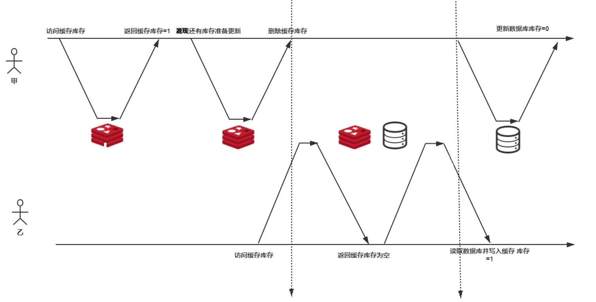
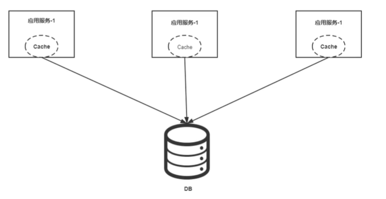
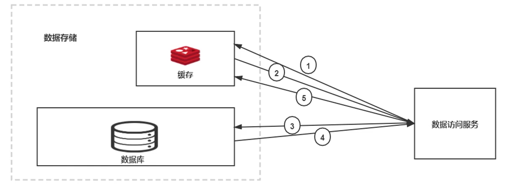
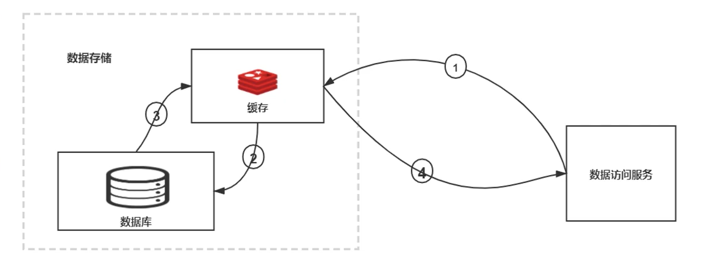
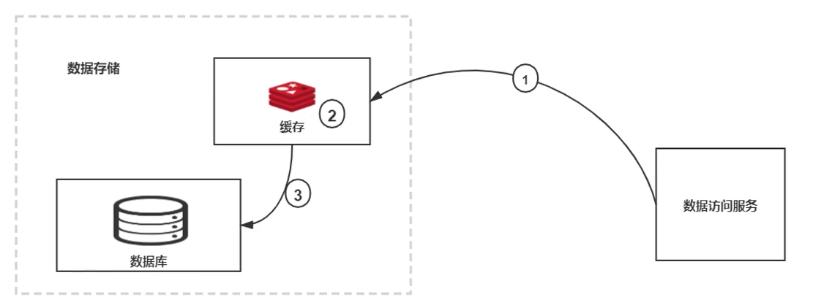
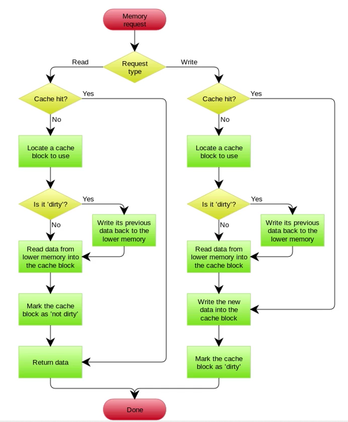
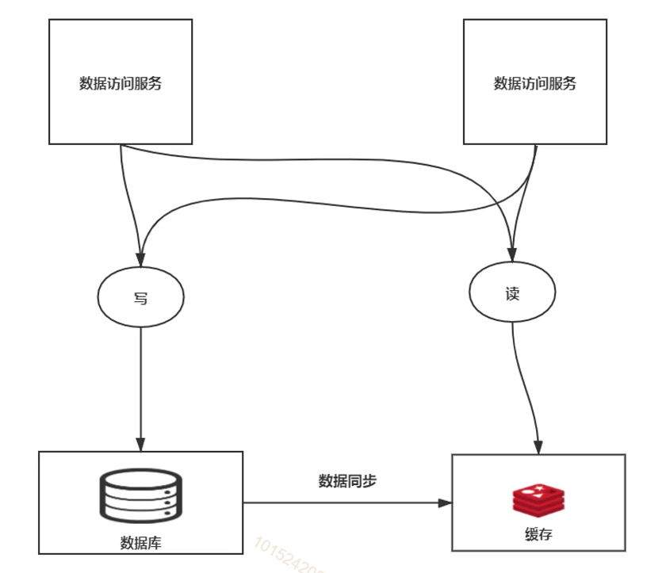
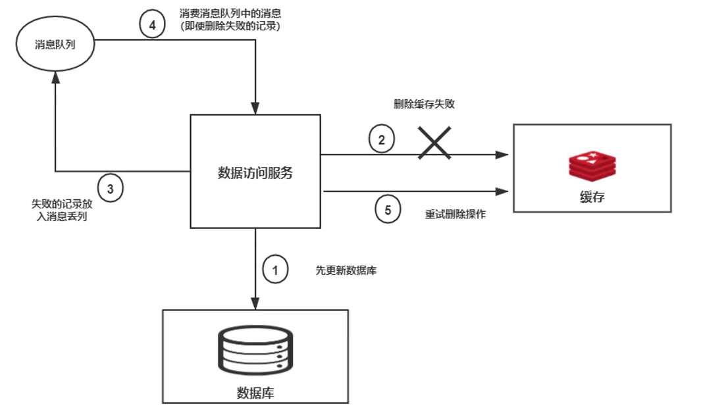
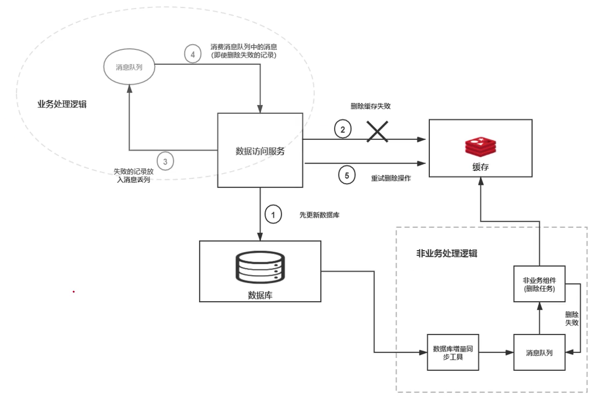
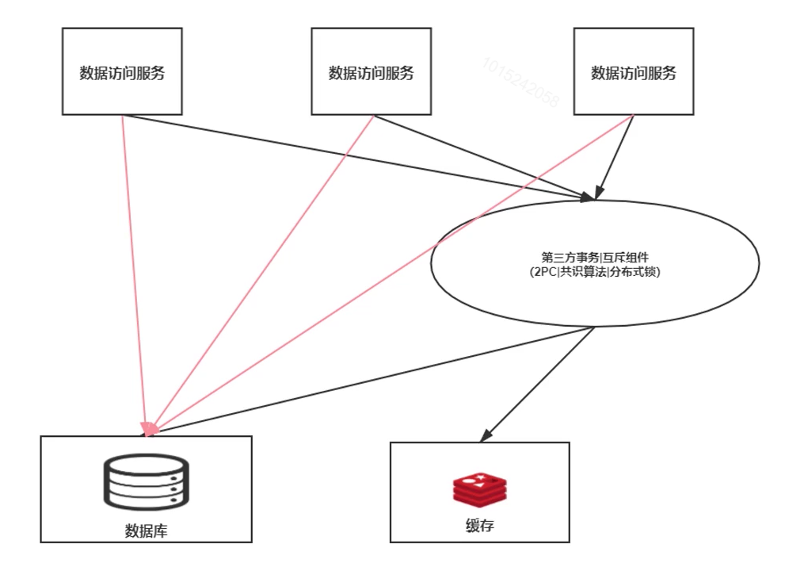

[toc]

# 缓存和数据库一致性更新原则

## 缓存和数据库的关系

缓存: 高性能产品

数据库: 性能低产品

缓存+数据库 = 高效的数据存储产品组合

1. 提供了性能的提升 (更好的存储介质, 更贴近请求的存储距离)
2. 提供了简便的数据抽象(缓存一般都是 K-V)

## 缓存和数据库一致性更新

保证用户访问缓存和数据库中的数据是一样的 !

为什么需要一致性更新?

如上图, 线程甲在消费库存中的商品, 在访问缓存时, 发现该商品数量为 1 , 返回库存为 1 . 消费商品将缓存设置为 0,  开始进行业务处理; 此时线程乙查询该商品数量, 发现数据库中该商品数量为 1, 并修改缓存中该商品的数量为 1. 此时线程甲业务处理完成, 并将数据库中商品数量设置为 0. 此时缓存中该商品数量为1, 但是数据库中该商品的数量为0, 出现了数据不一致的情况

## 缓存和数据库一致性更新原则

### 常见的缓存访问模式 Cache-Aside

cache-aside 数据库和缓存时没有交互的

-  本地缓存

  

  

  在访问数据库后数据会保存到本地缓存

  优点:

  1. 缓存内嵌到服务中, 性能会很好
  2. 缓存数据和业务结合紧密, 控制更精细
  3. 不用单独部署缓存服务, 维护简单

  缺点:

  1. 相同的服务进行集群或者有很多实例时, 本地缓存是大量重复的
  2. 应用维护需要同时维护缓存
  3. 本地缓存分配的内存一般不会很大, 就导致了缓存数据更容易淘汰, 更频繁访问数据库

- 缓存中间件

  

  <table>
  	<tr>
          <td><image src="res/缓存中间件.png"/></td>
          <td><image src="res/缓存中间件2.png"/></td>
      </tr>
  	<tr>
          <td>
模式一
</td>
          <td>
模式二
</td>
      </tr>
  </table>

  </table>

  模式二中提供了同一个的数据访问服务, 减少了每个业务节点的访问逻辑, 屏蔽了数据存储的感知, 业务节点就不会显得臃肿, 但是中间要增加一次访问, 相对来说会延长RT时间

**缓存读取**

1. 先访问缓存, 查找想要的数据
2. 缓存返回查找失败
3. 直接查找数据库
4. 数据库返回查找的数据
5. 数据写入缓存, 后续的读取操作就能直接通过缓存访问到

**缓存的更新**

- 先更新缓存再更新数据库
  - 优点: 其他线程会读取到更新后的数据
  - 缺点: 如果更新数据库不成功就会出现数据不一致 
- 先更新数据库再更新缓存
  - 优点: 更可靠安全
  - 缺点: 
    - 如果更新缓存不成功, 就会导致数据不一致, 但是后续查询会将这条数据更新到缓存, 影响不太大
    - 如果线程一在更新数据库后进行业务逻辑处理, 线程二此时更新数据库并更新缓存, 线程一处理完成业务逻辑后进行缓存更新, 此时会出现数据不一致
- **先删除缓存再更新数据库**
  - 优点 :
    - 缩短了旧数据的读取, 基本不会读取到旧数据
    - 更可靠, 多了一次数据库的读取, 但是不会影响数据一致性
  - 缺点 : 
    - 线程A 更新数据, 先删除缓存, 然后执行因为逻辑; 
    - 此时线程 B 执行查找操作, 发现缓存中不存在数据, 去数据库中查找数据; 
    - 线程 A 业务执行完成, 更新数据库; 
    - 线程 B 将数据库中的旧数据保存到缓存中, 造成了数据库不一致
- 先更新数据库, 再删除缓存
  - 优点: 会在一定程度上减少数据库的并发, 因为在更新数据库时会去访问缓存中的旧数据
  - 缺点:
    -  在更新数据库时会访问到缓存中的旧数据, 数据不一致, 但是这个不一致只是暂时的, 随后会删除这条数据
    - 数据不一致场景: 
      - 线程 A 查找数据, 未命中缓存, 去查找数据库数据, 执行业务逻辑
      - 此时线程 B 更新数据库并删除缓存
      - 线程 A 业务执行完成, 更新缓存 造成数据不一致

综上, 更新方式可以分为:

- 更新, 不删除
  - 先更新缓存, 再更新数据库
  - 先更新数据库, 再更新缓存

> 写多读少的场景, 导致很多缓存还没来得及读就更新了, 造成数据库缓存的负载较大
>
> 数据库表关系比较复杂, 而数据保存到缓存中需要先将数据抽象成为特定的数据, 这样的抽象的计算过程也会消耗很多资源
>
> 这两种情况是不适合不删除的操作的

- 需要删除
  - 先删除缓存, 再更新数据库
  - 先更新数据库, 再删除缓存

> 删除缓存会高效的节省缓存空间, 读多写少的场景很适合

### 常见的缓存访问模式 Through

这里缓存服务直接就代理了数据库的访问

**数据读取 (Read Through)**

1. 访问缓存, 查找数据
2. 如果没有数据, 就查询数据库
3. 返回查询的数据给缓存
4. 缓存得到数据, 写入缓存并返回给客户端

**数据写入 (Write Through)**

1. 查找更新的数据是否存在缓存中
2. 如果在缓存中, 则直接更新缓存中的数据
3. 如果没有查找到缓存中的数据, 则直接更新数据库; 第 2 步中的如果更新完缓存中的数据, 同步的也会更新到数据库中

 

**数据交互 (Write-Behind)**

`Write-Behind`和`Write-Through`在“程序只和缓存交互且只能通过缓存写数据”这一点上很相似。不同点在于`Write-Through`会把数据立即写入数据库中，而`Write-Behind`会在一段时间之后（或是被其他方式触发）把数据一起写入数据库，这个异步写操作是`Write-Behind`的最大特点。

**数据读取** :

1. 请求如果命中缓存直接返回数据
2. 如果未命中缓存就会去申请一块缓存来使用
3. 申请的缓存块是否被标记为`dirty`, 如果未被标记就执行第 5 步
4. 如果被标记为 `dirty` , 就会把该数据写入到数据库中
5. 去数据库查询出数据, 然后保存到缓存中
6. 将缓存块标记为 `not dirty`
7. 返回数据

**数据写入** :

1. 请求如果命中缓存 执行第 6 步
2. 如果未命中缓存就会去申请一块缓存来使用
3. 申请的缓存块是否被标记为`dirty`, 如果未被标记就执行第 5 步
4. 如果被标记为 `dirty` , 就会把该数据写入到数据库中
5. 去数据库查询出数据, 然后保存到缓存中
6. 将新的数据保存到缓存中
7. 标记缓存块为 `dirty`

上面的`dirty`标识就代表着**缓存数据是否和数据库是否一致, 是否需要向数据库更新数据** , `not dirty`就说明数据是一致的

## 一致性更新目标

### 最终一致性

达成最终一致性的方法有:

- **过期时间 (TTL)**

  - 最终一致性, 过期了会取数据库最新值
  - 剔除冷缓存, 节省空间, 提升效率

  **那么这个 TTL 应该如何设置呢?** 

  如果都设置成为相同的时间例如 2s, 在 2s 后就会出现大量的 key 过期, 就会有可能造成数据库压力过大. 所以应该根据业务的不同设置为在一个合适的范围内随机

- **异步更新**

  

  对于数据库的数据是通过第三方组件来更新到缓存的, 而所以写操作都是操作DB, 而读操作都是通过缓存

  **注意点:**

  - 由于要求所有的读操作都要在缓存中进行, 也就是要求所有的数据都要存到缓存中, 对缓存的容量要求很高
  - 数据同步组件需要对业务逻辑有一定了解, 因为要对数据库数据进行抽象来保存到缓存中

- **重试机制**

  

  在业务逻辑中使用消息队列来对缓存进行删除重试

  

  也可以将这样的重试机制单独部署一套服务来进行, 这样就可以避免代码中的业务处理逻辑过于复杂

### 强一致性

使用第三方保证ACID事务一致

