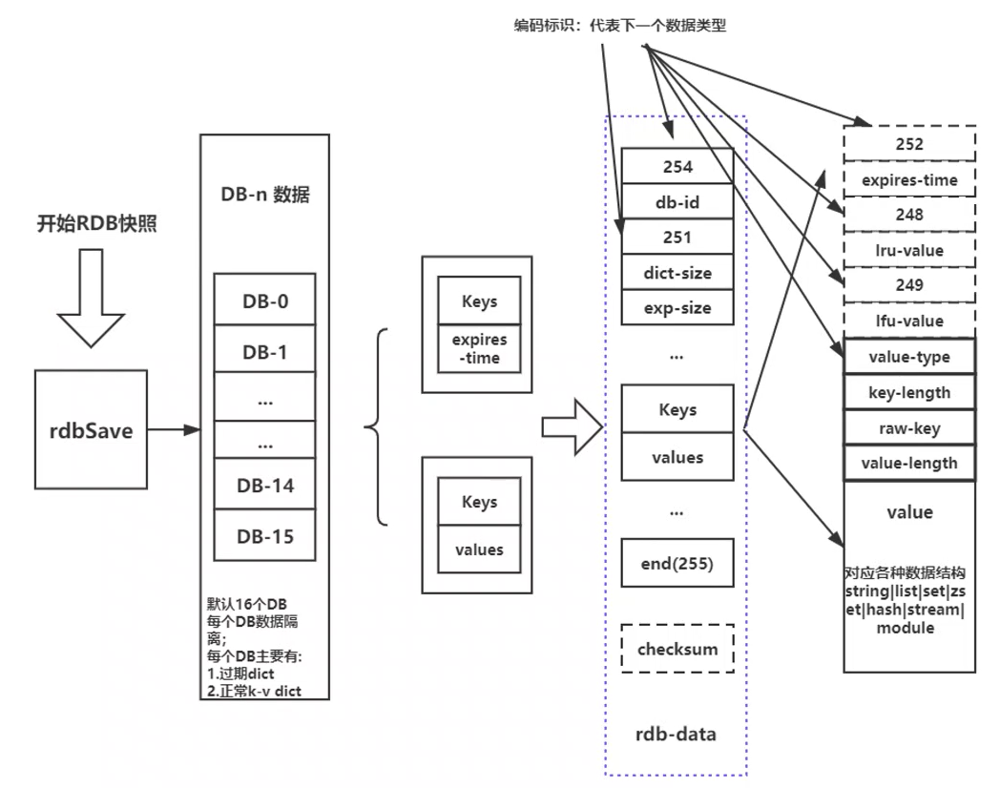
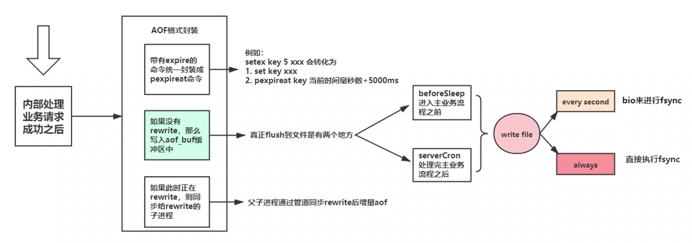
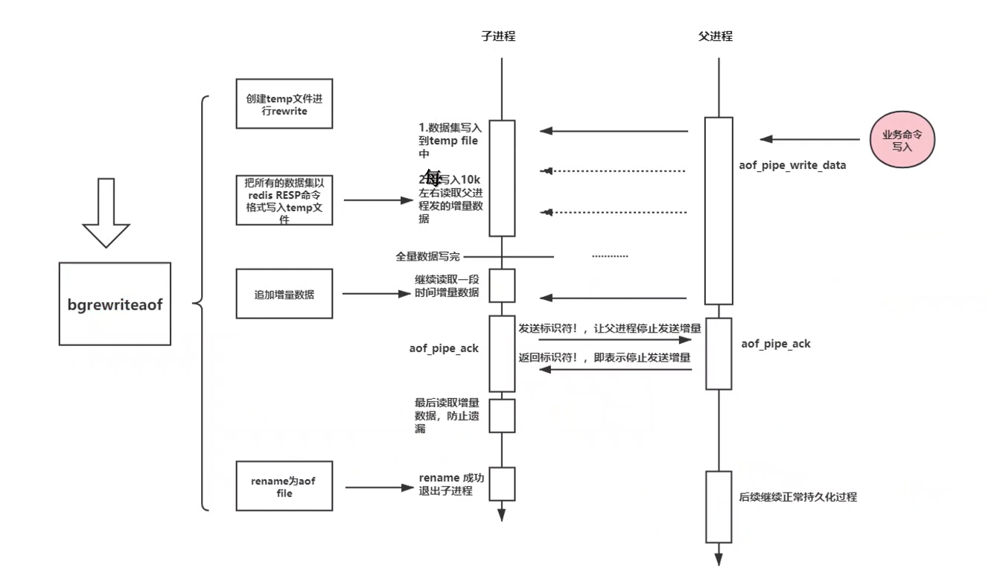
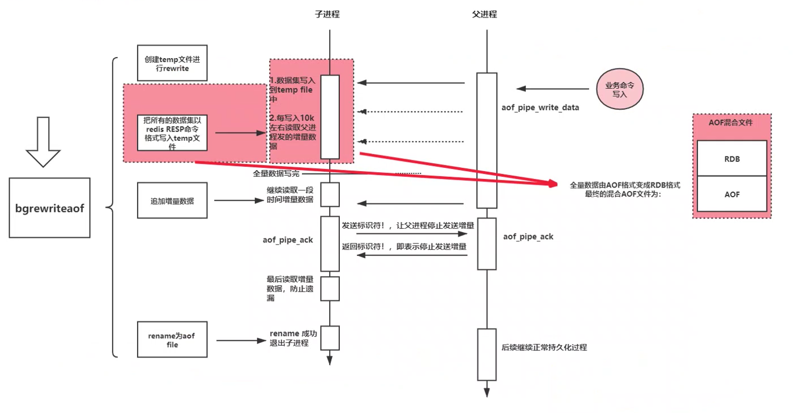

[toc]

# Redis 持久化

**什么是数据持久化**

数据持久化, 狭隘的理解为把存储在内存中的数据进行一定的编码存储到持久化介质 (例如: 磁带, 硬盘) 的过程

本质: 容易丢失的数据进行固化处理, 不丢失

**Redis持久化**

官网介绍 http://www.redis.cn/topics/persistence.html

三种持久化机制

- RDB 
- AOF
- RDB+AOF 混合持久化

可以 Redis 持久化的场景:

- 数据非核心, 运行部分丢失
- 兜底溯源数据库根本满足了不了因为的性能需求
- 直接利用 Redis 服务本身高可用来达到数据不丢失 (成本太高)
- 低成本的离线数据分析 (利用rdb文件或者aof文件)

## RDB 持久化

**RDB 是什么**

1. rdb 属于 Redis 内存数据的 snapshots, 即某时刻快照
2. rdb 采用紧凑型二进制保存

**RDB 配置**

- `dbfilename dump.rdb` 配置文件名
- `save <seconds> <changes>` 经过多少秒后, 如果至少多少个变更的 key, 那么就会执行 rdb snapshots 一次, 例如 `save 900 1`

- `stop-writes-on-bgsave-error yes` 当rdb快照失败的时候, 那么后续的变更 key 的请求都会返回错误 (- MISCONF Errors), 即请求失败.

  默认配置是 yes, 即如果开启了 rdb, 那么还是启用这个配置. 如果本身 rdb 并不重要, 丢失一段时间没关系, 那么可以关闭

- `rdbcompression yes` 当rdb快照过程中, 遇上 key 或者 value 是字符串, 并且长度 >= 20 的时候就会采用 lzf 进行压缩, 并带上 `RED_ENC_LZF` 标识, 以便解析, 建议配置

  好处是: 节省了大量的存储空间, 对rdb进行备份/迁移时节省时间

  坏处是: 消耗了部分cpu, 不管是 `rdb save` 过程还是 `load` 过程, 所以相对分析时间会长一些

- `rdbchecksum yes`

  启用该配置, 会在生成 rdb 快照过程中, 对所有的数据进行 crc64 计算, 以便 rdb 解析是能够校验, 判断 rdb 是否有被修改

  这其中会消耗部分CPU计算能力, 影响性能, 如果都是 rdb 不公开, 可以不设置

**RDB 持久化过程**

## AOF 持久化

**AOF 是什么**

aof 注意是记录每一个对数据有修改 (删除, 新增, update) 的命令, 通过不同的策略将他们一一持久化到文件

后续如果有其他 redis server 根据这个备份启动的时候, 会读取 aof 文件, 读取到里面的命令就像收到用户命令请求一样执行命令, 重构整个数据集

**类似 `spop key` 随机移除这种命令, 应该怎么记录这条命令才不会在后续重启的时候导致数据不一致 ?**

随机命令会转化为确定语义的命令, 如执行 `spop myset`, 结果删除了 `myset` 中的 `hello` 字段那么在aof文件中就会记录为 `srem myset hello`

**AOF持久化配置**

- `appendonly yes` 开启AOF持久化
- `appendfilename "appendonly.aof"` 配置AOF文件名
- aof fsync 模式
  - `appendfsync always`  每次写入都会强制刷盘, 同步刷盘会影响整个系统的性能, 但是可靠性好
  - `appendfsync everysec` (默认配置) 每秒强制刷盘, 影响适中, 即使发生故障, 丢失的数据也是秒级的
  - `appendfsync no` 让操作系统控制刷盘, 影响系统控制, 需要结合系统配置, 丢失不可控

- `no-appendfsync-on-rewrite no` 在aof整理重写的时候不进行刷盘. 

- 哪种条件下进行aof重写

  - `auto-aof-rewrite-percentage 100`  根据上一次的`rewrite`后的aof大小, 判断当前的aof大小是否增长了
  - `auto-aof-rewrite-min-size 64mb` 最小 `rewrite` 的aof文件大小

  上面两个条件要同时满足才会进行 `rewrite`

- `aof-load-truncated yes` 进行aof加载重放的时候有问题是否不退出 (尽可能多的load数据, 截取aof文件最后一个正常的文字并给出log提示)

- `aof-use-rdb-preamble yes` 是否使用在 `rewrite` 全量数据的时候使用rdb格式

**AOF 持久化过程**

**rewrite 过程**

## 混合持久化

**为什么要混合持久化 ?**

RDB :

- 优点
  - 紧凑型 snapshot
  - 加载快
  - 都是子进程, 不影响父进程
- 缺点
  - snapshot 会丢失更多数据 (固定时间点保存)
  - 每次都 `fork` 性能损耗, 吃内存

AOF : 

- 优点
  - 可靠性更好, 并可控
  - 顺序写文件, 相对实现性能比较好
  - 提供 `rewrite` 防止文件空间浪费
  - 可阅读性更友好
- 缺点
  - 文件太大
  - 加载太慢, 相当于每个命令都要重新执行一遍
  - 相对 rdb 更复杂

**Redis 的混合持久化**

RDB数据文件小加载快, AOF保存数据更完整可靠, 那如每次AOF在`rewrite` 的时候都保存为RDB文件, 这样是不是就能利用了RDB和AOF的优点了呢 ?

在 Redis 5.0 + 这种混合存储已经是默认的持久化方式, 就是上面的`aof-use-rdb-preamble yes`