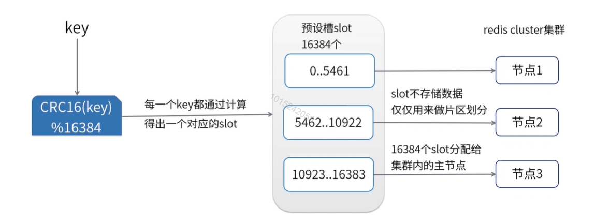

[toc]

# Redis 集群分片

**为什么要分片存储**

公司用户量3千万, 用户基本信息缓存到 Redis 中, 需要内存 10 G, 如何设计 Redis 的缓存架构?

1. 3千万用户, 各种业务业务场景对用户信息的访问量大.  (单台 redis 示例的读写瓶颈凸显)
2. 单 redis 实例管理 10G 内存, 必然影响处理效率
3. redis 的内存需求可能超过集群的最大内存  (一台机器不够用)

此时, 就需要分片

## 官方集群方案

redis cluster 是 Redis 的分布式集群解决方案, 在 3.0 版本推出后有效地解决了 redis 分布式方面的需求实现了数据在对各 Redis 节点之间自动分片, 故障转移, 扩容机制等功能

## 集群部署

部署步骤请参考 [集群搭建文档](redis5集群搭建.md)

1. **增加了slot槽的计算，是不是比单机性能差？**

   共16384个槽，slots槽计算方式公开的，java客户端中就使用了：`HASH_SLOT = CRC16(key) mod 16384`
   为了避免每次都需要服务器计算重定向，优秀的java客户端都实现了本地计算，和服务器slots分配进行映射，有变动时再更新本地内容。

   

2. **redis集群大小**

   理论是可以做到16384个槽，但是redis官方建议是**最大1000个实例**

   

3. **集群节点空间是怎么通信的?**

   每个 Redis 集群节点都有一个额外的 TCP 端口, 每个节点使用 TCP 连接与每个其他节点连接. 监测和故障转移这些步骤基本和哨兵模式类似

   

4. **cluster meet命令中的bus-port是什么？**

   MEET <ip> <port> [bus-port]
   每个Redis群集节点都有一个额外的TCP端口，用于接收来自其他Redis群集节点的传入连接

   

5. **ask 和 moved 重定向的区别**

   重定向包括两种情况

   - 如果是确定slot不属于当前节点，redis会返回moved
   - 如果当前redis节点正在处理slot迁移，则代表此处请求对应的key暂时不在此节点，返回ask，告诉客户端本次请求重定向

   

6. **数据倾斜和访问倾斜的问题**

   倾斜导致集群中部分节点数据过多, 压力大, 解决办法分为前期和后期:

   - 前期是业务层面提前预测, 哪些key是热点, 在设计的过程中规避
   - 后期是slot迁移, 尽量将压力分摊 (slot 跳转有自动 rebalance, reshard 和 手动)

   

7. **slot 手动迁移怎么做**
   迁移过程如下，完整的迁移流程：

   - 在迁移目的节点执行cluster setslot <slot> IMPORTING <node ID>命令，指明需要迁移的slot和迁移源节点。
   - 在迁移源节点执行cluster setslot <slot> MIGRATING <node ID>命令，指明需要迁移的slot和迁移目的节点。
   - 在迁移源节点执行cluster getkeysinslot获取该slot的key列表。
   - 在迁移源节点执行对每个key执行migrate命令，该命令会同步把该key迁移到目的节点。
   - 在迁移源节点反复执行cluster getkeysinslot命令，直到该slot的列表为空。
   - 在迁移源节点和目的节点执行cluster setslot <slot> NODE <node ID>，完成迁移操作。

   

8. **节点之前会交换信息, 传递的消息包括槽的消息, 带来带宽的消耗**

   注意: 避免使用一个集群, 可以分多个集群

   

9. **Pub/Sub 发布订阅机制**

   注意: 对集群内任意的一个节点执行publish发布消息, 这个消息会在集群中进行传播, 其他节点接收到发布的消息

   

10. **读写分离**

    - redis-cluster 默认**所有从节点上的读写, 都会重定向到 key 对接槽的主节点上** (也就是说模式不是读写分离的)
    - 可以通过 readonly 设置**当前连接**可读, 通过 readwrite 取消当前连接的可读状态

    注意: 主从节点依然存在数据不一致的问题

    

## 非官方集群方案

豌豆荚团队开源产品: Codis

推特开源产品: twemproxy

这两款软件实际上实现了类似 `nginx` 分发调用后台集群服务的功能, 根据命令所传输的 key 可以进行分片存储 (和 redis-cluster 原理类似)

建议使用官方集群