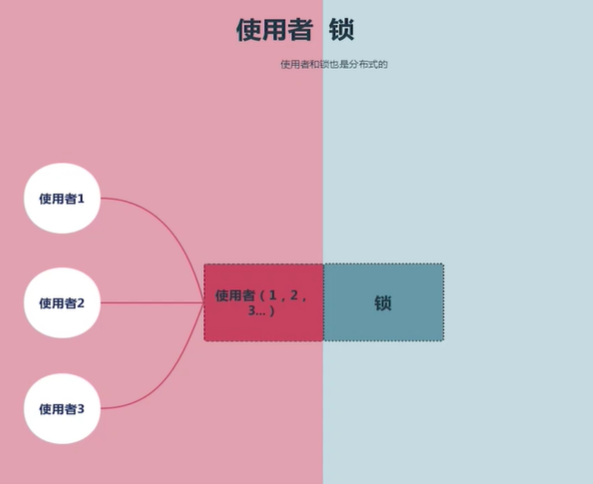
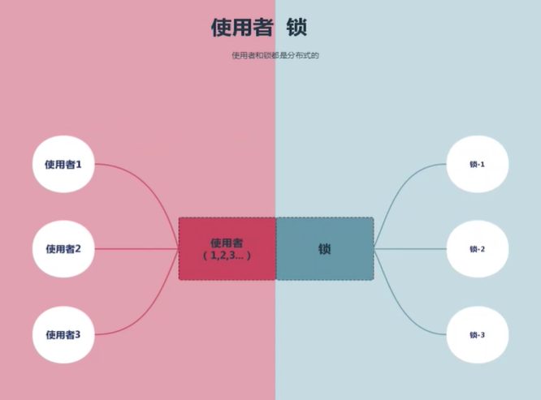
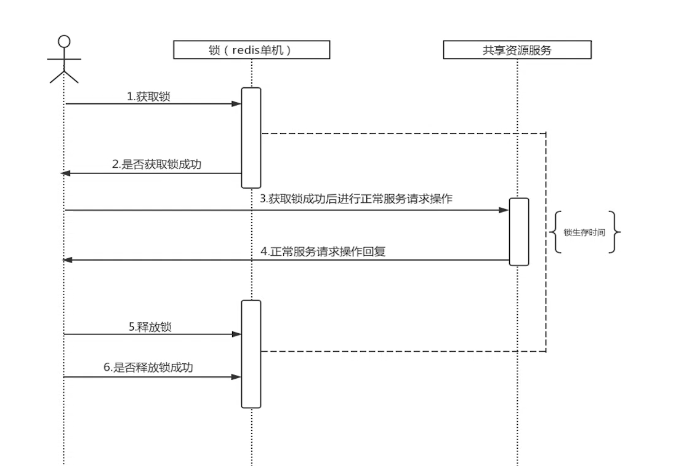
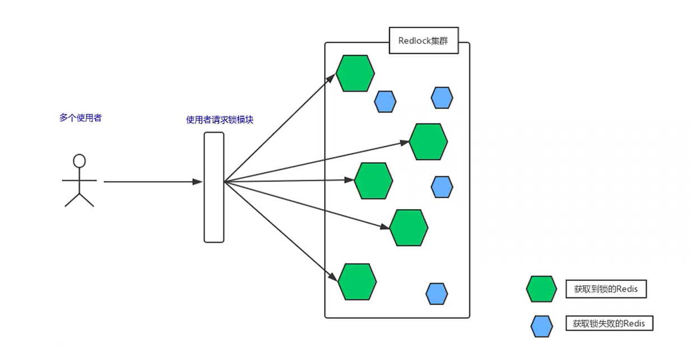

[toc]


# Redis 分布式锁


## 什么是分布式锁


- **使用者之间是分布式的**

  

  使用者一/二/三是单独部署的, 锁只有一把

  

  - **好处** : 锁不是单独部署的, 少部署了一个组件

  - **坏处** : 假设部署到了使用者一上,  这样如果使用者一/二/三都来参与锁竞争, 如果使用者二/三就必须要通过网络访问到使用者一内部, 而使用者一只需要调用方法就可以参与锁竞争, 使用者一拿到锁的几率更大


- 使用者和锁直接是分布式的

  

  

  这样可以避免了使用者直接锁竞争的公平, 但是锁会出现单点问题, 如果锁服务挂掉, 那么整个会影响整个系统的使用


- 锁本身是分布式的

  

  锁集群的部署方式能够避免锁的单点问题


## Redlock 实现分布式锁


### 单机版的 Redis 锁




**核心要点**: 

- **获取锁**

  ```shell
  SET key value NX PX|EX time
  ```

  - key: 可以是任意的值, 为了能够在分布式使用者直接保持一致, 直接以共享资源命名更好

  - value: **保证每个使用者唯一性**即可

  - NX: redis 关键字, 表示key不存在的时候才能set成功, 保证了不同使用者的**互斥性**

  - PX|EX: 过期时间单位 PX - 毫秒 EX - 秒

    

- **释放锁**

  ```lua
  if redis.call("get", KEYS[1]) == ARGV[1] then
      return redis.call("del", KEYS[1])
  else
      return 0
  end
  ```

  该 Lua 脚本的语义是: 执行这个脚本当输入的 keys[1] 在 redis 的值等于输入的 argv[1] 时, 删除这个原有的key, 即释放锁 (这里查找不到 return 0 也可能是因为过期了)

  - KEYS[1]: 获取锁时输入的 key, 即资源名

  - ARGV[1]: 获取锁输入时的value, 这个**value的唯一性决定了使用者只能删除自身已经获取的锁, 不会误删别人的**

    

- **为什么需要设置锁的过期时间?** 

  给执行的任务一个时间限定, 如果没有完成也需要释放锁.  在如下情况

  - 网络抖动: 在服务A拿到锁并完成任务后, 执行锁释放操作, 这是发生了网络抖动, Redis没有收到删除命令
  - 服务器宕机: 服务A到的锁后宕机, 锁没有释放

  如果不加过期时间, 锁就永远不会释放, 造成死锁

  

- **为什么获取和释放锁需要原子保障**

  如果不使用组合命令:

  ```shell
  SET key value NX PX|EX time
  ```

  而是使用两条命令:

  ```shell
  SETNEX key value
  EXPERE key time
  ```

  这样就不能保证原子性的执行

  

  这样的话如果在执行 `setnx`成功后使用崩溃了, 就不执行`expire`命令来设置过期时间了

  

  同理在释放锁的时候, 也不能将

  ```lua
  if redis.call("get", KEYS[1]) == ARGV[1] then
      return redis.call("del", KEYS[1])
  else
      return 0
  end
  ```

  改为

  ```shell
  get key == value
  del key
  ```

  在执行成功 `get`后服务A崩溃了, 然后在这时锁本服务B获取到后`set`为了新的值, 而这时服务A恢复了, 执行了 `del` 命令, 就会造成误解锁

  

- **单机版 Redis 锁最大的风险是什么**

  单点问题: Redis宕机或网络不通后无法提供服务

  **解决方案**

  - **使用持久化机制** : AOF设置always, 保留每一条用户请求; 如果 redis server 挂了, 这个时候直接重新拉起, 公共 AOF 文件进行恢复

    **风险** : 

    - redis 的持久化并**不一定**能够保证最近的n条数据保存到了文件中, 如果没记录最新的最新的`set`命令, 在重启后就可能导致其他服务获取到锁
    - AOF文件变大后重启需要时间, 可能会导致重启后可能 key 已经过期了

  - **使用主从高可用**

    当主节点挂掉后从节点接收保持锁机制不变

  - **使用 Redlock 分布式锁**

    基于 N 个完全独立的 Redis 节点, 利用分布式高可用系统中大多数存活 (法定人数 quorum 机制) 即可用原则来保证锁的高可用


### Redlock 实现

官方文档 http://www.redis.cn/topics/distlock.html



Redlock **获取锁**实现步骤:

1. 获取当前时间 (精确到毫秒) ,  作为后续计时的依据

2. 按照**一定的顺序**依次向 N 个 Redis 节点获取锁

   - **为什么要有顺序?**

     如果每个线程不按照相同的顺序获取锁, 就会出现这样的情况: 假设有十个 Redis 节点, 线程一获取到了 1,2,3 的锁, 线程二获取到了 4,5,6 的锁, 线程三获取到了 7,8,9,10 的锁, 这样就会造成锁竞争失败

   - **Redis 节点需要超时时间么?**

     例如你的锁自动失效时间为10秒，则超时时间应该在5-50毫秒之间。这样可以避免服务器端Redis已经挂掉的情况下，客户端还在死死地等待响应结果。如果服务器端没有在规定时间内响应，客户端应该尽快尝试另外一个Redis实例。

3. 如果此时获取到了大多数 Redis 节点的锁 (大于等于 N/2 +1) 即认为获取锁这一步骤成功

4. 计算获取锁消耗的时间是否小于锁的有效时间

   - 如果小于, 那么说明可以开始操作共享资源
   - 如果大于, 那么说明锁失效, 需要重新获取锁

   

Redlock **释放锁**步骤:

客户端向所有 Redis 节点发起释放锁的操作 (和单机版的操作一样) , 不管这些节点有没有设置锁成功


>  **相对于单机版的 Redis 锁, Redlock是不是完美解决了它的不足 ? 或者说 Redlock 是不是就完美的分布式锁了 ?**


**Redlock 实现的典型场景分析** :

- **场景一**

  假设 N= 5, ABCDE

  1. 使用者 1 成功锁住了大多数 ( 假设是 ABC, 没有成功的是 DE), 获取锁成功
  2. 大多数中有一个节点宕机 (假设是 C), 并且该节点并没有持久化使用者 1 的锁
  3. 节点 C 重启了, 使用者 2 这时候获取到了大多数节点 (CDE)
  4. 出现了使用者 1, 使用者 2 同时获取到了锁, 对共享资源操作的互斥性被破坏了

  

  **解决方案**

  即使开启了持久化在极限情况下还是不能保证场景一一定不发生.  针对这种情况, 可以采用 **延时重启** 的来规避

  >  一个节点崩溃会不会立即重启, 而是等待**一段时间**重启, 而这段时间应该是要**大于锁的有效时间**, 这样就可以避免上述场景中的其他使用者拿到锁的情况

  那么如果一个业务中会调用很多不同的服务, 而每个服务的锁重启延时时间又不同, 那应该怎么平衡这个时间呢? 需要对每个服务的延时时间都有了解, 大于其中最大的延时重启时间

- **场景二**

  假设 N= 5, ABCDE

  1. 使用者 1 成功锁住了大多数 ( 假设是 ABC, 没有成功的是 DE), 获取锁成功
  2. 大多数中有一个节点出现了时钟跳跃 (假设是节点 C 出现了时钟跳跃到了锁失效时间之后, 导致锁过期)
  3. 使用者 2 这时候获取到了大多数节点 (CDE)
  4. 出现了使用者 1, 使用者 2 同时获取到了锁, 对共享资源操作的互斥性被破坏了

  

  会出现这样情况的可能是

  - 系统运维人员的误操作时间设置
  - NTP服务器收到一个大的时钟更新事件

  

  **解决方案**

  > - 规范运维人员操作
  > - 禁止NTP大的时钟更新事件\

- **场景三**

  假设 N= 5, ABCDE

  1. 使用者 1 成功锁住了大多数 , 获取锁成功
  2. 使用者 1 开始对共享资源进行操作
  3. 异常发生: 使用者 1 开始开始操作共享资源到释放锁这段时间已经超过了时间锁的有效时间, 但是使用者 1 不感知
  4. 异常发生期间使用者 2 获取到了锁, 并开始对锁进行操作
  5. 出现了使用者 1, 使用者 2 同时获取到了锁, 对共享资源操作的互斥性被破坏了

   

  会出现这样情况的可能是

  - JVM虚拟机在 GC 时出现`stop the world`
  - 虚拟化容器被`suspend`挂起
  - 操作系统线程上下文的切换
  - 应用程序同步磁盘IO的访问
  - Linux 内存 `swap` 操作
  - 发送 signal stop 信号暂停 Unix 进程
  - 网络阻塞延时

  

  **解决方案**

  这中情况下造成的问题是所有分布式锁都会存在的, Martin Kleppmann在2016-02-08发表了一篇 blog提供了解决思路 **Fencing Token**

  

  这种解决思路实际上是: 每个使用者对锁的竞争会增加一个单调递增的 `Token` 在访问共享资源的时候, 会携带着这个 `Token` , 如果共享资源记录的最后一次操作的的 `Token` 大于本次操作的 `Token` 那说明本次请求是一个无效请求, 直接拒绝本次操作


## Redlock 的使用建议


### Redlock的争论

Martin Kleppmann 的提出的疑问 http://martin.kleppmann.com/2016/02/08/how-to-do-distributed-locking.html 这篇 blog 也作者同时提出了应该如何实现一个安全的分布式锁

- 带有自动过期功能的分布式锁, 必须提供某种 `fencing` 机制来保证对共享资源的真正的互斥保护. Redlock 提供不了这样的机制
- Redlock 构建在一个不够安全的系统模型上. 它对系统的计时假设 (timing assumption) 有比较强的要求, 而这些要求在现实的系统中是无法保证的


作者的回复  http://antirez.com/news/101

- Fencing 机制是不是让锁成为了不必要的产物, Redlock 产生的随机串也能提供 `token` 的功能, 只要唯一性即可, 不需要顺序性;
- 时钟的改变可以通过更好的工程实际来规避


Martin Kleppmann 对于分布式锁的理解

- **效率的锁**

  **定义**: 避免各个使用者做重复的工作. 计时锁偶尔失效了, 只是可能把某些操作多做一遍而已, 例如重复发送了一封邮件

  **使用场景**: 如果使用场景是效率的锁, Redis 单机版就能满足, Redlock显得过重

- **正确性的锁**

  **定义**: 任何情况下都不允许锁异常失效的情况发送, 一旦发生, 就意味着数据不一致, 数据损坏, 从而导致更严重的危害

  **使用场景**: 如果使用场景是正确性的锁, 很严格的场合, 那么不要使用 Redlock. 它建立在异步模型上的一个不够强的算法, 对于系统模型的假设包含了一些风险 (例如时钟). 而且也没有`fencing token`机制


总的来说, Martin Kleppmann 对于锁的用途分类的见解很好. 但是 Redlock 在场景一和场景二下也可以通过**延时重启**和**运维规范**来规避, 并且 Redis 的本身的性能很好, 用于分布式锁时的效率很好的提升. 

Fencing机制需要考虑的地方还有很多, 比如:

- 资源/锁服务/使用者之间如何去协调这些 `token` 来保证唯一并且递增, 这应该如何实现呢 ?
- 如果访问的资源服务也是分布式的呢 ? 如果版本 1 使用者来操作资源 A, 版本 2 的使用者来操作资源 B, 如何保证版本 1 的使用者能够正确操作资源不被拒绝呢


### Redlock 的使用推荐


Redlock 毕竟是基于客户端的分布式锁, 在实现上有一定的难度, 需要客户端自己协调整个锁机制; 而类似 Zookeeper, etcd, chubby 这些集群直接通过更严格的分布式协议 zab, raft, 或者 paxos 内部协调整个锁资源的一致性. 对使用者而言只有一个操作入口, 会更友好些


如果是刚开始使用 Redlock, 建议查看


- 官方方案 [中文](http://www.redis.cn/topics/distlock.html)  [英文](https://redis.io/topics/distlock)

- 推荐的 Redisson:  https://github.com/redisson/redisson/
  - java 客户端 不仅是分布式互斥锁, 还提供了很多使用的功能
  - 国人开源

