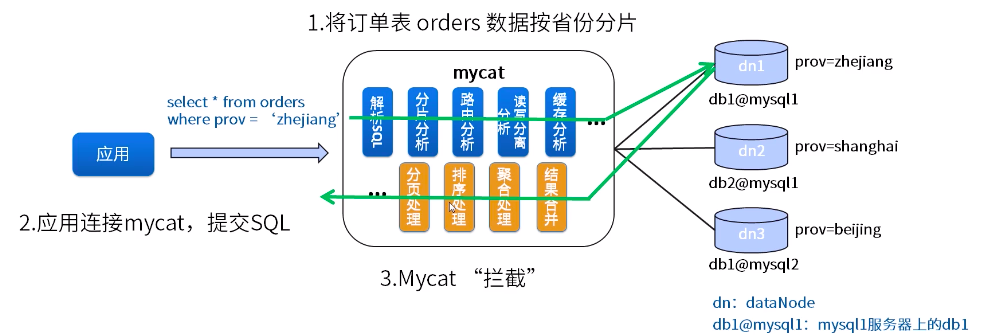
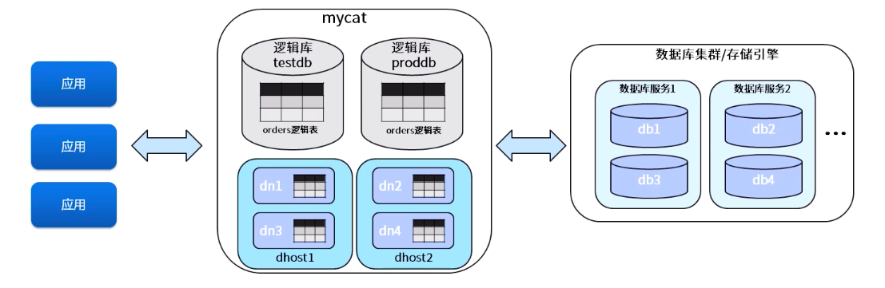
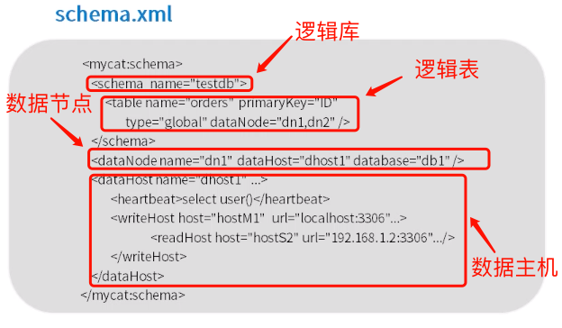
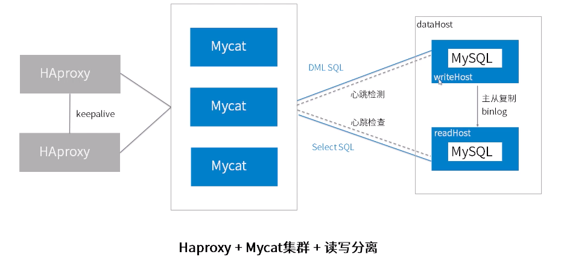
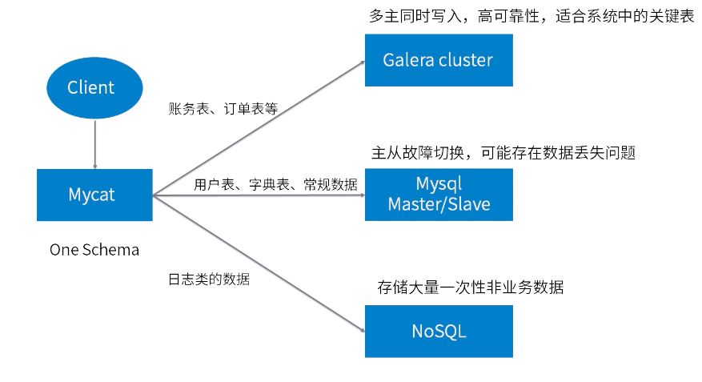
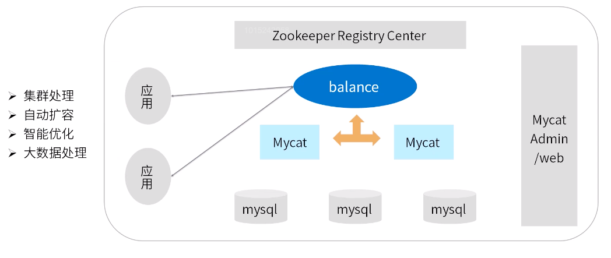

[TOC]

# MyCat 入门

官网: http://www.mycat.io/

参考资料: [MyCat 权威指南](http://www.mycat.io/document/mycat-definitive-guide.pdf)

案例参考: https://github.com/MyCATApache/Mycat-doc

## 简介

-   一个彻底开源的，面向企业应用开发的大数据库集群
-   支持事务、ACID、可以替代 MySQL 的加强版数据库
-   一个可以视为 MySQL 集群的企业级数据库，用来替代昂贵的 Oracle 集群
-   一个融合内存缓存技术、NoSQL 技术、HDFS 大数据的新型 SQL Server
-   结合传统数据库和新型分布式数据仓库的新一代企业级数据库产品
-   一个新颖的数据库中间件产品

**应用场景 :**

-   单纯读写分离, 此时配置最为简单, 支持读写分离, 主从切换
-   分库分表, 对于超过 1000W 的表进行分片, 最大支持 1000 亿的单表分片
-   多租户应用, 没应用一个库, 但应用程序只连接 MyCat, 从而不改造程序本身, 实现多租户化
-   报表系统, 借助于 MyCat 的分表能力, 处理大规模报表的统计
-   替代 Hbase 分析大数据
-   作为海量数据实时查询的一种简单有效方案, 比如 100 亿条频繁查询的记录需要在 3 秒内查出结果, 除了基于主键的查询, 还可能存在范围查询或其他属性查询, 此时 MyCat 是最简单的选择

## MyCat 工作原理

MyCat 的工作原理就是**拦截**, 拦截了用户发来的 SQL 语句, 首先解析 SQL 语句, 做一些特定的分析, 如切边分析, 路由分析, 读写分离分析和缓存分析等等; 然后将此 SQL 发给后端真实的数据库, 并将返回结果做使得处理, 最终返回给用户

## 关键特性

-   支持 SQL92 标准
-   支持 MySQL、Oracle、DB2、SQL Server、PostgreSQL 等 DB 的常见 SQL 语法
-   遵守 Mysql 原生协议，跨语言，跨平台，跨数据库的通用中间件代理。
-   基于心跳的自动故障切换，支持读写分离，支持 MySQL 主从，以及 galera cluster 集群。
-   支持 Galera for MySQL 集群，Percona Cluster 或者 MariaDB cluster
-   基于 Nio 实现，有效管理线程，解决高并发问题。
-   支持数据的多片自动路由与聚合，支持 sum,count,max 等常用的聚合函数,支持跨库分页。
-   支持单库内部任意 join，支持跨库 2 表 join，甚至基于 caltlet 的多表 join。
-   支持通过全局表，ER 关系的分片策略，实现了高效的多表 join 查询。
-   支持多租户方案。
-   支持分布式事务（弱 xa）。
-   支持 XA 分布式事务（1.6.5）。
-   支持全局序列号，解决分布式下的主键生成问题。
-   分片规则丰富，插件化开发，易于扩展。
-   强大的 web，命令行监控。
-   支持前端作为 MySQL 通用代理，后端 JDBC 方式支持 Oracle、DB2、SQL Server 、 mongodb 、巨- 杉。
-   支持密码加密
-   支持服务降级
-   支持 IP 白名单
-   支持 SQL 黑名单、sql 注入攻击拦截
-   支持 prepare 预编译指令（1.6）
-   支持非堆内存(Direct Memory)聚合计算（1.6）
-   支持 PostgreSQL 的 native 协议（1.6）
-   支持 mysql 和 oracle 存储过程，out 参数、多结果集返回（1.6）
-   支持 zookeeper 协调主从切换、zk 序列、配置 zk 化（1.6）
-   支持库内分表（1.6）
-   集群基于 ZooKeeper 管理，在线升级，扩容，智能优化，大数据处理（2.0 开发版）。

MyCat 安装资料: [MyCat 参考资料](https://github.com/Mao-PC/Notes/tree/master/Middle/db/4-%E6%95%B0%E6%8D%AE%E5%BA%93%E4%B8%AD%E9%97%B4%E4%BB%B6/Mycat%E8%A1%A5%E5%85%85%E8%B5%84%E6%96%99)

## 核心概念

逻辑概念:

**逻辑库 :** MyCat 数据库服务中定义, 管理的数据库

**逻辑表 :** 逻辑库中锁包含的分库分表存储的表

**dataNode :** 数据节点 (分片节点), 逻辑表分片存放的节点

**dataHost :** 数据主机 (节点主机), 数据节点所在的主机

物理概念:

**writeHost :** 写主机, 真实的数据库
**readHost :** 读主机, 真实的数据库

具体每个标签的属性懒得抄了, 请参考 [MyCat 权威指南](http://www.mycat.io/document/mycat-definitive-guide.pdf)

## 最佳实践

简单小型项目配置

大小项目配置

MyCat 1.6 架构

增加了 MyCat 的集群, 使用 ZooKeeper 做注册中心, 可以负载均衡

安装请参考 [在 Centos7 上安装 MyCat](../4-数据库中间件/Mycat补充资料/Centos7上Mycat安装.pdf)