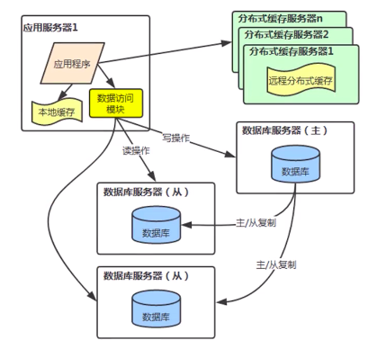

[TOC]

# 数据库中间件设计要点

## 为什么需要数据库中间件?

**Question:** 数据量不是很大, 并发读写超过数据库服务器处理能力的解决办法:

**加缓存**

缓存过期不命中, 还是有大量的读和全部的写操作会请求数据库, 如果数据库支持不了怎么办?

**读写分离**

读写要分别操作不同的库, 对 DAO 层的代码有影响吗? 如果隔离这种变化?

**增加数据库访问模块-数据库中间件**

**Question:** 应用的模块很多, 总的数据量很大, 并发读写均超过单个数据库服务器的处理能力

这个问题可以分解为多个小问题:

1.  对于读压力, 可以使用集群, 多个从库:

    

    此时, 就要去数据库中间件能够均衡的分发到多个从数据库上 (**负载均衡**)

2.  对于写压力, 但是不能使用多个主库:

    -   多个主库间数据同步很难保证数据一致性
    -   数据量大的时候单库保存不下

        此时, 需要分库, 最常用的是根据业务代码分成不同的数据库

        

        如果分库, 对 DAO 层代码有什么影响? 如果要跨库关联查询要怎么办?

    -   如果单个表数据量很大, 超出了单表的上限, 如电商网站的商品表, 订单表等等

        可以根据一定的规则来讲单个表中的数据分开存储到多个表

        分表后, 对 DAO 层的影响:

        -  如何觉得数据要存到那个表?
        -  如何查询多个表?
        -  如何做到对DAO层透明?

    需要用数据库中间件来屏蔽掉这些对代码造成的影响

    分库分表: 具体可以参考 [分库分表](../../DB/totally/分库分表.md)

## 数据库中间件设计要点

1. 能解析 SQL
2. 支持读写分离
3. 能支持从库负载均衡
4. 支持分库操作
5. 支持分表操作
6. 支持扩库关联查询
7. 对事务处理支持
8. 主键 ID 生成支持
9. 数据源管理

数据库中间件的两种实现模式:

-   客户端模式
    

    需要在应用程序中集成数据库中间件模块, 通过该模块来配置管理应用的一个或多个数据源, 在模块内部来按错数据的整合

    主要有:

    -   当当: sharding-jdbc
    -   阿里: TDDL(头都大了)

-   服务端(代理)模式
    

    通过中介代理层来同一管理所有的数据源, 后端数据源集群对前端应用程序透明, 同时易于数据库扩展. 独立的访问能提供更强的处理能力, 适合复杂的大型系统

    主要有:

    -   社区: Mycat-cobar
    -   数字: Atlas
    -   百度: heinsberge
    -   YouTube: vitess
    -   金山: kingshard
    -   商业版: Oneproxy

各个数据库中间件比较:

| -          | Cobar | TDDL    | ShardingJDBC | MyCat |
| ---------- | ----- | ------- | ------------ | ----- |
| 分库支持   | Yes   | Yes     | Yes          | Yes   |
| 分表支持   | No    | Yes     | Yes          | Yes   |
| 类型       | Proxy | 客户端  | 客户端       | Proxy |
| ORM 支持   | 任意  | 多种    | 多种         | 多种  |
| 数据库支持 | MySQL | 多种    | 多种         | 多种  |
| 外部依赖   | No    | Diamond | No           | No    |
| 社区活跃度 | 停滞  | 停滞    | 较活跃       | 活跃  |
| 文档丰富   | Yes   | -       | Yes          | Yes   |
| 持续更新   | No    | -       | Yes          | Yes   |
