## 分布式消息中间件设计篇

### 消息中间件概述

**单体架构：**

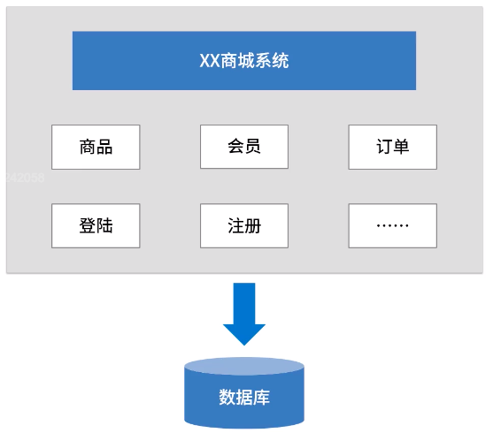

所有的代码放在同一个 jar 中。如果某一个模块需要升级的话，需要升级所有的模块，如果服务部署到 10 台服务器上，那么需要把这 10 台服务器全部升级。这样做耦合度太高、难管理。

**分布式系统架构：**

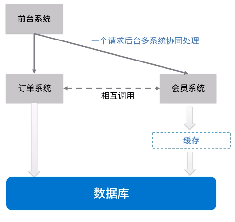

每个模块独立部署，降低了耦合度，代码易于管理。

**基于消息中间件的分布式系统架构：**

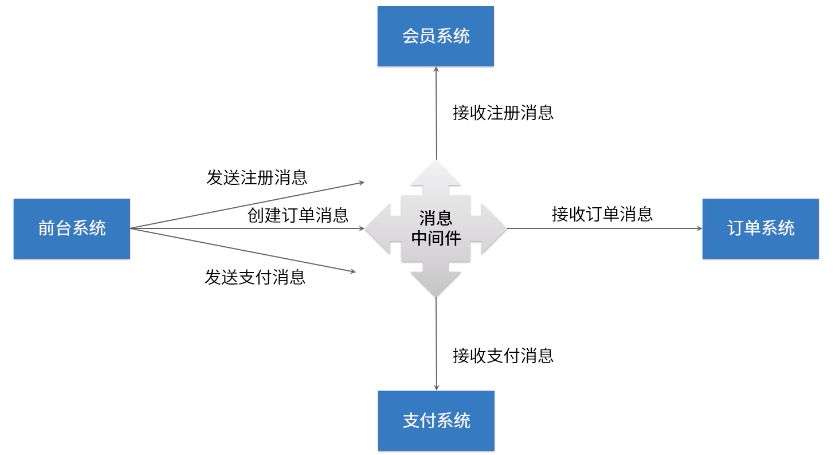

**消息中间件** 就是利用高效可靠的信息传递机制进行平台无关的数据交流；并基于数据通信来进行分布式系统的集成；通过提供消息传递和消息排队模型，它可以在分布式环境下扩展进程间的通信。

**应用场景：** 跨数据传递、高并发流量削峰、数据异步处理。。。

常用的消息中间件：[ActiveMQ](mq/activemq/README.md) [RabbitMQ](mq/rabbitmq/README.md) [Kafka](mq/kafka/README.md) [RocketMQ](mq/rocketmq/README.md)

**消息中间件的核心设计：**

-   **本质**
    一种具备接收请求、保存数据、发送数据等功能的网络应用。  
     和一般的网络应用程序的主要区别是它主要负责数据的接收和传递，所以性能一般都有高于普通程序

-   **五大核心组成**
    -   协议
    -   持久化机制
    -   消息分发机制
    -   高可用设计
    -   高可靠设计

### 协议

协议**三要素**：

-   **语法：** 数据与控制信息的结构或格式
-   **语义：** 需要发出什么控制信息，完成什么东西已经做出怎样的响应
-   **时序（同步）：** 事件实现顺序的详细说明

例如 HTTP 协议三要素：

-   语法： HTTP 规定了请求报文和响应报文的具体格式
-   语义： 客户端主动发起的操作称为请求
-   同步：一个请求对应一个响应

消息中间件常用协议：OpenWire、AMQP、MQTT、Kafka、OpenMessage

**为什么不直接使用 HTTP 协议？**

-   HTTP 协议有点“太大”了，状态码、请求类型、浏览器信息...
-   HTTP 大部分情况下都是短连接，每次通信都会重建连接。在进程通信时，需要长时间来通信：客户端拿消息和发送消息

#### AMQP

AMQP（Advanced Message Queuing Protocol）高级消息队列协议，摩根大通集团联合其他公司设计

**特性：** 事务支持、持久化支持，出身**金融行业**，在可靠性消息处理上有天然的优势

RabbitMQ、ActiveMQ 实现了 AMQP

#### MQTT

MQTT（Message Queuing Telemetry Transport）消息队列遥测传输，IBM 开发的即时通讯协议，在**物联网**架构中重要组成部分

**特性：** 轻量、结构简单、传输快、没有事务支持、没有持久化相关设计

**应用场景：** 计算能力有限、低带宽、网络不稳定的场景

RabbitMQ、ActiveMQ 实现了 MQTT

#### Kafka

基于 TCP 的二进制协议。消息内部是通过长度来分割，由一些基本数据类型构成。

**特性：** 结构简单、解析快、无事务设计、有持久化设计

Kafka 实现了 Kafka

#### OpenMessage

由阿里发起，于其他公司一起创立的分布式中间件、流处理领域的应用开发标准。**是国内首个在全球范围内发起的分布式消息领域国标标准**

**特性：** 结构简单、解析快、有事务、持久化设计

RocketMQ 实现了 OpenMessage

### 持久化

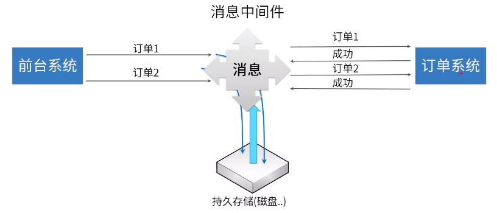

| 持久化方式 | ActiveMQ | RabbitMQ | Kafka | RocketMQ |
| ---------- | -------- | -------- | ----- | -------- |
| 文件系统   | √        | √        | √     | √        |
| 数据库     | √        | ×        | ×     | ×        |

### 消息分发

业务场景 1：中间件需要感觉不太的业务将消息发送给不同的系统
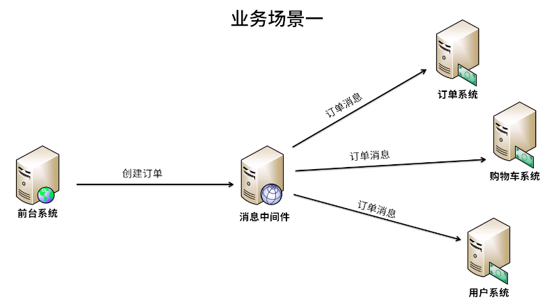

业务场景 2：客户端处理失败，中间件有可能需要重新发送消息
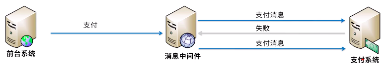

| 发布策略 | ActiveMQ | RabbitMQ | Kafka | RocketMQ |
| -------- | -------- | -------- | ----- | -------- |
| 发布订阅 | √        | √        | √     | √        |
| 轮询发布 | √        | √        | √     | ×        |
| 公平发布 | ×        | √        | √     | ×        |
| 重发     | √        | √        | ×     | √        |
| 消息拉取 | ×        | √        | √     | √        |

### 高可用

-   Master-Slave 主从共享 **解决单点故障问题, 使用同一个数据库实例, 只有一个 Master 能提供服务**
    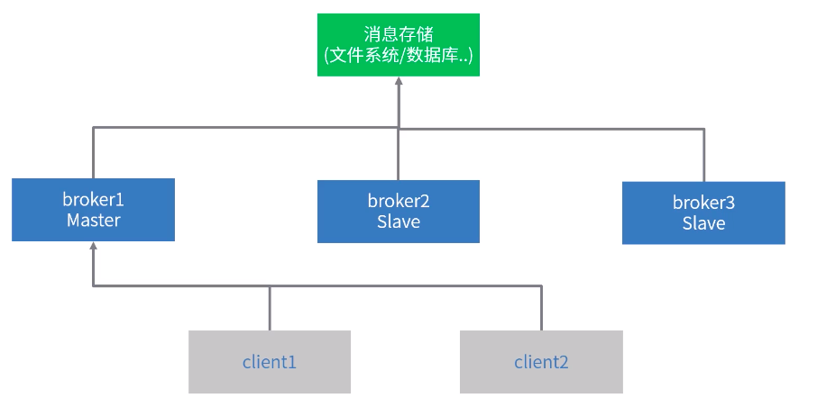

-   Master-Slave 主从同步 类似 ZooKeeper 在做集群时只使用一台服务器来做些操作
    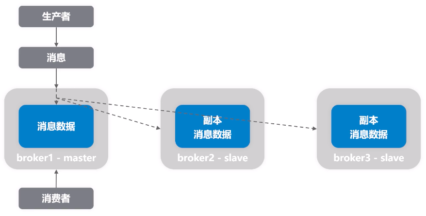

-   Broker-Cluster 多主集群同步部署
    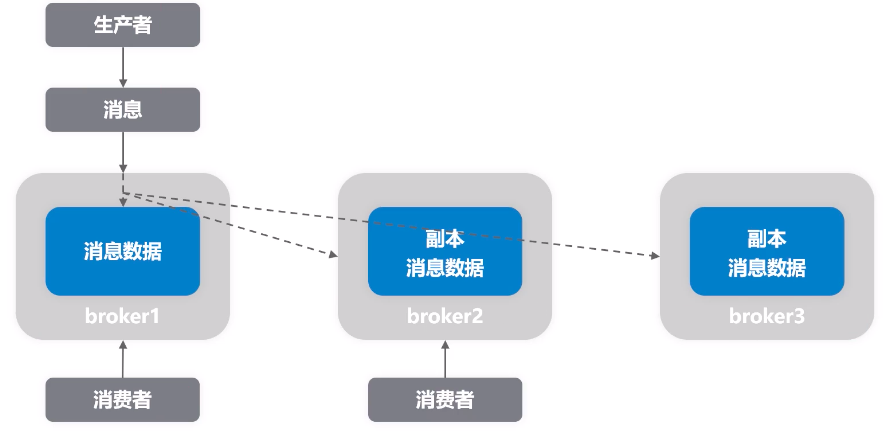

-   Broker-Cluster 多主集群转发部署
    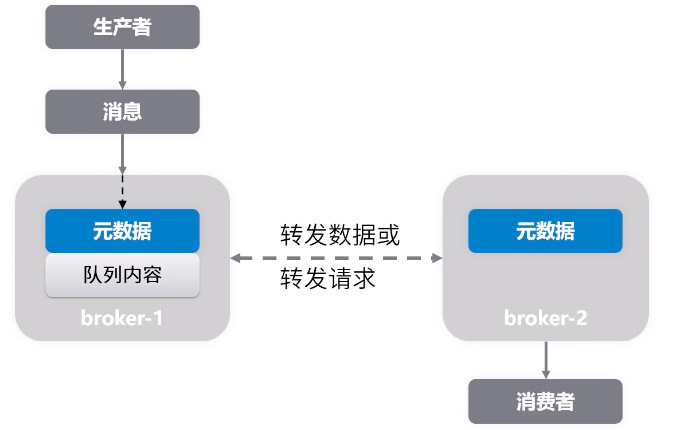

-   Master-Slave 与 Broker-Cluster 结合
    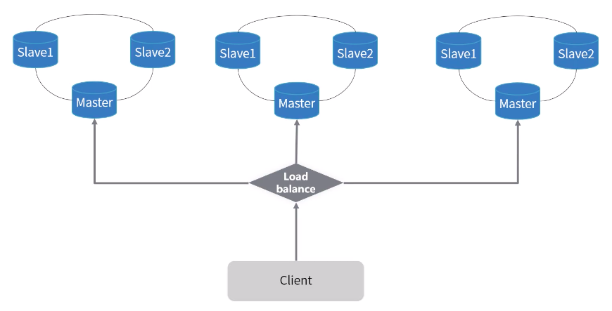

### 高可靠

指系统可以无障碍运行。比如一个系统从来不会崩溃报错，或者崩溃、报错的几率比较低。

一般从两个方面考虑：

-   消息传输可靠：通过协议来保证系统间数据解析的正确性
-   消息存储可靠：通过持久化来保证消息存储的可靠性

---

[中间件](../README.md)  
[主页](../../../../../)
