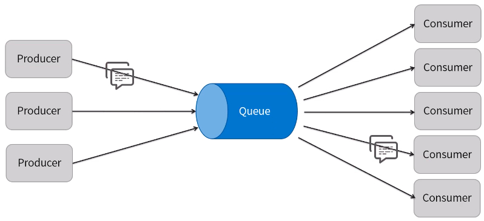
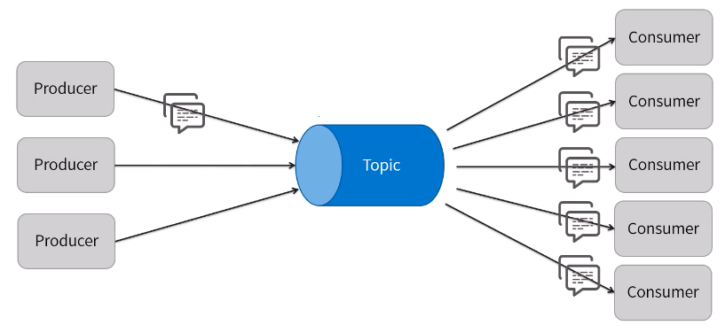
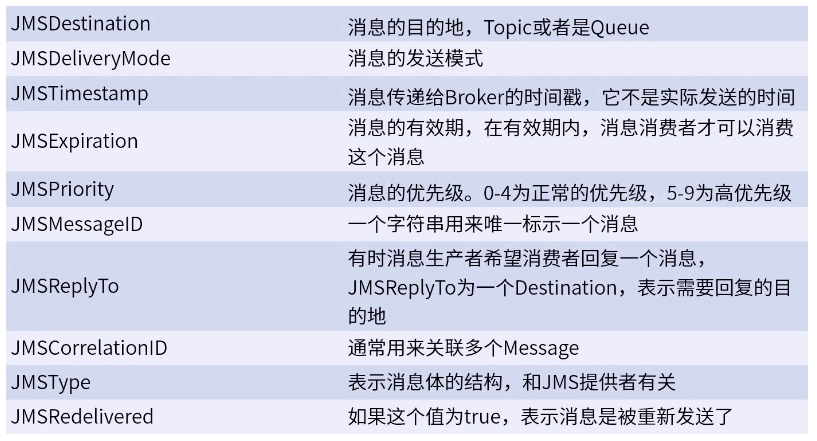
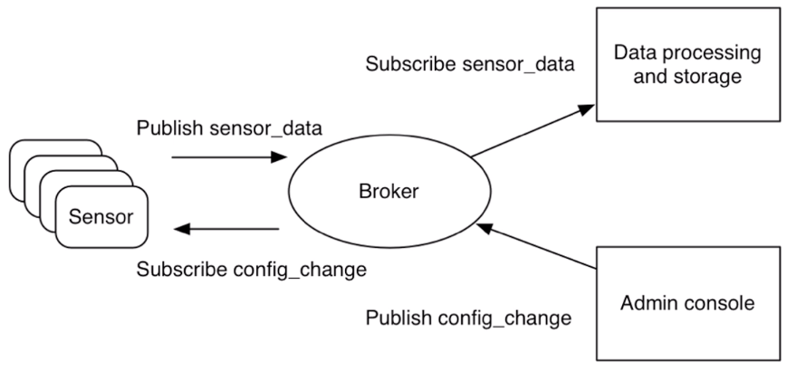
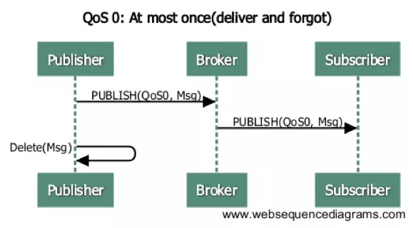
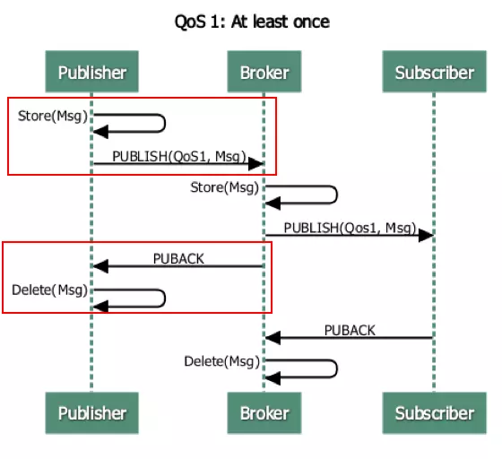
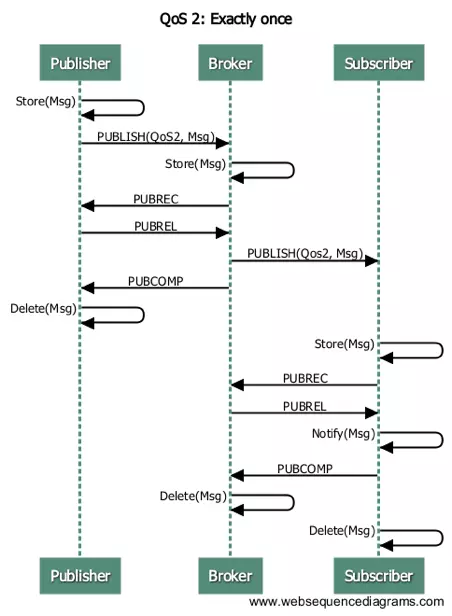
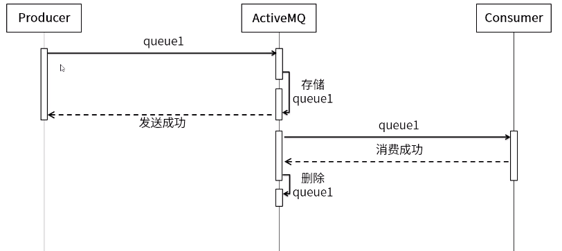
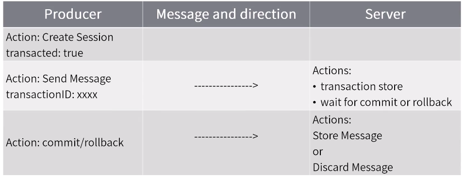
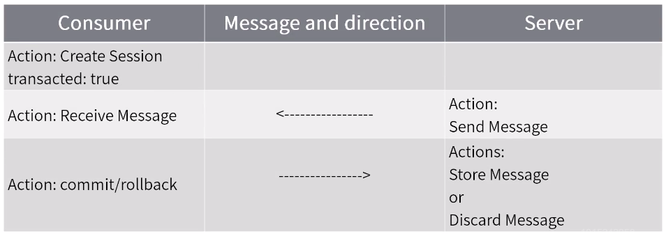

[TOC]

## ActiveMQ

Apache 出品，JMS1.1 和 J2EE1.4 规范 JMS Provider 实现

MQ 具体的示例代码可以参考: [MQ 的示例代码](/资料/subject-2-mq-master)

### ActiveMQ 和 JMS

**JMS 规范：** Java 消息服务（Java Message Service）程序接口是一个 Java 平台面向消息中间件（MOM）的 API，用于在两个应用程序之间，或分布式系统中发消息，进行异步通信。是一个于平台无关的 API。

**JMS 的对象模型：**

| 实例              | 说明                       |
| ----------------- | -------------------------- |
| ConnectionFactory | 连接工厂                   |
| Connection        | 连接                       |
| Session           | 会话                       |
| Destination       | 目的                       |
| MessageProducer   | 生产者                     |
| MessageCustomer   | 消费者                     |
| Message           | 消息                       |
| Broker            | 消息中间件示例（ActiveMQ） |

**JMS 的消息模型：**

-   **P2P（Point-to-Point）/点对点：** 消息发送到指定目的地，如发短信等待
    

-   **Pub/Sub（Publish/Subscribe）/主题（发布订阅）：** 消息会传播给所有这个消息的订阅者，如在朋友圈发动态
    

**JMS 的消息结构：**
JMS 消息一般包括：消息头、消息属性、消息体

-   消息头
    

-   消息属性：可以理解为消息的附加消息头，属性名可以自定义  
     属性值类型：boolean、byte、int、long、float、double、String

-   消息体：
    消息体类型：
    BytesMessage：用来传递字节消息  
    MapMessage：传递 K-V 对消息
    ObjectMessage： 传递序列号对象消息
    StreamMessage：传递文件
    TextMessage：传递字符串

**ActiveMQ 特性：** 支持多种编程语言、支持多种传输协议、有多种持久化方式

### ActiveMQ 配置及入门

[activemq 入门使用](activemq入门使用.md)

### ActiveMQ 支持的协议和传输方式

ActiveMQ 支持多种协议和传输方式, 运行客户端使用多种协议连接

支持的协议有: AUTO, OpenWire, AMQP, Stomp, MQTT

支持的传输协议有: VM, TCP, SSL, UDP, Peer, Multicast, HTTP(S)等, 已经更高级的 Failover, Fanout, Discovery, ZeroConf 等

**ActiveMQ 的协议连接配置** 在 \${ActiveMQ_HOME}/conf/activemq.xml 中, 通过\<transportConnectors> 就可以使用多种传输协议

```xml
<transportConnectors>
     <!-- DOS protection, limit concurrent connections to 1000 and frame size to 100MB -->
     <transportConnector name="openwire" uri="tcp://0.0.0.0:61616?maximumConnections=1000&amp;wireFormat.maxFrameSize=104857600"/>
     <transportConnector name="amqp" uri="amqp://0.0.0.0:5672?maximumConnections=1000&amp;wireFormat.maxFrameSize=104857600"/>
     <transportConnector name="stomp" uri="stomp://0.0.0.0:61613?maximumConnections=1000&amp;wireFormat.maxFrameSize=104857600"/>
     <transportConnector name="mqtt" uri="mqtt://0.0.0.0:1883?maximumConnections=1000&amp;wireFormat.maxFrameSize=104857600"/>
     <transportConnector name="ws" uri="ws://0.0.0.0:61614?maximumConnections=1000&amp;wireFormat.maxFrameSize=104857600"/>
</transportConnectors>
```

#### ActiveMQ 常用的传输方式及配置

##### TCP

是 ActiveMQ 最常用的传输方式, 协议为 OpenWire, 默认端口为 61616

配置格式: `tcp://hostname:port?key=value`

**TCP 的参数说明:**

在服务端配置时, 要以: `transport.` 开头: `tcp://hostname:port?transport.ThreadName&transport.trace=false&transport.soTimeout=60000`

在客户端配置时, 不需要 `transport.` : `tcp://hostname:port?ThreadName&trace=false&soTimeout=60000`

| 属性                    | 默认值            | 描述                                                                                                                                                                                                                                                                                                                                                       |
| ----------------------- | ----------------- | ---------------------------------------------------------------------------------------------------------------------------------------------------------------------------------------------------------------------------------------------------------------------------------------------------------------------------------------------------------- |
| backlog                 | 5000              | 指定传输服务器套接字等待接受的最大连接数。                                                                                                                                                                                                                                                                                                                 |
| closeAsync              | true              | 如果 true 套接字关闭调用是异步发生的。此参数应设置 false 为 STOMP 等协议，这些协议通常用于为每次读取或写入创建新连接的情况。这样做可确保套接字关闭调用同步发生。同步关闭可防止代理由于连接的快速循环而耗尽可用套接字。                                                                                                                                     |
| connectionTimeout       | 30000             | 如果>=1 该值设置连接超时（以毫秒为单位）。值为 0 表示没有超时。负值被忽略。                                                                                                                                                                                                                                                                                |
| daemon                  | false             | 如果 true 传输线程将以守护进程模式运行。将此参数设置为 true 将代理嵌入 Spring 容器或 Web 容器中以允许容器正确关闭。                                                                                                                                                                                                                                        |
| dynamicManagement       | false             | 如果 true 在 TransportLogger 可以通过 JMX 进行管理。                                                                                                                                                                                                                                                                                                       |
| ioBufferSize            | 8 \* 1024         | 指定在 TCP 层和 wireFormat 基于编组的 OpenWire 层之间使用的缓冲区的大小。                                                                                                                                                                                                                                                                                  |
| jmxPort                 | 1099              | （仅限客户端）指定 JMX 服务器将用于管理的端口 TransportLoggers。这应仅由客户端生产者或消费者通过 URI 设置，因为代理创建自己的 JMX 服务器。指定备用 JMX 端口对于在同一台计算机上测试代理和客户端并且需要通过 JMX 控制这两者的开发人员非常有用。                                                                                                             |
| keepAlive               | false             | 如果 true，在代理连接上启用 TCP KeepAlive 以防止连接在 TCP 级别超时。这不应该与使用的 KeepAliveInfo 消息混淆 InactivityMonitor。                                                                                                                                                                                                                           |
| logWriterName           | default           | 设置 org.apache.activemq.transport.LogWriter 要使用的实现的名称。名称映射到 resources/META-INF/services/org/apache/activemq/transport/logwriters 目录中的类。                                                                                                                                                                                              |
| maximumConnections      | Integer.MAX_VALUE | 此代理允许的最大套接字数。                                                                                                                                                                                                                                                                                                                                 |
| minmumWireFormatVersion | 0                 | wireFormat 将被接受的最小远程版本（请注意拼写错误）。注意：当远程 wireFormat 版本低于配置的最低可接受版本时，将引发异常并且将拒绝连接尝试。值 0 表示不检查远程 wireFormat 版本。                                                                                                                                                                           |
| socketBufferSize        | 64 \* 1024        | 设置接受的套接字读写缓冲区的大小（以字节为单位）。                                                                                                                                                                                                                                                                                                         |
| soLinger                | Integer.MIN_VALUE | soLinger 值为时设置套接字的选项> -1。当设置-1 的 soLinger 套接字选项被禁用。                                                                                                                                                                                                                                                                               |
| soTimeout               | 0                 | 设置套接字的读取超时（以毫秒为单位）。值为 0 表示没有超时。                                                                                                                                                                                                                                                                                                |
| soWriteTimeout          | 0                 | 设置套接字的写入超时（以毫秒为单位）。如果套接字写操作未在指定的超时之前完成，则套接字将被关闭。值 0 表示没有超时。                                                                                                                                                                                                                                        |
| 的 stackSize            | 0                 | 设置传输的后台读取线程的堆栈大小。必须以倍数指定 128K。值为 0 表示忽略此参数。                                                                                                                                                                                                                                                                             |
| startLogging 会         | true              | 如果传输堆栈 true 的 TransportLogger 对象最初将消息写入日志。除非，否则忽略此参数 trace=true。                                                                                                                                                                                                                                                             |
| tcpNoDelay              | false             | 如果设置 true 了套接字选项 TCP_NODELAY。这会禁用 Nagle 的小数据包传输算法。                                                                                                                                                                                                                                                                                |
| threadName              | N / A             | 指定此参数时，将在调用传输期间修改线程的名称。附加远程地址，以便粘贴在传输方法中的调用将在线程名称中包含目标信息。当使用线程转储进行脱气时，这非常有用。                                                                                                                                                                                                   |
| 跟踪                    | false             | 导致通过传输发送的所有命令都被记录。要查看记录的输出，请定义 Log4j 记录器：log4j.logger.org.apache.activemq.transport.TransportLogger=DEBUG。                                                                                                                                                                                                              |
| trafficClass            | 0                 | 要在套接字上设置的流量类。                                                                                                                                                                                                                                                                                                                                 |
| 区分服务                | 0                 | （仅限客户端）要在传出数据包上设置的首选差分服务流量类，如 RFC 2475 中所述。有效整数值：[0,64]。有效的字符串值：EF，AF[1-3][1-4]或 CS[0-7]。使用 JDK 6 时，仅在 JVM 使用 IPv4 堆栈时才有效。要使用 IPv4 堆栈，请设置系统属性 java.net.preferIPv4Stack=true。注意：同时指定' diffServ 和 typeOfService ' 是无效的，因为它们在 TCP / IP 包头中共享相同的位置 |
| typeOfService           | 0                 | （仅限客户端）要在传出数据包上设置的首选服务类型值。有效的整数值：[0,256]。使用 JDK 6 时，仅在 JVM 配置为使用 IPv4 堆栈时才有效。要使用 IPv4 堆栈，请设置系统属性 java.net.preferIPv4Stack=true。注意：同时指定' diffServ 和 typeOfService ' 是无效的，因为它们在 TCP / IP 包头中共享相同的位置。                                                          |
| useInactivityMonitor    | true              | 当 false 该 InactivityMonitor 被禁用，连接永不超时。                                                                                                                                                                                                                                                                                                       |
| useKeepAlive            | true              | 在 true KeepAliveInfo 空闲连接上发送消息时，防止其超时。如果此参数是 false 连接，如果在指定的时间内没有在连接上收到任何数据，则连接仍将超时。                                                                                                                                                                                                              |
| useLocalHost            | false             | 当 true 本地连接将使用值进行 localhost 的，而不是实际的本地主机名。在某些操作系统上，例如 OS X，无法以本地主机名连接，因此 localhost 更好。                                                                                                                                                                                                                |
| useQueueForAccept       | true              | 当 true 接受的套接字被放置到队列上以使用单独的线程进行异步处理时。                                                                                                                                                                                                                                                                                         |
| wireFormat              | default           | wireFormat 要使用的工厂的名称。                                                                                                                                                                                                                                                                                                                            |
| wireFormat。\*          | N / A             | 具有此前缀的属性用于配置 wireFormat。                                                                                                                                                                                                                                                                                                                      |

##### SSL

需要安全连接是可以考虑使用 SSL, 适用于 Client 和 Broker 在公网的情况, 如使用 was 云平台等, 具体请参考: [http://activemq.apache.org/ssl-transport-reference](http://activemq.apache.org/ssl-transport-reference)

配置格式: `ssl://hostname:port`

客户端配置:  
JMS 客户端需要使用 ActiveMQSslConnectionFactory 类创建连接, broker-url 以 ssl:// 开头, 以下是 Spring 配置:  


SSL 主机名验证: 从 ActiveMQ 5.15.6 开始支持 TLS 主机名验证默认客户端启用, 服务端未启用

服务端配置: `ssl://localhost:61616?transport.verifyHostName=true`  
客户端配置: `ssl://localhost:61616?socket.verifyHostName=false` 或者 `ssl://localhost:61616?verifyHostName=false`

##### NIO

ActiveMQ 使用 Java 默认的 BIO 连接, 如果有大量的客户端, 或者性能瓶颈在网络传输上, 可以使用 NIO 对其进行改进.

配置格式: `nio://hostname:port?key=value`

NIO 是 OpenWire 协议的传输方式, 其他协议, 如: AMQP, MQTT... 也有 nio 实现,通常在协议前缀使用 +nio 实现, 示例: `mqtt+nio://hostname:1883` , nio+ssl: `nio+ssl://hostname:port`

**NIO 的参数:**

| 属性                                                                | 默认值 | 描述                                                                |
| ------------------------------------------------------------------- | ------ | ------------------------------------------------------------------- |
| org.apache.activemq.transport.nio.SelectorManager.corePoolSize      | 10     | 即使它们处于空闲状态，也要保留在池中的线 ​​ 程数                    |
| org.apache.activemq.transport.nio.SelectorManager.maximumPoolSize   | 1024   | 池中允许的最大线程数                                                |
| org.apache.activemq.transport.nio.SelectorManager.workQueueCapacity | 0      | 在增长池之前的最大工作队列深度                                      |
| org.apache.activemq.transport.nio.SelectorManager.rejectWork        | false  | 当达到容量时，允许使用 IOException 拒绝工作，以便可以保留现有的 QOS |

属性可以在 \${ActiveMQ_HOME}/bin/env 中配置

```shell
ACTIVEMQ_OPTS="$ACTIVEMQ_OPTS -Dorg.apache.activemq.transport.nio.SelectorManager.corePoolSize=2000 -Dorg.apache.activemq.transport.nio.SelectorManager.maximumPoolSize=2000 -Dorg.apache.activemq.transport.nio.SelectorManager.workQueueCapacity=1024"
```

##### UDP

牺牲了可靠性, 如物联网场景下

配置格式: `udp://hostname:8123`

| 属性         | 默认值                                                 | 描述                            |
| ------------ | ------------------------------------------------------ | ------------------------------- |
| trace        | false                                                  | 如果为 true，记录发送的所有命令 |
| useLocalHost | 如果为 true，则会导致本地计算机名称解析为“localhost”。 |
| datagramSize | 4 \* 1024                                              | 指定数据报的大小                |
| wireFormat   | default                                                | 要使用的 WireFormat 的名称      |

##### HTTP(S)

需要穿越防火墙, 可以考虑, 但由于是短连接, 每次创建的成本比较高, 性能最差. 通过 xml 传数据

配置格式: `http://localhost` `https://localhost:8080`

##### VM

虚拟机协议(方法调用), 使用场景为 Client 端和 Broker 在同一个 Java 虚拟机内嵌的情况, 无需网络通信开销.

配置格式: `vm://brokerName?marshal=false&broker.persistent=false`
| 属性 | 默认值 | 描述 |
| ------------ | ------------------------------------------------------ | ------------------------------- |
marshal|false|如果为 true，则强制使用 WireFormat 对通过传输发送的每个命令进行格式转换
wireFormat|default|要使用的 WireFormat 的名称
create|true|如果 Broker 不存在,就创建
waitForStart|-1|如果> 0，则表示等待代理启动的超时（以毫秒为单位）。值-1 和 0 表示不等待。仅在 ActiveMQ 5.2+中受支持

#### ActiveMQ 支持协议

##### OpenWire

是 Apache 的跨语言协议, 是 ActiveMQ 4.x 版本后的默认协议, 具体可参考[http://activemq.apache.org/openwire](http://activemq.apache.org/openwire)

支持 TCP, SSL, NIO, UDP, VM 等, 直接配置这些传输方式就是使用的 OpenWire 协议, OpenWire 有自己的参数, 客户端和服务端都可以通过配置前缀为 'wireFormat.' 来表示

如: `tcp://localhost:61616?wireFormat.cacheEnabled=false&wireFormat.tightEncodingEnabled=false`

具体可参考 [http://activemq.apache.org/configuring-wire-formats](http://activemq.apache.org/configuring-wire-formats)

| 选项                             | 默认     | 描述                                                                                                                                                                                                                               |
| -------------------------------- | -------- | ---------------------------------------------------------------------------------------------------------------------------------------------------------------------------------------------------------------------------------- |
| cacheEnabled                     | true     | 是否应该缓存通常重复的值，以便减少编组？                                                                                                                                                                                           |
| cacheSize                        | 1024     | 当 cacheEnabled=true，则此参数用于指定值的数量被缓存。                                                                                                                                                                             |
| maxInactivityDuration            | 30000    | 最大不活动持续时间（在套接字被认为死亡之前），以毫秒为单位。在某些平台上，套接字可能需要很长时间才能消亡。因此，允许代理在配置的时间段内处于非活动状态时终止连接。某些传输使用它来启用保持心跳功能。设置为值时禁用不活动监视<= 0。 |
| maxInactivityDurationInitalDelay | 10000    | 开始不活动检查之前的初始延迟。是的，这个词 'Inital'应该像那样拼写错误。                                                                                                                                                            |
| maxFrameSize                     | MAX_LONG | 允许的最大帧大小。可以帮助防止 OOM DOS 攻击。                                                                                                                                                                                      |
| sizePrefixDisabled               | false    | 在每个数据包被封送之前，是否应该为数据包的大小添加前缀？                                                                                                                                                                           |
| stackTraceEnabled                | true     | 是否应将代理上发生的异常堆栈跟踪发送到客户端？                                                                                                                                                                                     |
| tcpNoDelayEnabled                | true     | Socket 中的 NoDelay 参数                                                                                                                                                                                                           |
| tightEncodingEnabled             | true     | 根据 CPU 使用情况, 自动调节传输内容大小                                                                                                                                                                                            |

##### MQTT

MQTT（Message Queuing Telemetry Transport）消息队列遥测传输，IBM 开发的即时通讯协议，在**物联网**架构中重要组成部分

MQTT 发布订阅模型:



MQTT 服务质量:

**服务质量(QoS)** 级别是一种关于发送者和接收者之间信息投递的保证协议.

MQTT 有三种 QoS: (以下图文转自: [https://www.jianshu.com/p/8b0291e8ee02](https://www.jianshu.com/p/8b0291e8ee02))

-   至多一次 (0)  
     简而言之，就是仅发一次包，是否收到完全不管，适合那些不是很重要的数据。如:日志发送
    

-   至少一次 (1)
    当 client 没收到 service 的 puback 或者 service 没有收到 client 的 puback，那么就会一直发送 publisher
    流程：（publisher -> broker）

    1.  publisher store msg -> publish ->broker （传递 message）
    2.  broker -> puback -> publisher delete msg （确认传递成功）

    注意：

    1.  publisher 必须保存 msg，这样才能在重发
    2.  publisher 如果在一定时间或 socket 断开等异常情况，会继续重发 msg

    

-   只有一次 (2)
    publisher 和 broker 进行了缓存，其中 publisher 缓存了 message 和 msgID，而 broker 缓存了 msgID，两方都做记录所以可以保证消息不重复，但是由于记录是需要删除的，这个删除流程同样多了一倍
    流程：（publisher -> broker）

    1.  publisher store msg -> publish ->broker -> broker store msgID（传递 message）
    2.  broker -> puberc （确认传递成功）
    3.  publisher -> pubrel -> broker delete msgID （告诉 broker 删除 msgID）
    4.  broker -> pubcomp -> publisher delete msg （告诉 publisher 删除 msg）

    注意：

    1.  第二步，即 puberc 不可以删除 publisher 的 msg，因为第三步未必成功，这个时候就需要第一步提醒第二步继续发，而提醒必须要 msgID
        

QoS 是 MQTT 的一个主要功能, 使得在不可靠网络下进行通信变得更为简单, 因为及时是在非常不可靠的网络下, 协议也可以掌握是否需要重复消息并保证消息到达. 它也能帮助客户端根据网络环境和程序逻辑来自由选择 QoS.

ActiveMQ 开启 MQTT:

```xml
<transportConnectors>
   <transportConnector name="mqtt" uri="mqtt://localhost:1883"/>
</transportConnectors>
```

**通配符:**

| 功能   | ActiveMQ | MQTT |
| ------ | -------- | ---- |
| 分隔符 | .        | /    |
| 元素   | \*       | +    |
| 子节点 | >        | #    |

示例: 主题名: `foo.blah.bar`, 在使用 MQTT 客户端时, 可以使用 `foo/+/bar`. 在 JMS 订阅, 使用 `foo.*.bar`

##### AMQT

最好不要使用 ActiveMQ, 推荐 RabbitMQ

##### AUTO

自动检测协议, 具体可参考 [http://activemq.apache.org/auto](http://activemq.apache.org/auto).

配置格式: `auto://localhost:5671`

从 ActiveMQ 5.13 版本开始, 开始支持协议检测, 可以自动检测 OpenWire, AMQP, MQTT, SROPM. 允许这四种类型的客户端可以共享一个传输.

[activemq 主从共享数据库集群方案](activemq主从共享数据库集群方案.md)  
[activemq-Broker-Cluster 集群部署](activemq-Broker-Cluster集群部署.md)

### ActiveMQ 的持久化方式

Queue 类型的持久化:



Topic 类型的持久化:

topic 和 queue 不同, 因为 topic 有很多个订阅者, 每个订阅者有可能处理消息的进度不同. MQ 会维护一个 GC 策略, 如果某条消息长时间(可以配置)没有被访问, 那就会被清除


#### JDBC

将详细存到数据库中

-   优点: 方便管理, 可以支持强一致性
-   缺点: 性能低

如果在某些业务场景下只需要用到 MQ 的特性而不要求效率时可以使用

#### AMQ

早期版本中, 现在已经不推荐使用

基于文件存储, 写入速度快且容易回恢复, 但是重建索引时间长, 而且索引文件大.

#### KahaDB

是 AMQ 的升级版, 5.4 版本后默认使用的持久化方式

在 activemq.xml 中默认配置

```xml
<!--
     Configure message persistence for the broker. The default persistence
     mechanism is the KahaDB store (identified by the kahaDB tag).
     For more information, see:

     http://activemq.apache.org/persistence.html
-->
<persistenceAdapter>
     <kahaDB directory="${activemq.data}/kahadb"/>
</persistenceAdapter>
```

#### LevelDB

使用 LevelDB 持久化, 已经被废弃

### 事务机制

生产者事务:



消费者事务:



```java
....
// 第一个参数为事务开关, 为true则会忽略第二个参数, 被jms服务器设置为SESSION_TRANSACTED
conn.createSession(true, Session.SESSION_TRANSACTED);
....
// 提交事务
session.commit();
// 回滚事务
session.rollback();
```

---

[中间件](../README.md)  
[主页](../../../../../)
