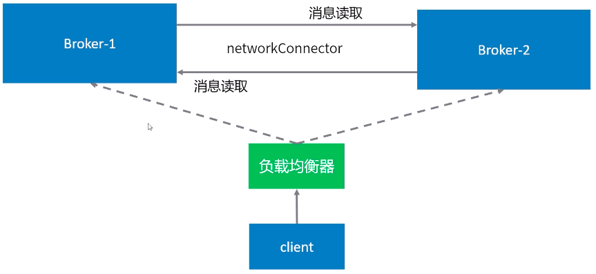
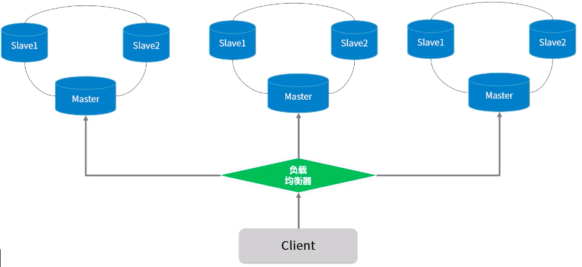

# Broker-Cluster 部署



也可以参照[分布式消息中间件设计篇](../README.md)中的 Broker-Cluster 多主集群转发部署

## **机器列表**

-   192.168.100.242
-   192.168.100.243

> 为了保证机器之间网络互通，建议关闭防火墙：`systemctl stop firewalld.service`

## **Static 静态集群部署方式**

static 方式就是在 broker 的配置中，静态指定要连接到其它 broker 的地址，格式：

```xml
<networkConnector uri="static:(tcp://host1:61616,tcp://host2:61616)"/>
```

**说明：** host1、host2 表示连接目标的地址，61616 是连接目标开放的端口。修改配置前，先停止 activemq

### **一、修改配置文件**

1. 修改 192.168.100.242 上的/var/activemq/conf/activemq.xml，在`<broker></broker>`标签中添加以下代码

```xml
    <networkConnectors>
        <networkConnector uri="static:(tcp://192.168.100.243:61616)"/>
    </networkConnectors>
```

2. 修改 192.168.100.243 上的/var/activemq/conf/activemq.xml，在`<broker></broker>`标签中添加以下代码

```xml
    <networkConnectors>
        <networkConnector uri="static:(tcp://192.168.100.242:61616)"/>
    </networkConnectors>
```

### **三、验证**

1. 启动所有 broker
2. 查看日志中是否有 WARN 等警告/错误信息。 `tail -f /var/activemq/data/activemq.log`
3. 所有的 broker 都启动后，可以在 web 管理界面的 Networky 页面可以看到连接信息。
4. 将生产者与消费者分别连接到不同的节点上，看生产者发送的消息，在消费者中能不能收到。

## **Dynamic 自动发现集群部署方式**

> ActiveMQ 通过组播方式将自己的信息发送出去，接收到的信息的机器再来连接这个发送源。默认情况下，ActiveMQ 发送的是机器名，可以通过配置修改成发送 IP 地址。**注意机器间的网络**。

### **一、修改配置文件**

1. 修改每台机器上的/var/activemq/conf/activemq.xml，在<broker></broker>标签中添加以下代码
    ```xml
    <networkConnectors>
        <networkConnector uri="multicast://default"/>
    </networkConnectors>
    ```
2. 修改 transportConnector，增加 discoveryUri 属性，并添加 publishedAddressPolicy
    ```xml
    <transportConnector name="openwire" uri="tcp://0.0.0.0:61616?maximumConnections=1000&amp;wireFormat.maxFrameSize=104857600" discoveryUri="multicast://default">
     <publishedAddressPolicy>
         <publishedAddressPolicy publishedHostStrategy="IPADDRESS"></publishedAddressPolicy>
     </publishedAddressPolicy>
    </transportConnector>
    ```

> 验证方式和上面的静态方式一致

## Master-Slave 与 Broker-Cluster 结合



修改每台机器上的/var/activemq/conf/activemq.xml，在<broker></broker>标签中添加多个<networkConnectors></networkConnectors>, 连接到多个 broker 集群

```xml
<networkConnectors>
    <networkConnector uri="masterslave:(tcp://other-cluster-1-master:61616,other-cluster-1-slave:61616)" duplex="false"/>
    <networkConnector uri="masterslave:(tcp://other-cluster-2-master:61616,other-cluster-2-slave:61616)" duplex="false"/>
    ...
</networkConnectors>
```

\<networkConnectors>\</networkConnectors> 参数详细参数请参照: http://activemq.apache.org/networks-of-brokers
