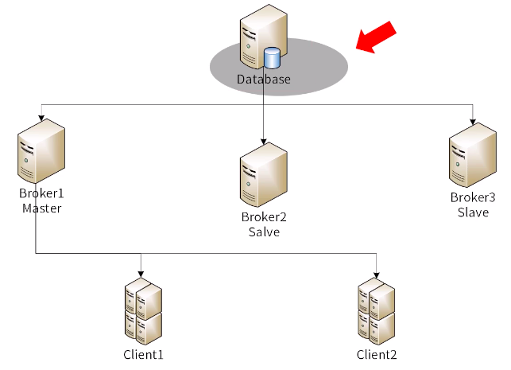

[TOC]

> 集群配置参考 http://activemq.apache.org/clustering.html

# 数据库共享方案

## 1、 使用数据库进行消息持久化



可以基于文件共享或者数据库共享, 文件共享需要硬件方面的支持, 这里以数据库共享为例

### 1.1、引入数据库驱动包和数据库连接池

```
根据需要，把数据库驱动放到activemq目录下 lib/extra
如：mysql-connector-java-5.1.41.jar
```

### 1.2、修改 activemq.xml，使用 jdbc 持久化

```
# /var/activemq/conf/activemq.xml  文件 persistenceAdapter节点
<!-- persistent=true-->
<broker brokerName="localhost" persistent="true" xmlns="http://activemq.apache.org/schema/core">
    <persistenceAdapter>
       <!-- 这里是关键 -->
        <jdbcPersistenceAdapter dataSource="#mysql-ds" useDatabaseLock="false" transactionIsolation="4"/>
    </persistenceAdapter>
      ........
</broker>
<!-- MySql DataSource Sample Setup -->
<bean id="mysql-ds" class="org.apache.commons.dbcp2.BasicDataSource" destroy-method="close">
    <property name="driverClassName" value="com.mysql.jdbc.Driver"/>
    <property name="url" value="jdbc:mysql://database.tony.com:3306/test_activemq?relaxAutoCommit=true"/>
    <property name="username" value="tony"/>
    <property name="password" value="tony"/>
    <property name="poolPreparedStatements" value="true"/>
</bean>
```

## 2、集群配置

> 多台服务器部署启动 activemq 服务，使用同一个数据库

## 3、客户端使用

http://activemq.apache.org/failover-transport-reference.html

```
# brokerURI 使用failover，故障自动切换方式
# 非failover的公共参数配置通过nested.*，例如 failover:(...)?nested.wireFormat.maxInactivityDuration=1000
# ?randomize=false 随机选择，默认是顺序
# 指定优先切换 failover:(tcp://host1:61616,tcp://host2:61616,tcp://host3:61616)?priorityBackup=true&priorityURIs=tcp://local1:61616,tcp://local2:61616
# maxReconnectDelay重连的最大间隔时间(毫秒)

brokerUrl = "failover:(tcp://activemq.tony.com:61616,tcp://activemq-slave.tony.com:61616)?initialReconnectDelay=100";
```

## 4、原理简述

```
1、 数据库表自动创建
2、 多服务器争抢获取LOCK表锁
3、 连接断开后，客户端自动重连
```
