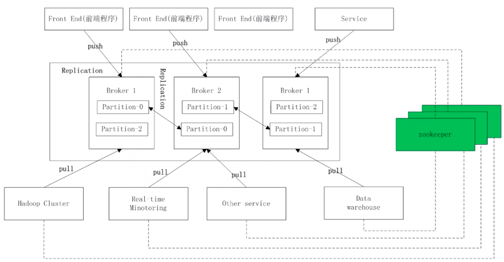
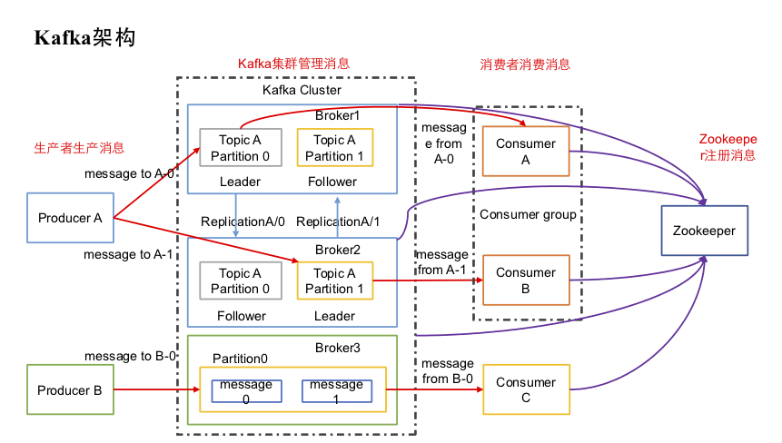

[TOC]

# Kafka

关于 Kafka 资料请参考: [预习资料](https://github.com/Mao-PC/Notes/tree/master/Middle/mq/kafka/%E9%A2%84%E4%B9%A0%E8%B5%84%E6%96%99)

本文档应当和[预习资料](https://github.com/Mao-PC/Notes/tree/master/Middle/mq/kafka/%E9%A2%84%E4%B9%A0%E8%B5%84%E6%96%99)结合学习, 两者互为补充

## 简介

官网: http://kafka.apache.org/intro.html

Kafka 是 linkedin 使用 Scala 开发的具有高水平扩展和高吞吐量的分布式消息系统

Kafka 对消息保存时根据 Topic 归类, 发送消息者成为 Producer, 消息接收者成为 Consumer, 此外 Kafka 集群由多个 Kafka 实例组成, 每个实例(server)成为 Broker

无论是 Kafka 集群, 还是 producer 和 consumer 都依赖于 ZooKeeper 来保证系统可用性, 为集群保存一些 meta 信息

主流 MQ 的对比

| -             | ActiveMQ                      | RabbitMQ               | Kafka           |
| ------------- | ----------------------------- | ---------------------- | --------------- |
| 所属社区/公司 | Apache                        | Mozilla Public License | Apache LinkedIN |
| 开发语言      | Java                          | ErLang                 | Scala           |
| 支持的协议    | OpenWire,STOPM,REST,XMPP,AMQP | AMQP                   | 仿 AMQP         |
| 事务          | 支持                          | 不支持                 | 不支持          |
| 集群          | 支持                          | 支持                   | 支持            |
| 负载均衡      | 支持                          | 支持                   | 支持            |
| 动态扩容      | 不支持                        | 不支持                 | (zk)支持        |

**Kafka 的主要功能**

Kafka 是一个分布式流处理平台

流处理平台特性:

-   可以让发布和订阅流式的记录, 这一方面和消息队列或企业消息系统类似
-   可以存储流式的记录, 并且有较好 的容错性
-   可以在流式记录产生时就进行处理

适用场景:

-   构造实时流处理管道, 它可以在系统或应用直接可靠的获取数据(相当于消息队列)
-   构造实时流式应用程序, 对这些流数据进行转换或者影响

## Kafka 的核心概念

-   Kafka 作为一个集群运行在一个或者多个服务器上
-   Kafka 通过 topic 对存储的流数据进行分类
-   每条记录包含一个 key, 一个 value 和一个时间戳(timestamp)

**四个核心 API**

-   **Producer API** 允许一个应用程序发布一串流式数据到一个或多个 Kafka topic
-   **Consumer API** 允许一个程序订阅一个或多个 topic, 并且对发布给他们的流式数据进行处理
-   **Streams API** 允许一个应用程序作为一个流处理器, 消费一个或多个 topic 产生的输入流, 然后产生一个一个输出流到一个或多个 topic 中去, 在输入输出流中进行有效的交换

-   **Connector API** 允许构建并运行可重用的生产者和消费者, 将 Kafka topics 连接到已存在的应用程序或数据系统. 比如连接到一个关系型数据库, 捕捉表(table)的所有变更内容

**相关概念**

-   [AMQP 协议](<../rabbitmq/README.md##\ AMQP\ 协议>)
-   **Topics 和 Logs**

    是数据主题, 是数据记录发布的地方, 可以用来区分业务系统. Kafka 中的 Topics 是多订阅者模式, 一个 Topic 可以拥有一个或者多个消费者来订阅它的数据

    对于每一个 topic, Kafka 集群都会维持一个分区日志(log), 如图:

    

    **partition 结构**

    

-   **Distribution**

    log 的分区被分布到集群的多个服务器上, 每个服务器处理它分到的分区, 根据配置每个分区还可以复制到其他服务器作为备份容错

    每个分区有一个 leader, 零或多个 follower. Leader 处理此分区所有的读写请求, 而 follower 被动的复制数据. 如果 leader 宕机, 其他的一个 follower 会被推举为一个新的 leader. 一台服务器可能是一个分区的 leader, 另一个分区的 follower. 这样可以平衡负载, 避免所有的请求都只让一台或几台服务器处理

-   **Producer**

    生产者向某个 topic 上发送消息, 生产者也选择发送到 topic 上的哪个分区. 最简单的方式是从分区列表上轮流选择, 也可以根据某种算法依照权重选择分区. 开发者负责选择分区算法

-   **Consumer**

    消费者使用一个消费组名称来进行标识发布到 topic 中的每条记录被分配给订阅者组中的一个消费者实例. 消费者可以分布在多个进程中或者多个机器上.

    -   如果所有的消费者实例在同一个消费组中, 消费记录或负载平衡到每一个消费者实例中
    -   如果所有的消费者实例在不同的消费组中, 每条消息记录会广播到所有的消费者进程

    

**Kafka 整体架构**

**Replication(备份)**: 为保证分布式可靠性, Kafka 0.8 开始对每个分区的数据进行备份(不同的 Broker 上), 防止一个 Broker 宕机造成分区数据不可用

搞清楚 Kafka 中 Producer, Consumer, Topic, Partition 的关系, 主要需要弄清:

-   **Consumer 是如何消费的?**

    -   Consumer 数量 \< Partition 数量: 会出现一个 Consumer 消费多个 Partition 的情况
    -   Consumer 数量 = Partition 数量: 每个 Consumer 分配一个 Partition 进行消费
    -   Consumer 数量 > Partition 数量: 每个 Consumer 分配一个 Partition 进行消费, 多余的 Consumer 不做任何消费

    总之每个 Partition 只有一个 Consumer 进行消费

-   **Producer 是如何向 Broker 中的 Partition 中发送消息的?**
    由 Topic 决定的
    -   默认是轮询存放, Broker 每次接收到消息时, 先要检查有多少个 Partition, 然后轮询存放.
    -   开发人员也可以自定义 hash 来选择 Partition

## Kafka 的使用场景

-   **消息**
    Kafka 可以更好的替换传统消息系统, 消息系统被用于各种场景(解耦数据生产者, 缓存未处理消息), 与大多数的消息系统相比, Kafka 有更好的吞吐量, 内置分区, 副本和故障转移, 这有利于处理大规模消息.

    根据官方经验,通常消息传递使用较低的吞吐量, 但可能要求较低的端到端延迟, Kafka 提供强大持久性来满足这一要求. 在这方面 Kafka 可以与传统的消息传递系统(ActiveMQ 和 RabbitMQ)相媲美

-   **跟踪网站活动**
    Kafka 最初使用作用就是将用户活动跟踪管道重建为一组实时发布订阅源. 把网站活动(浏览网页, 搜索或其他的操作)发布到中心 topic, 其中每个活动类型有一个 topic. 这些订阅源提供一系列用例, 包括实时处理, 实时监视, 对加载到 Hadoop 或离线数据仓库系统进行离线处理和报告等

    每个用户浏览网站时都产生了许多活动信息, 因此活动跟踪的数量经常非常大. 这就非常需要使用 Kafka

-   **日志聚合**
    许多人使用 Kafka 来代替日志聚合解决方案. 日志集合通常是才能够服务器收集物理日志文件, 并将其置于一个中心系统(可能是文件服务器或 HDFS)进行处理. Kafka 从这些日志文件中提取信息, 并将其抽象为一个更加清晰的消息流. 这样可以实现更更低的延迟处理且易于支持多个数据源及分布式数据的消耗. 与 Scribe 或 Flume 等以日志为中心的系统相比, Kafka 具有同样出色的性能, 更强的耐用性(因为复制功能)和更低的端到端延迟

-   **流处理**
    从 0.10.0.0 开始, Kafka 支持轻量但功能强大的流处理

    Kafka 消息处理包含多个阶段. 其中原始输入数据时从 Kafka 主题消费的. 然后汇总, 丰富或者以其他的方式处理转换为新主题以供进一步消费或后续处理. 例如, 一个推荐新闻文章, 文章内容可能从"articles"主题获取, 然后进一步处理内容, 得到一个处理后的新内容, 最后推荐给用户. 这种处理是基于单个主题的实时数据流.

    处理 Kafka Streams, 还有 Apache Storm 和 Apache Samza 也是不错的流处理框架

-   **事件采集**
    Event sourcing 是一种应用程序设计风格, 按时间来记录状态的更改, Kafka 可以存储非常多的日志数据, 为基于 event sourcing 的应用程序提供强有力的支持

-   **提交日志**
    Kafka 可以从外表为分布式系统提供日志功能. 日志有助于记录节点和行为间的数据, 才去重新同步机制可以从失败节点恢复数据. Kafka 日志压缩功能支持这一用法, 这一点与 Apache BookKeeper 项目类似
