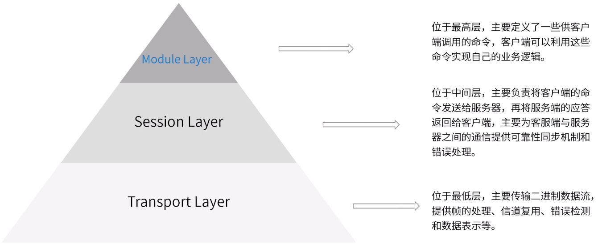
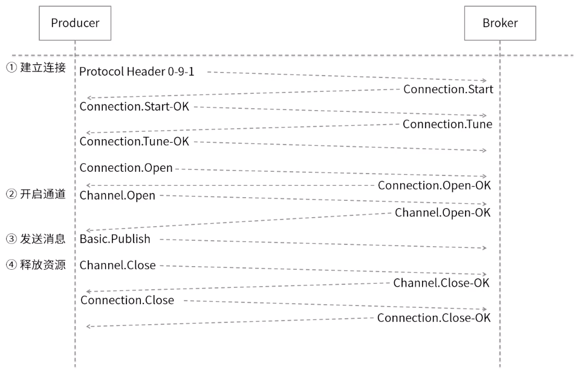
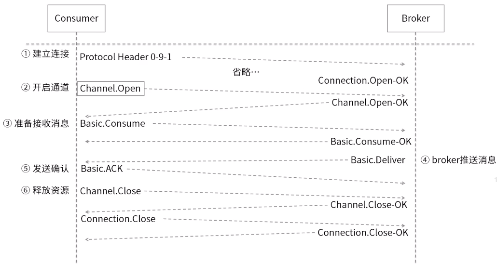
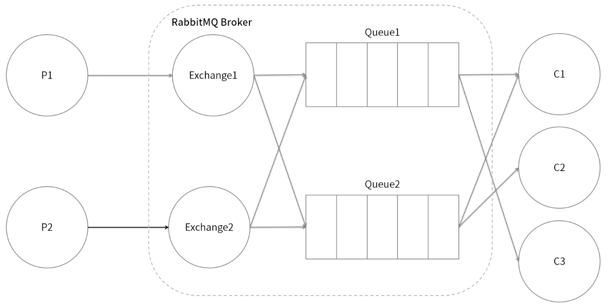
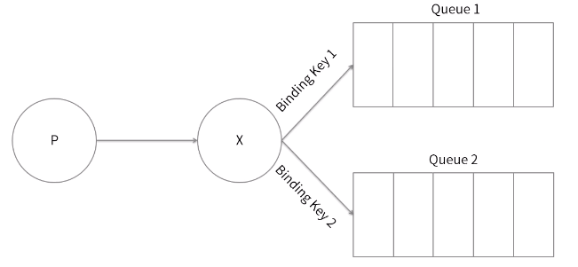
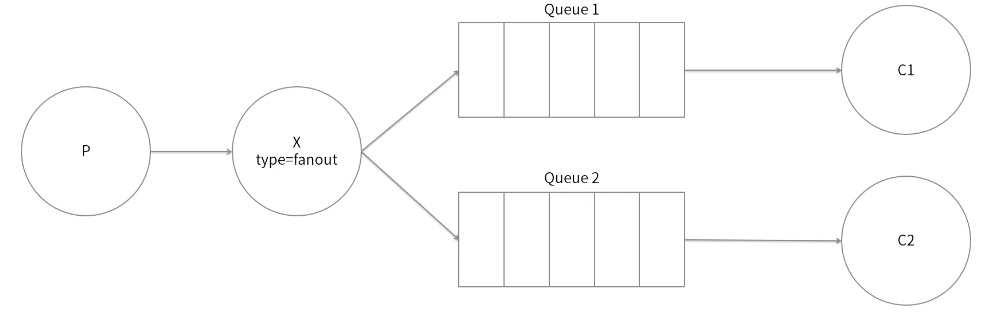
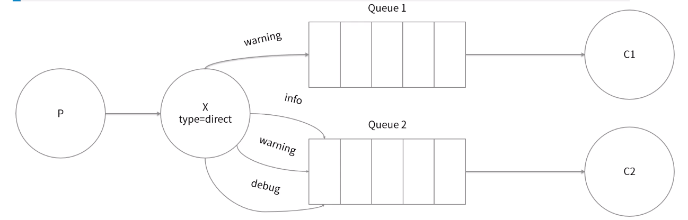
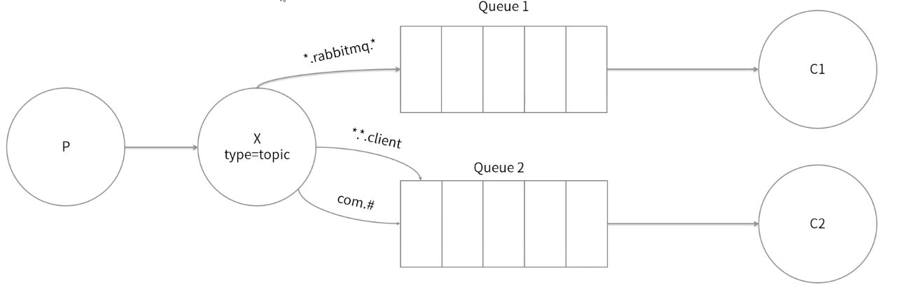
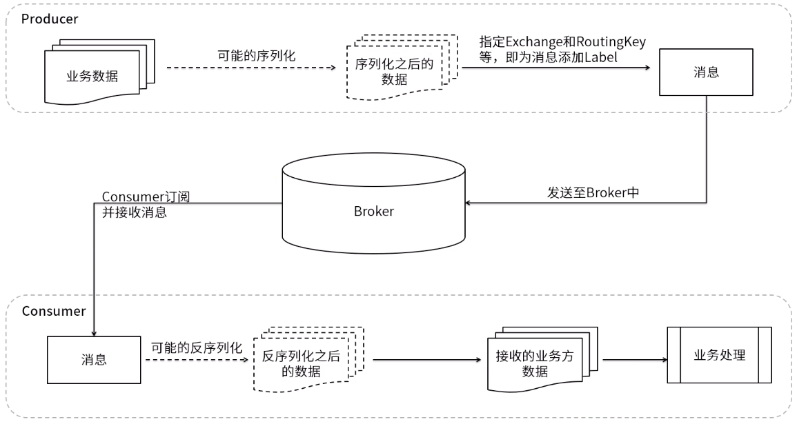
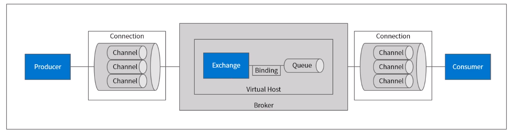

[TOC]

## RabbitMQ

是一个开源的 AMQP 实现, 使用 Erlang 编写.

## 安装

[rabbitmq 单机到集群完整搭建](rabbitmq单机到集群完整搭建.md)

## 基本使用

MQ 具体的示例代码可以参考: [MQ 的示例代码](/资料/subject-2-mq-master)

## AMQP 协议

**AMQP 结构**

**AMQP 消费者流转过程**

**AMQP 消费者流转过程**

## RabbitMQ 的核心概念

**RabbitMQ 整体架构**

### Producer 生产者

投递消息的一方, 生产者创造消息, 然后投发布到 RabbitMQ 中.  
一般包含两个部分:

-   消息体(payload): 在实际应用中, 消息体一般是一个带有业务逻辑的数据结构, 比如一个 json 字符串. 当然可以进一步对这个消息体进行序列化操作
-   附加信息: 来表述这条信息, 如目标交互机的名称, 路由键和一些自定义属性等等

**Broker 消息中间件的服务节点**

对于 RabbitMQ 来说, 一个 Broker 就可以简单的看做一个 RabbitMQ 的一个服务节点, 或者 RabbitMQ 服务实例, 也可以看做一台 RabbitMQ 服务器

**Virtual Host 虚拟主机**

表示一批交互器, 消息队列和相关对象.  
共享主机是共享相同的身份认证和加密环境的独立服务器域 (可以理解为一个 MySQL 服务中的多个 database)  
每个 Virtual Host 本质上就是一个 mini 版的 RabbitMQ 服务器, 用友自己的队列, 交换器, 绑定和权限机制.  
vhost 是 AMQP 概念的基础, 必须在连接时指定, **RabbitMQ 默认的 vhost 是 /**

**Channel 频道或信道**

是建立在 Connection 连接之上的一种轻量级连接.  
大部分操作都是在 Channel 这个接口中完成的, 包括定义队列声明 queueDeclare, 交互器声明 exchangeDeclare, 队列的绑定 queueBind, 发布消息 basicPublish, 消费消息 basicConsume 等.  
如果把 Connection 比作一段光纤电缆的话, 那么 Channel 就是电缆中的一根光纤. 一个 Connection 可以创建任意数量的 Channel

**RoutingKey 路由键**

生产者在将消息发给交互器时, 通常会指定一个 RoutingKey 来指定这个消息的路由规则  
**RoutingKey 需要与交互器类和绑定键(BindingKey)联合使用.** 在交互器类型和 BindingKey 固定的情况下, 生产者可以在发送消息给交互器时, 通过 RoutingKey 来觉得消息的流向

**Exchange 交互器**

生产者将消息发送到 Exchange(交换器, 通常也可以用 **"X"** 来表述), 由交换器把消息路由到一个或多个队列中. 如果路由不到, 或返回给生产者, 或直接丢弃

**Queue 队列**

RabbitMQ 的内部对象, 用于存储消息

**Binding 绑定**

RabbitMQ 通过绑定将交换器和队列关联起来, 在绑定的时候一般会指定一个绑定键(BindingKey), 这样 RabbitMQ 就知道如何将消息路由到队列了

**Exchange 的类型**

常用的 Exchange 类型有: fanout, direct, topic, headers

-   fanout: 扇形交换器, 把发送到交换器的消息路由到所有与该交换器绑定的队列中
    

-   direct: 直接交换机, 把消息路由到 BindingKey 和 RoutingKey 完全匹配的队列中
    

-   topic: 主题交换器, 与 direct 类似, 但是可以通过通配符进行模糊匹配(\* 代表一个单词, # 代表任意个单词 如 com.order.get 就可以 表示为 \*.order.\*, 也可以表示为 com.# )
    

-   headers: 头交换器, 不依赖于 RoutingKey 和 BindingKey, 认识根据发送的消息内容中 headers 属性来匹配, headers 的性能很差,而且也不实用

### Consumer 消费者

接收消息的一方. 消费者连接到 RabbitMQ 服务器, 并订阅队列  
消费者消费一条消息时, 值消费消息的消息体(payload), 在路由的过程中, 消息的标签会被丢弃, 存入到队列的消息只有消息体, 消费者也只会消费到消息体, 也就不知道消息的生产者是谁, 也不需要知道

## 总结

**整体运转流程**

生产者发送消息的过程:

1. 生产者连接到 RabbitMQ Broker, 建立一个连接(Connection), 开启一个信道(Channel)
2. 生产者声明一个交换器, 并设置相关属性, 如交换器类型, 是否持久化等
3. 生产者声明一个队列并设置相关属性, 比如是否排他, 是否持久化, 是否自动删除等
4. 生产者通过 RoutingKey 把交换器和队列绑定起来
5. 生产者发送消息到 RabbitMQ Broker, 其中包括路由键,交换器等消息
6. 相应的交换器根据接收到的路由键查找相匹配的队列
7. 如果找到, 就将发送过来的消息存入相应的队列中
8. 如果没找到, 则根据生产者配置的属性来选择丢弃或者退回给生产者
9. 关闭信道, 关闭连接

消费者接收消息过程:

1. 生产者连接到 RabbitMQ Broker, 建立一个连接(Connection), 开启一个信道(Channel)
2. 消费者向 RabbitMQ Broker 请求消费相应队列中的消息, 可能会设置相应的回调函数, 以及做一些准备工作
3. 等待 RabbitMQ Broker 回应并投递相应队列中的消息, 消费者接收消息
4. 消费者确认(ack)接收到的消息
5. RabbitMQ 从队列中删除相应以被确认的消息
6. 关闭信道, 关闭连接

---

[中间件](../README.md)  
[主页](../../../../../)
