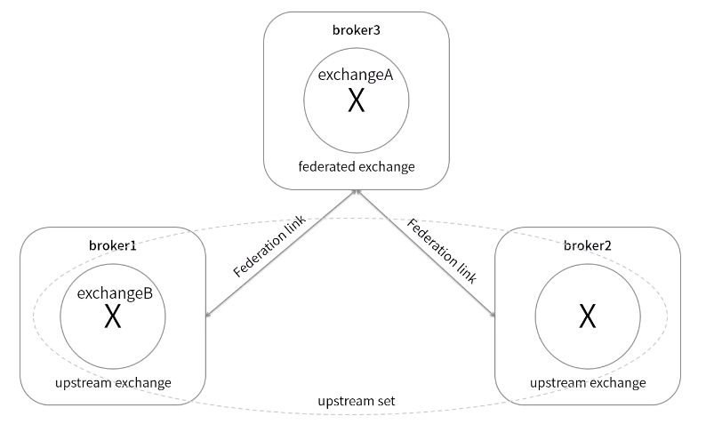
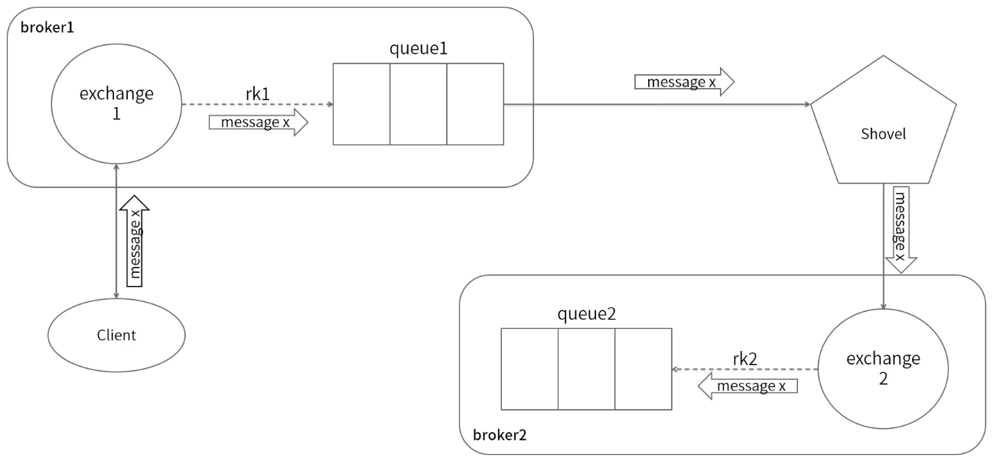
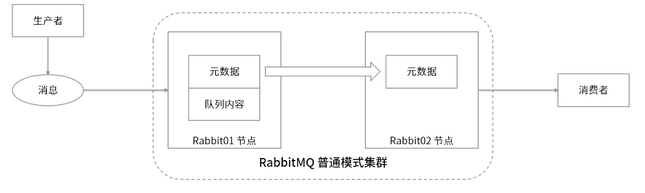
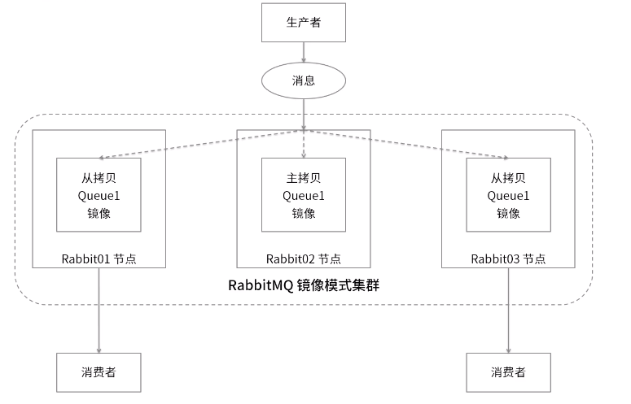

[TOC]

# **RabbitMQ 安装和使用**

## **一、安装依赖环境**

1. 在 http://www.rabbitmq.com/which-erlang.html 页面查看安装 rabbitmq 需要安装 erlang 对应的版本

2. 在 https://github.com/rabbitmq/erlang-rpm/releases 页面找到需要下载的 erlang 版本，`erlang-*.centos.x86_64.rpm`就是 centos 版本的。

3. 复制下载地址后，使用 wget 命令下载

    ```sh
    wget -P /home/download https://github.com/rabbitmq/erlang-rpm/releases/download/v21.2.3/erlang-21.2.3-1.el7.centos.x86_64.rpm
    ```

4. 安装 Erlang

    ```sh
    sudo rpm -Uvh /home/download/erlang-21.2.3-1.el7.centos.x86_64.rpm
    ```

5. 安装 socat
    ```sh
    sudo yum install -y socat
    ```

## **二、安装 RabbitMQ**

1. 在[官方下载页面](http://www.rabbitmq.com/download.html)找到 CentOS7 版本的下载链接，下载 rpm 安装包

    ```sh
    wget -P /home/download https://github.com/rabbitmq/rabbitmq-server/releases/download/v3.7.9/rabbitmq-server-3.7.9-1.el7.noarch.rpm
    ```

    **`提示：可以在`https://github.com/rabbitmq/rabbitmq-server/tags`下载历史版本`**

2. 安装 RabbitMQ
    ```sh
    sudo rpm -Uvh /home/download/rabbitmq-server-3.7.9-1.el7.noarch.rpm
    ```

## **三、启动和关闭**

-   启动服务

    ```sh
    sudo systemctl start rabbitmq-server
    ```

-   查看状态

    ```sh
    sudo systemctl status rabbitmq-server
    ```

-   停止服务

    ```sh
    sudo systemctl stop rabbitmq-server
    ```

-   设置开机启动
    ```sh
    sudo systemctl enable rabbitmq-server
    ```

配置文件:

RabbitMQ 的有一套默认的配置文件, 能够满足日常的开发, 如果需要更改配置, 需要自己创建一个配置文件, 具体可以参考 https://github.com/rabbitmq/rabbitmq-server

配置文件示例: https://github.com/rabbitmq/rabbitmq-server/blob/master/docs/rabbitmq.conf.example

配置项说明: https://www.rabbitmq.com/configure.html

## **四、开启 Web 管理插件**

1. 开启插件

    ```sh
    rabbitmq-plugins enable rabbitmq_management
    ```

    **`说明：rabbitmq有一个默认的guest用户(密码也是guest)，但只能通过localhost访问，所以需要添加一个能够远程访问的用户。`**

2. 添加用户

    ```sh
    rabbitmqctl add_user admin admin
    ```

3. 为用户分配操作权限

    ```sh
    rabbitmqctl set_user_tags admin administrator
    ```

4. 为用户分配资源权限

    ```sh
    rabbitmqctl set_permissions -p / admin ".*" ".*" ".*"
    ```

    RabbitMQ 的角色分类: none, management, policymaker, monitoring, administrator

    - none: 不能访问 management plugin
    - management: 用户可以通过 AMQP 做的任何事情外加:
        - 列出自己可以通过 AMQP 登录入的 virtual hosts
        - 查看自己的 virtual hosts 中的 queues, exchange 和 bindings
        - 查看和关闭自己的 channels 和 connections
        - 查看有关自己的 virtual hosts 中"全局"统计信息, 包括其他用户在这些 virtual hosts 中的活动
    - policymaker: 可以做 management 所有事外加 查看,创建,删除自己 virtual hosts 所属的 policies 和 parameters
    - monitoring: 可以做 management 的所有事外加:
        - 列出所有的 virtual hosts, 包括不能登录的 virtual hosts
        - 查看其他用户的 channels 和 connections
        - 查看节点级别的数据, 如 clustering 和 memory 使用情况
        - 查看真正关于所有 virtual hosts 的全局统计信息
    - administrator: 最大的角色, 可以 management 和 policymaker 的所有事外加:
        - 创建和删除 virtual hosts
        - 查看, 创建和删除 users
        - 查看, 创建和删除 permissions
        - 关闭其他用户的 connections

## **五、防火墙添加端口**

-   RabbitMQ 服务启动后，还不能进行外部通信，需要将端口添加都防火墙

1. 添加端口

    端口说明:  
    4369: Erlang 节点映射使用  
    5672: AMQP 客户端端口, 没有使用 SSL  
    5671: AMQP 客户端端口, 使用 SSL  
    25672: RabbitMQ 提供的 CLI 工具, 配合 4396 使用  
    15672: 只用管理员才能使用, 用于管理 RabbitMQ, 需要启用 management 插件  
    61613, 61614: 当 STOPM 插件启用, 根据是否使用 TLS 选择  
    1883, 8883: MQTT 插件打开, 根据是否使用 TLS 选择  
    15674: WebSocket 的 STOPM 端口, 当启用 Web STOMP 插件  
    15675: WebSocket 的 MQTT 端口, 当启用 Web MQTT 插件

    ```sh
    sudo firewall-cmd --zone=public --add-port=4369/tcp --permanent
    sudo firewall-cmd --zone=public --add-port=5672/tcp --permanent
    sudo firewall-cmd --zone=public --add-port=25672/tcp --permanent
    sudo firewall-cmd --zone=public --add-port=15672/tcp --permanent
    ```

2. 重启防火墙
    ```sh
    sudo firewall-cmd --reload
    ```

---

# **多机多节点集群部署**

## **一、 环境准备**

-   准备三台安装好 RabbitMQ 的机器，安装方法见 [安装步骤](#rabbitmq-安装和使用)

    -   10.10.1.41
    -   10.10.1.42
    -   10.10.1.43

    **`提示：如果使用虚拟机，可以在一台VM上安装好RabbitMQ后，创建快照，从快照创建链接克隆，会节省很多磁盘空间`**

## **二、修改配置文件**

1. 修改`10.10.1.41`机器上的`/etc/hosts`文件

    ```sh
    sudo vim /etc/hosts
    ```

2. 添加 IP 和节点名
    ```sh
    10.10.1.41 node1
    10.10.1.42 node2
    10.10.1.43 node3
    ```
3. 修改对应主机的 hostname

    ```sh
    hostname node1
    hostname node2
    hostname node3
    ```

4. 将`10.10.1.41`上的 hosts 文件复制到另外两台机器上
    ```sh
    sudo scp /etc/hosts root@node2:/etc/
    sudo scp /etc/hosts root@node3:/etc/
    ```
    **`说明：命令中的root是目标机器的用户名，命令执行后，可能会提示需要输入密码，输入对应用户的密码就行了`**
5. 将`10.10.1.41`上的`/var/lib/rabbitmq/.erlang.cookie`文件复制到另外两台机器上, Erlang 要求必须要有一样的 cookie
    ```sh
    scp /var/lib/rabbitmq/.erlang.cookie root@node2:/var/lib/rabbitmq/
    scp /var/lib/rabbitmq/.erlang.cookie root@node3:/var/lib/rabbitmq/
    ```
    **`提示：如果是通过克隆的VM，可以省略这一步`**

## **三、防火墙添加端口**

-   给每台机器的防火墙添加端口

1. 添加端口

    ```sh
    sudo firewall-cmd --zone=public --add-port=4369/tcp --permanent
    sudo firewall-cmd --zone=public --add-port=5672/tcp --permanent
    sudo firewall-cmd --zone=public --add-port=25672/tcp --permanent
    sudo firewall-cmd --zone=public --add-port=15672/tcp --permanent
    ```

2. 重启防火墙
    ```sh
    sudo firewall-cmd --reload
    ```

### **四、启动 RabbitMQ**

1. 启动每台机器的 RabbitMQ

    ```sh
    sudo systemctl start rabbitmq-server
    ```

    或者

    ```sh
    rabbitmq-server -detached
    ```

2. 将`10.10.1.42`加入到集群

    ```sh
    # 停止RabbitMQ 应用
    rabbitmqctl stop_app
    # 重置RabbitMQ 设置
    rabbitmqctl reset
    # 加入到集群
    rabbitmqctl join_cluster rabbit@node1 --ram
    # 启动RabbitMQ 应用
    rabbitmqctl start_app
    ```

3. 查看集群状态，看到`running_nodes,[rabbit@node1,rabbit@node2]`表示节点启动成功

    ```sh
    rabbitmqctl cluster_status
    ```

    **`提示：在管理界面可以更直观的看到集群信息`**

4. 将`10.10.1.43`加入到集群

    ```sh
    # 停止 RabbitMQ 应用
    rabbitmqctl stop_app
    # 重置 RabbitMQ 设置
    rabbitmqctl reset
    # 节点加入到集群
    rabbitmqctl join_cluster rabbit@node1 --ram
    # 启动 RabbitMQ 应用
    rabbitmqctl start_app
    ```

5. 重复地 3 步，查看集群状态

---

# **单机多节点部署**

## **一、环境准备**

-   准备一台已经安装好 RabbitMQ 的机器，安装方法见 [安装步骤](#rabbitmq-安装和使用)
    -   10.10.1.41

## **二、启动 RabbitMQ**

1. 在启动前，先修改 RabbitMQ 的默认节点名（非必要），在`/etc/rabbitmq/rabbitmq-env.conf`增加以下内容

    ```sh
    # RabbitMQ 默认节点名，默认是rabbit
    NODENAME=rabbit1
    ```

2. RabbitMQ 默认是使用服务的启动的，单机多节点时需要改为手动启动，先停止运行中的 RabbitMQ 服务

    ```sh
    sudo systemctl stop rabbitmq-server
    ```

3. 启动第一个节点

    ```sh
    rabbitmq-server -detached
    ```

4. 启动第二个节点

    ```sh
    RABBITMQ_NODE_PORT=5673 RABBITMQ_SERVER_START_ARGS="-rabbitmq_management listener [{port,15673}]" RABBITMQ_NODENAME=rabbit2 rabbitmq-server -detached
    ```

5. 启动第三个节点

    ```sh
    RABBITMQ_NODE_PORT=5674 RABBITMQ_SERVER_START_ARGS="-rabbitmq_management listener [{port,15674}]" RABBITMQ_NODENAME=rabbit3 rabbitmq-server -detached
    ```

6. 将 rabbit2 加入到集群

    ```sh
    # 停止 rabbit2 的应用
    rabbitmqctl -n rabbit2 stop_app
    # 重置 rabbit2 的设置
    rabbitmqctl -n rabbit2 reset
    # rabbit2 节点加入到 rabbit1的集群中
    rabbitmqctl -n rabbit2 join_cluster rabbit1 --ram
    # 启动 rabbit2 节点
    rabbitmqctl -n rabbit2 start_app
    ```

7. 将 rabbit3 加入到集群

    ```sh
    # 停止 rabbit3 的应用
    rabbitmqctl -n rabbit3 stop_app
    # 重置 rabbit3 的设置
    rabbitmqctl -n rabbit3 reset
    # rabbit3 节点加入到 rabbit1的集群中
    rabbitmqctl -n rabbit3 join_cluster rabbit1 --ram
    # 启动 rabbit3 节点
    rabbitmqctl -n rabbit3 start_app
    ```

8. 查看集群状态，看到`{running_nodes,[rabbit3@node1,rabbit2@node1,rabbit1@node1]}`说明节点已启动成功。
    ```sh
    rabbitmqctl cluster_status
    ```
    **`提示：在管理界面可以更直观的看到集群信息`**

## **三、防火墙添加端口**

-   需要将每个节点的端口都添加到防火墙

1. 添加端口

    ```sh
    sudo firewall-cmd --zone=public --add-port=4369/tcp --permanent
    sudo firewall-cmd --zone=public --add-port=5672/tcp --permanent
    sudo firewall-cmd --zone=public --add-port=25672/tcp --permanent
    sudo firewall-cmd --zone=public --add-port=15672/tcp --permanent
    sudo firewall-cmd --zone=public --add-port=5673/tcp --permanent
    sudo firewall-cmd --zone=public --add-port=25673/tcp --permanent
    sudo firewall-cmd --zone=public --add-port=15673/tcp --permanent
    sudo firewall-cmd --zone=public --add-port=5674/tcp --permanent
    sudo firewall-cmd --zone=public --add-port=25674/tcp --permanent
    sudo firewall-cmd --zone=public --add-port=15674/tcp --permanent
    ```

2. 重启防火墙
    ```sh
    sudo firewall-cmd --reload
    ```

---

# **镜像队列模式集群**

-   镜像队列属于 RabbitMQ 的高可用方案，见：https://www.rabbitmq.com/ha.html#mirroring-arguments
-   通过前面的步骤搭建的集群属于普通模式集群，是通过共享元数据实现集群
-   开启镜像队列模式需要在管理页面添加策略，添加方式：

    1. 进入管理页面 -> Admin -> Policies（在页面右侧）-> Add / update a policy
    2. 在表单中填入：

        ```
              name: ha-all
           Pattern: ^
          Apply to: Queues
          Priority: 0
        Definition: ha-mode = all
        ```

        **参数说明**

        name: 策略名称，如果使用已有的名称，保存后将会修改原来的信息

        Apply to：策略应用到什么对象上

        Pattern：策略应用到对象时，对象名称的匹配规则（正则表达式）

        Priority：优先级，数值越大，优先级越高，相同优先级取最后一个

        Definition：策略定义的类容，对于镜像队列的配置来说，只需要包含 3 个部分: `ha-mode` 、`ha-params` 和 `ha-sync-mode`。其中，`ha-sync-mode`是同步的方式，自动还是手动，默认是自动。`ha-mode` 和 `ha-params` 组合使用。组合方式如下：

    | ha-mode | ha-params | 说明                                                                                                                                                       |
    | :-----: | :-------: | :--------------------------------------------------------------------------------------------------------------------------------------------------------- |
    |   all   |  (empty)  | 队列镜像到集群类所有节点                                                                                                                                   |
    | exactly |   count   | 队列镜像到集群内指定数量的节点。如果集群内节点数少于此值，队列将会镜像到所有节点。如果大于此值，而且一个包含镜像的节点停止，则新的镜像不会在其它节点创建。 |
    |  nodes  | nodename  | 队列镜像到指定节点，指定的节点不在集群中不会报错。当队列申明时，如果指定的节点不在线，则队列会被创建在客户端所连接的节点上。                               |

-   镜像队列模式相比较普通模式，镜像模式会占用更多的带宽来进行同步，所以镜像队列的吞吐量会低于普通模式
-   但普通模式不能实现高可用，某个节点挂了后，这个节点上的消息将无法被消费，需要等待节点启动后才能被消费。

# **其他集群**

**Federation 集群**

Federation 插件设计目的是使 RabbitMQ 在不同的 Broker 之间进行信息传递而无需建立集群, 该功能在以下场景非常有用:

-   各个节点运行在不同版本的 Erlang 和 RabbitMQ 上
-   网络逻辑不稳定, 比如在广域网中



在不同 Broker 之间消息先发给 Federation, 然后由 Federation 进行转发

**Shovel 集群**

和 Federation 类似, 但是消息是 Shovel 主动从队列拉取然后转发.



# **集群总结**

总的来说 RabbitMQ 集群常用有两种形式: 普通集群和镜像集群

**普通集群**



基于元数据共享集群, 有元数据节点**单机故障**

元数据包括以下几个部分:

-   队列元数据: 队列的名称及属性
-   交换器: 交换器的名称及属性
-   绑定关系元数据: 交换器与队列或者交换器与交换器
-   vhost 元数据: 为 vhost 内部的队列,交换器和和绑定提供命名空间及安全数据之间的绑定关系

**镜像集群**



镜像集群是指普通集群的基础上, 通过 policy 实现. 没有元数据的单点故障问题

**Shovel/Federation 和 RabbitMQ 集群对比**

| Shovel/Federation                                                   | Cluster                                                                                                        |
| ------------------------------------------------------------------- | -------------------------------------------------------------------------------------------------------------- |
| 各个 Broker 之间逻辑分类                                            | 逻辑上是个 Broker 节点                                                                                         |
| 各个 Broker 之间可以运行不同版本的 Erlang 和 RabbitMQ               | 各个 Broker 之间必须是相同版本的 Erlang 和 RabbitMQ                                                            |
| 各个 Broker 之间可以在广域网中相连, 当然必须要授予适当的用户和权限  | 各个 Broker 之间必须在可信赖的局域网中连通, 通过 Erlang 内部节点传递信息, 但节点之间必须有相同的 Erlang cookie |
| 各个 Broker 之间可以任何拓扑逻辑部署连接可以是单向或者双向的        | 各个 Broker 之间都是双向连接其他节点                                                                           |
| 从 CAP 理论中选择了 AP, 即可用性和分区容错性                        | 从 CAP 中选择了 CA, 即一致性和可用性                                                                           |
| 一个 Broker 的交换器可以是 Federation/Shovel 生成的, 也可以是本地的 | 集群中所有的 Broker 交换器都是一样的, 要么全有要么全无                                                         |
| 客户端能看到它锁连接的 Broker 节点上的队列                          | 客户端连接到集群中的任何 Broker 节点都能看到所有的队列                                                         |

---

[中间件](../README.md)  
[主页](../../../../../)
