[TOC]

# RocketMQ

特点:

-   原生分布式
-   两种消息拉取
-   严格消息顺序
-   特有的分布式协调器
-   亿级消息堆积
-   组(Group)

本例中文档中具体代码请参考: [RockerMQ 入门代码](https://github.com/Mao-PC/Notes/tree/master/%E8%B5%84%E6%96%99/subject-2-mq-master/rocketmq-demo1/src/main/java/com/study/rocketmq)

## 环境搭建

```sh
# 获取RocketMQ
wget http://mirrors.tuna.tsinghua.edu.cn/apache/rocketmq/4.5.0/rocketmq-all-4.5.0-bin-release.zip

# 解压
unzip -d /usr rocketmq-all-4.5.0-bin-release.zip

mv /usr/rocketmq-all-4.5.0-bin-release/ /usr/rocketmq
```

RocketMQ 的 NameServer 默认占用 4G, Broker 占用 8G, 启动服务是一定要注意, 如果不修改启动参数, 很有可能出现问题

修改配置文件 `runserver.sh`, 根据自己的服务器大小修改 :

```sh
#===========================================================================================
# JVM Configuration
#===========================================================================================
JAVA_OPT="${JAVA_OPT} -server -Xms500m -Xmx500m -Xmn500m -XX:MetaspaceSize=128m -XX:MaxMetaspaceSize=320m"
```

修改 `runbroker.sh`:

```sh
#===========================================================================================
# JVM Configuration
#===========================================================================================
JAVA_OPT="${JAVA_OPT} -server -Xms500m -Xmx500m -Xmn500m"
```

停止和启动命令:

```sh
cd /usr/rocketmq
# 启动nameserver
nohub sh bin/mqnamesrv > logs/rocketmqlogs/namesrv.log 2>&1 &

#启动broker
nohub sh bin/mqbroker -n localhost:9876 > logs/rocketmqlogs/broker.log 2>&1 &

# 停止broker
bin/mqshutdown broker

# 停止nameserver
bin/mqshutdown namesrv
```

测试是否启动成功:

```sh
# 发送消息
export NAMESRV_ADDR=localhost:9876
bin/tools.sh org.apache.rocketmq.example.quickstart.Producer

# 接收消息
sh bin/tools.sh org.apache.rocketmq.example.quickstart.Consumer
```

如果需要可视化界面请参考: [rocketmq 可视化管理](rocketmq可视化管理.md)

生产者启动后，发送消息时会报以下错：
<font color="red">Exception in thread "main" org.apache.rocketmq.client.exception.MQClientException: No route info of this topic, TopicTest</font>

**原因：**  
使用 RocketMQ 进行发消息时，必须要指定 topic，对于 topic 的设置有一个开关 autoCreateTopicEnable，一般在开发测试环境中会使用默认设置 autoCreateTopicEnable = true，
但是这样就会导致 topic 的设置不容易规范管理，没有统一的审核等等，所以在正式环境中会在 Broker 启动时设置参数 autoCreateTopicEnable = false。

但是，目前的版本中，autoCreateTopicEnable 设置为 true 也不会生效

解决方法：
手动通过命令或管理界面创建主题
/usr/rocketmq/bin/mqadmin updateTopic -n '192.168.100.242:9876' -c DefaultCluster -t TopicTest

## RocketMQ 架构方案及角色详解

**架构方案**

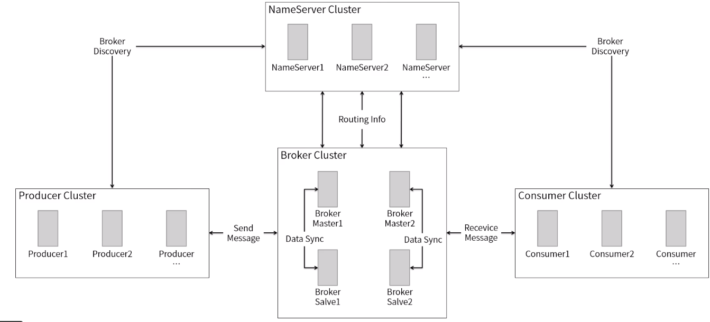

**角色:**

-   Producer: 消息生产者
-   Consumer: 消息消费者
-   Push Consumer: 封装消息拉取, 消费进程和内部
-   Pull Consumer: 主动拉取消息, 一旦拉取到消息, 应用的消费进程初始化
-   Producer Group: Producer 的集合名称, 这类 Producer 通常发送一类消息, 且发送逻辑一致
-   Consumer Group: Consumer 的集合名称, 这类 Consumer 通常消费一类消息, 且消费逻辑一致
-   Broker: 消息中转角色, 负责存储消息, 转发消息, 就是 RocketMQ Server
-   Topic: 消息的主题, 用于定义并在服务端配置, 消费者可以按照主题进行订阅, 也就是消息分类, 通常一个系统一个 Topic
-   Massage: 在生产者, 消费者, 服务器之间传递的消息, 一个 massage 必须属于一个 topic
-   Namesrv: 一个无状态的名称服务, 以集群部署, 每一个 broker 启动的时候都会想名称服务器注册, 主要是接收 broker 的注册, 接收客户端的路由请求并返回路由消息
-   Offset: 偏移量, 消费者拉取消息时, 需要知道上一次消费到了什么位置, 这一次从哪里开始
-   Partition: 分区, Topic 物理上的分区, 一个 Topic 可以分为多个分区, 每个分区是一个有序的队列. 分区中的每条消息都会给分配一个有序的 ID, 也就是偏移量
-   Tag: 对于消息进行过滤, 理解为 message 的标记,同一业务不同目的的 message 可以用相同的 topic 但是用不同的 tag 来区分
-   key: 消息的可以字段是来表示消息的唯一性, 方便查问题, 不是必须配置, 只是为了开发和运维可以放屁定位问题. 这个 key 可以是订单的 id

**NameServer Cluster**

提供轻量级服务发现和路由, 每个名称服务器记录完整的路由信息, 提供相应的读写服务, 并支持快速存储扩展.

**主要流程:**

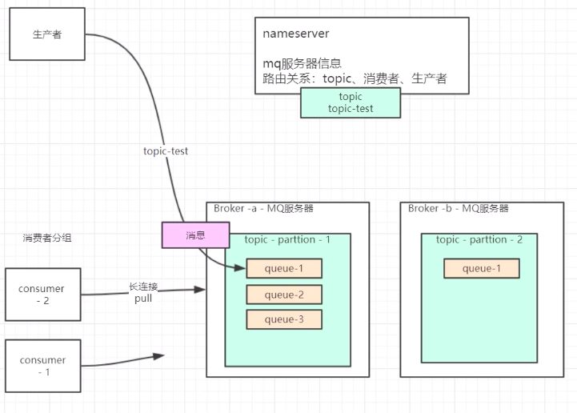

消息生产流程:

0. 每个 Broker 启动时, 都会注册到 NameSrv 中
1. Producer 生产消息会先去 Namesrv 获取到一个消息存放的 Broker, 然后将消息存放到这个 Broker 的 topic 中
1. message 事件存放到了 topic 的 queue 中,每一个 topic 会有很多歌 queue

消息消费流程:

1. 消费者连接到 NameSrv, NameSrv 会为 Consumer 分配一个 Broker, 并建立长链接
2. 这里需要注意, 一个 queue 只会对应有一个 Consumer 区消费, 所以, 如果 Consumer 的数量比 queue 的数量多的话, 会造成资源浪费

**Broker 的高可用:**

1. 在消息存放到 Broker 时, 可以同步/异步写入到磁盘, 异步在 Broker 出现问题时(宕机), 可能会造成部分数据丢失, 如果不能接受这种情况, 可以选择同步写入

    - 同步: 在存放到 Broker 时就写入磁盘
    - 异步: 每隔一段时间, 将 Broker 的数据写入磁盘

2. 如果做了 Broker 集群, 主从 Broker 之间, 数据传递, 也会有同步/异步的区别
    - 同步: 在主 Broker 存放数据时, 需要等待从 Broker 数据存放完毕, 才认为这次数据存放成功

集群配置在 RocketMQ 中已经有了示例配置, 在`conf/`目录下, 分别有:

-   2m-2s-async: 2 主 2 从异步集群
-   2m-2s-sync: 2 主 2 从同步集群
-   2m-noslave: 2 主集群

> 请注意: Broker 集群中的所有 Master 是不做任何数据交互的, 每个 Master 都存放的不同分区. NameSrv 集群每个 NameSrv 也是不需要数据交互的, 每个 Broker 都需要向每个 NameSrv 注册信息, 所以每个 NameSrv 都数据相同

**2 主 2 从示例图, 及参数说明**

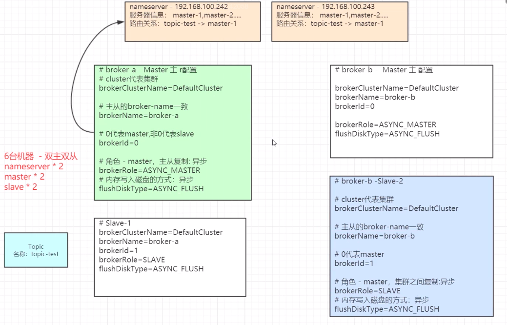

具体集群过程及参数说明请参考: [rocketmq-集群搭建](rocketmq-集群搭建.md)

## 有序信息

如果小明去去银行先存了 1000 元, 存完后才想起来要是全存了就没零花钱了, 然后又去了 200 出来. 如果这种情况, 在下图中, 分别以 M1 和 M2 表示存钱和取钱操作

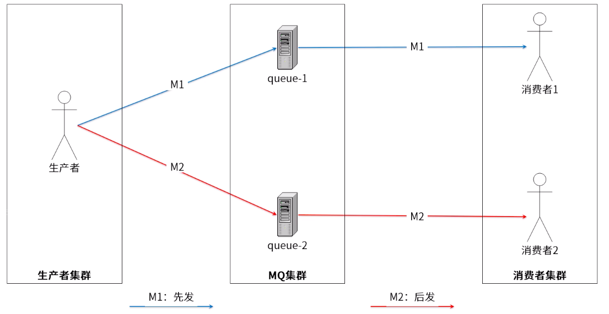

由于种种原因(信号或者 处理逻辑问题等等), 很有可能, 小明在收到银行短信是, 先收到了取钱短信, 后收到了存钱短信, 这样就会给人一种好像是先取钱后存钱的感觉, 所以可以改为下图中的消息处理, 保证消息发送的有序性

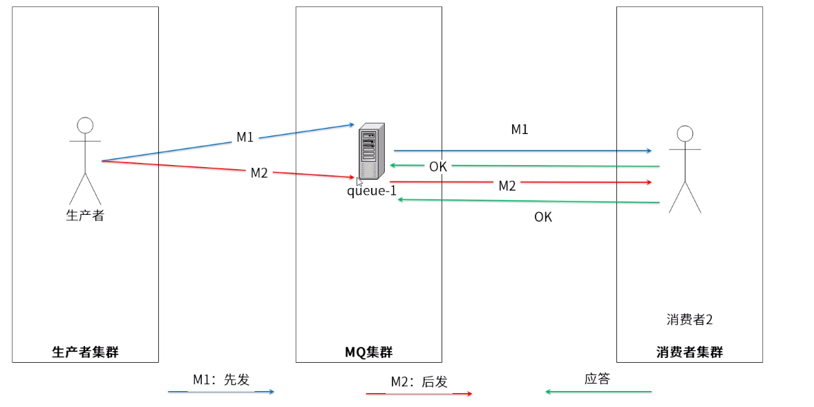

**有序消息:** 又叫顺序消息(FIFO 消息), 指消费顺序和生产顺序相同, 在有些业务逻辑下必须保证消息顺序. 如订单生成, 付款, 发货, 这个消息就必须按照顺序处理才行.

有序消息分为全局顺序和分区(queue)顺序

-   全局顺序: 一个 Topic 内所有的消息都发送到同一个 queue 中, 按照先进先出的顺序进行发布和消费

    

    适用场景: 性能要求不高, 所有的消息严格按照 FIFO 进行消息发布和消费的场景

-   分区顺序: 指定一个 Topic, 所有的消息按照 sharding key 进行区块(queue)分区, 对于同一个 queue 内的消息,严格按照 FIFO 进行消息发布和消费.
    sharding key 是顺序消息用来区分不同分区关键字段, 和普通消息的 key 完全是两个不同的概念
    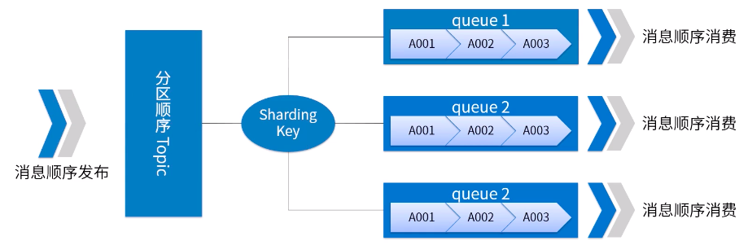

    适用场景: 性能要求高, 根据消息中的 sharding key 去决定消息发送到哪一个 queue

消息类型的对比:

| 顺序类型                           | 支持事务 | 支持定时消息 | 性能 |
| ---------------------------------- | -------- | ------------ | ---- |
| 无序消息(普通,事务, 定时/延时消息) | 是       | 是           | 最高 |
| 分区顺序消息                       | 否       | 否           | 高   |
| 全局顺序消息                       | 否       | 否           | 一般 |

消息发送方式的对比:

| 顺序类型                           | 支持可靠同步发送 | 支持可靠异步发送 | 支持 OneWay 发送 |
| ---------------------------------- | ---------------- | ---------------- | ---------------- |
| 无序消息(普通,事务, 定时/延时消息) | 是               | 是               | 是               |
| 分区顺序消息                       | 是               | 否               | 否               |
| 全局顺序消息                       | 是               | 否               | 否               |

**RocketMQ 如何保证消息顺序?**

三个方面:

-   消息被发送时保证顺序
-   消息被存储时保证顺序和发送时一致
-   消息被消费是保证顺序和存储时一致

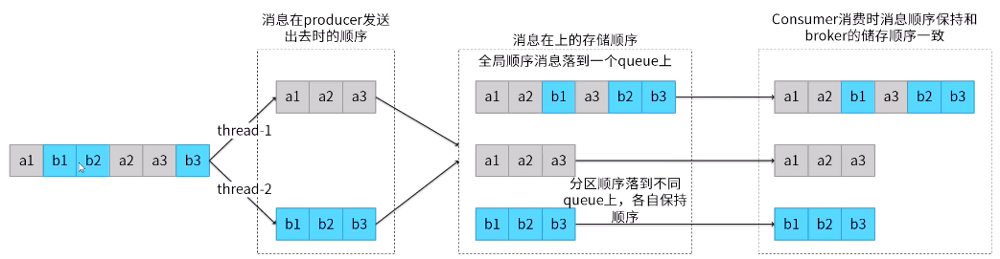

**RocketMQ 顺序消息的实现**

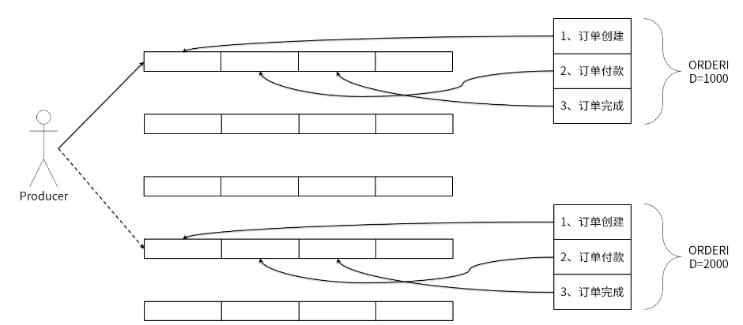

RocketMQ 消费端有两种类型: `MQPullConsumer` 和 `MQPushConsumer`. 底层本质都是通过 Pull 机制去实现的, pushConsumer 是一种 API 封装

-   `MQPullConsumer` 由用户线程控制, 主动从服务端获取消息,每次获取到的是一个 MessageQueue 中的消息. PullResult 中的 List<MessageExt> msgFoundList 自然和存储顺序一致, 用户需要在拿到这批消息后自己保证消费的顺序

-   `MQPushConsumer` 由用户注册的 MessageListener 来消费消息, 在客户端需要保证调用 MessageListener 时消息的顺序性

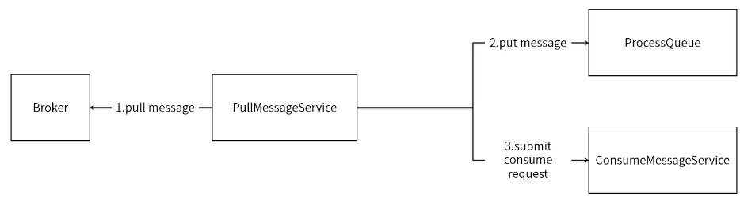

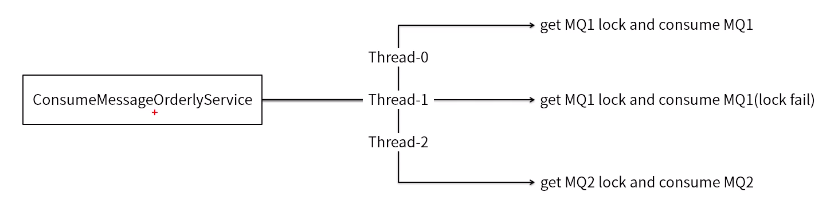

**有序消息的缺陷**

发送顺序消息无法利用集群的 Failover 特性, 因此不能更换 MessageQueue 进行重试. 因为发送的路由策略导致热点问题, 可能某些 MessageQueue 的数据量特别大

-   消费并行读依赖于 queue 的数量
-   消费失败时无法跳过

具体的有序消息使用官网教程: http://rocketmq.apache.org/docs/order-example/

## 订阅机制

**发布订阅** 即观察者模式, 定义对象间的一种一对多依赖关系, 当一个对象的状态发生改变时, 所有依赖它的对象都将得到通知

RocketMQ 的消息订阅分为两种模式:

-   **Push 模式(MQPushConsumer)**: Broker 主动向消费者推送消息(出非必要, 建议使用 Push 模式)
-   **Pull 模式(MQPullConsumer)**: 消费者在需要消息时, 主动去 Broker 拉取消息

但是, 在 RocketMQ 中, 具体实现时, Push 和 Pull 都是采用消费端主动去 Broker 拉取消息

**发布订阅模式实现原理:**

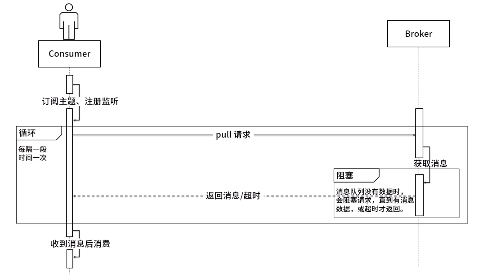

Pull 模式中取消息过程需要用户自己写:

首先通过打算消费的 Topic 拿到 MessageQueue 集合, 遍历 MessageQueue 集合. 然后针对每个 MessageQueue 批量去消息, 一次去完后记录队列下一次要取的 offset, 直到取完了在换另一个 MessageQueue

使用订阅模式官网示例: http://rocketmq.apache.org/docs/broadcast-example/

## 定时消息

**定时消息** 消息发到 Broker 之后, 不能立刻被 Consumer 消费, 要到特定的时间点或者等待特定时间后才能被消费

如果要支持任意的时间精度, 在 Broker 层面, 必须要做消息排序, 如果再涉及到持久化, 那么消息排序要不可避免的产生巨大的性能开销

RocketMQ 支持定时消息, 但是不支持任意时间精度, 支持特定的 level, 例如定时 1s, 10s, 5m 等

具体的延时级别可以用户自定义, 如下图中就定义了 n 中延迟级别


定时消息逻辑实现: Broker 在存储消息时, 在 topic 中 queue 会按照不同的延时等级去存储到不同的延时 queue 中

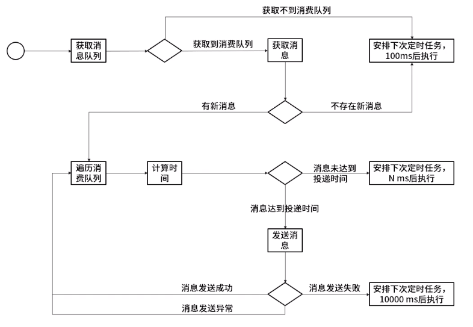

定时消息官网示例: http://rocketmq.apache.org/docs/schedule-example/

## 批量消息

使用场景: 在很多调优的时候, 比如数据库批量处理,有些请求进行合并发送等都是类似批量的实现

RocketMQ 批量发送也是为了追求性能, 特别是在消息数据量很大的时候, 批量效果就特别的明显

**批量消息的限制:**

-   同一批次的消息应该具有相同主题, 相同的消息配置
-   不支持延时消息
-   建议一个批量消息大小最好不超过 1 M

批处理官网示例: http://rocketmq.apache.org/docs/batch-example/

## 事务消息

RocketMQ 的事务消息是指 Producer 消息发送事件和本地事务事件, 同时成功或同时失败

事务消息设计思路:

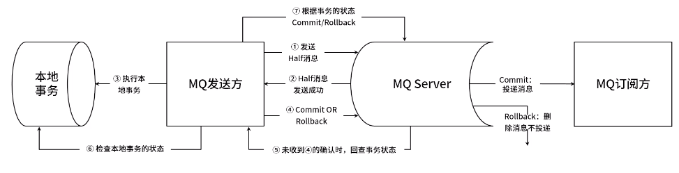

**事务消息的使用约束:**

-   不支持定时和批量
-   为了避免一个消息被多次重复检查, 导致半数队列消息堆积. RocketMQ 限制单个消息的默认查询次数为 15 次, 通过修改 Broker 配置文件中`transactionCheckMax`参数进行调整
-   特定时间段后才检查事务, 通过修改 Broker 配置文件中`transactionTimeout`参数或者用户配置 CHECK_IMMUNITY_TIME_IN_SECONDS 进行调整
-   一个事务消息有可能多次检查或多次消费
-   提交过的消息重新放到目标主题有可能会失败
-   事务消息的生产者 ID 不能与其他类型消息生产者 ID 共享

**事务消息的状态:**

1. `TransactionStatus.CommitTransaction`：提交事务，允许消费者消费此消息。
2. `TransactionStatus.RollbackTransaction`：回滚事务，该消息将被删除而不允许被消费。
3. `TransactionStatus.Unknown`：中间状态，表示需要 MQ 检查以确定状态。

事务消息官网示例: http://rocketmq.apache.org/docs/transaction-example/

## RocketMQ 高性能最佳实践

**Producer 最佳实践**

1. 一个应用尽可能用一个 Topic, 消息子类型用 tags 来标识, tags 可以由应用自由设置

    只有设置了 tags, 消费方在订阅消息时,才可以利用 tags 在 Broker 上做消息过滤

    ```java
    message.setTags("TagA");
    ```

2. 每个消息在业务层面的唯一标识码, 要设置到 keys 字段, 方便将来定位消息丢失问题

    服务器会为每个消息创建索引(hash 索引), 应用可以通过 topic, key 来查询这条消息内容, 已经消息被谁消费. 由于是 hash 索引, 请务必保证可以尽可能唯一, 这样可以避免潜在的 hash 冲突

    ```java
    // 订单id
    String orderId = "32487s34p";
    message.setKeys(orderId);
    ```

3. 如果有可靠性需求, 消息发送成功或失败, 要打印消息日志(sendresult 和 key 信息)
4. 如果相同性质的消息量大, 使用批量消息可以提升性能
5. 建议消息大小不超过 512 KB
6. send(msg)会阻塞, 如果有性能要求, 可以使用异步方式: send(msg, callback)
7. 如果在一个 JVM 中, 有多个生产者进行大数据处理, 建议:
    - 少数生产者使用异步发送方式(3~5 个)
    - 通过 setInstanceName 方法, 给每个生产者设置一个实例名
8. send 消息方法, 只有不抛异常, 就代表发送成功. 但是发送成功会有多个状态, 在 setResult 里定义:

    - SEND_OK: 消息发送成功
    - FLUSH_DISK_TIMEOUT: 消息发送成功, 但是服务器刷盘超时, 消息已经进入服务器队列, 此时服务器宕机, 机消息会丢失
    - FLUSH_SLAVE_TIMEOUT: 消息发送成功, 但是服务器同步到 Slave 时超时, 消息已经进入服务器队列, 此时服务器宕机, 机消息会丢失
    - SLAVE_NOT_AVAILABLE: 消息发送成功, 但此时 slave 不可用, 消息已经进入服务器队列, 此时服务器宕机, 机消息会丢失

    如果是 `FLUSH_SLAVE_TIMEOUT` 或者 `FLUSH_DISK_TIMEOUT` 并且 Broker 正好关闭, 此时可以丢弃这条消息或者重发. 但建议最好重发, 由消费端去重.

    Producer 向 Broker 发送请求会等待响应, 但如果达到最大的等待时间而未得到响应, 则客户端将抛出 RemotingTimeoutException. **默认等待时间是 3s**, 如果使用 send(msg, timeout)就可以自己设定超时时间, 超时时间不能设置太小, 因为 Broker 需要一定时间来刷新磁盘或与 Slave 同步. 如果该值超过 syncFlushTimeout, 则该值可能影响不大, 因为 Broker 可能会在超时之前 FLUSH_SLAVE_TIMEOUT 或 FLUSH_SLAVE_TIMEOUT 的响应

9. 对于消息不可丢失的应用, 务必要有消息重发机制

    Producer 的 send 方法本身支持内部重试:

    - 至多重试 3 次
    - 如果发送失败, 则轮转到下一个 Broker
    - 这个方法的总耗时不超过 sendMsgTimeout 设置的值, 默认 10s. 所以如果本身向 Broker 发送消息产生超时异常, 就不会再重试

    以上策略仍不能保证消息一定发送成功, 为保证消息一定发送成功, 建议将消息存储到 DB, 由后台线程定时重试, 保证消息一定到达 Broker

**Consumer 的最佳实践**

1. **消费者组合订阅**
   不同的消费群体可以独立的消费同样的主题, 并且每个消费者都有自己的消费偏移量(offset)  
   确保同一组中的每个消费者订阅相同的主题

2. **MessageListener**

    - **顺序(orderly)**
      消费者将锁定每个 MessageQueue, 以确保每个消息都被按一个顺序使用. 这将导致性能损失  
       如果关心消息的顺序时, 它就很有用了. 不建议抛异常, 可以返回 ConsumerOrderlyStatus.SUSPEND_CURRENT_QUEUE_A_MOMENT 代替

    - **消费状况**:
      对于 MessageListenerConcurrently, 可以返回 RECONSUME_LATER 告诉消费者, 当前不能消费它但是希望以后重新消费. 然后可以继续使用其他信息. 对于 MessageListenerOrderly, 如果关心顺序, 可以返回 SUSPEND_CURRENT_QUEUE_A_MOMENT 告诉消费者等待片刻

    - **阻塞(blocking)**
      不建议阻塞 Listener, 因为它会阻塞线程池, 最终可能会停止消费程序

    - **线程数**
      消费者使用一个 ThreadPoolExecutor 来处理内部消费, 因此可以通过设置 setConsumerThreadMin 或者 setConsumerThreadMax 来更改它

    - **从何处开始消费**

        - 当建立一个 Consumer Group 时, 需要决定是否需要消费 Broker 中已经存在的历史消息
        - CONSUME_FROM_LAST_OFFSET 将忽略历史消息并消费此后生成的任何内容
        - CONSUME_FROM_FIRST_OFFSET 将消耗 Broker 中存的所有消息, 还可以使用 CONSUME_FROM_TIMESTAMP 来消费指定时间戳之后生成消息

    - **重复**
      RocketMQ 无法避免消息重复, 如果业务对消息重复消费非常敏感, 务必在业务层面去重:
        - 通过记录消息唯一键进行去重
        - 使用业务层面的状态机制去重

**NameServer 的最佳实践**

在 Apache RocketMQ 中, NameServer 用于协调分布式系统的每个组件, 主要通过管理主题路由信息来实现协调.

管理由两部分组成:

-   Brokers 定期更新保存在每个名称服务器中的元数据
-   名称服务器是为客户端提供最新的路由信息服务的, 包括生产者, 消费者和命令行客户端

因此, 在启动 brokers 和 clients 之前, 需要告诉他们如何给他们提供的一个名称服务器地址列表来访问名称服务器. 在 Apache RocketMQ 中, 有 4 中方式完成:

1.  使用程序方式:

    -   对于 brokers,我们可以在 broker 的配置文件中指定:

        ```sh
        namesrvAddr=name-server-ip1:port;name-server-ip2:port
        ```

    -   对于生产者和消费者, 可以通过名称服务器

        ```java
        DefualtMQProducer producer = new DefualtMQProducer("please_rename-unique_group_name");
        producer.setNamesrvAddr("name-server-ip1:port;name-server-ip2:port);

        DefualtMQPushConsumer consumer = new DefualtMQPushConsumer("please_rename-unique_group_name");
        consumer.setNamesrvAddr("name-server-ip1:port;name-server-ip2:port);
        ```

    -   如果从 shell 中使用管理命令行

        ```sh
        sh mqadmin command-name -n name-server-ip1:port;name-server-ip2:port -X OTHER-OPTION
        ```

2.  通过 Java 参数 `rocketmq.namesrv.addr` , 在启动之前指定
3.  可以设置 NAMESRV_ADDR 环境变量, 如果设置了, Broker 和 clients 将检查并使用其值
4.  HTTP 端点(HTTP Endpoint):
    如果么有使用前面提到的方法, Apache RocketMQ 会每 2s 发送一次 Http 请求以获取和更新 NameSrv 地址列表, 初始延时 10s

        默认情况下,访问的 HTTP 地址是:

        ```
        http://jmenv.tbsite.net:8080/rocketmq/nsaddr
        ```

        通过 Java 参数`rocketmq.namesrv.domain`,可以修改`jmenv.tbsite.net`
        通过 Java 参数`rocketmq.namesrv.domain.subgroup`,可以修改`nsaddr`

四种方式的优先级: 编程方式 > Java 参数 > 环境变量 > HTTP

**JVM 与 Linux 内核配置**

具体可以参考官方建议: http://rocketmq.apache.org/docs/system-config/

**Java 配置**

推荐使用 JDK1.8,使用服务器编译器和 8G 堆

设置系统的 Xmx 和 Xms, 防止防止 JVM 调整堆大小

```java
-server -Xms8g -Xmx8g -Xmn4g
```

如果不关心 Broker 的启动时间, 可以预先触摸 Java 堆, 以确保 JVM 初始化期间分配页是更好的选择

```java
-XX:+AlwaysPreTouch
```

禁用偏向锁可能会减少 JVM 暂停:

```java
-XX:-UseBiasedLocking
```

对于垃圾回收, 建议使用 G1

```java
-XX:+UseG1GC -XX:G1HeapRegionSize=16m -XX:G1ReservePercent=25 -XX:InitiatingHeapOccupancyPercent=30
```

这些 GC 选项看起来有些激进, 但是事实证明它在生产环境中性能有更好的表现

`-XX:MaxGCPauseMillis` 不要设置太小的值, 否则 JVM 将使用一个小的新生代, 这将导致非常频繁新生代的 GC

推荐使用滚动 GC 日志文件:

```java
-XX:+UseGCLogFileRotation -XX:NumberOfGCLogFiles=5 -XX:GCLogFileSize=30m
```

如果写入 GC 文件会增加代理延迟, 请将重定向 GC 日志文件考虑在内存文件系统中:

```java
-Xloggc:/dev/shm/mq_gc_%p.log
```

Linux 内核配置省略, 此部分以超出了 Java 开发人员范围, 如果有兴趣可以查询官方文档
