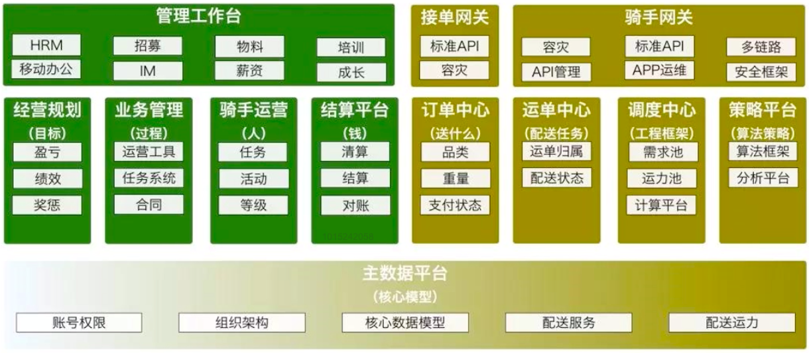
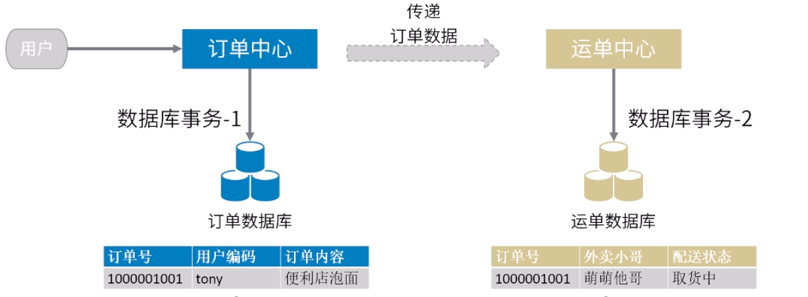
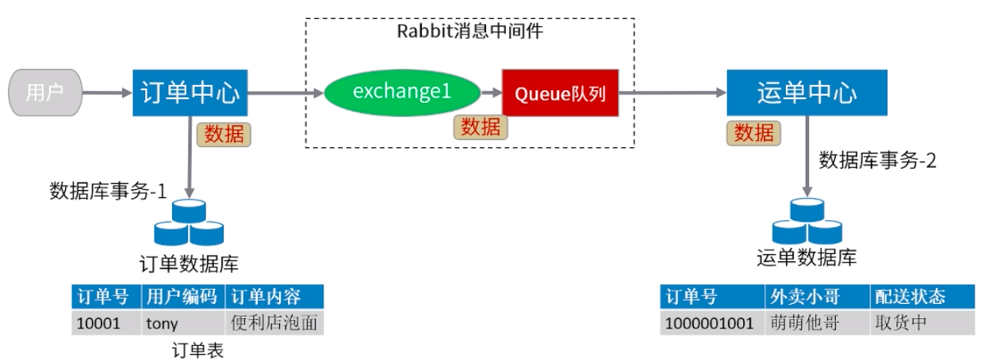
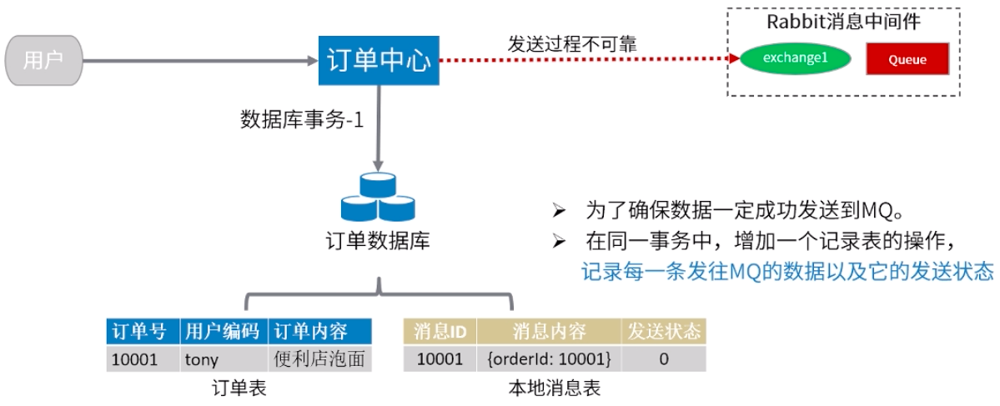
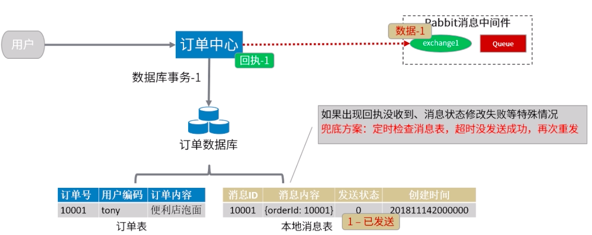
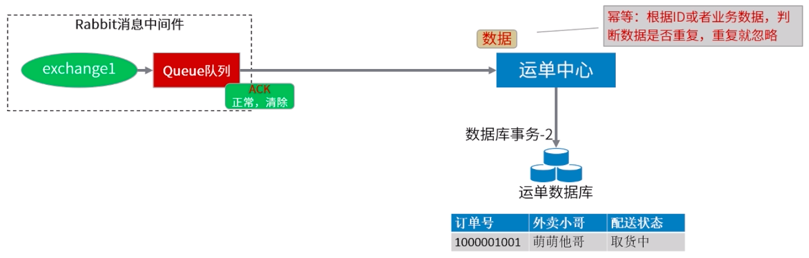
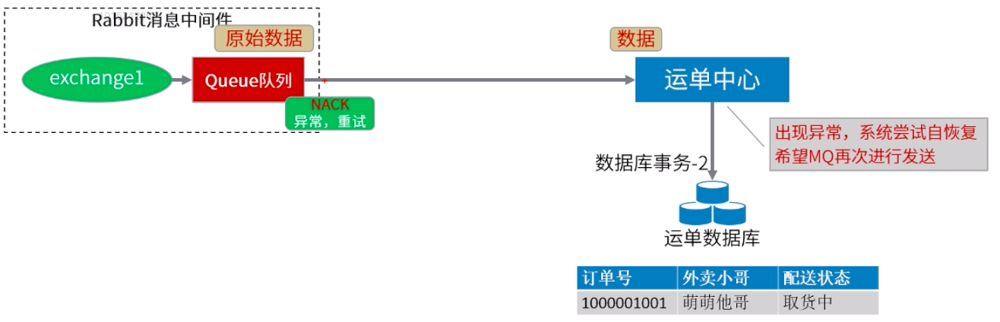
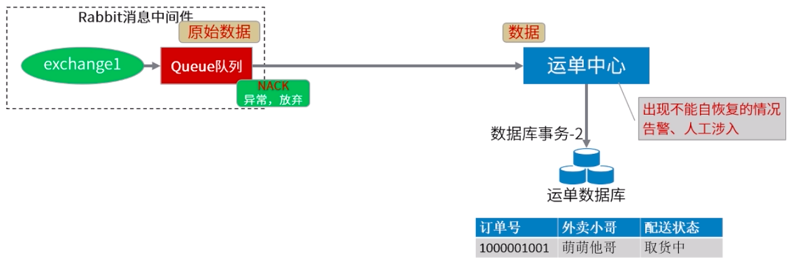

[TOC]

# 基于 MQ 的分布式事务解决方案

## 前言-分布式事务的几种解决方案

-   基于数据库 XA/JTA 协议方式: 需要数据库厂商支持
-   异步校对数据方式: 微信,支付宝等主动查询支付状态,对账单的形式
-   基于 MQ 方式: 异步场景, 通用性,扩展性强
-   TCC 编程式解决方案: 网易严选, 阿里, 蚂蚁自己封装的 DTX

具体请参考参考: [分布式系统事务一致性解决方案](../../Java/other/分布式系统事务一致性解决方案.md)

美团点评架构图:



多系统间的分布式事务问题:

下图中, 订单中心和运单中心属于两个不同的服务, 分别有自己的数据库, 那么在多系统间如何保证数据一致?



## 分布式事务问题

示例代码:

```java
// 模拟运单系统
@RestController
@RequestMapping("/dispatch-api")
public class DispatchController {
    @Autowired
    private DispatchService dispatchService;

    @GetMapping("/dispatch")
    public String lock(String orderId) throws Exception {
        Thread.sleep(3000); // 模拟业务耗时
        dispatchService.dispath(orderId);
        return "ok";
    }
}
```

运单系统**错误**示例:

```java
// 模拟订单系统
@Transactional(rollbackFor=Exception.class)
public void createOrder(JSONObject orderInfo) throws Exception {
    orderDatabaseService.saveOrder(orderInfo);
    String result = callDispathHttpApi(orderInfo);
    if (!"ok".equals(result)) {
        throws new Exception("订单创建失败: 调用运单接口失败");
    }
}
```

这种写法不管接口调用成功还是失败, 都会产生分布式事务问题:

-   调用成功, 订单系统数据库事务提交失败, 运单系统没有回滚
-   调用超时, 订单系统数据库回滚, 运单系统接口继续执行

## 分布式事务的步骤

### 整体思路



关键点:

1. 可靠生产: 保证消息一定要发送到 RabbitMQ 中
2. 可靠消费: 保证消息取出来一定要正确消费

### 步骤一: 可靠消息生产 - 记录消息发送(本地消息表)



这里可以将消息状态单独存为一张表, 也可以在订单表中增加一个消息发送状态字段. 在本例中, 将消息(订单)状态单独存到一张(本地消息表)表中

### 步骤二: 可靠消息生产 - 修改消息发送状态

利用 RabbitMQ 发布确认机制(confirm), 开启确认发布机制后, MQ 准确受理消息返回回执



### 步骤三: 可靠消息处理 - 正常处理

开启手动 ACK 模式, 由消费者控制信息的重发/清除/丢弃

幂等性. 防止重法处理, 一次用户操作值对应一次消息处理



### 步骤四: 可靠消息处理 - 非正常处理

#### 消息重发

消费者处理失败, 需要 MQ 再次发送给消费者. 出现异常一般会重试几次, 由消费者自身记录重试次数, 并进行次数控制



#### 消息丢弃

消费者处理失败, 直接丢弃或转移到死信队列(DLQ)

重试次数过多, 消息内容格式错误等情况, 通过线上预警机制通知运维人员



## 总结

优点:

-   通用性强
-   扩展性强
-   方案成熟

缺点:

-   基于消息中间件, 只适合异步场景
-   消息处理会有延迟, 需要业务上能容忍

建议:

-   尽量避免分布式事务
-   尽量将非核心的事务做成异步
