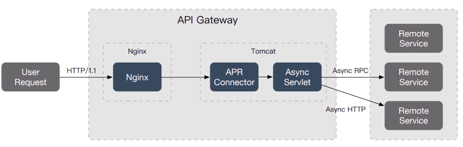
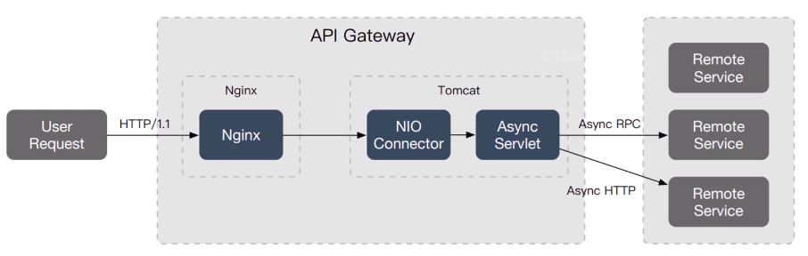
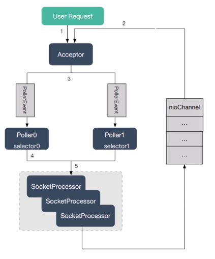
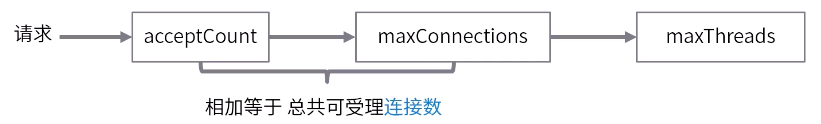
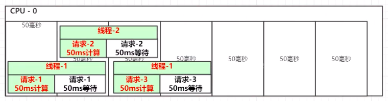

## Tomcat

### Tomcat 网络处理线程模型

#### Tomcat 7

Tomcat 7 默认使用 **BIO + 同步 Servlet**：


一个请求，一个工作线程，CPU 利用率低， 新版本中已经不会去使用

Tomcat 会监听默认的指定路径，如果有安装 APR，会自动启用**APR+异步 Servlet**：



APR（Apache 可移植运行库），是 Apache HTTP 服务器的支持库。以 JNI 形式调用 Apache HTTP 服务的核心动态链接库来处理文件读写和网络连接操作。  
这种形式比较麻烦，要为空一个动态连接库。

#### Tomcat 8

Tomcat 8 默认使用 NIO + 异步 Servlet：



NIO 处理流程：



1. 接收器接收套接字
2. 接收器从缓存中检索 nioChannel 对象
3. Pollthread 将 nioChannel 注册到它的选择器 IO 事件
4. 轮训器将 nioChannel 分配给一个 work 线程来处理请求
5. SocketProcessor 来完成对请求的处理和返回

### Tomcat 参数调优

**参数：**

| 配置项                                            | 默认             | 建议 | 注意                                                  |
| ------------------------------------------------- | ---------------- | ---- | ----------------------------------------------------- |
| ConnectionTimeout                                 | 20s              | 减少 |
| maxThread 处理连接的最大线程数                    | 200              | 增加 | 不是越大越好                                          |
| acceptCount(backlog) 等待接收 accept 请求数量限制 | 100              | 增加 | Socket 参数，min(accept, proc/sys/net/core/somaxconn) |
| maxConnections 最大连接处理数                     | NIO 1w；APR 8192 | 不变 |



[tomcat 调优过程记录](/资料/tomcat调优过程记录.pdf)

“tomcat 调优过程记录” 中线程数量： **理想的线程数量= (1 + 代码阻塞时间/代码执行时间) \* cpu 数量** 解释：
有一家理发店，有两个理发的位置，假设一个理发技师接待一个客人需要 30m，接待完之后需要休息 30m，那么这家店需要几个技师？  
技师数量 = (1 + 接待时间/休息时间) \* 理发位置数量



### 调优示例

目标代码：

```java
package com.example.boot;

import org.springframework.boot.SpringApplication;
import org.springframework.boot.autoconfigure.SpringBootApplication;
import org.springframework.scheduling.annotation.EnableAsync;
import org.springframework.web.bind.annotation.RequestMapping;
import org.springframework.web.bind.annotation.RestController;

import java.util.Random;
import java.util.concurrent.Callable;

@SpringBootApplication
@RestController
@EnableAsync
public class WebDemoApplication {
    public static void main(String[] args) {
        SpringApplication.run(WebDemoApplication.class, args);
    }

    // 这个方法固定延时3秒，用于测试线程/连接数量控制
    @RequestMapping("/testCount")
    public String testCount() throws InterruptedException {
        Thread.sleep(3000);// connections  acceptCount
        return "Success";
    }

    @RequestMapping("/test")
    public String benchmark() throws InterruptedException {
        System.out.println("访问test：" + Thread.currentThread().getName());

        // 这段代码，一直运算。
        for (int i = 0; i < 200000; i++) {
            new Random().nextInt();
        }
        // 50毫秒的数据库等待，线程不干活
        Thread.sleep(50L);
        return "Success";
    }

    // 异步支持
    @RequestMapping("/testAsync")
    public Callable<String> benchmarkAsync() throws InterruptedException {
        return new Callable<String>() {
            @Override
            public String call() throws Exception {
                System.out.println("访问testAsync：" + Thread.currentThread().getName());
                // 这段代码，一直运算。
                for (int i = 0; i < 200000; i++) {
                    new Random().nextInt();
                }
                // 50毫秒的数据库等待，线程不干活
                Thread.sleep(50L);
                return "Success";
            }
        };
    }
}
```

```java
package com.example.boot;

import org.springframework.context.annotation.Bean;
import org.springframework.context.annotation.Configuration;
import org.springframework.scheduling.concurrent.ThreadPoolTaskExecutor;
import org.springframework.web.context.request.async.TimeoutCallableProcessingInterceptor;
import org.springframework.web.servlet.config.annotation.AsyncSupportConfigurer;
import org.springframework.web.servlet.config.annotation.WebMvcConfigurationSupport;

@Configuration
public class WebMvcConfig extends WebMvcConfigurationSupport {
    @Override
    public void configureAsyncSupport(final AsyncSupportConfigurer configurer) {
        configurer.setDefaultTimeout(60 * 1000L);
        configurer.registerCallableInterceptors(timeoutInterceptor());
        configurer.setTaskExecutor(threadPoolTaskExecutor());
    }

    @Bean
    public TimeoutCallableProcessingInterceptor timeoutInterceptor() {
        return new TimeoutCallableProcessingInterceptor();
    }

    @Bean
    public ThreadPoolTaskExecutor threadPoolTaskExecutor() {
        ThreadPoolTaskExecutor t = new ThreadPoolTaskExecutor();
        t.setCorePoolSize(200);
        t.setMaxPoolSize(200);
        t.setThreadNamePrefix("netease-demo-");
        return t;
    }
}
```

---

[中间件](../README.md)  
[主页](/)
