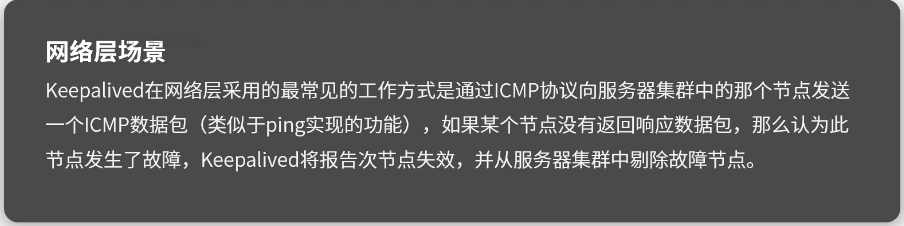
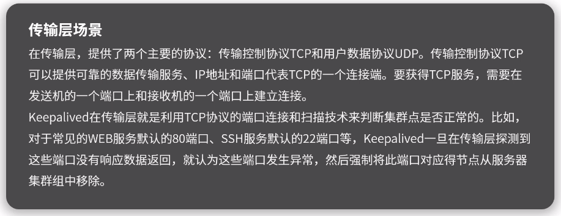
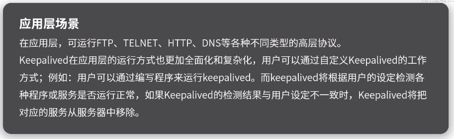
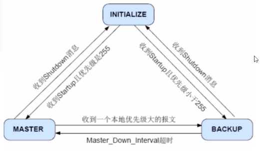

[TOC]

# LVS

## LVS 简介

LVS 全称为 Linux Virtual Server, 即 Linux 虚拟服务器. 是我国章文嵩博士的一个开源项目. 在 Linux 内核 2.6 中, 已成为 Linux 内核的一部分.

**LVS 主要用于多服务器的负载均衡**.

-   工作在网络四层, 可以实现高性能, 高可用服务器集群技术.
-   廉价, 可以把许多低性能的服务器组合在一起形成一个超级服务器.
-   易用, 配置非常简单, 有多种负载均衡策略
-   稳定可靠, 即时集群中某台服务器不能正常工作, 也不影响整体效果.
-   可扩展性高

**网络分层**

图片参考: https://www.cnblogs.com/qishui/p/5428938.html

OSI 七层模型, Nginx 就是工作在七层模型下

网络五层模型

网络四层模型: 应用层, 传输层, 网际层, 网络接口层, LVS 工作在四层网络模型下

## IP 虚拟服务器软件 IPVS

在调度器的实现技术中, IP 负载均衡技术是效率最高的. IPVS 软件实现了三种负载均衡技术, 大致原理如下:

-   Virtual Server via Direct Routing (VS/DR) 通过改写请求报文的 mac 地址, 将请求发送到真实服务器, 而真实服务器将响应直接返回给客户. 同 VS/TUN 技术一样, VS/DR 技术可极大的提高集群系统的伸缩性. 这种方法没有 IP 隧道的开销, 对集群中的真实服务器也没有支持 IP 隧道协议的要求, 但是要求调度器与真实服务器都有一块网卡连接在同一物理网段上.

    

-   Virtual Server via Network Address Translation (VS/NAT) 通过网络地址转换, 调度器重写请求报文的目标地址, 根据预设的调度算法, 将请求分派给后端的真实服务器; 真实服务器的响应保存通过调度器时, 报文的源地址被重写, 返回给客户, 完成整改负载调度过程

    

-   Virtual Server via IP Tunneling (VS/TUN) 采用 NAT 时, 由于请求和响应报文都必须经过调度器地址重写, 当客户请求越来越多时, 调度器的处理能力将成为瓶颈. 为了解决这个问题, 调度器把请求报文通过 IP 隧道转发至真实服务器, 而真实服务器直接把响应返回给客户, 所以调度器只处理请求报文. 由于一般网络服务应答比请求报文大很多, 采用 VS/TUN 之后, 集群性能的最大吞吐量可以提高 10 倍

    

IPVS 调度算法:

-   轮叫调度（Round-Robin Scheduling）
-   加权轮叫调度（Weighted Round-Robin Scheduling）
-   最小连接调度（Least-Connection Scheduling）
-   加权最小连接调度（Weighted Least-Connection Scheduling）
-   基于局部性的最少链接（Locality-Based Least Connections Scheduling）
-   带复制的基于局部性最少链接（Locality-Based Least Connections with Replication Scheduling）
-   目标地址散列调度（Destination Hashing Scheduling）
-   源地址散列调度（Source Hashing Scheduling）
-   最短预期延时调度（Shortest Expected Delay Scheduling）
-   不排队调度（Never Queue Scheduling）

具体说明请参考: https://www.jianshu.com/p/619c23fb1a14

## 内核 Layer-7 交换机 KTCPVS

在基于 IP 的负载均衡调度技术中, 因为 IPVS 无法检查到请求的内容再选择服务器, 索引要求后端服务组提供相同的服务, 不管请求到哪台服务器, 返回的结果都是一样的. 但是有些应用后端服务器功能不一样, 有的提供 html, 有的提供图片, 有的提供 cgi. 这就需要基于内容的调度

KTCPVS (Kernel TCP Virtual Server) 是在应用层处理. 伸缩性有限, 但带来以下好处:

-   相同页面的请求被发送到同一服务器, 可提高单台服务器 cache 的命中率
-   一些研究表明 web 访问流中存在局部性, Layer-7 交互可以充分利用访问的局部性, 将相同类型的请求发送到同一台服务器, 使每台服务器的请求有更高的相似性, 可进一步提高服务器 cache 的命中
-   后端服务器可以运行不同类型的服务, 如: 文档服务, 图片服务等

## LVS 集群特点

功能:

-   三种 IP 负载均衡技术和八种连接调度算法的 IPVS 软件。
-   在 IPVS 内部实现上, 采用了高效的 Hash 函数和垃圾回收机制, 能正确处理所调度报文相关的 ICMP 消息
-   虚拟服务的设置数量没有限制, 每个虚拟服务有自己的服务集
-   它支持持久的虚拟服务 (如 HTTP Cookie 和 HTTPS 等需要该功能的支持), 并提供详尽的统计数据, 如连接的处理速率和报文的流量等
-   针对大规模拒绝服务 (Deny of Service) 攻击, 实现了三种防卫策略
-   有基于内容请求分发的应用层交换软件 KTCPVS, 它也是在 Linux 内核实现的系统的高可用
-   有关于的集群管理软件对资源进行监测, 能及时将故障屏蔽, 实现系统的高可用性
-   主从调度器能周期性的进行状态同步, 从而实现更高的可用性

## LVS 和 Nginx 对比

| 负载均衡   | 4 层负载均衡                                                                                                                                                 | 7 层负载均衡                                                                                                                                                                                                                                         |
| ---------- | ------------------------------------------------------------------------------------------------------------------------------------------------------------ | ---------------------------------------------------------------------------------------------------------------------------------------------------------------------------------------------------------------------------------------------------- |
| 技术原型   | IP+TCP 端口                                                                                                                                                  | URL 应用层 (内容交换)                                                                                                                                                                                                                                |
| 典型代表   | LVS                                                                                                                                                          | Nginx,Haproxy,MySQL Proxy                                                                                                                                                                                                                            |
| 优点和缺点 | 不理解 MySQL, ftp, http 等应用协议, 满足不了特点需求, 比如说动静分离, 缓存自定义等. 但是配置简单, 效率也很高                                                 | 对负载均衡社保也很高, 处理七层能力一般低于四层模式的部署方式, 但比较智能化, 比如动静分离, 根据不同请求定义图片, 缓存, 可以对客户端请求和服务器相应作出自定义修改, 极大的提升了应用系统在网络层的灵活性                                               |
| 安全性     | SYNFlood 攻击, 有的软四层应用则会转发到后端服务器, 有的则可以防止攻击这个和设备 (软硬) 有一定关系                                                            | 一般可以在七层进行拦截, 不影响后台服务器正常运行, 可以设置多种策略, 过滤特定报文                                                                                                                                                                     |
| 应用       | 对应 TCP 应用, 比如 C/S 开发的 ERP                                                                                                                           | HTTP 协议, 主要是网站或内部信息平台等 B/S 开发系统                                                                                                                                                                                                   |
| 案例       | 接收客户的 syn 请求, 通过上述方式选择后端指定服务器, 并且对报文中目标 IP 地址进行修改, 改为后端的服务器 IP, TCP 连接是直接建立的, 而负载均衡类似路由器的作用 | 如果要根据真正的应用层内容再选择服务器, 则先代理最终服务器和客户端建立连接 (三次握手) 之后, 才可能接收到客户端发送的真正应用层报文内容, 然后根据该报文中的特定字段, 加上负载均衡设备的服务器选择方式, 觉得最终选择的内部服务器. 次数充当了代理服务器 |

## Keepalived 简介

keepalived 官方文档: https://www.keepalived.org/documentation.html

**keepalived 的作用** 是检查服务器状态, 如果有一台 web 服务器宕机或者出现工作故障, keepalived 会检查到并将有故障的服务器从系统中剔除, 同时使用其他服务器代替该服务器的工作, 当服务器正常后 keepalived 会将服务器接入到服务器群中. 这些工作全部自动完成, 不需要人工干涉, 需要人工做的只是修复故障服务器.

**keepalived 的特性**

-   配置文件简单
-   稳定性强, 可 keepalived 是一个类似于 Ayer3/4/7 交换机机制的软件, 具备我们平时所说的第三层, 第四层和第七层交换机的功能, 常用于前端负载均衡器的高可用服务, 当主服务出现故障时, 可快速进行切换, 检测机制灵活, 成功率高
-   成本低廉, 开源软件, 直接下载就好
-   应用范围广, 因为可 keepalived 可应用于多个层面, 它几乎可以对所有的应用做高可用, 包括 LVS, 数据库, HTTP 范围, Nginx 负载均衡等等
-   支持多种类型: 主从, 主主模式高可用, 根据业务场景选择

**keepalived 工作原理**

keepalived 内部工作分为以下几个部分:

1. WatchDog 监控 checkers 和 VRRP 进程情况
2. Checkers 复制真实服务器的监控检查 healthchecking
3. VRRP Stack 负载负载均衡之间的失败切换
4. IPVS wrapper 用来发送设定的规则发送到内核 IPVS 代码
5. Netlink Reflector 用来设定 VRRP 的 VIP 地址等

**VRRP**

Keepalived 是以 VRRP 协议为实现基础的, VRRP 全称 Virtual Router Redundancy Protocol (虚拟路由冗余协议)

VRRP 根据优先级来确定虚拟路由器中每台路由器的角色(Master 路由或者 Backup 路由), VRRP 优先级的取值范围为 0~255 (数值越大表名优先级越高), 可配置范围为 1~254 , 优先级 0 为系统保留给路由器放弃 Master 位置时使用, 255 则保留给 IP 地址拥有者使用. 优先级越高则越有可能成为 Master 路由器. 两台优先级相同的路由器竞争 Master 时, 比较接口 IP 地址大小, 接口地址大的成为 Master

keepalived 主要有三个模块: core, check, vrrp

-   core: keepalived 的核心模块, 负责主线程的启动, 维护已经全局配置文件的加载和解析
-   check: 负责健康检查
-   vrrp: 实现 VRRP 协议

## Keepalived 的应用场景

在网络层, 数据链路层运行着四个重要协议:

-   IP: 互联网协议
-   ICMP: 互联网控制报文协议
-   ARP: 地址转换协议
-   RARP: 反向地址转换协议

常见的高可用架构:

**主从高可用**

1. 系统中有一个 Master 和一个 Backup, Master 对线上业务提供服务, Backup 与 Master 保持心跳
2. 当 Master 宕机时, 系统会把 Backup 升级成为新的 Master, 切换到 Backup 提供服务
3. 当原 Master 上线时, 将成为 Backup

**双主高可用**

1. 系统中有两个 Master, 均对线上业务提供服务, 两个 Master 保持心跳
2. 当一个 Master 宕机时, 系统会把全部流量导向拎一个 Master
3. 当原 Master 上线时, 加入集群提供服务

**keepalived 高可用**

keepalived 一个节点上启动之后, 会生产一个 Master 主进程, 这个主进程又会生成两个子进程, 分别是:

-   VRRP Stack: 实现 VRRP 协议
-   Checkers: 检测 IPVS 后端 realserver 的健康状况

VRRP 双方节点都启动后, 要实现状态转换的. 刚开始启动的时候, 初始状态都是 Backup, 而后向其他节点发送通告, 以及自己的优先级信息, 谁的优先级高谁就成为 Master.

这时候服务状态就在状态为 Master 的节点上启动, 为用户提供服务, 如果该节点挂掉, 就转换为 Backup 并降低优先级, 另一个节点转成 Master, 优先级上升, 服务就在此节点启动, VIP,VMAC 都转移到这个节点上为用户提供服务
