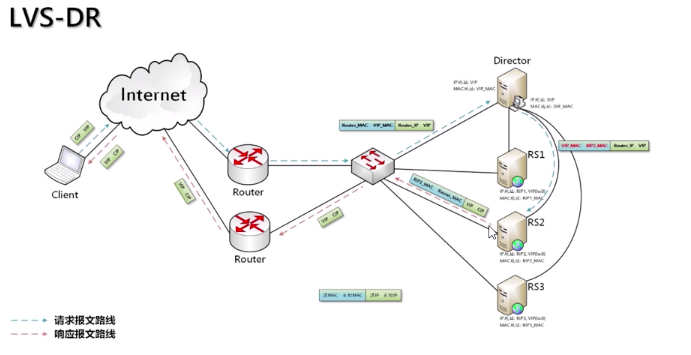
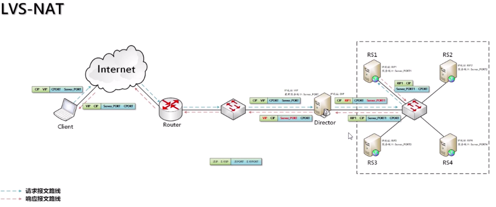
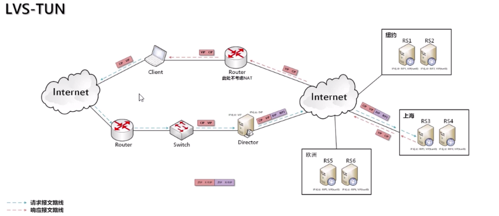

# LVS

## LVS 简介

LVS 全称为 Linux Virtual Server, 即 Linux 虚拟服务器. 是我国章文嵩博士的一个开源项目. 在 Linux 内核 2.6 中, 已成为 Linux 内核的一部分.

**LVS 主要用于多服务器的负载均衡**.

-   工作在网络四层, 可以实现高性能, 高可用服务器集群技术.
-   廉价, 可以把许多低性能的服务器组合在一起形成一个超级服务器.
-   易用, 配置非常简单, 有多种负载均衡策略
-   稳定可靠, 即时集群中某台服务器不能正常工作, 也不影响整体效果.
-   可扩展性高

**网络分层**

图片参考: https://www.cnblogs.com/qishui/p/5428938.html

OSI 七层模型, Nginx 就是工作在七层模型下

网络五层模型

网络四层模型: 应用层, 传输层, 网际层, 网络接口层, LVS 工作在四层网络模型下

## IP 虚拟服务器软件 IPVS

在调度器的实现技术中, IP 负载均衡技术是效率最高的. IPVS 软件实现了三种负载均衡技术, 大致原理如下:

-   Virtual Server via Direct Routing (VS/DR) 通过改写请求报文的 mac 地址, 将请求发送到真实服务器, 而真实服务器将响应直接返回给客户. 同 VS/TUN 技术一样, VS/DR 技术可极大的提高集群系统的伸缩性. 这种方法没有 IP 隧道的开销, 对集群中的真实服务器也没有支持 IP 隧道协议的要求, 但是要求调度器与真实服务器都有一块网卡连接在同一物理网段上.

    

-   Virtual Server via Network Address Translation (VS/NAT) 通过网络地址转换, 调度器重写请求报文的目标地址, 根据预设的调度算法, 将请求分派给后端的真实服务器; 真实服务器的响应保存通过调度器时, 报文的源地址被重写, 返回给客户, 完成整改负载调度过程

    

-   Virtual Server via IP Tunneling (VS/TUN) 采用 NAT 时, 由于请求和响应报文都必须经过调度器地址重写, 当客户请求越来越多时, 调度器的处理能力将成为瓶颈. 为了解决这个问题, 调度器把请求报文通过 IP 隧道转发至真实服务器, 而真实服务器直接把响应返回给客户, 所以调度器只处理请求报文. 由于一般网络服务应答比请求报文大很多, 采用 VS/TUN 之后, 集群性能的最大吞吐量可以提高 10 倍

    

IPVS 调度算法:

-   轮叫调度（Round-Robin Scheduling）
-   加权轮叫调度（Weighted Round-Robin Scheduling）
-   最小连接调度（Least-Connection Scheduling）
-   加权最小连接调度（Weighted Least-Connection Scheduling）
-   基于局部性的最少链接（Locality-Based Least Connections Scheduling）
-   带复制的基于局部性最少链接（Locality-Based Least Connections with Replication Scheduling）
-   目标地址散列调度（Destination Hashing Scheduling）
-   源地址散列调度（Source Hashing Scheduling）
-   最短预期延时调度（Shortest Expected Delay Scheduling）
-   不排队调度（Never Queue Scheduling）

具体说明请参考: https://www.jianshu.com/p/619c23fb1a14

## 内核 Layer-7 交换机 KTCPVS

在基于 IP 的负载均衡调度技术中, 因为 IPVS 无法检查到请求的内容再选择服务器, 索引要求后端服务组提供相同的服务, 不管请求到哪台服务器, 返回的结果都是一样的. 但是有些应用后端服务器功能不一样, 有的提供 html, 有的提供图片, 有的提供 cgi. 这就需要基于内容的调度

KTCPVS (Kernel TCP Virtual Server) 是在应用层处理. 伸缩性有限, 但带来以下好处:

-   相同页面的请求被发送到同一服务器, 可提高单台服务器 cache 的命中率
-   一些研究表明 web 访问流中存在局部性, Layer-7 交互可以充分利用访问的局部性, 将相同类型的请求发送到同一台服务器, 使每台服务器的请求有更高的相似性, 可进一步提高服务器 cache 的命中
-   后端服务器可以运行不同类型的服务, 如: 文档服务, 图片服务等
