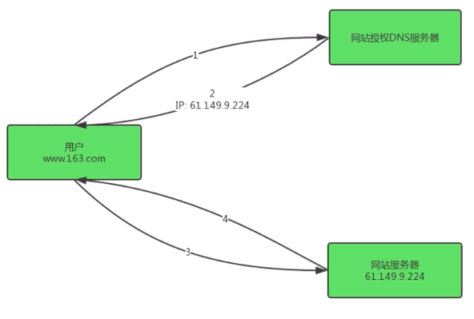
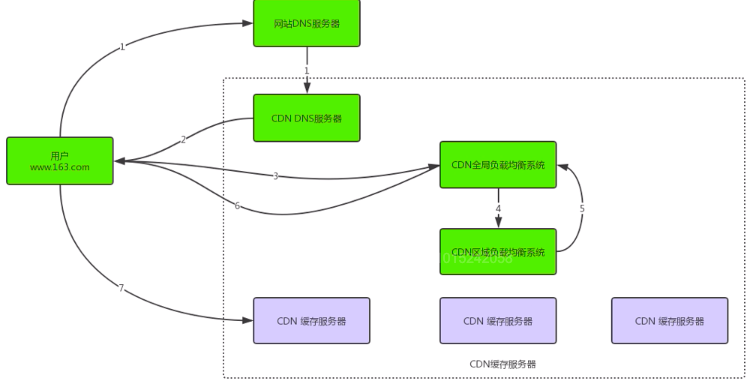
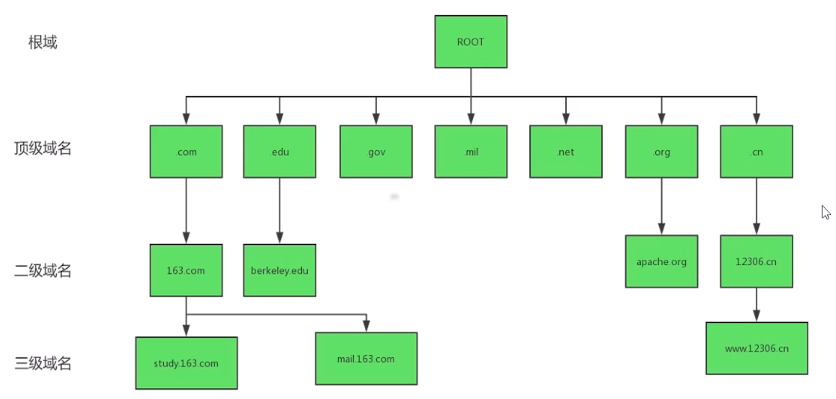
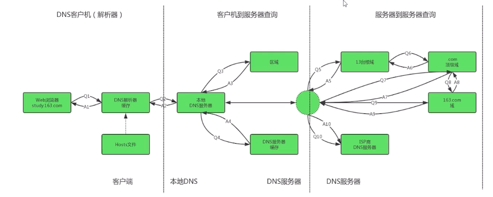
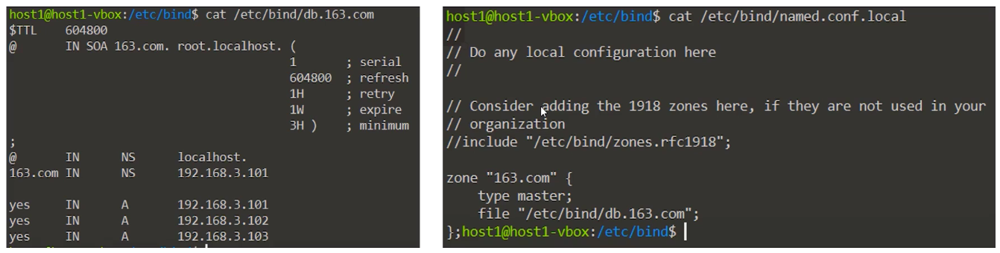
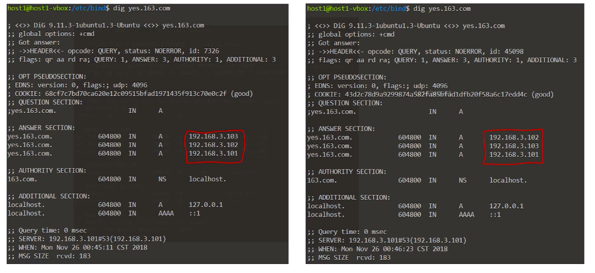

[TOC]

# CDN 与 DNS

## CDN

### CDN 简介

CDN 的全称是 Content Delivery Network，即内容分发网络。

-   CDN 是构建在网络之上的内容分发网络
-   依靠部署在各地的边缘服务器，通过中心平台的负载均衡、内容分发、调度等功能模块
-   使用户就近获取所需内容，降低网络拥塞，提高用户访问响应速度和命中率。

CDN 的关键技术主要有内容存储和分发技术。

分析 `img.163.com` 域名, 执行 dig 命令, 输出如下

```sh
pikaqiu@maopchMac:~/Downloads$ dig img.163.com

; <<>> DiG 9.10.6 <<>> img.163.com
;; global options: +cmd
;; Got answer:
;; ->>HEADER<<- opcode: QUERY, status: NOERROR, id: 9597
;; flags: qr rd ra; QUERY: 1, ANSWER: 3, AUTHORITY: 0, ADDITIONAL: 0

;; QUESTION SECTION:
;img.163.com.			IN	A

;; ANSWER SECTION:
img.163.com.		30	IN	CNAME	img.163.com.wscdns.com.
img.163.com.wscdns.com.	30	IN	A	122.70.142.183
img.163.com.wscdns.com.	30	IN	A	122.70.142.172

;; Query time: 15 msec
;; SERVER: 192.168.1.1#53(192.168.1.1)
;; WHEN: Thu May 09 18:38:04 CST 2019
;; MSG SIZE  rcvd: 94
```

从上面的查询结果可以看看出 `img.163.com.wscdns.com` 后面的 CNAME 就是 CDN 提供的支持

**CDN 的主要特点:**

-   **本地 Cache 加速** 提高了企业站点 (尤其含有大量图片和静态页面网点) 的访问速度, 并大大提高稳定性
-   **镜像服务** 消除不同运营商直接互联瓶颈造成的影响, 实现了跨运营商的网络加速, 保证不同网络中的用户都能得到良好的访问质量
-   **远程加速** 远程访问用户通过 CDN 负载均衡技术智能选择 Cache 服务器, 加快网络访问速度
-   **带宽优化** 自动生成服务器的远程 Mirror (镜像) Cache 服务器, 远程用户访问时从 cache 服务器读取数据, 减少远程访问的带宽, 分担网络流量, 减轻站点 web 服务器负载
-   **集群抗攻击** 广泛分布的 CDN 节点加锁节点间的智能冗余机制, 可以有效的防止黑客入侵及降低各种 DDoS 攻击对网站的影响, 同时保证较好的访问质量

### CDN 访问模式

CDN 主要包括以下三个要件:

-   **分发服务系统** 最基本的单元就是 Cache 设备, cache(边缘 cache)负责响应最终用户的直接访问请求, 把缓存在本地的内容快速提供给用户. 同时 cache 还负责与源站点进行同步, 把更新的内容以及本地没有的内容从源站点获取并保存到本地
    <font color='red'>Cache 设备数量, 规模, 总服务能力是衡量一个 CDN 系统服务能力的最基本指标</font>

-   **负载均衡系统** 主要对所有发起请求的的用户进行访问调度, 确定最终提供给用户的实际服务地址. 两级调度体系分为全局负载均衡 (GSLB) 和本地负载均衡 (SLB). GSLB 主要根据用户就近原则, 通过对每个服务节点进行"最优"判断, 确定向用户提供服务的 cache 物理位置. SLB 主要负责节点内容内部的设备负载均衡

-   **运营管理系统** 分为运营管理和网络管理子系统, 负责处理业务层面与外界系统交互所必须的搜集, 整理, 交付工作, 包含用户管理, 产品管理, 计费管理, 统计分析等功能

**常规 web 请求处理流程**:



1. 用户在浏览器中输入域名
2. 浏览器向本地 DNS(域名解析服务器)请求对该域名解析.
3. 本地 DNS 服务器如果缓存有这个域名的解析结果, 就直接返回对应的解析结果
4. DNS 如果没有关于合格域名的解析结果缓存, 则递归的向整个 DNS 系统请求解析, 获得应答后将结果返回给该浏览器
5. 浏览器获得域名的解析结果, 就是该域名对应的服务器 IP
6. 浏览器向服务器请求内容
7. 服务器将用户请求内容返回给浏览器

**引入 CDN 后的 web 请求处理流程**



1. 用户输入 URL 应该本地 DNS 服务器解析, DNS 会将最终域名解析权交给 CNAME 指向的 CND 专用 DNS 服务器
2. CND 的 DNS 服务器将 CND 的全局负载均衡设备 IP 地址返回给用户
3. 用户向 CND 全局负载均衡发起内容 URL 访问请求
4. CND 全局负载均衡设备根据用户 IP 地址以及用户请求的内容 URL 选择一台用户所属区域负载均衡设备, 让用户向这台设备发起请求
5. 区域负载均衡设备会为用户选择一台合适的缓存服务器提供服务
6. 用户向缓存服务器发起请求, 缓存服务器响应请求, 将用户所需内容发送给用户
7. 如果这个服务器上没有用户所需内容, 那么这台服务器就会向它的上一级缓存服务器请求内容, 直至追溯到网站的原服务器将内容拉取到本地

### CND 关键技术

**缓存算法**

缓存代理软件: Squid

缓存算法决定命中率, 源服务器压力, FTP 节点存储能力

**分发能力**

取决于 IDC 能力和 IDC 策略性发布

**负载均衡**

软件: Nginx

负载均衡 (智能调度) 决定最佳路由, 响应时间, 可用性, 服务质量

**基于 DNS**

DNS 服务器软件: BIND

1. 基于 DNS 的负载均衡以 CNAME 实现域名中转, 去最优节点服务
2. 缓存点有客户端浏览器缓存, 本地 DNS 服务器缓存
3. 缓存内容有 DNS 地址缓存, 客户请求内容缓存, 动态内容缓存

**支持协议**

支持协议如动静态加速 (图片加速, HTTPS 带证书加速), 下载加速, 流媒体加速, 企业应用加速, 手机应用加速

## DNS

### DNS 简介

域名系统（英文：Domain Name System，缩写：DNS）, 其主要作用就是将主机名解析成 IP 地址的过程完成了从域名到主机识别 IP 地址之间的转换

-   DNS 是一个分布式、分层次的主机名管理架构，通过配置 DNS 服务器地址，主机不需要知道对应的 ip 地址就能通过主机名的形式访问互联网；

-   DNS 利用类似倒状树的目录结构将主机名的管理分配在不同层级的 DNS 服务器当中，经过分层管理，每一级 DNS 服务器负责部分域名信息，这也就减轻了 DNS 服务器的负载，同时也方便记录的更新同步。

-   DNS 是一个网络服务，因此就有对应的网络服务，因此就有对应的端口，其端口是 53 号，通常 DNS 在查询的时候是以 udp 这个快速的数据传输协议来查询的，但是一旦没有办法查询到完整的信息时就会再次以 TCP 协议来进行重新查询，因此 DNS 服务在启动的时候会同时开启 tcp 的 53 号端口和 udp 的 53 号端口

-   DNS 在进行区域传输的时候用 TCP 协议, 其他时候使用 UDP 协议

-   FQDN（Full Qualified Domain Name）:完整主机名. 完整主机名由主机名和域名构成。比如，www.taobao.com 当中，www 就是 web 网站服务器的主机名，taobao.com 就是域名；主机名和域名之间用实心的点号来表示；

-   DNS 是基于 C/S 架构 (多数基于套接字架构的 C/S 架构), 对于每一级域名长度现在是 63 个字符, 域名总长度不超过 253 个字符

-   DNS 系统记录的信息非常多, 不过重点就两个: 一个是记录服务器所在的 NS (name server) 标志, 另一个是记录主机名对应的 A(Address)标志

**DNS 的域名结构** :



1. DNS 域名是树状结构, 在最顶层的是一个根服务器, 它主要负责顶级域名的管理
2. 一级域名共分为 3 类: 组织域, 国家域和反响域, 最多可以有 127 级域名
3. 每一级域名服务器只负责对应下级域的管理, 其中根节点是分布在世界各地 13 台服务器组成的, 10 台位于美国地区, 另外 3 台在英国, 瑞典和日本

### DNS 工作原理

DNS 解析域名到 IP 有三个阶段:



1. 本地 DNS 缓存解析
2. 本地 DNS 服务器解析, 递归查询
3. 根域及各级域名服务器解析, 迭代查询

**DNS 负载均衡**

原理是: 在 DNS 服务器中为同一个主机名配置多个 IP 地址, 多个 IP 地址以轮询的方式选择

操作系统: Ubuntu

DNS 服务器软件: bind9



使用 dig 查看对域名 yes.163.com 的解析, 会发现每次的 IP 地址顺序不同



**DNS 与其他负载均衡工具对比:**

1. **DNS 负载均衡**: 对同一个请求的域名, 映射为不同的服务器 IP 地址
2. **HTTP 重定向**: HTTP 代理 (比如浏览器) 向 web 服务器请求某一 URL 后, web 服务器根据 HTTP 服务器响应头信息中的 location 标记来返回一个新的 URL, 然后 HTTP 请求继续访问这个心的 URL
3. **反向代理的负载均衡**: 是指以代理服务器来接收对 web 服务器的连接请求, 然后转发给内部网络中不同的 web 服务器, 并将从 web 服务器请求达到的结果返回给请求连接的客户端, 以 **Nginx** 为代表
4. **NAT 负载均衡**: 将公网地址映射为多个私网地址, 解决 IP 地址紧张, 不想让外部网络直到内部网络结构 问题
5. **CDN**: 通过发布机制将内容同步到大量的缓存节点, 并在 DNS 服务器上进行扩展, 找到离用户最近的缓存节点作为服务提供节点
6. **混合型负载均衡**: 在某些大型网络, 由于多个服务器的各种差异, 可以给每个服务器群采用合适的负载均衡方式, 然后在多个服务器群间再一次负载均衡或集群起来以一个整体向外界提供服务.
