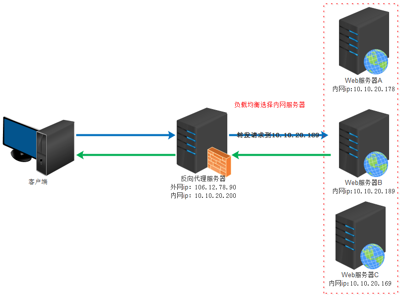
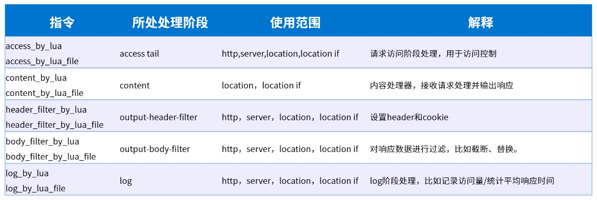

[TOC]

# Nginx

## 简介


是一款轻量级 web 服务器/反向代理服务器及电子邮件(IMAP/POP3)代理服务器, 并在一个 BSD 协议下发行, 可以在 Unix, GNU/Linux, BSD, Mac OS X, Solaris, Windows 等操作系统上运行

特点: **占用内存少, 并发能力强**(用于解决 C10K 问题), 事实上 Nginx 的并发能力确实在同类型网络服务器上表现较好. 提供**强大的反向代理功能**.

基于反向代理功能, Nginx 作为负载均衡主要以下几点理由:

-   高并发连接
-   内存消耗少
-   配置文件非常简单
-   成本低廉
-   支持 rewrite 重写规则
-   内置健康检查功能
-   节省带宽
-   稳定性高

## 正向代理和反向代理

**正向代理**: 类似于一个跳板机, 代理访问外部资源


**反向代理**: 实际运行方式是指以代理服务器来接收 Internet 上的连接请求, 然后将请求转发给内部网络上的服务器并将服务器上得到的结果返回给 Internet 上的连接请求的客户端, 此时代理服务器对外表现为一台服务器




反向代理的作用:

1. 保证内网安全, 可以使用反向代理提供 WAF 功能, 组织 web 攻击. 大型网站通常将反向代理作为公网访问地址, web 服务器是内网.
2. 负载均衡, 通过代理服务器来优化网站的负载

## 负载均衡

**负载均衡原理**

单从字面上来说可以理解为 n 台服务器平均分担负载, 不会因为某台服务器负载高宕机和某台服务器闲置的情况. 那么负载均衡就是要 2 台以上的服务器才能实现

**Nginx 的配置文件**

```conf

#user  nobody;
worker_processes  1;

#error_log  logs/error.log;
#error_log  logs/error.log  notice;
#error_log  logs/error.log  info;

#pid        logs/nginx.pid;


events {
    worker_connections  1024;
}


http {
    include       mime.types;
    default_type  application/octet-stream;

    #log_format  main  '$remote_addr - $remote_user [$time_local] "$request" '
    #                  '$status $body_bytes_sent "$http_referer" '
    #                  '"$http_user_agent" "$http_x_forwarded_for"';

    #access_log  logs/access.log  main;

    sendfile        on;
    #tcp_nopush     on;

    #keepalive_timeout  0;
    keepalive_timeout  65;

    proxy_cache_path /data/nginx/cache keys_zone=one:10m max_size=10g

    upstream netease.com {
        server 127.0.0.1:8881;
        server 127.0.0.1:8882;
        server 127.0.0.1:8883;
    }

    #gzip  on;

    server {
        listen       80;
        server_name  localhost;

        proxy_cache one
        #charset koi8-r;

        #access_log  logs/host.access.log  main;

        location / {
            root   html;
            index  index.html index.htm;
        }

        #error_page  404              /404.html;

        # redirect server error pages to the static page /50x.html
        #error_page   500 502 503 504  /50x.html;
        location = /50x.html {
            root   html;
        }

        # proxy the PHP scripts to Apache listening on 127.0.0.1:80
        #
        #location ~ \.php$ {
        #    proxy_pass   http://127.0.0.1;
        #}

        # pass the PHP scripts to FastCGI server listening on 127.0.0.1:9000
        #
        #location ~ \.php$ {
        #    root           html;
        #    fastcgi_pass   127.0.0.1:9000;
        #    fastcgi_index  index.php;
        #    fastcgi_param  SCRIPT_FILENAME  /scripts$fastcgi_script_name;
        #    include        fastcgi_params;
        #}

        # deny access to .htaccess files, if Apache's document root
        # concurs with nginx's one
        #
        #location ~ /\.ht {
        #    deny  all;
        #}
    }


    # another virtual host using mix of IP-, name-, and port-based configuration
    #
    #server {
    #    listen       8000;
    #    listen       somename:8080;
    #    server_name  somename  alias  another.alias;

    #    location / {
    #        root   html;
    #        index  index.html index.htm;
    #    }
    #}


    # HTTPS server
    #
    #server {
    #    listen       8000;
    #    listen       somename:8080;
    #    server_name  somename  alias  another.alias;

    #    location / {
    #        root   html;
    #        index  index.html index.htm;
    #    }
    #}


    # HTTPS server
    #
    #server {
    #    listen       443 ssl;
    #    server_name  localhost;

    #    ssl_certificate      cert.pem;
    #    ssl_certificate_key  cert.key;

    #    ssl_session_cache    shared:SSL:1m;
    #    ssl_session_timeout  5m;

    #    ssl_ciphers  HIGH:!aNULL:!MD5;
    #    ssl_prefer_server_ciphers  on;

    #    location / {
    #        root   html;
    #        index  index.html index.htm;
    #    }
    #}

}

```

Nginx 负载均衡有 4 种方案配置:

1. **轮询 (Round Robin)**: 根据 Nginx 配置文件中的顺序依次把 web 端的请求发送到不同的后端服务器上, 是 Nginx 的**默认策略**

    - 支持 http 和 https 协议, 只需要修改 `proxy_pass` 后协议即可
    - Nginx 支持 FastCGI, uwsgi, SCGI, memcatched 等等负载均衡, 只需要将 `proxy_pass` 改为 `fastcgi_pass` `uwsgi_pass` `scgi_pass` `memcatched_pass`即可

    ```
    server {
        listen       80;
        server_name  localhost;

        location / {
            proxy_pass http:yes.163.com
        }
    }
    ```

    - 此策略时候服务器配置相当, 无状态且短频快服务使用

2. **最少连接 (least conn)**: web 请求会被转发到连接数最少的服务器上

    - 使用`least_conn`指令 更改`upstream`

    ```conf
    upstream netease.com {
        least_conn;
        server 127.0.0.1:8881;
        server 127.0.0.1:8882;
        server 127.0.0.1:8883;
    }
    ```

    - 适用于请求处理事件长短不一造成的服务过载情况

3. **IP 地址 hash (ip_hash)**: 前面两中负载均衡方案中, 同一客户端连续的 web 请求可能会被发送到不同的后端服务器上, 因此如果涉及到会话 session 就会比较复杂. 常见的是基于数据库会话持久化. 要克服上面的难题, 可以使用基于 IP 地址 hash 的负载均衡方案, 这样的话同一客户端连续的 web 请求就会被分发到同一服务器进行处理

    - 使用`ip_hash`指令 更改`upstream`

    ```conf
    upstream netease.com {
        ip_hash;
        server 127.0.0.1:8881;
        server 127.0.0.1:8882;
        server 127.0.0.1:8883;
    }
    ```

    - Nginx 使用客户端请求的 IP 地址进行 hash 计算, 确保同一个服务器响应请求
    - 适用于有状态服务, 如 session

4. **基于权重 (weight)**: 这种配置下我们可以把更多的请求发送到高配置的后端服务器上

    - 使用`weight`指令 更改`upstream`, 权重越高分配到的请求数就越多

    ```conf
    upstream netease.com {
        server 127.0.0.1:8881,weight=1;
        server 127.0.0.1:8882,weight=2;
        server 127.0.0.1:8883,weight=3;
    }
    ```

    - 此策略可以与 `ip_hash` 和 `least_conn` 配合使用
    - 适用于服务器硬件配置差别比较大的情况

## Nginx 缓存

Nginx 的 http_proxy 模块, 可以实现类似于 Squid 的缓存功能

Nginx 对于客户已经访问过的内容在 Nginx 服务器本地建立副本, 这样在一段时间内再次访问该数据, 就不需要 Nginx 再次向后端服务器发送请求, 所以可以减小 Nginx 与后端服务器的网络流量, 减轻网络阻塞, 同时还能减小数据传输延迟, 提高访问速度

同样, 后端服务器宕机时, Nginx 还能返回相关的请求, 提高了后端服务的鲁棒性

对于缓存, 我们大概会有以下几个问题:

1. 缓存文件放在哪儿
2. 如何指定哪些请求被缓存
3. 缓存的有效期是多久
4. 对于某些请求, 是否可以不走缓存

解决完这些问题, Nginx 缓存基本就完成了

1. **缓存文件放在哪儿**
   `proxy_cache_path` 指定 Nginx 缓存文件位置, 有两个必填参数: 缓存目录, keys_zone 指定缓存名称和占用缓存空间的大小

    `proxy_cache` 之前指定的缓存名称

    配置文档示例中的 10m 是对内存上数据大小的限制, max_size 是对磁盘总量大小的限制

2. **如何指定哪些请求被缓存**

    1. Nginx 会默认缓存所有的 get 和 head 请求结果, 缓存的可以默认使用请求字符串
    2. 自定义 key, 例如: `proxy_cache_key`
    3. 指定请求至少被发送多少次以上才被缓存, 可以防止低频访问被缓存 `proxy_cache_min_use 5;`
    4. 指定哪些方法请求被缓存, 例如: `proxy_cache_methods GET HEAD POST;`

    ```conf
    server {
        listen       80;
        server_name  localhost;

        proxy_cache one

        location / {
            proxy_pass http:yes.163.com
            proxy_set_header Host $host;
            proxy_set_header X-Real-IpP $remote_addr;
            proxy_cache_key $host$request_uri$cookie_user;
        }
    }
    ```

3. **缓存的有效期**

    默认情况下, 缓存是长期保留的, 除非缓存的总量超出限制. 可以指定缓存的有效时间, 同样在`location`下配置, 例如:

    - 响应码为 200 302 时, 10m 有效 `proxy_cache_valid 200 302 10m`
    - 对于任何状态码, 5m 有效 `proxy_cache_valid any 5m`

4. **对于某些请求, 是否可以不走缓存**
   `proxy_cache_bypass`: 哪些不缓存, 如果任何一个参数不为空, 或者不等于 0, Nginx 就不会查找缓存, 直接进行代理转发
    ```conf
    location / {
        proxy_pass http:yes.163.com
        proxy_set_header Host $host;
        proxy_set_header X-Real-IpP $remote_addr;
        proxy_cache_key $host$request_uri$cookie_user;
        proxy_cache_bypass $cookie_nocache $arg_nocache $arg_comment;
    }
    ```

网页缓存是由 HTTP 消息头中 "Cache-control" 来控制, 常见的取值有: private, no-cache, max-age, must-revalidate 等, 默认为 private

| Cache-control      | 说明                                                                                                                                                                                           |
| ------------------ | ---------------------------------------------------------------------------------------------------------------------------------------------------------------------------------------------- |
| public             | 表明响应可以被任何对象（包括：发送请求的客户端，代理服务器，等等）缓存。                                                                                                                       |
| private            | 表明响应只能被单个用户缓存，不能作为共享缓存（即代理服务器不能缓存它）,可以缓存响应内容。                                                                                                      |
| no-cache           | 必须与服务器确认返回的响应是否被更改然后才能使用该响应来满足后续对同一个网址的请求. 因此,如果存在合适的验证令牌(ETag), no-cache 会发起往返通信来验证缓存的响应, 如果资源未被更改, 可以避免下载 |
| no-store           | 缓存不应存储有关客户端请求或服务器响应的任何内容。                                                                                                                                             |
| must-revalidate    | 缓存必须在使用之前验证旧资源的状态，并且不可使用过期资源。                                                                                                                                     |
|                    |
| max-age=\<seconds> | 设置缓存存储的最大周期，超过这个时间缓存被认为过期(单位秒)。与 Expires 相反，时间是相对于请求的时间。                                                                                          |

## Lua 扩展

Nginx 是使用 C 开发的, 如果对 Nginx 源码十分熟悉, 可以使用 C 对 Nginx 进行扩展.

也可以使用 ngx_lua 模块, Lua 脚本对 Nginx 进行业务扩展

得益于 Lua 协程的支持, ngx_lua 在处理 10000 并发请求时只需要很少的内存. 据测试, ngx_lua 在处理每个请求只需要 2k 的内存, 如果使用 LuaJIT 则会更少

**协程 (Coroutine)**

协程类似多线程, 与多线程的区别为:

1. 协程并非 os 线程, 所以创建/切换开销比线程要小
2. 线程与线程一样有自己的栈, 局部变量等, 但是协程的栈是在用户进程空间模拟的, 所以创建/切换开销很小
3. 多线程是由多个线程并发执行, 也就是说在一瞬间有多个控制流在执行. 而协程强调的是一种在多个协程间协作的关系, 只有当一个协程主动放弃执行权, 另一个协程才能获得执行权, 所以在一瞬间多个协程只有一个在运行
4. 由于多个协程只有一个在运行, 所以对于临界区的访问不需要加锁, 而多线程的情况就必须加锁
5. 多线程程序有多个控制流, 所以程序行为不可控, 而多个协程的执行是由开发者定义的所以是可控的

Nginx 的每个 work 进程都是在 epoll 或者 kqueue 这样的事件模型上, 封装成协程, 每个请求都有一个协程进行处理. 这正好和 Lua 内建协程的模型是一致的, 所以即使使用 ngx_lua 执行 Lua, 相对 C 有一定的开销, 但依然能保证高并发能力

**Nginx 进程模型**

Nginx 采用多进程模型, 但 Master 多 Worker, Master 进程主要用来管理 Worker 进程.

Worker 进程采用单线程非阻塞的事件模型(Event Loop, 事件循环)来实现端口的监听及客户端请求的处理和响应, 同时 Worker 还要处理 Master 的信号. Worker 进程的个数一般设置为 CPU 的核数


Master 进程一般包括 4 个主要功能:

1. 接收来自外界的信号
2. 向各个 Worker 进程发送信号
3. 监控 Worker 进程的运行状态
4. 当 Worker 进程退出后 (异常情况下), 会自动重启新的 Worker 进程

**Nginx 对 HTTP 请的处理**

| 阶段           | 说明                                                                                                                                            |
| -------------- | ----------------------------------------------------------------------------------------------------------------------------------------------- |
| post-read      | 读取请求内容阶段, Nginx 读取并解析完请求头后就立即开始执行                                                                                      |
| server-rewrite | server 请求地址重写阶段                                                                                                                         |
| find-config    | 配置查找阶段, 用来完成当前请求与 location 配重块之间的配对工作                                                                                  |
| rewrite        | location 请求地址重写阶段, 当 ngx_rewrite 指令用于 location 中, 就是在这个阶段运行的                                                            |
| post-rewrite   | 请求地址重写提交阶段, 当 Nginx 完成 rewrite 阶段锁要求的内部调整动作, 如果 rewrite 阶段有要求的话                                               |
| preaccess      | 访问权限检查准备阶段, ngx_limit_req 和 ngx_limit_zone 在这个阶段运行, ngx_limit_req 可以控制请求的访问频率, ngx_limit_zone 可以控制访问的并发度 |
| access         | 权限检查阶段, ngx_access 在这个阶段运行, 配置指令多事执行访问控制相关的任务, 如检查用户访问权限, 检查用户来源 IP 是否合法                       |
| post-access    | 访问权限检查提交阶段                                                                                                                            |
| try-files      | 配置项 try-files 处理阶段                                                                                                                       |
| content        | 内容产生阶段,是所有请求处理中最为重要的阶段, 因为这个阶段的指令通常是用来生产 HTTP 响应内容的                                                   |
| log            | 日志模块处理阶段                                                                                                                                |

**ngx_lua 指令**



**OpenResty**

一个基于 Nginx 和 Lua 的高性能 web 平台, 器内部集成了大量精良的 Lua 库. 用于方便的搭建高并发, 扩展性极高的 web 应用, web 服务和动态网关

OpenResty 的目标是让 web 服务直接泡在 Nginx 内部, 充分利用 Nginx 的优势

这部分代码省略了... 用到了在说吧

例子参考: [Nginx-Lua](nginxlua.md)

## Nginx 最佳实践

这个有空再看吧...
