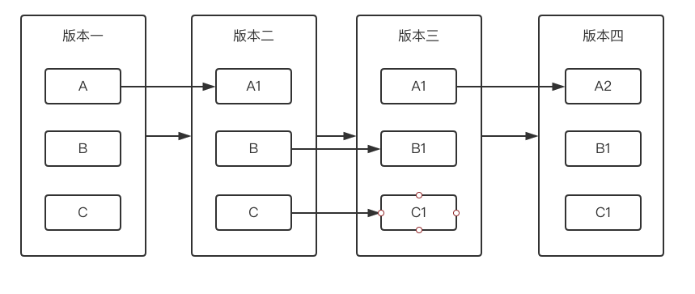
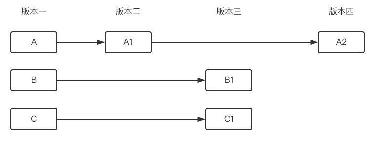

[TOC]

# Git

## 基础概念

集中式版本控制器: CVS , SVN

分布式版本控制器: Git

Git 的优势:

-   本地版本控制
-   重写提交说明
-   可以"后悔"
-   分支系统

Git 为全量更新, 每个版本都包括所有文件, 时刻保持数据的完整性

SVN 为曾量更新

Git 的三种状态:

-   已修改 (modified)
-   已暂存 (staged)
-   已提交 (commited)
