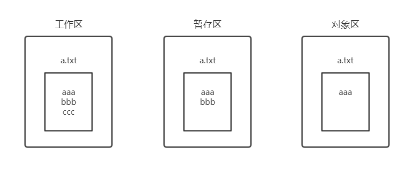

[TOC]

# 其他命令补充

## checkout

**checkout** 的作用:

- 切换分支(参考: [分支基础操作](分支操作.md))
- 工作区取消修改
- 版本穿梭

### 工作区取消修改

操作过程:

1. 编辑 a.txt 文件, 内容为 aaa, 然后 add+commit
2. 在 a.txt 文件中增加一行, 内容为 bbb, 执行 add
3. 在 a.txt 文件中增加一行, 内容为 ccc

脚本执行如下:

```sh
mao@maopeichun MINGW64 ~/Dev/test/mygit (master)
$ echo aaa > a.txt

mao@maopeichun MINGW64 ~/Dev/test/mygit (master)
$ cat a.txt
aaa

mao@maopeichun MINGW64 ~/Dev/test/mygit (master)
$ git add .
warning: LF will be replaced by CRLF in a.txt.
The file will have its original line endings in your working directory

mao@maopeichun MINGW64 ~/Dev/test/mygit (master)
$ git commit -m init
[master (root-commit) 57ad08b] init
 1 file changed, 1 insertion(+)
 create mode 100644 a.txt

mao@maopeichun MINGW64 ~/Dev/test/mygit (master)
$ echo bbb >>a.txt

mao@maopeichun MINGW64 ~/Dev/test/mygit (master)
$ cat a.txt
aaa
bbb

mao@maopeichun MINGW64 ~/Dev/test/mygit (master)
$ git add .
warning: LF will be replaced by CRLF in a.txt.
The file will have its original line endings in your working directory

mao@maopeichun MINGW64 ~/Dev/test/mygit (master)
$ echo ccc >> a.txt

mao@maopeichun MINGW64 ~/Dev/test/mygit (master)
$ git status
On branch master
Changes to be committed:
  (use "git reset HEAD <file>..." to unstage)

        modified:   a.txt

Changes not staged for commit:
  (use "git add <file>..." to update what will be committed)
  (use "git checkout -- <file>..." to discard changes in working directory)

        modified:   a.txt


```

会出现如下的情况:



执行 checkout

```sh
mao@maopeichun MINGW64 ~/Dev/test/mygit (master)
$ git checkout -- a.txt

mao@maopeichun MINGW64 ~/Dev/test/mygit (master)
$ cat a.txt
aaa
bbb
```

这里的 `checkout`是**取消工作区的修改**

再次修改 a.txt 文件, add, 可以使用 `git reset HEAD <file>`撤销

```sh
$ echo xxx > a.txt

mao@maopeichun MINGW64 ~/Dev/test/mygit (master)
$ git add .
warning: LF will be replaced by CRLF in a.txt.
The file will have its original line endings in your working directory

mao@maopeichun MINGW64 ~/Dev/test/mygit (master)
$ git reset head a.txt
Unstaged changes after reset:
M       a.txt

mao@maopeichun MINGW64 ~/Dev/test/mygit (master)
$ git status
On branch master
Changes not staged for commit:
  (use "git add <file>..." to update what will be committed)
  (use "git checkout -- <file>..." to discard changes in working directory)

        modified:   a.txt

no changes added to commit (use "git add" and/or "git commit -a")
```

注意, 这里的 `git reset head a.txt` 并没有还原 a.txt 文件, 而是 **取消了`add`** 操作

### 版本穿梭

当前的提交了 3 次

```sh
$ git log --pretty=oneline
8db41eb41c22321139e441221d36dc9c9e4f0754 (HEAD -> master) commit3
9630605871f121df58c282f98fd8f0ece878d9b9 commit2
57ad08b65c77c539ed01e866808a44e254d219c2 init
```

使用 `git checkout <sha1>`修改版本

```sh
$ git checkout 9630605871f121df58c282f98fd8f0ece878d9b9
Note: checking out '9630605871f121df58c282f98fd8f0ece878d9b9'.

You are in 'detached HEAD' state. You can look around, make experimental
changes and commit them, and you can discard any commits you make in this
state without impacting any branches by performing another checkout.

If you want to create a new branch to retain commits you create, you may
do so (now or later) by using -b with the checkout command again. Example:

  git checkout -b <new-branch-name>

HEAD is now at 9630605 commit2

```

根据 git 提示要注意:

1. 修改必须提交
2. 可以创建分支

测试修改:

```sh
$ cat a.txt
aaa
bbb

mao@maopeichun MINGW64 ~/Dev/test/mygit ((9630605...))
$ echo cc >> a.txt

mao@maopeichun MINGW64 ~/Dev/test/mygit ((9630605...))
$ git checkout 8db41e
error: Your local changes to the following files would be overwritten by checkout:
        a.txt
Please commit your changes or stash them before you switch branches.
Aborting

mao@maopeichun MINGW64 ~/Dev/test/mygit ((9630605...))
$ git commit -am 穿越提交
warning: LF will be replaced by CRLF in a.txt.
The file will have its original line endings in your working directory
[detached HEAD 5462b52] 穿越提交
 1 file changed, 1 insertion(+)

mao@maopeichun MINGW64 ~/Dev/test/mygit ((5462b52...))
$ git checkout 8db41e
Warning: you are leaving 1 commit behind, not connected to
any of your branches:

  5462b52 穿越提交

If you want to keep it by creating a new branch, this may be a good time
to do so with:

 git branch <new-branch-name> 5462b52

HEAD is now at 8db41eb commit3

mao@maopeichun MINGW64 ~/Dev/test/mygit ((8db41eb...))
$ git log --pretty=oneline
8db41eb41c22321139e441221d36dc9c9e4f0754 (HEAD, master) commit3
9630605871f121df58c282f98fd8f0ece878d9b9 commit2
57ad08b65c77c539ed01e866808a44e254d219c2 init
```

上述过程:

- 在过去的版本中修改 a.txt
- checkout 到最新版本
- git 提示必须提交过去版本的修改
- commit 修改
- checkout 到最新版本
- git log 发现并没有记录, 说明没有修改现在版本的文件

额, 这里有点像你穿越到过去后不论做了说明都不会对现在造成影响的赶脚啊..., 但是, 请注意在旧版本提交后执行`checkout`时的提示 :

```sh
mao@maopeichun MINGW64 ~/Dev/test/mygit ((5462b52...))
$ git checkout 8db41e
Warning: you are leaving 1 commit behind, not connected to
any of your branches:

  5462b52 穿越提交

If you want to keep it by creating a new branch, this may be a good time
to do so with:

 git branch <new-branch-name> 5462b52

HEAD is now at 8db41eb commit3
```

这里提示: `如果你想要5462b52新建分支, 可以使用 git branch <new-branch-name> 5462b52`

```sh
$ git branch parallelBranch 5462b52

mao@maopeichun MINGW64 ~/Dev/test/mygit ((9630605...))
$ git checkout  parallelBranch
Previous HEAD position was 9630605 commit2
Switched to branch 'parallelBranch'

mao@maopeichun MINGW64 ~/Dev/test/mygit (parallelBranch)
$ git log --pretty=oneline
5462b525f44670dbb9b4bdace3fd26a4cec74411 (HEAD -> parallelBranch) 穿越提交
9630605871f121df58c282f98fd8f0ece878d9b9 commit2
57ad08b65c77c539ed01e866808a44e254d219c2 init
```

执行后会产生一个新分支, 使用 `git log`查看发现这个分支上有了在旧版本的提交

这个能说什么呢... 你在过去做的事情虽然不能改变现在, 但是会产生一个平行宇宙 (分支) ?

好吧, 骚话不多说, checkout 穿梭版本主要用于创建新的分支

## stash 暂存

stash 保存现场

1. 建议: 在功能没有开发完成前不要 commit
2. (必须) 在没有 commit 之前, 不能 checkout 分支

现在场景如下:

有 master 和 dev 两个分支并行开发, 在 dev 没有开发完成的情况下切换分支：

```sh
mao@maopeichun MINGW64 ~/Dev/test/mygit (master)
$ cat a.txt
aaa

mao@maopeichun MINGW64 ~/Dev/test/mygit (master)
$ git checkout dev
Switched to branch 'dev'

mao@maopeichun MINGW64 ~/Dev/test/mygit (dev)
$ echo dev >> a.txt

mao@maopeichun MINGW64 ~/Dev/test/mygit (dev)
$ cat a.txt
aaa
dev

mao@maopeichun MINGW64 ~/Dev/test/mygit (dev)
$ git checkout master
Switched to branch 'master'
M       a.txt

mao@maopeichun MINGW64 ~/Dev/test/mygit (master)
$ cat a.txt
aaa
dev
```

可以明显发现, 不同的分支可以切换, 也都可以看到修改, 这里是因为 master 和 dev 在**同一个 commit 阶段**. 如果在不同的 commit 阶段, 是不能够切换分支的.

正确的操作:

1. 保存现场 （临时保存，`git stash`）
2. 切换

```sh
mao@maopeichun MINGW64 ~/Dev/test/mygit (dev)
$ cat a.txt
aaa
dev

mao@maopeichun MINGW64 ~/Dev/test/mygit (dev)
$ git stash
warning: LF will be replaced by CRLF in a.txt.
The file will have its original line endings in your working directory
Saved working directory and index state WIP on dev: f8aea23 commita

mao@maopeichun MINGW64 ~/Dev/test/mygit (dev)
$ cat a.txt
aaa

mao@maopeichun MINGW64 ~/Dev/test/mygit (dev)
$ git checkout master
Switched to branch 'master'

mao@maopeichun MINGW64 ~/Dev/test/mygit (master)
$ cat a.txt
aaa
```

切换到 dev 分支后, 需要回复 stash 中的内容

- 查看 stash `git stash list`
- 恢复 stash `git stash pop`

```sh
mao@maopeichun MINGW64 ~/Dev/test/mygit (dev)
$ cat a.txt
aaa

mao@maopeichun MINGW64 ~/Dev/test/mygit (dev)
$ git stash list
stash@{0}: WIP on dev: f8aea23 commita

mao@maopeichun MINGW64 ~/Dev/test/mygit (dev)
$ git stash pop
On branch dev
Changes not staged for commit:
  (use "git add <file>..." to update what will be committed)
  (use "git checkout -- <file>..." to discard changes in working directory)

        modified:   a.txt

no changes added to commit (use "git add" and/or "git commit -a")
Dropped refs/stash@{0} (ee0b1a04c9961391239fbe3a3adf8d3e2361d591)

mao@maopeichun MINGW64 ~/Dev/test/mygit (dev)
$ cat a.txt
aaa
dev

mao@maopeichun MINGW64 ~/Dev/test/mygit (dev)
$ git stash list

```

也可以在暂存中指定保存的"说明", 如下操作: 暂存了两次, 一次有保存说明, 另一次没写说明

```sh
mao@maopeichun MINGW64 ~/Dev/test/mygit (dev)
$ echo dev1 >> a.txt

mao@maopeichun MINGW64 ~/Dev/test/mygit (dev)
$ git stash save "mystash"
warning: LF will be replaced by CRLF in a.txt.
The file will have its original line endings in your working directory
Saved working directory and index state On dev: mystash

mao@maopeichun MINGW64 ~/Dev/test/mygit (dev)
$ cat a.txt
aaa

mao@maopeichun MINGW64 ~/Dev/test/mygit (dev)
$ git stash list
stash@{0}: On dev: mystash

mao@maopeichun MINGW64 ~/Dev/test/mygit (dev)
$ echo dev2 >> a.txt

mao@maopeichun MINGW64 ~/Dev/test/mygit (dev)
$ git stash
warning: LF will be replaced by CRLF in a.txt.
The file will have its original line endings in your working directory
Saved working directory and index state WIP on dev: f8aea23 commita

mao@maopeichun MINGW64 ~/Dev/test/mygit (dev)
$ git stash list
stash@{0}: WIP on dev: f8aea23 commita
stash@{1}: On dev: mystash

```

可以看出, list 是一个栈, 后入先出

使用 `git apply`可以还原暂存, 但不会从 list 中删除

```sh
mao@maopeichun MINGW64 ~/Dev/test/mygit (dev)
$ git stash apply
On branch dev
Changes not staged for commit:
  (use "git add <file>..." to update what will be committed)
  (use "git checkout -- <file>..." to discard changes in working directory)

        modified:   a.txt

no changes added to commit (use "git add" and/or "git commit -a")

mao@maopeichun MINGW64 ~/Dev/test/mygit (dev)
$ cat a.txt
aaa
dev2
```

`git stash drop` 删除暂存, 可以指定删除哪条暂存

```sh
mao@maopeichun MINGW64 ~/Dev/test/mygit (dev)
$ git stash drop
Dropped refs/stash@{0} (c31ef50c1005f040f1a8328d26aa9a1438bdbdc2)

mao@maopeichun MINGW64 ~/Dev/test/mygit (dev)
$ git stash list
stash@{0}: On dev: mystash

mao@maopeichun MINGW64 ~/Dev/test/mygit (dev)
$ echo dev3 >> a.txt

mao@maopeichun MINGW64 ~/Dev/test/mygit (dev)
$ cat a.txt
aaa
dev2
dev3

mao@maopeichun MINGW64 ~/Dev/test/mygit (dev)
$ git stash save "dev3"
warning: LF will be replaced by CRLF in a.txt.
The file will have its original line endings in your working directory
Saved working directory and index state On dev: dev3

mao@maopeichun MINGW64 ~/Dev/test/mygit (dev)
$ git stash list
stash@{0}: On dev: dev3
stash@{1}: On dev: mystash

mao@maopeichun MINGW64 ~/Dev/test/mygit (dev)
$ git stash drop stash@{1}
Dropped stash@{1} (fa10893e344b14261156bc044a6ff971c7cef61d)

mao@maopeichun MINGW64 ~/Dev/test/mygit (dev)
$ git stash list
stash@{0}: On dev: dev3

```

### 总结

| 命令                 | 说明                                                                |
| -------------------- | ------------------------------------------------------------------- |
| git stash            | 临时保存, 保存到 list 中                                            |
| git stash save "xxx" | 临时保存, 保存到 list 中, 保存名称/说明为 xxx                       |
| git stash list       | 查看暂存                                                            |
| git stash pop        | 恢复暂存, 从 list 中删除, 可以指定下标来恢复 `git stash pop 1`      |
| git stash drop       | 删除暂存,可以指定删除哪条暂存 `git stash drop stash@{1}`            |
| git stash apply      | 回复暂存, 不会从 list 中删除 可以指定下标来恢复 `git stash apply 1` |
| git show [stash@{0}] | 查看暂存, 默认最近                                                  |

## Tag 标签

tag 是整个项目来说的, 和分支没有关系

`git tag` 查看标签

`git tag xxx` 给当前提交打标签

```sh
mao@maopeichun MINGW64 ~/Dev/test/mygit (master)
$ git tag v1.0

mao@maopeichun MINGW64 ~/Dev/test/mygit (master)
$ git tag
v1.0
```

`git tag -a xxx -m "xxx"` 标签说明

```sh
mao@maopeichun MINGW64 ~/Dev/test/mygit (master)
$ git tag -a v2.0 -m 999

mao@maopeichun MINGW64 ~/Dev/test/mygit (master)
$ git tag
v1.0
v2.0
```

`git tag -d xxx` 删除

```sh
mao@maopeichun MINGW64 ~/Dev/test/mygit (master)
$ git tag
v1.0
v2.0

mao@maopeichun MINGW64 ~/Dev/test/mygit (master)
$ git tag -d v1.0
Deleted tag 'v1.0' (was 868df02)

mao@maopeichun MINGW64 ~/Dev/test/mygit (master)
$ git tag
v2.0
```

`git tag -l "xx"` 查询

```sh
mao@maopeichun MINGW64 ~/Dev/test/mygit (master)
$ git tag -l "v*"
v2.0
```

## blame 追责

`git blame xxx` 查看 xxx 文件的修改历史, sha1 值和作者

```sh
mao@maopeichun MINGW64 ~/Dev/test/mygit (master)
$ git blame a.txt
^f8aea23 (mao 2019-08-07 10:40:45 +0800 1) aaa
868df026 (mao 2019-08-16 16:40:51 +0800 2) dev2
868df026 (mao 2019-08-16 16:40:51 +0800 3) dev3
8677c8cf (mao 2019-08-16 16:54:08 +0800 4) 999
```

## diff 差异

本身是 Linux 命令

### Linux 的 diff

`diff a.txt b.txt` 比较两个文件

```sh
mao@maopeichun MINGW64 ~/Dev/test/mygit (master)
$ cp a.txt b.txt

mao@maopeichun MINGW64 ~/Dev/test/mygit (master)
$ ls
a.txt  b.txt

mao@maopeichun MINGW64 ~/Dev/test/mygit (master)
$ echo bbb >> b.txt

mao@maopeichun MINGW64 ~/Dev/test/mygit (master)
$ echo bbb2222 >> b.txt

mao@maopeichun MINGW64 ~/Dev/test/mygit (master)
$ cat b.txt
aaa
dev2
dev3
999
bbb
bbb2222

mao@maopeichun MINGW64 ~/Dev/test/mygit (master)
$ diff a.txt b.txt
4a5,6
> bbb
> bbb2222
```

`diff -u a.txt b.txt` 比较明细

```sh
mao@maopeichun MINGW64 ~/Dev/test/mygit (master)
$ diff -u a.txt b.txt
--- a.txt       2019-08-16 16:41:44.190543800 +0800
+++ b.txt       2019-08-16 17:07:34.321695700 +0800
@@ -2,3 +2,5 @@
 dev2
 dev3
 999
+bbb
+bbb2222
```

Linux 的 diff 比较的是不同的文件

### git 的 diff

`git diff` 比较暂存区和工作区

```sh
mao@maopeichun MINGW64 ~/Dev/test/mygit (master)
$ echo ----- >> a.txt

mao@maopeichun MINGW64 ~/Dev/test/mygit (master)
$ git diff
warning: LF will be replaced by CRLF in a.txt.
The file will have its original line endings in your working directory
diff --git a/a.txt b/a.txt
index fe89fdc..73893c8 100644
--- a/a.txt
+++ b/a.txt
@@ -2,3 +2,4 @@ aaa
 dev2
 dev3
 999
+-----
```

`git diff <sha1>` 比较对象区 sha1 和工作区, 如果比较最新对象区可以使用 `git diff head`

`git diff --cached <sha1>` 比较暂存区和对象区
