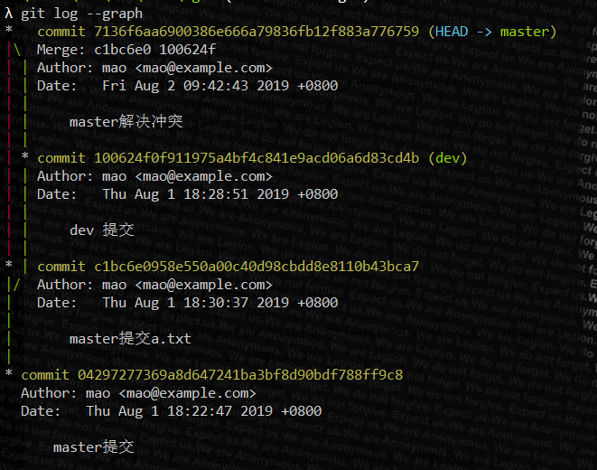
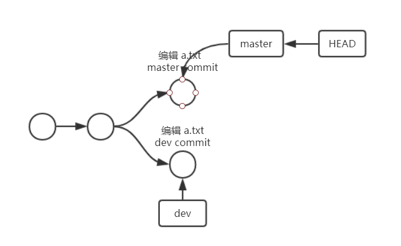
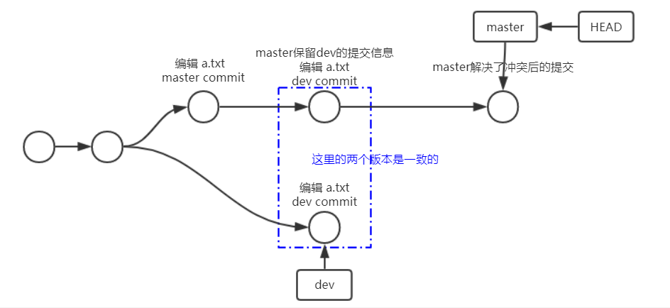
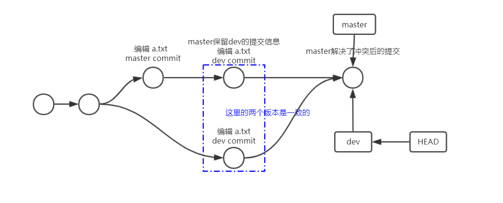

[TOC]

## 分支冲突

### git 具体执行情况

分支合并基本上都会遇到分支冲突的情况, master 分支和 dev 分支都编辑了 a.txt 并执行了 commit 操作, 结果如下:

```sh
C:\Users\mao\Dev\test\testgit (master -> origin)
λ git merge dev --no-ff
Auto-merging a.txt
CONFLICT (content): Merge conflict in a.txt
Automatic merge failed; fix conflicts and then commit the result.

C:\Users\mao\Dev\test\testgit (master -> origin)
λ cat a.txt
<<<<<<< HEAD
bbb
=======
aaa
>>>>>>> dev
```

这里需要 vim 解决冲突, 然后再次提交, 这里解决是保留了 master 和 dev 分支的编辑

```sh
C:\Users\mao\Dev\test\mgit (master -> origin)
λ vim a.txt

C:\Users\mao\Dev\test\mgit (master -> origin)
λ cat a.txt
bbb
aaa

C:\Users\mao\Dev\test\mgit (master -> origin)
λ git status
On branch master
You have unmerged paths.
  (fix conflicts and run "git commit")
  (use "git merge --abort" to abort the merge)

Unmerged paths:
  (use "git add <file>..." to mark resolution)

        both modified:   a.txt

no changes added to commit (use "git add" and/or "git commit -a")

C:\Users\mao\Dev\test\mgit (master -> origin)
λ git add a.txt

C:\Users\mao\Dev\test\mgit (master -> origin)
λ git status
On branch master
All conflicts fixed but you are still merging.
  (use "git commit" to conclude merge)

Changes to be committed:

        modified:   a.txt


C:\Users\mao\Dev\test\mgit (master -> origin)
λ git commit -m master解决冲突
[master 7136f6a] master解决冲突

C:\Users\mao\Dev\test\mgit (master -> origin)
λ git log -granph
fatal: unrecognized argument: -granph

C:\Users\mao\Dev\test\mgit (master -> origin)
λ git log --graph
*   commit 7136f6aa6900386e666a79836fb12f883a776759 (HEAD -> master)
|\  Merge: c1bc6e0 100624f
| | Author: mao <mao@example.com>
| | Date:   Fri Aug 2 09:42:43 2019 +0800
| |
| |     master解决冲突
| |
| * commit 100624f0f911975a4bf4c841e9acd06a6d83cd4b (dev)
| | Author: mao <mao@example.com>
| | Date:   Thu Aug 1 18:28:51 2019 +0800
| |
| |     dev 提交
| |
* | commit c1bc6e0958e550a00c40d98cbdd8e8110b43bca7
|/  Author: mao <mao@example.com>
|   Date:   Thu Aug 1 18:30:37 2019 +0800
|
|       master提交a.txt
|
* commit 04297277369a8d647241ba3bf8d90bdf788ff9c8
  Author: mao <mao@example.com>
  Date:   Thu Aug 1 18:22:47 2019 +0800

      master提交

C:\Users\mao\Dev\test\mgit (master -> origin)
λ git checkout dev
Switched to branch 'dev'

C:\Users\mao\Dev\test\mgit (dev -> origin)
λ git log --graph
* commit 100624f0f911975a4bf4c841e9acd06a6d83cd4b (HEAD -> dev)
| Author: mao <mao@example.com>
| Date:   Thu Aug 1 18:28:51 2019 +0800
|
|     dev 提交
|
* commit 04297277369a8d647241ba3bf8d90bdf788ff9c8
  Author: mao <mao@example.com>
  Date:   Thu Aug 1 18:22:47 2019 +0800

      master提交

```

这里解决冲突后执行的 `git add a.txt` 是告知 git 冲突已经解决, 解决冲突后 master 的日志为:



这里可以发现, master 在解决冲突时提交了 2 次:

1. 保存了 dev 分支的提交信息
2. 解决了冲突后的最终提交

在 dev 分支合并 master

```sh
λ git merge master
Updating 100624f..7136f6a
Fast-forward
 a.txt | 1 +
 1 file changed, 1 insertion(+)

C:\Users\mao\Dev\test\mgit (dev -> origin)
λ git log --graph
*   commit 7136f6aa6900386e666a79836fb12f883a776759 (HEAD -> dev, master)
|\  Merge: c1bc6e0 100624f
| | Author: mao <mao@example.com>
| | Date:   Fri Aug 2 09:42:43 2019 +0800
| |
| |     master解决冲突
| |
| * commit 100624f0f911975a4bf4c841e9acd06a6d83cd4b
| | Author: mao <mao@example.com>
| | Date:   Thu Aug 1 18:28:51 2019 +0800
| |
| |     dev 提交
| |
* | commit c1bc6e0958e550a00c40d98cbdd8e8110b43bca7
|/  Author: mao <mao@example.com>
|   Date:   Thu Aug 1 18:30:37 2019 +0800
|
|       master提交a.txt
|
* commit 04297277369a8d647241ba3bf8d90bdf788ff9c8
  Author: mao <mao@example.com>
  Date:   Thu Aug 1 18:22:47 2019 +0800

      master提交

```

可以明显发现: 不用解决冲突, 是因为 master 已经解决了冲突, 在解决时已经把 dev 的提交信息保存了, 所有在这里合并时实际上执行的是 fast forward

### 过程视图

用图来表示上述过程:

1. master 和 dev 都编辑并提交 a.txt
   

2. master 执行 merge 并解决冲突
   

3. dev 分支执行 merge (fast forward)
   

## 版本穿梭

git 的分支就是 commit 链, 在版本间穿梭就是进行版本的前进和回退

### 补充操作 和 环境说明

这里补充关于`git log`的一些操作

前面的 [基础操作](./基础操作.md) 已经有了

- `git log` 查看所有的 log
- `git log -<num>` 查看最近 num 条提交
- `git log --graph` 查看最图形化提交 log
- `git log --pretty=oneline` 在一行内查看所有日志
- `git log --abbrev-commit` 所有用简短的 sha1 值查所有日志

上面的几个参数可以配合使用, `git log -3 --graph --pretty=oneline --abbrev-commit`, 在一行内使用简短的 sha1 查看最近 3 条图形化 log:

```sh
C:\Users\mao\Dev\test\mgit (dev -> origin)
λ git log -3 --graph --pretty=oneline --abbrev-commit
*   7136f6a (HEAD -> dev, master) master解决冲突
|\
| * 100624f dev 提交
* | c1bc6e0 master提交a.txt
|/

```

补充提交操作: `git add <file>` 和 `git commit -m <提交说明>` 可以合为一步 `git commit -am <提交说明>`

**环境说明**

现在的环境为:

在 master 分支上 a.txt 文件以及被编辑了 4 次并提交, 4 次的操作为

1. 在 a.txt 中增加一行, 内容为 1, 提交说明为 commit1
2. 在 a.txt 中增加一行, 内容为 2, 提交说明为 commit2
3. 在 a.txt 中增加一行, 内容为 3, 提交说明为 commit3
4. 在 a.txt 中增加一行, 内容为 4, 提交说明为 commit4

现在 a.txt 的内容为

```txt
1
2
3
4
```

git log 为

```sh
$ git log --graph --pretty=oneline --abbrev-commit
* 38c6b6c (HEAD -> master) commit4
* 0fcc656 commit3
* f594af2 commit2
* 28936f5 commit
```

### 版本回退

- `git reset --hard HEAD^^`, 后面有几个 `^` 就是回退几个版本

  执行结果为, HEAD 已经指向了 commit2:

  ```sh
  mao@maopeichun MINGW64 ~/Dev/test/testgit (master)
  $ git reset --hard head^^
  HEAD is now at f594af2 commit2

  ```

- `git reset --hard HEAD~<num>` 回退 num 个版本

  ```sh
  mao@maopeichun MINGW64 ~/Dev/test/testgit (master)
  $ git reset --hard head~1
  HEAD is now at 28936f5 commit

  mao@maopeichun MINGW64 ~/Dev/test/testgit (master)
  $ git log --pretty=oneline
  28936f5213773f4f450326540b75ff165037c370 (HEAD -> master) commit

  ```

### 查看 commit 日志

`git reflog`

```sh
mao@maopeichun MINGW64 ~/Dev/test/testgit (master)
$ git reflog
28936f5 (HEAD -> master) HEAD@{0}: reset: moving to head~1
f594af2 HEAD@{1}: reset: moving to head^^
38c6b6c HEAD@{2}: commit: commit4
0fcc656 HEAD@{3}: commit: commit3
f594af2 HEAD@{4}: commit: commit2
28936f5 (HEAD -> master) HEAD@{5}: commit (initial): commit
```

可以看到, 当前在 HEAD@{0} (28936f5), 一共 commit 了 4 次, 执行了 `head^^`( commit4 -> commit2 ), 执行了 `head~1` ( commit2 -> commit )

### 版本前进

通过 `git reflog` 看到了 HEAD 指针的移动和当前版本之前和之后的版本 sha1, 就可以移动 HEAD 指针来让版本前进

`git reset --hard <commit_sha1>` HEAD 指针**移动**到 commit_sha1 版本处

```sh
mao@maopeichun MINGW64 ~/Dev/test/testgit (master)
$ git reset --hard 38c6b6c
HEAD is now at 38c6b6c commit4

mao@maopeichun MINGW64 ~/Dev/test/testgit (master)
$ git log --pretty=oneline
38c6b6cee2df5c11af59b682ecbb698d11d6efdb (HEAD -> master) commit4
0fcc6563b46a5ab707c700d016e91e14d69e6806 commit3
f594af2cf2e0877c41cc8705a34f0ca34346160e commit2
28936f5213773f4f450326540b75ff165037c370 commit

mao@maopeichun MINGW64 ~/Dev/test/testgit (master)
$ git reflog
38c6b6c (HEAD -> master) HEAD@{0}: reset: moving to 38c6b6c
28936f5 HEAD@{1}: reset: moving to head~1
f594af2 HEAD@{2}: reset: moving to head^^
38c6b6c (HEAD -> master) HEAD@{3}: commit: commit4
0fcc656 HEAD@{4}: commit: commit3
f594af2 HEAD@{5}: commit: commit2
28936f5 HEAD@{6}: commit (initial): commit
```

git 的版本穿梭就是控制 HEAD 指针来指向不同的版本, `git reset --hard <commit_sha1>` 用来移动指针, 这个命令也可以用来使版本回退, 如下:

```sh
mao@maopeichun MINGW64 ~/Dev/test/testgit (master)
$ git reset --hard 0fcc656
HEAD is now at 0fcc656 commit3

mao@maopeichun MINGW64 ~/Dev/test/testgit (master)
$ git log --pretty=oneline
0fcc6563b46a5ab707c700d016e91e14d69e6806 (HEAD -> master) commit3
f594af2cf2e0877c41cc8705a34f0ca34346160e commit2
28936f5213773f4f450326540b75ff165037c370 commit

mao@maopeichun MINGW64 ~/Dev/test/testgit (master)
$ git reflog
0fcc656 (HEAD -> master) HEAD@{0}: reset: moving to 0fcc656
38c6b6c HEAD@{1}: reset: moving to 38c6b6c
28936f5 HEAD@{2}: reset: moving to head~1
f594af2 HEAD@{3}: reset: moving to head^^
38c6b6c HEAD@{4}: commit: commit4
0fcc656 (HEAD -> master) HEAD@{5}: commit: commit3
f594af2 HEAD@{6}: commit: commit2
28936f5 HEAD@{7}: commit (initial): commit
```
