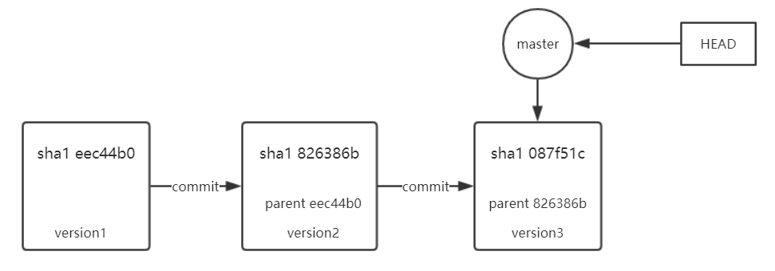
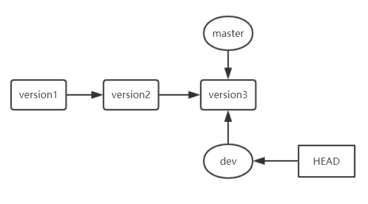
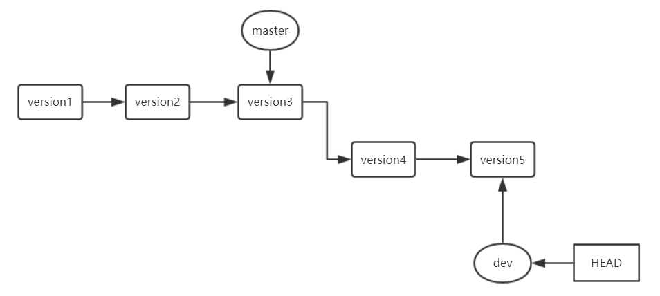
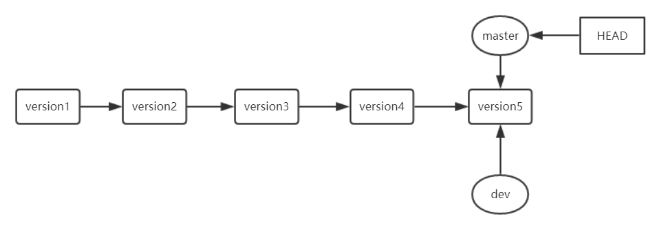
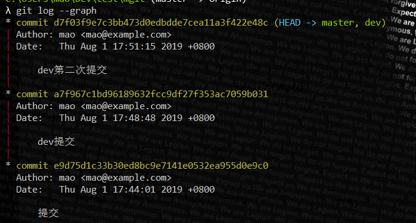
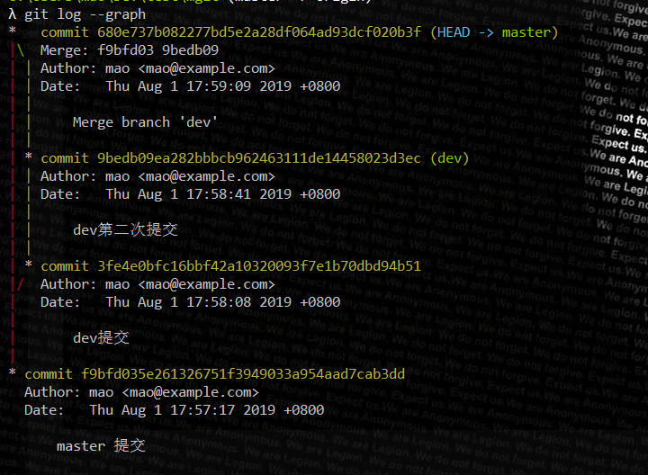
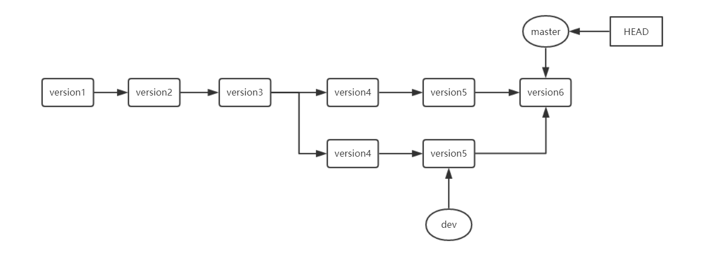

[TOC]

## 分支基础操作

查看分支: `git branch`

```sh
C:\Users\mao\Dev\test\mygit (master -> origin)
λ git branch
* master
```

创建分支: `git branch <branch_name>`

```sh
git branch new_branch
```

切换分支: `git checkout <branch_name>`

```sh
C:\Users\mao\Dev\test\mygit (master -> origin)
λ git checkout new_branch
Switched to branch 'new_branch'

C:\Users\mao\Dev\test\mygit (new_branch -> origin)
```

创建并切换分支: `git checkout -b <branch_name>`

```sh
C:\Users\mao\Dev\test\mygit (master -> origin)
λ git checkout -b branch2
Switched to a new branch 'branch2'

C:\Users\mao\Dev\test\mygit (branch2 -> origin)
```

删除分支: `git branch -d <branch_name>`

```sh
C:\Users\mao\Dev\test\mygit (master -> origin)
λ git branch -d new_branch
Deleted branch new_branch (was 41b5b84).
```

p.s.

1. 不能删除当前分支 ( 不能在 new_branch 分支删除 new_branch )
2. 不能删除 **"未合并"** 的内容 (建议先合并在删除)

```sh
C:\Users\mao\Dev\test\mygit (master -> origin)
λ git checkout -b branch2
Switched to a new branch 'branch2'

C:\Users\mao\Dev\test\mygit (branch2 -> origin)
λ git rm a.properties
rm 'a.properties'

C:\Users\mao\Dev\test\mygit (branch2 -> origin)
λ git status
On branch branch2
Changes to be committed:
  (use "git reset HEAD <file>..." to unstage)

        deleted:    a.properties


C:\Users\mao\Dev\test\mygit (branch2 -> origin)
λ git commit -m 删除a.properties
[branch2 ddf7cd0] 删除a.properties
 1 file changed, 0 insertions(+), 0 deletions(-)
 delete mode 100644 a.properties

C:\Users\mao\Dev\test\mygit (branch2 -> origin)
λ ls
c.txt  hello.txt  hello2.txt  world.txt

C:\Users\mao\Dev\test\mygit (branch2 -> origin)
λ git checkout master
Switched to branch 'master'

C:\Users\mao\Dev\test\mygit (master -> origin)
λ ls
a.properties  c.txt  hello.txt  hello2.txt  world.txt

C:\Users\mao\Dev\test\mygit (master -> origin)
λ git branch -d branch2
error: The branch 'branch2' is not fully merged.
If you are sure you want to delete it, run 'git branch -D branch2'.
```

创建 branch2 分支, 并在 branch2 分支上删除 a.properties 文件, 切换回 master 分支后删除 branch2 分支, 会收到提示

```sh
error: The branch 'branch2' is not fully merged.
If you are sure you want to delete it, run 'git branch -D branch2'.
```

因为这个分支上有**未合并**的操作, 如果不需要合并分支, 可以使用 `git branch -D <branch_name>` 强制删除

分支合并: `git merge <branch_name>`

```sh
λ git merge branch2
Updating 910272b..ddf7cd0
Fast-forward
 a.properties | 0
 1 file changed, 0 insertions(+), 0 deletions(-)
 delete mode 100644 a.properties

C:\Users\mao\Dev\test\mygit (master -> origin)
λ ls
c.txt  hello.txt  hello2.txt  world.txt

# 将分支合并后, 就可以删除被合并的分支了
C:\Users\mao\Dev\test\mygit (master -> origin)
λ git branch -d branch2
Deleted branch branch2 (was ddf7cd0).

C:\Users\mao\Dev\test\mygit (master -> origin)
λ git branch
* master
```

查看各个分支的最近一次提交的提交说明: `git branch -v`

```sh
C:\Users\mao\Dev\test\mygit (branch3 -> origin)
λ git branch -v
* branch3 f1f6f12 tijiao
  master  5bc2eba 提交56556
```

在分支中操作细节:

1. 在 A 分支中进行写操作, 如果没有 commit, 在 master 上还是能够看到该操作

   如下操作: 新建并切换到 branch3, 在 branch3 中新建 56556.txt 文件, 切换回 master 分支, 能够看到 56556.txt, 在 branch3 分支执行 commit 操作之后, 在 master 分支上就看不到 56556.txt 了

   ```sh
   C:\Users\mao\Dev\test\mygit (master -> origin)
   λ git checkout -b branch3
   Switched to a new branch 'branch3'

   C:\Users\mao\Dev\test\mygit (branch3 -> origin)
   λ echo 56556 > 56556.text

   C:\Users\mao\Dev\test\mygit (branch3 -> origin)
   λ ls
   56556.text  c.txt  hello.txt  hello2.txt  world.txt

   C:\Users\mao\Dev\test\mygit (branch3 -> origin)
   λ git checkout master
   Switched to branch 'master'

   C:\Users\mao\Dev\test\mygit (master -> origin)
   λ ls
   56556.text  c.txt  hello.txt  hello2.txt  world.txt

   C:\Users\mao\Dev\test\mygit (master -> origin)
   λ git checkout branch3
   Switched to branch 'branch3'

   C:\Users\mao\Dev\test\mygit (branch3 -> origin)
   λ git add 56556.text

   C:\Users\mao\Dev\test\mygit (branch3 -> origin)
   λ ls
   56556.text  c.txt  hello.txt  hello2.txt  world.txt

   C:\Users\mao\Dev\test\mygit (branch3 -> origin)
   λ git checkout master
   Switched to branch 'master'
   A       56556.text

   C:\Users\mao\Dev\test\mygit (master -> origin)
   λ ls
   56556.text  c.txt  hello.txt  hello2.txt  world.txt

   C:\Users\mao\Dev\test\mygit (master -> origin)
   λ git checkout branch3
   Switched to branch 'branch3'
   A       56556.text

   C:\Users\mao\Dev\test\mygit (branch3 -> origin)
   λ git commit -m 提交56556
   [branch3 5bc2eba] 提交56556
   1 file changed, 1 insertion(+)
   create mode 100644 56556.text

   C:\Users\mao\Dev\test\mygit (branch3 -> origin)
   λ ls
   56556.text  c.txt  hello.txt  hello2.txt  world.txt

   C:\Users\mao\Dev\test\mygit (branch3 -> origin)
   λ git checkout master
   Switched to branch 'master'

   C:\Users\mao\Dev\test\mygit (master -> origin)
   λ ls
   c.txt  hello.txt  hello2.txt  world.txt
   ```

2. 在 A 分支中进行写操作, 没有 commit, 在 master 中可以直接删除

   如下, 新建并切换到 branch4 分支, 新建 liu.txt 文件, 执行 add 操作. 切换到 master 分支, 可以看到 master 分支能看到 branch4 的操作, 删除 branch4 分支成功

   ```sh
   λ git checkout -b branch4
   Switched to a new branch 'branch4'

   C:\Users\mao\Dev\test\mygit (branch4 -> origin)
   λ echo 6666 > liu.txt

   C:\Users\mao\Dev\test\mygit (branch4 -> origin)
   λ ls
   56556.text  c.txt  hello.txt  hello2.txt  liu.txt  world.txt

   C:\Users\mao\Dev\test\mygit (branch4 -> origin)
   λ cat liu.txt
   6666

   C:\Users\mao\Dev\test\mygit (branch4 -> origin)
   λ git add .

   C:\Users\mao\Dev\test\mygit (branch4 -> origin)
   λ git checkout master
   Switched to branch 'master'
   A       liu.txt

   C:\Users\mao\Dev\test\mygit (master -> origin)
   λ git status
   On branch master
   Changes to be committed:
   (use "git reset HEAD <file>..." to unstage)

           new file:   liu.txt

    C:\Users\mao\Dev\test\mygit (master -> origin)
    λ git branch -d branch4
    Deleted branch branch4 (was 5bc2eba).
   ```

综上, 如果分支进行了 commit 操作, 是不能直接删除的, 如果没有 commit 操作就能直接删除 (因为在 master 上能看到进行了哪些操作)

## 总结

进行了这么多的分支操作, 总的体会:

分支: 一个 commit 链, 一条工作记录线
version: 版本/快照, 每一次提交的所有文件



上图: HEAD 指向的分支为当前分支

- 3 次提交记录, 每次提交都记录了上次提交的 sha1 值
- HEAD 指向的是当前分支
- 分支名 (图中为 master)指向当前分支的最新提交



上图: 执行 `git checkout -b dev`, 新建并切换到了 dev 分支, 当前分支为 dev 分支



上图: dev 分支执行了两次提交, dev 指向最新的提交, master 指向的还是 version3



上图: 在 master 执行 `git merge dev1`, 当前分支为 master, 同样指向 version5, 但是在 merge 时会同样同步 version4

如果一个分支靠前, 一个分支落后( 本次为 master 落后 ), 如果不冲突, 通过 merge 可以直接追赶到靠前的分支, 在 `git log` 中被称为 **fast forward**,

fast forward:

- 跳过的中间 commit 仍然会保存, 本质为指针的移动, 会归于一点
- 没有(丢失)分支信息

git 在 merge 操作默认使用 fast forward, 可以使用 `git merge <branch_name> --no-ff` 来禁用 fast forward

使用 `git log --graph` 来查看图形化日志, 下图为 fast forward 的 log:



下图为 `git merge dev --no-ff` 的 log



即下图:



--no-ff :

- 跳过的中间 commit 仍然会保存, 本质为指针的移动, 不会归于一点, 会新生成一次合并记录并当前 branch 指向该 version
- 保留分支信息

至此, 在各个分支**没有冲突**的情况下的操作已经基本完成
