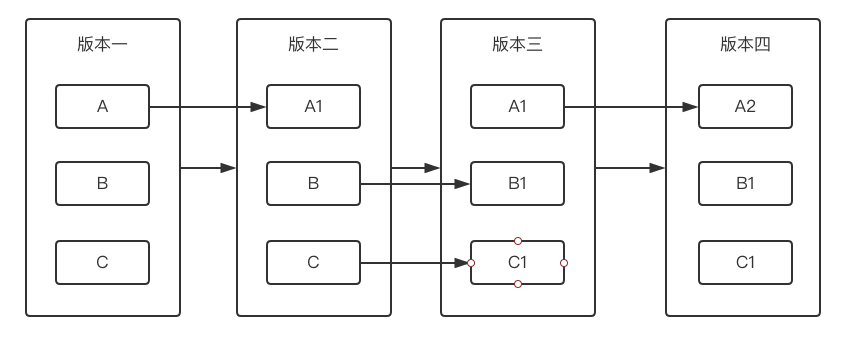
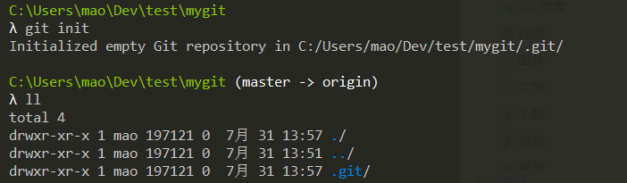

[TOC]

# Git

## 基础概念和操作

集中式版本控制器: CVS , SVN

分布式版本控制器: Git

Git 的优势:

- 本地版本控制
- 重写提交说明
- 可以"后悔"
- 分支系统

Git 为全量更新, 每个版本都包括所有文件, 时刻保持数据的完整性



SVN 为曾量更新


Git 的三种状态:

- 已修改 (modified)
- 已暂存 (staged)
- 已提交 (commited)


**初始化**

```sh
# cd 到需要 git 管理的文件夹, 执行命令, 该文件夹下的所有文件就交由git管理, 并会生成 .git 隐藏文件夹

git init
```

执行结果:



新建 hello.txt , 使用 `git status` 查看, git 提示可以执行 `git add <file>...` 后就可 commit

```sh
λ touch hello.txt

C:\Users\mao\Dev\test\mygit (master -> origin)
λ ls
hello.txt

C:\Users\mao\Dev\test\mygit (master -> origin)
λ git status
On branch master

No commits yet

Untracked files:
  (use "git add <file>..." to include in what will be committed)

        hello.txt

nothing added to commit but untracked files present (use "git add" to track)
```

执行 `git add hello.txt`, 提示可以通过 `git rm --cached <file>...` unstage ( `git add .` 可以把当前目录下的所有文件 add)

```sh
C:\Users\mao\Dev\test\mygit (master -> origin)
λ git add hello.txt

C:\Users\mao\Dev\test\mygit (master -> origin)
λ git status
On branch master

No commits yet

Changes to be committed:
  (use "git rm --cached <file>..." to unstage)

        new file:   hello.txt

```

执行 `git rm --cached hello.txt`

```sh
C:\Users\mao\Dev\test\mygit (master -> origin)
λ git rm --cached hello.txt
rm 'hello.txt'

C:\Users\mao\Dev\test\mygit (master -> origin)
λ git status
On branch master

No commits yet

Untracked files:
  (use "git add <file>..." to include in what will be committed)

        hello.txt

nothing added to commit but untracked files present (use "git add" to track)
```

执行提交操作, 编写提交说明

```sh
C:\Users\mao\Dev\test\mygit (master -> origin)
λ git commit
[master (root-commit) 3c49924] 这是我的提交
 1 file changed, 0 insertions(+), 0 deletions(-)
 create mode 100644 hello.txt
```

1 个文件新增, 没有内容修改, 没有内容删除

修改 hello.txt 内容

```sh
C:\Users\mao\Dev\test\mygit (master -> origin)
λ vim hello.txt

C:\Users\mao\Dev\test\mygit (master -> origin)
λ git status
On branch master
Changes not staged for commit:
  (use "git add <file>..." to update what will be committed)
  (use "git checkout -- <file>..." to discard changes in working directory)

        modified:   hello.txt

no changes added to commit (use "git add" and/or "git commit -a")
```

文件会在工作区中

执行 add 和 commit 操作

```sh
C:\Users\mao\Dev\test\mygit (master -> origin)
λ git add .
warning: LF will be replaced by CRLF in hello.txt.
The file will have its original line endings in your working directory

C:\Users\mao\Dev\test\mygit (master -> origin)
# 如果提交说明很短, 可以直接使用 git commit -m "提交说明"
λ git commit -m "我的内容..."
[master e1221d8] 我的内容...
 1 file changed, 1 insertion(+)

C:\Users\mao\Dev\test\mygit (master -> origin)
λ git status
On branch master
nothing to commit, working tree clean
```

执行后, 1 个文件修改, 1 行增加

查看提交日志 `git log`

```sh
C:\Users\mao\Dev\test\mygit (master -> origin)
λ git log
commit e1221d8c7b14fb568ce23118564a9538690e3dce (HEAD -> master)
Author: maopch <maopeichun@gmail.com>
Date:   Wed Jul 31 14:21:09 2019 +0800

    我的内容...

commit 3c49924b13699ea981c50db3e3ec14599c1caab7
Author: maopch <maopeichun@gmail.com>
Date:   Wed Jul 31 14:14:34 2019 +0800

    这是我的提交
```

commit 后的字符是通过 sha1 算法计算出来的, 用于产生随机数 (分布式 id 生成器)

```
commit e1221d8c7b14fb568ce23118564a9538690e3dce
```

`git log -2 --pretty=oneline` 查看最近 2 次提交, 只查看 id 和提交说明

```sh
C:\Users\mao\Dev\test\mygit (master -> origin)
λ git log -2 --pretty=oneline
e1221d8c7b14fb568ce23118564a9538690e3dce (HEAD -> master) 我的内容...
3c49924b13699ea981c50db3e3ec14599c1caab7 这是我的提交
```

`git log -2 --pretty=format:"%h - %an, %ar : %s"` 格式化查看日志

编辑 hello.txt, 执行 add 操作后再次修改 hello.txt

```sh
C:\Users\mao\Dev\test\mygit (master -> origin)
λ echo "hello 987" > hello.txt

C:\Users\mao\Dev\test\mygit (master -> origin)
λ cat hello.txt
"hello 987"

C:\Users\mao\Dev\test\mygit (master -> origin)
λ git add .

C:\Users\mao\Dev\test\mygit (master -> origin)
λ git commit -m "2222"

C:\Users\mao\Dev\test\mygit (master -> origin)
λ vim hello.txt

C:\Users\mao\Dev\test\mygit (master -> origin)
λ cat hello.txt
"hello hehehehe 987"

C:\Users\mao\Dev\test\mygit (master -> origin)
λ git status
On branch master
Changes to be committed:
  (use "git reset HEAD <file>..." to unstage)

        modified:   hello.txt

Changes not staged for commit:
  (use "git add <file>..." to update what will be committed)
  (use "git checkout -- <file>..." to discard changes in working directory)

        modified:   hello.txt
```

提示可以通过 `git checkout -- <file>...` 直接丢弃这个修改 ( 用对象区还原工作区文件 )

ps. 这个命令: `-- <file>`中间有个空格

```sh
C:\Users\mao\Dev\test\mygit (master -> origin)
λ git checkout -- hello.txt

C:\Users\mao\Dev\test\mygit (master -> origin)
λ cat hello.txt
"hello 987"
```

从暂存区回到工作区还可以通过 `git reset head`

新建 world.txt, 执行 add 操作, 然后通过 `git reset HEAD <file>...` 来还原

```sh
C:\Users\mao\Dev\test\mygit (master -> origin)
λ touch world.txt

C:\Users\mao\Dev\test\mygit (master -> origin)
λ git add .

C:\Users\mao\Dev\test\mygit (master -> origin)
λ git status
On branch master
Changes to be committed:
  (use "git reset HEAD <file>..." to unstage)

        new file:   world.txt


C:\Users\mao\Dev\test\mygit (master -> origin)
λ git reset head world.txt

C:\Users\mao\Dev\test\mygit (master -> origin)
λ git status
On branch master
Untracked files:
  (use "git add <file>..." to include in what will be committed)

        world.txt

nothing added to commit but untracked files present (use "git add" to track)
```

综上, 工作区/暂存区/对象区之间的操作为


## 设置账户

`git config` 有 3 个参数

- global 给整个计算机设置
- system 给用户设置
- local 给当前项目设置

如果同时设置的话, **优先级 local > system > global**

示例

```sh
C:\Users\mao\Dev\test\mygit\.git (master -> origin)
λ cat config
[core]
        repositoryformatversion = 0
        filemode = false
        bare = false
        logallrefupdates = true
        symlinks = false
        ignorecase = true

C:\Users\mao\Dev\test\mygit\.git (master -> origin)
λ git config --local user.name 'mao'

C:\Users\mao\Dev\test\mygit\.git (master -> origin)
λ git config --local user.email 'mao@xx.com'

C:\Users\mao\Dev\test\mygit\.git (master -> origin)
λ cat config
[core]
        repositoryformatversion = 0
        filemode = false
        bare = false
        logallrefupdates = true
        symlinks = false
        ignorecase = true
[user]
        name = 'mao'
        email = 'mao@xx.com'
```

如果是通过 `git config --system` 设置的, 会保存在用户的根目录下的 `.gitconfig` 文件中

```sh
C:\Users\mao
λ cat .gitconfig
[filter "lfs"]
        clean = git-lfs clean -- %f
        smudge = git-lfs smudge -- %f
        process = git-lfs filter-process
        required = true
[user]
        name = maopch
        email = maopeichun@gmail.com
```

删除用户, 邮箱命令操作

```sh
git config --local --unset user.name
git config --local --unset user.email
```

以上操作都可以直接编辑 config 文件实现
