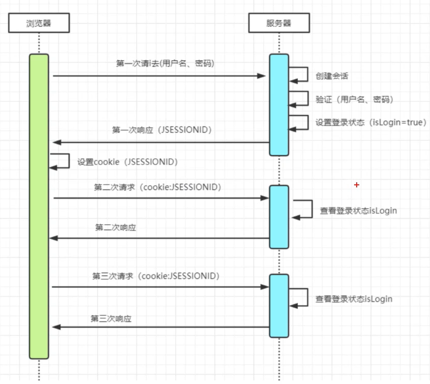

[toc]


## 认证与授权

 

第三方登录以及是标配, 任意打开一个网站都可以看到, QQ/微信账号登录


使用第三方登录的过程, 既要限制用户身份只让有效注册用户才能登录, 还要根据注册用户的不同身份来控制能浏览的内容, 这就需要 **认证和授权**


认证 (Authentication) : 证实某个用户是他所声明的那个人

授权 (Authorization) : 觉得一个身份确定的用户能够访问哪些资源


用户需要先认证认证用户身份, 然后更加用户身份再授权, 而且需要联合使用


## web安全协议


统一身份认证与授权中三种最常见的 web 安全协议是 **OpenID**, **OAuth** 和 **SAML**. 


### OpenID


OpenID 是一个以用户为中心的数字身份识别框架，它具有开放、分散性。OpenID 的创建基于这样一个概念：我们可以通过 URI （又叫 URL 或网站地址）来认证一个网站的唯一身份，同理，我们也可以通过这种方式来作为用户的身份认证。

用户需要使用 OpenID 就必须在OpenID身份服务器 (Identity Provider, IDP) 获得 OpenID账号. 用户可以使用 OpenID 账户来登录任何一个接受 OpenID 认证的服务应用 (the relying party, RP, 依赖方). OpenID 协议标准就是提供一个框架用来 IDP 和 RP 之间通信


本质而言, 用户的 OpenID 是一个为用户个人所拥有的特殊 URL, 所有有些网站甚至会提供选项让用户去填写 OpenID


### OAuth2


知乎的微信登录 `https://graph.qq.com/oauth2.0/show?which=Login&display=pc&scope=get_user_info%2Cget_info%2Cadd_t%2Cadd_pic_t%2Cget_other_info%2Cget_fanslist%2Cget_idollist%2Cadd_idol%2Cadd_share&state=34363434636665362d373231632d346162652d393765612d323035633035386332333037&redirect_uri=https%3A%2F%2Fwww.zhihu.com%2Foauth%2Fcallback%2Fqqconn%3Faction%3Dlogin%26from%3D&response_type=code&client_id=100490701`


格式化后

```
https://graph.qq.com/oauth2.0/show?which=Login
&display=pc
&scope=get_user_info%2Cget_info%2Cadd_t%2Cadd_pic_t%2Cget_other_info%2Cget_fanslist%2Cget_idollist%2Cadd_idol%2Cadd_share
&state=34363434636665362d373231632d346162652d393765612d323035633035386332333037
&redirect_uri=https%3A%2F%2Fwww.zhihu.com%2Foauth%2Fcallback%2Fqqconn%3Faction%3Dlogin%26from%3D
&response_type=code
&client_id=100490701
```


- code: 代表服务器希望收到授权码
- client_id: 注册应用时颁发的 id
- response_uri: 指明当用户授权完成之后返回的地址


OAuth2 是一个委托协议, 他可以让那些控制资源的人运行某个应用代表这些人, 而不是假冒和模仿这些人, 这个应用从资源的所有者那里得到授权 (Authorization) 和 Access Token, 随后就可以使用这个 Access Token来访问资源

客户端应用就可以请求 Access Token, 使用 Token就可以访问 API 资源了


## 单点登录 (SSO)


### 单体系统


http是无状态协议，浏览器的每一次请求，服务器会独立处理，不与之前或之后的请求产生关联，这个过程用下图说明，三次请求/响应对之间没有任何联系


**会话机制**

　　浏览器第一次请求服务器，服务器创建一个会话，并将会话的id作为响应的一部分发送给浏览器，浏览器存储会话id，并在后续第二次和第三次请求中带上会话id，服务器取得请求中的会话id就知道是不是同一个用户了，这个过程用下图说明，后续请求与第一次请求产生了关联


**登录状态**

有了会话机制，登录状态就好明白了，我们假设浏览器第一次请求服务器需要输入用户名与密码验证身份，服务器拿到用户名密码去数据库比对，正确的话说明当前持有这个会话的用户是合法用户，应该将这个会话标记为“已授权”或者“已登录”等等之类的状态，既然是会话的状态，自然要保存在会话对象中，tomcat在会话对象中设置登录状态如下
用户再次访问时，tomcat在会话对象中查看登录状态

```java
HttpSession session = request.getSession();
session.setAttribute("isLogin", true);
```

```java
HttpSession session = request.getSession();
session.getAttribute("isLogin");
```

每次请求受保护资源时都会检查会话对象中的登录状态，只有 isLogin=true 的会话才能访问，登录机制因此而实现。




### 多系统


​		虽然单系统的登录解决方案很完美，但对于多系统应用群已经不再适用了，为什么呢？

　　单系统登录解决方案的核心是cookie，cookie携带会话id在浏览器与服务器之间维护会话状态。但cookie是有限制的，这个限制就是cookie的域（通常对应网站的域名），浏览器发送http请求时会自动携带与该域匹配的cookie，而不是所有cookie


为什么不将web应用群中所有子系统的域名统一在一个顶级域名下，例如“*.baidu.com”，然后将它们的cookie域设置为“baidu.com”


局限性:

- 应用群域名得统一
- 应用群各系统使用的技术（至少是web服务器）要相同，不然cookie的key值（tomcat 为 JSESSIONID）不同，无法维持会话，共享cookie的方式是无法实现跨语言技术平台登录的，比如java、php、.net系统之间
- cookie本身不安全。


**单点登录**全称Single Sign On（以下简称SSO），是指在多系统应用群中登录一个系统，便可在其他所有系统中得到授权而无需再次登录，包括单点登录与单点注销两部分


#### 登录


相比于单系统登录，sso需要一个独立的认证中心，只有认证中心能接受用户的用户名密码等安全信息，其他系统不提供登录入口，只接受认证中心的间接授权。间接授权通过令牌实现，sso认证中心验证用户的用户名密码没问题，创建授权令牌，在接下来的跳转过程中，授权令牌作为参数发送给各个子系统，子系统拿到令牌，即得到了授权，可以借此创建局部会话，局部会话登录方式与单系统的登录方式相同。这个过程，也就是单点登录的原理，用下图说明

 


用户登录成功之后，会与sso认证中心及各个子系统建立会话，用户与sso认证中心建立的会话称为全局会话，用户与各个子系统建立的会话称为局部会话，局部会话建立之后，用户访问子系统受保护资源将不再通过sso认证中心，全局会话与局部会话有如下约束关系

1. 局部会话存在，全局会话一定存在
2. 全局会话存在，局部会话不一定存在
3. 全局会话销毁，局部会话必须销毁


#### 注销


