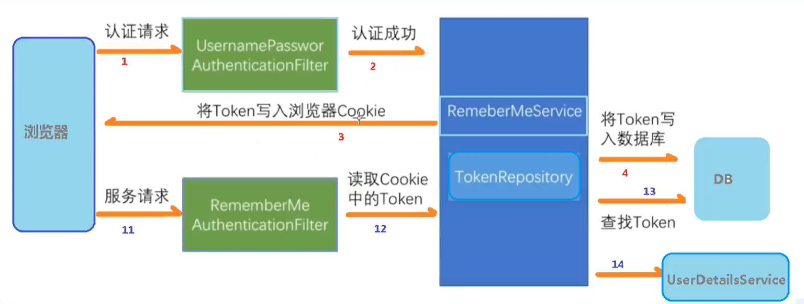
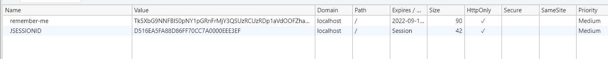

[toc]

# 自动登录


就是 163 邮箱的 `10 天内自动登录` 功能

实现机制

- cookie , 校验cookie可以免登录, 但是cookie是客户端技术, 如有保存用户密码等隐私不建议使用
- 安全框架机制, 如Spring Security


## 原理


使用 cookie 和数据库来实现

1. 用户认证成功, 在数据库中保存用户信息和一个加秘字符串, 在 cookie 中保存和数据库中相同的加密字符串
2. 用户再次进行访问, 获取 cookie 信息, 和数据库进行比对, 如果查询成功则认证成功

由于 cookie 可以设置有效时间, 如需要在10天内自动登录可以设置 cookie 在 10 天后失效, 从而在数据库验证失败


**Spring Security 的自动登录实现**



1/2/3/4 是第一次用户认证

11/12/13/14 是后续自动登录的实现


Spring Security 使用注意事项:

- 默认会创建表 `persistent_logins` 来保存用户登录状态
- `记住我` 这个功能在 cookie 中保存的 `key` 必须为 `remember-me`


## 代码实现


配置类 主要是配置了数据源需要创建表和配置自动登录

```kotlin
import com.fasterxml.jackson.databind.ObjectMapper
import com.google.gson.Gson
import com.lj.ljauth.common.RespBean
import org.springframework.beans.factory.annotation.Autowired
import org.springframework.context.annotation.Bean
import org.springframework.context.annotation.Configuration
import org.springframework.security.authentication.*
import org.springframework.security.config.annotation.authentication.builders.AuthenticationManagerBuilder
import org.springframework.security.config.annotation.web.builders.HttpSecurity
import org.springframework.security.config.annotation.web.configuration.WebSecurityConfigurerAdapter
import org.springframework.security.core.userdetails.UserDetailsService
import org.springframework.security.crypto.bcrypt.BCryptPasswordEncoder
import org.springframework.security.crypto.password.PasswordEncoder
import org.springframework.security.web.authentication.rememberme.JdbcTokenRepositoryImpl
import org.springframework.security.web.authentication.rememberme.PersistentTokenRepository
import javax.annotation.Resource
import javax.sql.DataSource


@Configuration
class SecurityConfig : WebSecurityConfigurerAdapter() {

    @Resource
    private lateinit var userDetailsService: UserDetailsService

    override fun configure(auth: AuthenticationManagerBuilder?) {
        if (auth == null) return
        auth.userDetailsService(userDetailsService).passwordEncoder(password())
    }


    @Autowired
    private lateinit var datasource: DataSource

    @Bean
    fun persistentTokenRepository(): PersistentTokenRepository {
        var jdbcTokenRepository = JdbcTokenRepositoryImpl()
        jdbcTokenRepository.setDataSource(datasource)
        // 第一次启动会自动创建表, 创建表后需要注释掉
//        jdbcTokenRepository.setCreateTableOnStartup(true)
        return jdbcTokenRepository
    }

    override fun configure(http: HttpSecurity?) {
        http!!.authorizeRequests()
                .and().csrf().disable()
                // fordata格式的数据
                .formLogin()
                // 自定义请求路径, 默认是 /login
//                .loginProcessingUrl("/login")
                // 登录成功返回数据
                .successHandler { req, resp, authentication ->
                    resp!!.contentType = "application/json;charset=utf-8"
                    val out = resp!!.writer
                    out.write(Gson().toJson(RespBean.success(null)))
                    out.flush()
                    out.close()
                }
                // 登录失败返回数据
                .failureHandler { req, resp, e ->
                    resp!!.contentType = "application/json;charset=utf-8"
                    val out = resp!!.writer
                    val respBean: RespBean = RespBean.error()
                    if (e is LockedException) {
                        respBean.msg = "账户被锁定，请联系管理员!"
                    } else if (e is CredentialsExpiredException) {
                        respBean.msg = "密码过期，请联系管理员!"
                    } else if (e is AccountExpiredException) {
                        respBean.msg = "账户过期，请联系管理员!"
                    } else if (e is DisabledException) {
                        respBean.msg = "账户被禁用，请联系管理员!"
                    } else if (e is BadCredentialsException) {
                        respBean.msg = "用户名或者密码输入错误，请重新输入!"
                    }
                    out.write(ObjectMapper().writeValueAsString(respBean))
                    out.flush()
                    out.close()
                }
                .permitAll()
                .and().authorizeRequests()
                // 哪些路径可以不用认证直接访问
                .antMatchers("/test", "/test2", "/test3").permitAll()
                //其他所有路径都需要权限校验
                .anyRequest().authenticated()
                // 自动登录设置
                .and().rememberMe().tokenRepository(persistentTokenRepository())
                // 自动登录有效时长, 单位 秒 默认为 14天
                .tokenValiditySeconds(10 * 24 * 60 * 60 * 60)
                .userDetailsService(userDetailsService)

        // 403 页面
        http.exceptionHandling().accessDeniedPage("/xxx.html")

        // 注销登录
        http.logout()
                // 注销url
                .logoutUrl("/logout")
                // 注销后要跳转的 url
//                .logoutSuccessUrl("index")
                .permitAll()
    }

    @Bean
    fun password(): PasswordEncoder {
        return BCryptPasswordEncoder()
    }
}
```


在前端传递参数 Formdate

```
username: admin
password: 123456
remember-me: true
```

cookie 中会多一个 `remember-me`

